# Web Accessibility

Данная шпаргалка представляет собой выдержки из <a href="https://dev.to/inhuofficial/101-digital-accessibility-tips-and-tricks-4728#document-structure">этой замечательной статьи</a>.

Официальные ресурсы по доступности:

- [Рекомендации по доступности веб-контента (WCAG)](https://www.w3.org/WAI/standards-guidelines/wcag/)
- [Рекомендации по доступности инструментов, используемых для разработки (ATAG)](https://www.w3.org/WAI/standards-guidelines/atag/glance/)
- [Инициатива веб-доступности - Доступные полнофункциональные интернет-приложения (WAI-ARIA или просто ARIA)](https://www.w3.org/WAI/standards-guidelines/aria/)

## Структура документа

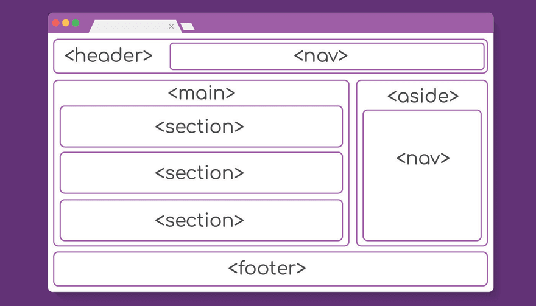

Структура документа является одним из ключевых факторов его доступности. Правильная структура не только хорошо влияет на поисковую оптимизацию, но также существенно облегчает организацию слоев, из которых состоит страница.

- _Заголовки очень важны_

Люди, использующие [экранные считывающие устройства](https://ru.wikipedia.org/wiki/%D0%AD%D0%BA%D1%80%D0%B0%D0%BD%D0%BD%D0%BE%D0%B5_%D1%81%D1%87%D0%B8%D1%82%D1%8B%D0%B2%D0%B0%D1%8E%D1%89%D0%B5%D0%B5_%D1%83%D1%81%D1%82%D1%80%D0%BE%D0%B9%D1%81%D1%82%D0%B2%D0%BE) (далее - читалки), для переключения между заголовками (`<h1>-<h6>`), как правило, используют клавиши `1-6`.

Поэтому для обозначения заголовков важно использовать только соответствующие теги `HTML`. Никогда не делаейте так - `<p class="h1">`.

Если следующий заголовок согласно дизайну больше предыдущего (по размеру, но меньше по уровню), используйте `CSS` для его стилизации (увеличения в размерах).

- _Не пропускайте уровни заголовков_

Переключаясь между заголовками, люди, использующие читалки, получают представление о структуре и содержимом документа.

Отсутствие заголовка может быть интерпретировано как отсутствие дальнейшего релевантного контента.

- _Существует 7 уровней заголовков_

Заголовок 7 уровня существует в виде атрибута `WAI-ARIA`:

```html
<h6>Глубоко вложенный раздел</h6>
<p>Какой-то текст</p>
<div role="heading" aria-level="7">
  По сути, это заголовок <h7>, несмотря на то, что такого в HTML не существует!
</div>
<p>Какой-то текст</p>
```

Атрибут `aria-label` также может быть использован в качестве CSS-селектора:

```css
[aria-level="7"]{
  font-weight: bold;
  font-size: 1rem;
}
```

- _На каждой странице должен быть только один `<h1>`_

Тег `h1` должен описывать текущую локацию страницы приложения для облегчения навигации.

- _Семантические теги_

Старайтесь структурировать содержимое страницы с помощью следующих тегов:

- `<header>`
- `<nav>`
- `<main>`
- `<section>`
- `<aside>`
- `<footer>`
- `<article>`

- _Разделы и заголовки_

Правильная структура документа часто предполагает наличие нескольких тегов `section`. Хорошей практикой считается использование атрибута `aria-labelledby` для связывания разделов с их заголовками:

```html
<section aria-labelledby="sectionHeader1">
  <h2 id="sectionHeader1">Очень интересный раздел</h2>
</section>
<section aria-labelledby="sectionHeader2">
  <h2 id="sectionHeader2">Еще один интересный раздел</h2>
</section>
```

- _Описательный `<title>`_

Если на сайте будет несколько одинаковых `<title>`, это может сделать навигацию сбивающей с толку (confusing). Поэтому убедитесь в том, что каждый заголовок является уникальным.

- _Порядок `DOM` должен соответствовать визуальному расположению элементов_

Элементы должны добавляться в `DOM` в том порядке, в котором они будут отображаться (читаться). Не изменяйте этот порядок с помощью `CSS` (например, `flex-direction: row-reverse` или `float: right`).

- _Порядок установки фокуса должен совпадать с порядком `DOM`_

Использование атрибута `tabindex` с положительным числом в качестве значения считается плохой практикой, поскольку это меняет порядок фокусировки элементов:

```html
<div tabindex="0">Я буду в фокусе последним!</div>
<div tabindex="2">Затем я!</div>
<div tabindex="1">Сначала я попаду в фокус!</div>
<a href="" tabindex="-1">А я никогда не попаду в фокус</a>
```

Для того, чтобы сделать элемент фокусируемым, можно использовать `tabindex='0'`, но, обычно, это означает, что вы использовали неправильный элемент.

- _Не используйте таблицы для создания макета страницы_

Элемент `table` предназначен для табличных данных, а не для создания макетов.

Если вам достался древний проект, удаление таблиц из которого "не стоит свеч", в качестве последнего средства можно использовать `role='presentation'` на каждом `<tr>`, `<td>` и т.д. (это удалит семантическую информацию из таблицы и превратит ее в обычный `div`).

- _Текст ссылок, кнопок и подписей должен быть уникальным_

Все ссылки на странице должны иметь уникальный текст, который запускает разные операции. Если у вас имеется несколько ссылок "Читать подробнее", то "Хьюстон, у нас проблемы!".

Существует несколько способов для решения данной проблемы. Одним из них является использование атрибута `aria-labelledby`:

```html
<article>
  <h2 id="article1-title">Моя замечательная статья</h2>
  
  <p>Краткое описание с многоточием...</p>
  <a href="article1-url" aria-labelledby="article1-title">Читать подробнее</a>
</article>
<article>
  <h2 id="article2-title">Твой код - отстой! Давай это исправим</h2>
  
  <p>Да ты, твой код - отстой, но мы можем помочь...</p>
  <a href="article2-url" aria-labelledby="article2-title">Читать подробнее</a>
</article>
```

Данную технику можно применять для кнопок в таблицах с повторяющимися строками, подписей в формах (если на странице имеется две формы с одинаковыми подписями) и т.д.

Разумеется, если ссылки или кнопки запускают одинаковые операции, например, перенаправляют по одному и тому же адресу, тогда их текст должен быть одинаковым.

## Формы

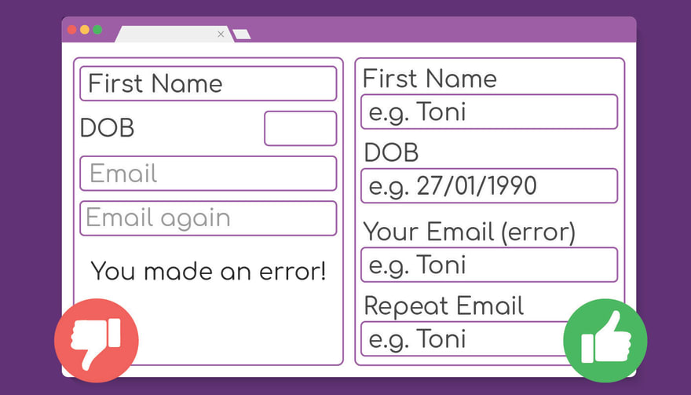

- _Добавляйте подписи (`label`) к полям для ввода (`input`)_

Нет, атрибута `placeholder` недостаточно.

- _Подписи всегда должны быть видимыми_

- _Связывайте подписи с полями явно_

Несмотря на то, что использование неявных подписей является валидным:

```html
<label>Имя
  <input name="first_name" placeholder="например, Иван">
</label>
```

Некоторые ассистивные технологии не понимают такие подписи. Поэтому лучше всегда использовать явные подписи:

```html
<label for="firstName">Имя</label>
<input name="first_name" placeholder="например, Иван" id="firstName">
```

Это также увеличивает область или зону клика: клик по подписи приводит к установке фокуса на соответствующее поле для ввода.

- _Подписи должны располагаться максимально близко к полям_

- _Группируйте связанные поля_

Если у вас имеется несколько связанных полей, сгруппируйте их с помощью `fieldset`. Такие группы могут быть подписаны с помощью `legend`:

```html
<fieldset>
  <legend>Адрес доставки:</legend>
  <label for="shipping_city">
    Город
  </label>
  <input type="text" name="shipping_city" id="shipping_city">
  <label for="shipping_street">
    Улица
  </label>
  <input type="text" name="shipping_street" id="shipping_street">
  <!-- и т.д. -->
</fieldset>
<fieldset>
  <legend>Адрес оплаты:</legend>
  <label for="billing_city">
    Город
  </label>
  <input type="text" name="billing_city" id="billing_city">
  <label for="billing_street">
    Улица
  </label>
  <input type="text" name="billing_street" id="billing_street">
  <!-- и т.д. -->
</fieldset>
```

_Обратите внимание_: для добавления дополнительной информации к подписям следует использовать либо визуально скрытый текст, либо `WAI-ARIA`. Вот хороший пример стилей для скрытого текста:

```css
.visually-hidden {
  border: 0;
  padding: 0;
  margin: 0;
  position: absolute !important;
  height: 1px;
  width: 1px;
  overflow: hidden;
  clip: rect(1px 1px 1px 1px);
  clip: rect(1px, 1px, 1px, 1px);
  clip-path: inset(50%);
  white-space: nowrap;
}
```

- _Обеспечьте возможность дополнительной проверки введенных пользователем данных перед отправкой формы_

Если вы собираете много информации или отправка информации впоследствии не может быть отменена, хорошей идеей будет предоставление пользователю возможности для дополнительной проверки введенных им данных перед их финальной отправкой.

Простейшим способом это сделать является отображение информации (с возможностью ее редактирования) после нажатия кнопки для отправки формы.

Это особенно важно в случае финансовых транзакций, таких как перевод денежных средств другому лицу.

- _Сообщения об ошибках должны отображаться рядом с соответствующими полями_

В качестве альтернативы можно показывать все ошибки наверху формы, но убедитесь в том, что соответствующие поля помечены с помощью каких-либо индикаторов (кроме цвета).

Для обозначения связи между ошибкой и полем следует использовать атрибут `aria-decribedby`, а в качестве индикатора ошибки атрибут `aria-invalid`:

```html
<form>
  <label for="email-address">
    Ваш адрес электронной почты
  </label>
  <span id="email-error">
    Ошибка: адрес электронной почты должен содержать символ "@"
  </span>
  <input
    id="email-address"
    type="email"
    aria-describedby="email-error"
    aria-invalid="true"
  >
</form>
```

- _Не отключайте автозаполнение_

Атрибут `autocomplete='off'` следует использовать только для полей, в отношении которых вы хотите быть уверенными в том, что они будут заполнены правильно, но имеются веские основания полагать, что они могут быть заполнены неправильно:

```html
<label for="CCname">Название карты</label>
<input name="name" id="CCname" autocomplete="cc-name">

<label for="CCnumber">Номер карты</label>
<input name="cardnumber" id="CCnumber" autocomplete="cc-number">

<label for="CCcvc">CVC (3 цифры на обратной стороне)</label>
<input name="cvc" id="CCcvc" required autocomplete="cc-csc">

<label for="CCexpiry">Действует до</label>
<input name="cc-exp" id="CCexpiry" autocomplete="cc-exp">
```

- _Не отключайте возможность вставки скопированного текста_

Такой код:

```js
someInput.onpaste = (e) => {
  e.preventDefault()
}
```

Сразу же сделает ваш сайт невалидным с точки зрения доступности, так что ни в коем случае не отключайте возможность вставки данных из буфера обмена.

## Изображения

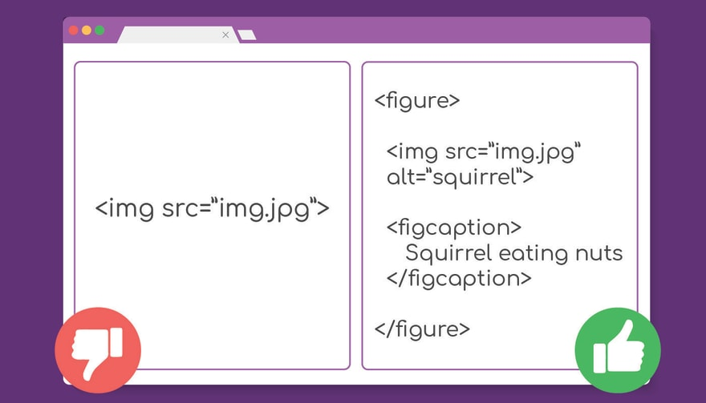

- _У всех тегов `img` должен быть атрибут `alt` с кратким описанием изображения_

У декоративных изображений (например, фоновых) также должен быть `alt` (пустой). Также к таким изображениям рекомендуется добавлять атрибут `role` со значением `presentation`.

Описание изображения в атрибуте `alt` не должно содержать слов "изображение", "картинка", "график" и т.д.

- _Если изображению нужна развернутая подпись, оберните их в тег `figure`_

Для подписи используйте тег `figcaption`:

```html
<figure>

  

  <figcaption>
     Серая белка ест орехи в лесу.
  </figcaption>

</figure>
```

- _К сложным графикам, диаграммам и т.п. рекомендуется добавлять визуально скрытую таблицу с данными_

- _Вместо атрибута `alt` во встроенных изображениях в формате `SVG` следует использовать тег `title`, а вместо `figcaption` - `desc`_

```html
<svg width="100" height="75">
  <title>Темный треугольник</title>
  <desc>Серый треугольник со скругленными углами и темно-зеленой границей</desc>
  <rect width="75" height="50" rx="20" ry="20" fill="#666" stroke="#229b23" stroke-fill="1" />
</svg>
```

## Язык

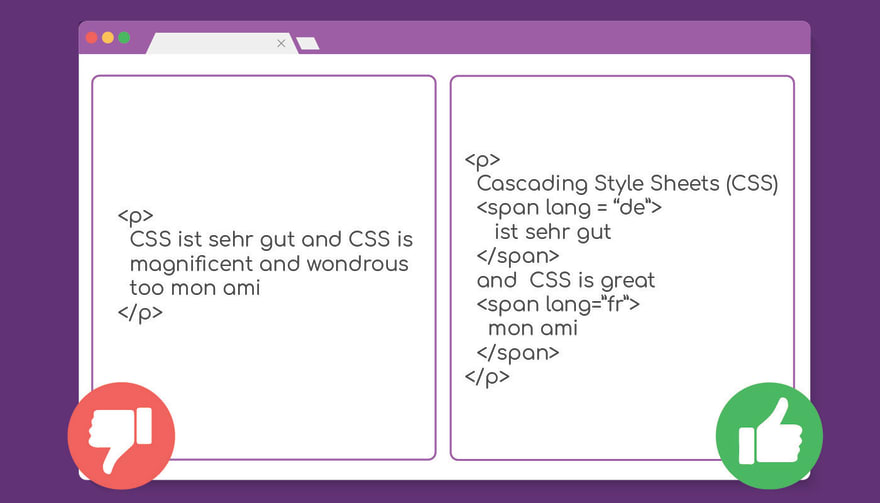

- _Используйте атрибут `lang` для документа_

```html
<html lang="en">
```

[Здесь](https://www.w3schools.com/tags/ref_language_codes.asp) можно найти список кодов языков.

- _Если на странице имеется текст на другом языке, к оборачивающему его элементу следует добавить атрибут `lang` с кодом этого языка_

```html
<p>
  Единственная фраза на немецком, которую я помню со школы - это
  <span lang = “de”>
     ist sehr gut
  </span>
  , и это печально. Боюсь, что мой французский не лучше,
  <span lang=”fr”>
    mon ami
  </span>
</p>
```

- _Старайтесь избегать жаргонных и сложных слов_

Язык на вашем сайте должен быть максимально понятным и простым.

- _Для аббревиатур и акронимов следует использовать тег `abbr` с атрибутом `title`_

```html
<p>Использование правильного <abbr title="HyperText Markup Language">HTML</abbr> в статьях делает их более доступными. HTML содержит много семантических элементов, таких как...</p>
```

Еще лучше при первом употреблении термина расшифровать его, а сокращение поместить в тег `abbr` в скобках:

```html
<p>Использование правильного HyperText Markup Language (<abbr>HTML</abbr>) в статьях делает их более доступными. HTML содержит много семантических элементов, таких как...</p>
```

## Навигация

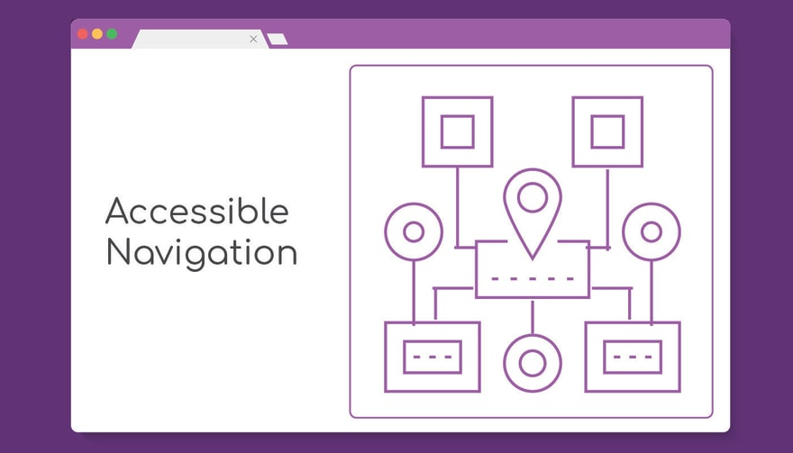

- _Добавьте на сайт [карту (sitemap) HTML](https://www.semrush.com/blog/html-sitemap/)_

- _Обеспечьте возможность навигации по сайту с помощью клавиатуры (это касается всех интерактивных элементов на странице)_

- _Убедитесь, что выпадающие меню активируются с помощью `Enter` или `Space` и только после активации становятся фокусируемыми с помощью `Tab`_

Вот [хороший пример](https://www.w3.org/WAI/tutorials/menus/flyout/) того, как это делается.

- _Добавьте ссылку для пропуска навигации (перехода к контенту)_

- _Если на странице много контента, имеет смысл добавить навигацию по нему с привязкой к заголовкам разделов, например_

- _Навигация, представленная тегом `nav`, считается главной_

Что если у нас также имеется навигация в `footer` или `aside`?

Для добавления подписей к `nav` с целью их дифференциации можно использовать атрибут `aria-label`:

```html
<header>
  <nav aria-label="main navigation">
    <ul>
      <li><a href="a-link">ссылка</a>
    </ul>
  </nav>
<header>

<main>
   <!-- ... -->
</main>

<footer>
  <nav aria-label="footer navigation">
    <ul>
      <li><a href="a-different-link">еще одна</a>
    </ul>
  </nav>
</footer>
```

- _Хлебные крошки (breadcrumbs) - отличный способ показать, где находится пользователь_

```html
<nav aria-label="breadcrumbs">
  <ol>
    <li>
      <a href="https://example.com/">
        Главная
      </a>
    </li>
    <li>
      <a href="https://example.com/products">
        Товары
      </a>
    </li>
    <li>
      <a href="https://example.com/products/childrens-clothing">
        Детская одежда
      </a>
    </li>
    <li>
      <a href="https://example.com/products/childrens-clothing/shoes" aria-current="page">
        Обувь
      </a>
    </li>
  </ol>
</nav>
```

_Обратите внимание_ на 2 вещи:

- атрибут `aria-current` - индикатор местонахождения пользователя (обычно, для этого достаточно `title` и `h1`)
- список является нумерованным - индикатор того, что "крошки" имеют определенный порядок

- _Убедитесь, что на вашем сайте нет ловушек для фокуса_

Ловушка для фокуса - это то место, куда можно попасть, но откуда нельзя выбраться с помощью клавиатуры. Это особенно характерно для модальных окон без фокусируемых кнопок. Убедитесь, что ваши модалки и другие ловушки закрываются при нажатии `button`, на которую можно установить фокус с помощью клавиатуры, а также при нажатии `Esc`.

## Внешний вид и дизайн

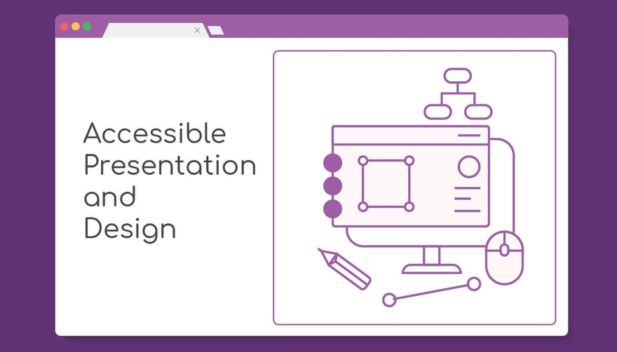

- _Обеспечьте контрастность цветов, используемых на сайте_

В сети полно таких инструментов. Определенную информацию, включая сведения о доступности элемента, можно получить с помощью инструментов разработчика: нажимаем иконку `Select an element in the page to inspect it` в верхнем левом углу и наводим указатель на элемент

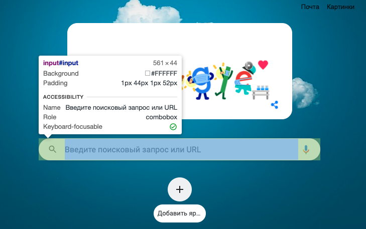

- _Такие элементы управления, как `input`, также должны "констрастрировать" со своим окружением_

- _Элементы, находящиеся в фокусе, должны очевидным образом выделяться, например, с помощью обводки или границ_

Общие рекомендации к обводке такие:

- контрастность по отношению к фону должна составлять __не менее `4.5:1`__
- ширина обводки должны быть __не менее `2px`__

- _Размер шрифта на сайте должен быть **не менее `16px` (14pt)**_

- _Высота строк (`line-height`) в блоках текста, за исключением многострочных заголовков, должна составлять **не менее `1.5`**_

- _Отступ между параграфами должен составлять __не менее двойного размера шрифта__ или __1.5 высоты строки__, или **`2.25rem`**_

- _Расстояние между буквами (`letter-spacing`) должно составлять __не менее 0.12 от размера шрифта__, а расстояние между словами (`word-spacing`) - **не менее 0.16 от размера шрифта**_

- _Длина строки не должна превышать **50-60 символов**_

- _Не выравнивайте текст по всей ширине строки (`text-align: justify;`)_

- _На странице не должно быть текста в верхнем регистре (uppercase)_

Речь идет о разметке. Используйте стили для преобразования текста в верхний регистр, но не злоупотребляйте этим:

```html
<!-- не делайте так -->
<h1>ДОБРО ПОЖАЛОВАТЬ!</h1>

<!-- лучше сделайте так -->
<style>
  h1 {
    text-transform: uppercase;
  }
</style>

<h1>Добро пожаловать!</h1>
```

- _Скрытие текста, предназначенного только для читалок_

Для визуального скрытия текста, несмотря на наличие специального атрибута `aria-label`, лучше использовать старый-добрый `span` с соответствующими стилями, поскольку `WAI-ARIA` имеет разную поддержку в браузерах.

Пример таких стилей уже приводился в начале шпаргалки, но, как известно, повторенье..., so:

```css
.visually-hidden {
  border: 0;
  padding: 0;
  margin: 0;
  position: absolute !important;
  height: 1px;
  width: 1px;
  overflow: hidden;
  clip: rect(1px 1px 1px 1px);
  clip: rect(1px, 1px, 1px, 1px);
  clip-path: inset(50%);
  white-space: nowrap;
}
```

Когда следует использовать такой трюк?

Простой пример - ссылка на twitter-аккаунт с иконкой из `Font Awesome`:

```html
<a href="https://twitter.com/SomeUserName">
  <i class="fa fa-twitter"></i>
</a>
```

Читалка прочитает это как `пустая ссылка` или `ссылка https://twitter.com/SomeUserName`. Ужасно, не так ли?

Поэтому в данном случае не обойтись без скрытого текста:

```html
<a href="https://twitter.com/SomeUserName">
   <i class="fa fa-twitter" aria-hidden="true"></i>
   <span class="visually-hidden">Подписывайтесь на SomeUserName в твиттере</span>
</a>
```

Да, и не будьте пуристами разметки, `WAI-ARIA` в любом случае сделает ваш `HTML` уродливым.

- _Атрибут `aria-hidden`_

Данный атрибут используется для скрытия от читалок всего неинтерактивного контекста соответствующего элемента. "Неинтерактивного" означает, что поля для ввода, кнопки, ссылки и т.д. останутся доступными.

- _Не используйте иконочные шрифты_

С точки зрения доступности __`SVG`__ намного лучше. Вот последний пример с использованием `SVG`:

```html
<a href="https://twitter.com/SomeUserName">
  <svg viewBox="0 0 32 32">
    <title>Подписывайтесь на SomeUserName в твиттере</title>
    <path d="M32 7.075c-1.175 0.525-2.444 0.875-3.769 1.031 1.356-0.813 2.394-2.1 2.887-3.631-1.269 0.75-2.675 1.3-4.169 1.594-1.2-1.275-2.906-2.069-4.794-2.069-3.625 0-6.563 2.938-6.563 6.563 0 0.512 0.056 1.012 0.169 1.494-5.456-0.275-10.294-2.888-13.531-6.862-0.563 0.969-0.887 2.1-0.887 3.3 0 2.275 1.156 4.287 2.919 5.463-1.075-0.031-2.087-0.331-2.975-0.819 0 0.025 0 0.056 0 0.081 0 3.181 2.263 5.838 5.269 6.437-0.55 0.15-1.131 0.231-1.731 0.231-0.425 0-0.831-0.044-1.237-0.119 0.838 2.606 3.263 4.506 6.131 4.563-2.25 1.762-5.075 2.813-8.156 2.813-0.531 0-1.050-0.031-1.569-0.094 2.913 1.869 6.362 2.95 10.069 2.95 12.075 0 18.681-10.006 18.681-18.681 0-0.287-0.006-0.569-0.019-0.85 1.281-0.919 2.394-2.075 3.275-3.394z"></path>
   </svg>
</a>
```

- _Не ограничивайтесь цветами для выделения важной информации_

Помните о том, что около 1 из 12 мужчин и 1 из 200 женщин страдают дефицитом цветового зрения в той или иной форме - это почти 4,5% населения земли.

- _Не забывайте о контрасте цветов при стилизации псевдоэлемента `::selection`_

- _С точки зрения доступности, анимации и переходы - это часть прогрессивного улучшения сайта (progressive enhancement)_

Это означает, что сначала мы делаем сайт без анимаций и переходов, а затем добавляем их, например, с помощью отдельной таблицы со стилями, чтобы их можно было легко отключить при необходимости без ущерба для дизайна.

Для определения предпочтений пользователя относительно анимации можно использовать медиа-запрос [`prefers-reduced-motion`](https://developer.mozilla.org/en-US/docs/Web/CSS/@media/prefers-reduced-motion):

```css
/* анимируем высоту по умолчанию */
.animation {
  transition: height 1s ease;
}

/* отключаем переход для тех, кто отключил анимацию */
@media (prefers-reduced-motion) {
  .animation {
    transition: none;
  }
}
```

## Семантика

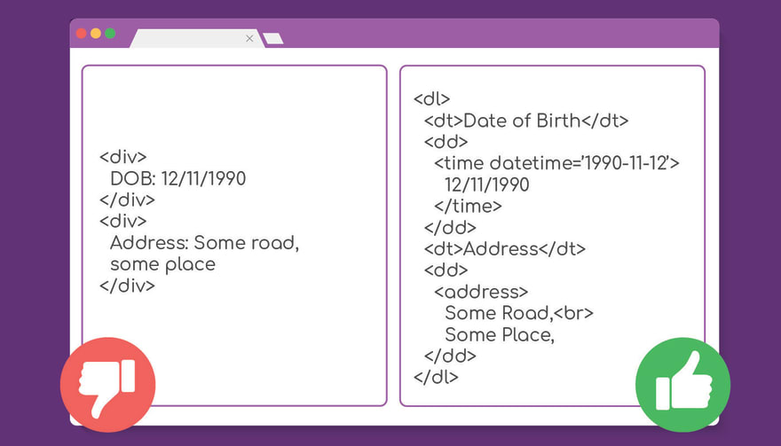

- _Для создания аккордеонов (выпадающих списков) следует использовать элементы `detail` и `summary`_

Мало того, что они позволяют легко реализовать сам аккордеон (без помощи `JavaScript` и `CSS`), так они еще и являются доступными по умолчанию.

- _Для даты и времени следует использовать элемент `time`_

```html
<p>Я сердечно приглашаю вас на шикарный ужин <time datetime="2021-08-07">7 августа</time> в мой домик у озера.</p>

<p>Мы пригласили профессионального шеф-повара, так что ужин будет готов к <time datetime="19:00">7 вечера</time>, а на <time datetime="20:00">8 вечера</time> запланирован струнный квартет. Не забудьте, что дорога занимает <time datetime="PT1H20M">1 час 20 мин</time>, если лететь на вертолете. Целую</p>
```

- _Для создания списков терминов (понятий) и их определений следует использовать элементы `dl`, `dt` и `dd`_

Эти элементы также можно использовать для предоставления пользователю возможности проверить введенную им информацию перед отправкой формы:

```html
<h1>Проверьте введенные вами данные</h1>
<p>Пожалуйста, проверьте введенные вами на предыдущем шаге данные для того, чтобы убедиться в их корректности:</p>
<dl>

  <dt>Имя</dt>
  <dd>Иван</dd>

  <dt>Фамилия</dt>
  <dd>Иванов</dd>

  <dt>Дата рождения</dt>
  <dd><time datetime="1990-05-15">15 мая 1990 г.</time></dd>

</dl>
```

## Социальные медиа

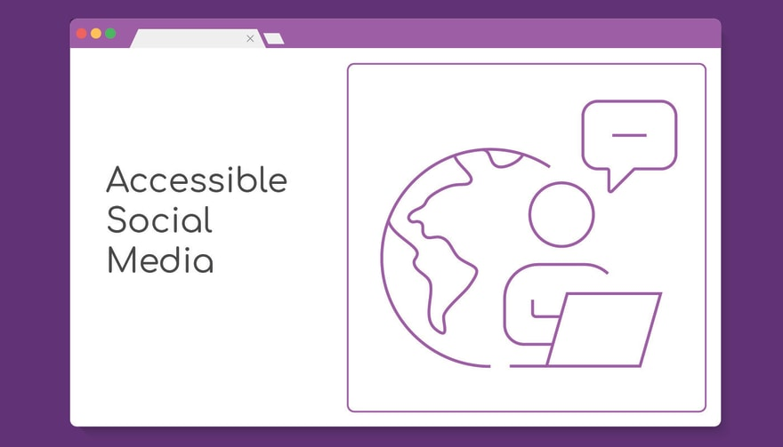

- _Если социальный сервис позволяет добавлять собственные атрибуты `alt` к изображениям и прочим медиа, пользуйтесь этим_

- _Для того, чтобы сделать доступными хештеги, можно писать их в стиле `camelCase` или `CamelCase`_

Например, `#someHashTag` или `#SomeHashTag`. Разумеется, платформа должна поддерживать такие хештеги.

- _Не используйте в тексте слишком много эмодзи_

Большинство читалок их не понимает.

- _Если сайт поддерживает добавление блоков кода, используйте эту возможность_

Если не поддерживает, поместите свой код в `GiHub Gist` или `CodePen` и сделайте ссылку на проект в посте.

## Таблицы

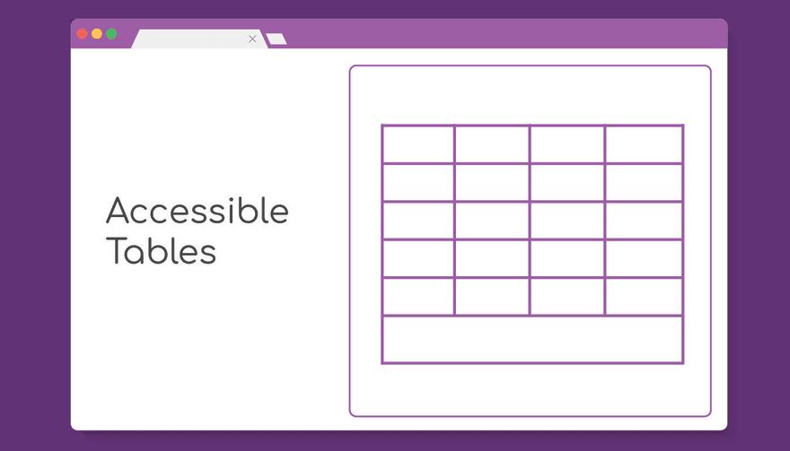

Пример простой таблицы:

```html
<table>
  <tr>
    <th>Col Header 1</th>
    <th>Col Header 2</th>
    <th>Col Header 3</th>
  </tr>
  <tr>
    <td>Row 1 Col 1</td>
    <td>Row 1 Col 2</td>
    <td>Row 1 Col 3</td>
  </tr>
  <tr>
    <td>Row 2 Col 1</td>
    <td>Row 2 Col 2</td>
    <td>Row 2 Col 3</td>
  </tr>
</table>
```

Что если мы хотим, чтобы первая ячейка строки была заголовком этой строки? Для этого можно использовать атрибут `scope`:

```html
<table>
  <tr>
    <th scope="col">Col Header 1</th>
    <th scope="col">Col Header 2</th>
    <th scope="col">Col Header 3</th>
  </tr>
  <tr>
    <th scope="row">Row Header 1</th>
    <td>Row 1 Col 2</td>
    <td>Row 1 Col 3</td>
  </tr>
  <tr>
    <th scope="row">Row Header 2</th>
    <td>Row 2 Col 2</td>
    <td>Row 2 Col 3</td>
  </tr>
</table>
```

Не забудьте добавить к таблице подпись с помощью элемента `caption`:

```html
<table>
  <caption>Пример таблицы</caption>
  <!-- ... -->
</table>
```

- _Для обозначения шапки таблицы используется элемент `thead` (как `header` в документе), для обозначения тела или контента таблицы - элемент `tbody` (`main`), а для обозначения подвала таблицы - `tfoot`_

Последний элемент является опциональным:

```html
<table>
  <thead>
    <tr>
      <th scope="col">Col Header 1</th>
      <th scope="col">Col Header 2</th>
      <th scope="col">Col Header 3</th>
    </tr>
  </thead>
  <tbody>
    <tr>
      <th scope="row">Row Header 1</th>
      <td>Row 1 Col 2</td>
      <td>Row 1 Col 3</td>
    </tr>
    <tr>
    <th scope="row">Row Header 2</th>
      <td>Row 2 Col 2</td>
      <td>Row 2 Col 3</td>
    </tr>
  </tbody>
  <tfoot>
    <tr>
      <th scope="row">Summary</th>
      <td>Col 2 summary</td>
      <td>Col 3 summary</td>
    </tr>
  </tfoot>
</table>
```

- _Для группировки столбцов таблицы используются элементы `col` (для представления группируемой колонки) и `colgroup` (для группировки колонок)_

Вместо `col` можно использовать элементы `th` и `td` с атрибутом `scope="col"`:

```html
<table>
  <col>
  <colgroup span="2"></colgroup>
  <colgroup span="2"></colgroup>
	<colgroup span="2"></colgroup>
  <tr>
    <th scope="row">Supplier</th>
    <th colspan="2" scope="colgroup">JB toys</th>
    <th colspan="2" scope="colgroup">ZA games</th>
		<th colspan="2" scope="colgroup">DD kids</th>
  </tr>
  <tr>
	  <th scope="col">Item</th>
    <th scope="col">Price</th>
    <th scope="col">Delivery Time</th>
    <th scope="col">Price</th>
    <th scope="col">Delivery Time</th>
		<th scope="col">Price</th>
    <th scope="col">Delivery Time</th>
  </tr>
  <tr>
    <th scope="row">Toy trucks</th>
    <td>&pound;25.00</td>
    <td>3 days</td>
    <td>&pound;35.00</td>
    <td>2 days</td>
		<td>&pound;15.00</td>
    <td>6 days</td>
  </tr>
  <tr>
    <th scope="row">Kids Baking set</th>
    <td>&pound;42.00</td>
    <td>4 days</td>
    <td>&pound;58.00</td>
    <td>2 days</td>
		<td>&pound;35.00</td>
    <td>5 days</td>
  </tr>
	<tr>
    <th scope="row">Water balloon kit</th>
    <td>&pound;7.00</td>
    <td>2 days</td>
    <td>&pound;9.00</td>
    <td>6 days</td>
		<td>&pound;11.00</td>
    <td>4 days</td>
  </tr>
</table>
```

## Тестирование

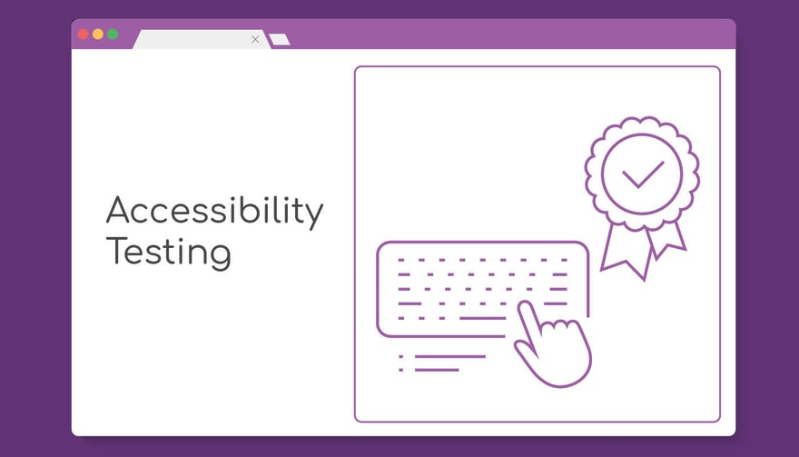

Инструменты для тестирования доступности, рекомендуемые автором статьи:

- [axe DevTools - Web Accessibility Testing](https://chrome.google.com/webstore/detail/axe-devtools-web-accessib/lhdoppojpmngadmnindnejefpokejbdd) - расширение `Chrome` для быстрого и грязного тестирования
- [eslint-plugin-jsx-a11y](https://github.com/jsx-eslint/eslint-plugin-jsx-a11y) - плагин для `ESLint`
- [Accessibility Insights for Web](https://chrome.google.com/webstore/detail/accessibility-insights-fo/pbjjkligggfmakdaogkfomddhfmpjeni) - лучший инструмент, но сложный в изучении и использовании

## Юзабилити

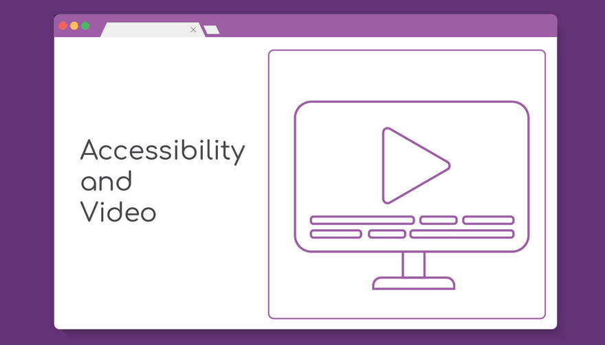

- _При разработке мобильной версии сайта или версии для планшета очень важно оставлять пустые места или "тихое пространство" (quiet space) во избежание случайного взаимодействия пользователя с интерактивными элементами_

- _Размер зоны клика кнопок, ссылок и т.д. должен быть **не менее 45х45px**_

- _Не отключайте зум_

Приходилось ли вам добавлять в `header` такое:

```html
<meta
  name="viewport"
  content="width=device-width",
  initial-scale=1.0,
  maximum-scale=1.0,
  user-scalable="no"
/>
```

Больше так не делайте. Отключение зума (возможности увеличивать масштаб отображения страницы) - серьезный удар по доступности.

- _Не используйте таймауты и таймеры на странице_

В случае крайней необходимости, убедитесь в том, что временной интервал является достаточно большим: людям с ограниченными возможностями для заполнения той же формы требуется гораздо больше времени, чем другим.

- _Если при клике по ссылке, выполняется переход на другой сайт (сайт открывается в новом окне - `target="_blank"`), сообщите об этом пользователю_

Это можно сделать так:

```html
<a href="https://example.com" target="_blank">перейти на другой сайт (открывается в новом окне)</a>
```

Или, если текст в скобках ломает ваш дизайн, так:

```html
<p>
  <a href="https://example.com" target="_blank">Внешняя ссылка<span class="visually-hidden">(открывается в новом окне)</span></a>, которая ведет на другой сайт
</p>
```

Идеально, если все открывается в текущем окне.

- _Не забывайте стилизовать состояние `:visited`_

- _Модальные окна (диалоги) - это настоящий вызов с точки зрения доступности_

Во-первых, для создания модального окна должен использоваться элемент `dialog`.

Модальное окно должно быть ловушкой для фокуса. Одного перехвата `Tab` для этого недостаточно. Весь контент страницы, кроме контента модалки, должен быть скрыт с помощью `aria-hidden="true"`. Все фокусируемые элементы, кроме тех, что принадлежат модалке, должны иметь атрибут `tabindex="-1"`.

Модалка должна закрываться по нажатию `Esc`. При этом фокус должен возвращаться на кнопку для ее открытия. После закрытия модалки следует удалить `tabindex="-1"` у фокусируемых элементов. И это лишь вершина айсберга.

## Видео

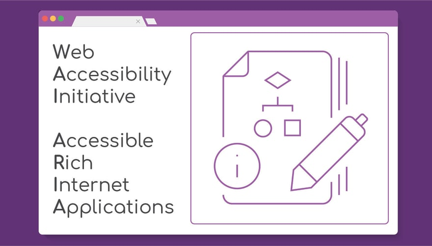

- _Добавляйте субтитры к видео_

Это помогает не только людям с ограниченными возможностями, но и тем, кто говорит на других языках. Существует много форматов субтитров, но наиболее универсальным является формат [`SRT`](https://en.wikipedia.org/wiki/SubRip).

- _Для коротких видео SRT-файл может быть легко создан вручную_

Данный файл представляет собой набор инструкций. Каждая инструкция состоит из 3 частей:

- номера субтитров (нумерация, обычно, начинается с 1)
- времени начала и окончания отображения субтитров
- текста
- между инструкциями должна быть пустая строка

Формат времени:

```
hh:mm:ss,ms
```

Пример отображения субтитров, начиная с 1 часа 28 минут 12 секунд и 115 миллисекунд, на протяжении 3,127 секунд:

```
01:28:15,115 -> 01:28:18,242
```

Более сложный пример:

```
1
00:00:00,500 --> 00:00:03,172
Субтитры

2
00:00:03,173 --> 00:00:06,494
Еще субтитры

3
00:00:06,495 --> 00:00:11,771
И еще
```

После того, как вы закончили, сохраните файл в формате `.srt` и загрузите вместе с видео.

- _Если видео длится более 2 мин, присмотритесь к `YouTube`_

`YouTube` автоматически генерирует субтитры для загружаемого файла. Он также позволяет загружать собственный SRT-файл. Сгенерированные субтитры можно редактировать в режиме реального времени с помощью `YouTube Studio`.

- _В идеале, в дополнение к видео и субтитрам следует добавлять транскрипцию (расшифровку видео в текстовом формате или, точнее, в формате `HTML`)_

Если видео - это разговор нескольких людей, для разделения говорящих можно использовать элемент `dl`, где с помощью `dt` обозначается спикер, а с помощью `dd` - его слова.

- _Если пойти еще дальше, то в дополнение к обычной (но доступной) версии видео следует добавить версию с описанием происходящего на экране (с более длительными паузами между словами говорящих и т.д.)_

- _Если видео содержит мигающие изображения, предупредите об этом пользователя_

В качестве дополнительной настройки можно предоставить пользователю возможность затенять сцены с мигающими изображениями.

## WAI-ARIA

- _`WAI-ARIA` - это крайнее средство_

`WAI-ARIA` предназначен для случаев, когда существующих HTML-элементов недостаточно для обеспечения доступности страницы или когда возможность использования определенных элементов ограничена дизайном.

`WAI-ARIA` также помогает обеспечивать доступность динамического контента и сложных приложений.

- _Атрибут [`role`](https://developer.mozilla.org/en-US/docs/Web/Accessibility/ARIA/Roles) позволяет указывать назначение (роль) элемента, который не имеет семантического значения (например, `div` или `span`)_

Большая часть значений `role` имеет эквиваленты в `HTML5`. Вот соответствующая таблица:

HTML5 | role
--- | ---
`<article>`	| `role="article"`
`<aside>`	| `role="complementary"`
`<footer>`	| `role="contentinfo"`
`<form>`	| `role="form"`
`<header>`	| `role="banner"`
`<main>`	| `role="main"`
`<nav>`	| `role="navigation"`
`<section>`	| `role="region"`

Общее правило: используйте `role` только при невозможности использования соответствующего HTML5-элемента.

- _`role="presentation"` позволяет удалить семантическую информацию из элемента_

Данный атрибут используется в `table` и `img`, которые используются в декоративных целях. Синонимом `role="presentation"` является `role="none"`, но последний в настоящее время плохо поддерживается.

Атрибут `role` также принимает значения для виджетов и кастомных элементов управления:

- `role="button"`
- `role="checkbox"`
- `role="gridcell"`
- `role="link"`
- `role="menuitem"`
- `role="menuitemcheckbox"`
- `role="menuitemradio"`
- `role="option"`
- `role="progressbar"`
- `role="radio"`
- `role="scrollbar"`
- `role="searchbox"`
- `role="separator"` (когда разделитель является фокусируемым)
- `role="slider"`
- `role="spinbutton"`
- `role="switch"`
- `role="tab"`
- `role="tabpanel"`
- `role="textbox"`
- `role="treeitem"`

- _Ни в коем случае не используйте `role="application"`_

Данный атрибут передает в ваши руки полный контроль над поведением страницы. Что в этом плохого? Ну, вам придется самому определять поведение каждой клавиши клавиатуры, тачпада и мыши. `Tab` не будет переключать фокус, `Enter` не будет отправлять форму и т.д. `role="application"` может себе позволить только эксперт по доступности с многолетним опытом, за которым стоит сильная команда профессионалов.

- _Атрибут [`aria-live`](https://developer.mozilla.org/en-US/docs/Web/Accessibility/ARIA/ARIA_Live_Regions)_

`aria-live` - один из немногих атрибутов, не имеющих эквивалента в `HTML`. Он позволяет сообщить читалке об изменениях, произошедших на странице, важной информации и т.д. Как правило, на странице должен присутствовать только один элемент с таким атрибутом.

- _Атрибут [`aria-expanded`](https://www.w3.org/WAI/GL/wiki/Using_the_WAI-ARIA_aria-expanded_state_to_mark_expandable_and_collapsible_regions)_

Данный атрибут должен добавляться к элементам, которые управляют раскрытием (отображением)/скрытием других элементов. Например, такой атрибут должна иметь кнопка для открытия меню. При этом, когда меню открыто, значением `aria-expanded` должно быть `true`, когда меню закрыто `aria-expanded` должно иметь значение `false` (или можно просто удалить этот атрибут)

- _Совместно с `aria-expanded` используется атрибут `aria-controls`_

Он позволяет определить связь между элементами, когда этого нельзя сделать с помощью `HTML`.
