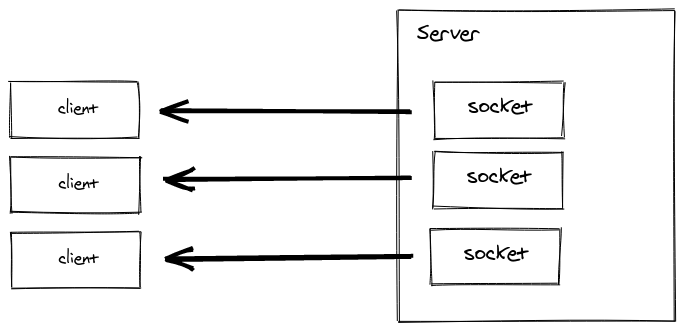
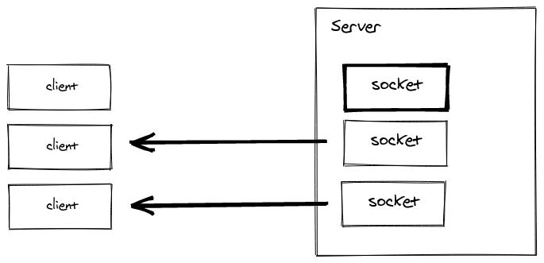
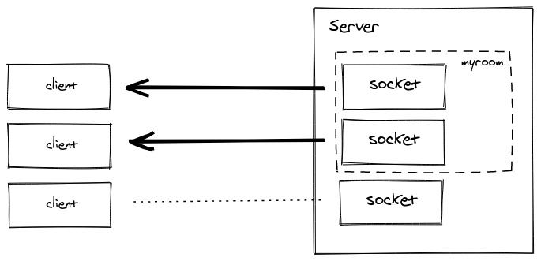

# Socket.IO

> [Socket.IO](https://socket.io/) - это библиотека для создания приложений, работающих в режиме реального времени, имеющих двунаправленный канал связи и основанных на событиях. Она состоит из:

- сервера на [Node.js](https://nodejs.org/en/);
- клиентской библиотеки для браузера (которая также может использоваться на сервере).

[Пример чата на React + Express](https://github.com/harryheman/Blog-Posts/tree/master/react-express-socket.io-chat-app).

## Введение

### Принцип работы

Клиент пытается установить [WebSocket-соединение](https://learn.javascript.ru/websocket). Если веб-сокеты оказываются недоступными, тогда используется [HTTP Long Polling](https://learn.javascript.ru/long-polling) (длинные опросы).

WebSocket - это коммуникационный протокол, предоставляющий полнодуплексный канал с низкой задержкой между сервером и клиентом.

### Возможности

- надежность: соединение устанавливается независимо от присутствия прокси, балансировщиков нагрузки, "файервола" и антивируса
- автоматическое переподключение
- обнаружение обрыва соединения
- отправка бинарных данных
- мультиплексирование

### Установка

```bash
yarn add socket.io
# или
npm i socket.io
```

### Простой пример

```js
// index.js
const content = require('fs').readFileSync(__dirname + '/index.html', 'utf8')

const httpServer = require('http').createServer((req, res) => {
  res.setHeader('Content-Type', 'text/html')
  res.setHeader('Content-Length', Buffer.byteLength(content))
  res.end(content)
})

const io = require('socket.io')(httpServer)

io.on('connection', socket => {
  console.log('Подключение установлено')

  let counter = 0
  setInterval(() => {
    // отправляем данные клиенту
    socket.emit('hello', ++counter);
  }, 1000)

  // получаем данные от клиента
  socket.on('hi', data => {
    console.log('hi', data)
  })
})

httpServer.listen(3000, () => {
  console.log('Перейдите на http://localhost:3000')
})
```

```html
<body>
  <ul id="events"></ul>

  <script src="/socket.io/socket.io.js"></script>
  <script>
    const $events = document.getElementById('events')

    const newItem = (content) => {
      const item = document.createElement('li')
      item.innerText = content
      return item
    }

    const socket = io()

    socket.on('connect', () => {
      $events.appendChild(newItem('Подключение установлено'))
    })

    // получаем данные от сервера
    socket.on('hello', (counter) => {
      $events.appendChild(newItem(`Привет - ${counter}`))
    })

    // отправляем данные на сервер
    let counter = 0
    setInterval(() => {
      ++counter
      socket.emit('hi', { counter })
    }, 1000)
  </script>
</body>
```

```bash
node index.js
# открываем localhost:3000
```

## Сервер

#### Node

```js
const server = require('http').createServer()
const options = {}
const io = require('socket.io')(server, options)

io.on('connection', socket => {})

server.listen(3000)
```

#### Express

```js
const app = require('express')()
const server = require('http').createServer(app)
const io = require('socket.io')(server)

io.on('connection', socket => {})

server.listen(3000)
```

#### Koa

```js
const app = require('koa')()
const server = require('http').createServer(app.callback())
const io = require('socket.io')(server)

io.on('connection', socket => {})

server.listen(3000)
```

### Экземпляр сокета

- `socket.id` - каждый сокет имеет 20-значный идентификатор, одинаковый на сервере и клиенте:

```js
// сервер
io.on('connection', socket => {
  console.log(socket.id) // ojIckSD2jqNzOqIrAGzL
})

// клиент
socket.on('connect', () => {
  console.log(socket.id) // ojIckSD2jqNzOqIrAGzL
})
```

- `socket.handshake` - объект, содержащий некоторую информацию о "рукопожатии", происходящем в начале сессии (заголовки, строка запроса, url и т.д.).

- `socket.rooms` - ссылка на комнаты:

```js
io.on('connection', socket => {
  console.log(socket.rooms) // Set { <socket.id> }
  socket.join('room1')
  console.log(socket.rooms) // Set { <socket.id>, 'room1' }
})
```

#### Добавление атрибутов

К экземпляру можно добавлять любые атрибуты:

```js
// middleware
io.use(async (socket, next) => {
  try {
    const user = await fetchUser(socket)
    socket.user = user
  } catch {
    next(new Error('Неизвестный пользователь'))
  }
})

io.on('connection', (socket) => {
  console.log(socket.user)

  // обработчик
  socket.on('set username', username => {
    socket.username = username
  })
})
```

#### События

- `disconnect` - происходит при отключении сокета:

```js
io.on('connection', socket => {
  socket.on('disconnect', reason = {})
})
```

- `disconnecting` - происходит перед `disconnect`, может использоваться для регистрации выхода пользователя из непустой комнаты:

```js
io.on('connection', socket => {
  socket.on('disconnecting', reason => {
    for (const room of socket.rooms) {
      if (room !== socket.id) {
        socket.to(room).emit('user has left', socket.id)
      }
    }
  })
})
```

Специальные события не должны использоваться в приложении.

### Посредники (middlewares)

Middleware - это функция, которая выполняется при каждом соединении. Посредники могут использоваться для логгирования, аутентификации/авторизации, ограничения скорости подключения и т.д.

#### Регистрация посредника

Посредник имеет доступ к экземпляру сокета и следующему посреднику:

```js
io.use((socket, next) => {
  if (isValid(socket.request)) {
    next()
  } else {
    next(new Error('как-то это все невалидно'))
  }
})
```

Несколько посредников выполняются последовательно.

#### Отправка полномочий (credentials)

Для отправки полномочий на клиенте используется свойство `auth`:

```js
const socket = io({
  auth: {
    token: 'secret'
  }
})
```

На сервере доступ к полномочиям можно получить через свойство `handshake`:

```js
io.use((socket, next) => {
  const token = socket.handshake.auth.token
})
```

#### Обработка ошибок, возникающих в посреднике

При возникновении ошибки в посреднике происходит отказ в подключении, а клиент получает событие `connect_error`:

```js
socket.on('connect_error', (e) => {
  console.log(e.message)
})
```

#### Совместимость с посредниками Express

Для обеспечения совместимости с Express middlewares требуется функция-обертка:

```js
const wrap = middleware => (socket, next) => middleware(socket.request, {}, next)
```

Пример использования Passport.js:

```js
const session = require('express-session')
const passport = require('passport')

io.use(wrap(session({ secret: 'secret' })))
io.use(wrap(passport.initialize()))
io.use(wrap(passport.session()))

io.use((socket, next) => {
  if (socket.request.user) {
    next()
  } else {
    next(new Error('unauthorized'))
  }
})
```

### Обработка CORS

Начиная с Socket.io версии 3, необходимо явно разрешать cross-origin resource sharing (распределение ресурса между разными источниками):

```js
const io = require('socket.io')(server, {
  cors: {
    origin: 'http://example.com',
    methods: ['GET', 'POST']
  }
})

// или
const io = require('socket.io')(server, {
  cors: {
    origin: '*'
  }
})
```

Пример с куками:

```js
// сервер
const io = require('socket.io')(server, {
  cors: {
    origin: 'http://example.com',
    methods: ['GET', 'POST'],
    allowedHeaders: ['custom-header'],
    credentials: true
  }
})

// клиент
const io = require('socket.io-client')
const socket = io('http://api.example.com', {
  withCredentials: true,
  extraHeaders: {
    'custom-header': 'chat-app'
  }
})
```

### Структура приложения

Рекомендуемая структура на примере списка задач.

```bash
mkdir socket-todo
cd socket-todo

yarn init -yp
yarn add socket.io express lowdb nanoid
```

```json
// package.json
{
  "name": "socket-todo",
  "version": "1.0.0",
  "main": "server.js",
  "license": "MIT",
  "private": true,
  "dependencies": {
    "express": "^4.17.1",
    "lowdb": "^1.0.0",
    "nanoid": "^3.1.20",
    "socket.io": "^3.1.1"
  },
  "scripts": {
    "start": "node server"
  }
}
```

```html
<!-- index.html -->
<body>
  <form>
    <input
      type="text"
      placeholder="Enter todo title..."
      autocomplete="off"
      autofocus
      required
    />
    <input type="submit" value="Add" />
  </form>
  <ul></ul>

  <!-- подключение socket.io -->
  <script src="/socket.io/socket.io.js"></script>
  <script src="client.js"></script>
</body>
```

```js
// server.js
const express = require('express')
const app = express()
const server = require('http').createServer(app)
const io = require('socket.io')(server)

// обработка статических файлов
app.use(express.static(__dirname))

// регистрация обработчиков
const registerTodoHandlers = require('./todoHandlers')

// обработка подключения
const onConnection = (socket) => {
  console.log('User connected')
  registerTodoHandlers(io, socket)
}

// регистрация подключения
io.on('connection', onConnection)

const PORT = process.env.PORT || 3000
server.listen(PORT, () => {
  console.log(`Server ready. Port: ${PORT}`)
})
```

```js
// todoHandlers.js
const { nanoid } = require('nanoid')
// подключение и настройка lowdb для работы с локальной базой данных в формате json
const low = require('lowdb')
const FileSync = require('lowdb/adapters/FileSync')

const adapter = new FileSync('todos.json')
const db = low(adapter)

// инициализация БД
db.defaults({
  todos: [
    { id: '1', title: 'Eat' },
    { id: '2', title: 'Sleep' },
    { id: '3', title: 'Repeat' }
  ]
}).write()

module.exports = (io, socket) => {
  // получение задач
  const getTodos = () => {
    const todos = db.get('todos').value()

    io.emit('todos', todos)
  }

  // добавление задачи
  const addTodo = (title) => {
    db.get('todos')
      .push({ id: nanoid(4), title })
      .write()

    getTodos()
  }

  // удаление задачи по идентификатору
  const removeTodo = (id) => {
    db.get('todos').remove({ id }).write()

    getTodos()
  }

  socket.on('todo:get', getTodos)
  socket.on('todo:add', addTodo)
  socket.on('todo:remove', removeTodo)
}
```

```js
// client.js
const socket = io()

// HTML-элементы
const form = document.querySelector('form')
const input = document.querySelector('input')
const list = document.querySelector('ul')

// инициализация получения задач
socket.emit('todo:get')

// обработка получения задач
socket.on('todos', (todos) => {
  list.innerHTML = ''
  todos.forEach(addTodo)
})

function addTodo({ id, title }) {
  const template = /*html*/ `
    <li>
      <span>${title}</span>
      <button data-id="${id}">Remove</button>
    </li>
  `
  list.innerHTML += template
  initBtns()
}

// инициализация кнопок для удаления задач
function initBtns() {
  const buttons = document.querySelectorAll('button')

  buttons.forEach((btn) => {

    btn.addEventListener('click', ({ target }) => {
      // удаление задачи по id
      const { id } = target.dataset

      socket.emit('todo:remove', id)
    })
  })
}

// добавление задачи
form.onsubmit = (e) => {
  e.preventDefault()

  const title = input.value.trim()

  input.value = ''

  socket.emit('todo:add', title)
}
```

```bash
yarn start
# открываем localhost:3000
```

## Клиент

- В процессе установки socket.io (`yarn add socket.io`) формируется клиентский "бандл":

```html
<script src="/socket.io/socket.io.js"></script>
```

Подключение библиотеки приводит к созданию глобальной переменной *io*.

- CDN:

```js
<script src="https://cdn.socket.io/3.1.1/socket.io.min.js"></script>
```

### Инициализация

- Если домены клиента и сервера совпадают:

```js
const socket = io()
```

- Если не совпадают:

```js
const socket = io('https://server-domain.com')
```

Не забудьте про CORS.

- Имеется возможность выбора определенного пространства имен (namespace):

```js
const socket = io('/admin')
```

### Настройки движка

- `path` - название пути, должно быть одинаковым на клиенте и сервере, не имеет отношения к пространству имен:

```js
// клиент
import { io } from "socket.io-client"

const socket = io("https://example.com", {
  path: "/custom-path/"
})

// сервер
const httpServer = require("http").createServer()
const io = require("socket.io")(httpServer, {
  path: "/custom-path/"
})
```

- `query` - дополнительные параметры строки запроса, сохраняются на протяжении сессии (не могут быть изменены):

```js
// клиент
const socket = io({
  query: {
    x: 42
  }
})

// сервер
io.on("connection", (socket) => {
  console.log(socket.handshake.query) // { x: "42", EIO: "4", transport: "polling" }
})
```

- `extraHeaders` - дополнительные заголовки, сохраняются на протяжении сессии (не могут быть изменены):

```js
// клиент
const socket = io({
  extraHeaders: {
    "custom-header": "chat-app"
  }
})

// сервер
io.on("connection", (socket) => {
  console.log(socket.handshake.headers) // { "custom-header": "chat-app" }
})
```

Также имеются настройки менеджера (`reconnection`, `reconnectionAttempts`, `reconnectionDelay` и т.д.).

### Экземпляр сокета

- `socket.id`

- `socket.connected` - индикатор подключения к серверу

Жизненный цикл


#### События

- `connect` - происходит при подключении / повторном подключении

```js
socket.on('connect', () => {})
```

- `connect_error` - происходит при отказе в подключении, требуется ручное переподключение:

```js
socket.on('connect_error', () => {
  socket.auth.token = 'secret'
  socket.connect()
})
```

- `disconnect` - происходит при отключении:

```js
socket.on('disconnect', reason => {})
```

#### Офлайн-режим

По умолчанию при отсутствии подключения происходит буферизация данных. В некоторых случаях может потребоваться другое поведение.

- использование атрибута `connect`:

```js
if (socket.connected) {
  socket.emit()
} else {}
```

- использование изменчивых событий (volatile events):

```js
socket.volatile.emit()
```

- очистка буфера перед повторным подключением:

```js
socket.on('connect', () => {
  socket.sendBuffer = []
})
```

## События

### Базовая отправка

Socket.io вдохновлен "нодовским" `EventEmitter`. Это означает, что мы можем отправлять (`emit`) события на одной стороне и регистрировать (`on`) их на другой:

```js
// сервер
io.on('connection', socket => {
  socket.emit('message', 'Привет, народ!')
})

// клиент
socket.on('message', message => {
  console.log(message) // Привет, народ!
})
```

```js
// сервер
io.on('connection', socket => {
  socket.on('message', message => {
    consol.log(message) // Привет, народ!
  })
})

// клиент
socket.emit('message', 'Привет, народ!')
```

Можно отправлять любое количество аргументов и любые сериализуемые структуры данных, включая буферы и типизированные массивы. Сериализация объектов (`JSON.stringify()`) выполняется автоматически. `Map` и `Set` должны быть сериализованы вручную.

#### Подтверждения

События удобны в использовании, но в некоторых случаях более предпочтительным является использование классического API *запрос-ответ*. В socket.io такой подход называется *подтверждениями* (acknowledgements). Мы можем добавить колбек в качестве последнего аргумента в `emit()`. Данный колбек будет вызван после получения события другой стороной:

```js
// сервер
io.on('connection', socket => {
  socket.on('update item', (arg1, arg2, cb) => {
    console.log(arg1) // 1
    console.log(arg2) // { name: 'updated' }
    cb({
      status: 'ok'
    })
  })
})

// клиент
socket.emit('update item', '1', { name: 'updated' }, response => {
  console.log(response.status) // ok
})
```

#### Изменчивые события

Volatile events - это такие события, которые не отправляются другой стороне при отсутствии подключения. Это может быть полезным при необходимости отправки только последних данных (когда получение другой стороной промежуточной информации является несущественным). Другим случаем использования является сброс (discard) событий при отсутствии подключения (по умолчанию события буферизуются до повторного подключения):

```js
// сервер
io.on('connection', socket => {
  console.log('connect')

  socket.on('ping', count => {
    console.log(count)
  })
})

// клиент
let count = 0
setInterval(() => {
  socket.volatile.emit('ping', ++count)
}, 1000)
```

При перезапуске сервера получим следующее:

```bash
connect
1
2
3
4
# сервер был перезапущен, произошло автоматическое переподключение клиента
connect
9
10
...
```

Без `volatile` мы увидим следующее:

```bash
connect
1
2
3
4
# сервер был перезапущен, произошло автоматическое переподключение клиента и отправка ему данных из буфера
connect
5
6
7
8
9
10
...
```

### Прослушивание событий

#### Методы EventEmitter

- `socket.on(eventName, listener)` - добавляет обработчик в конец массива обработчиков для события под названием *eventName*
- `socket.once(eventName, listener)` - добавляет одноразовый обработчик
- `socket.off(eventName, listener)` - удаляет указанный обработчик из массива обработчиков для *eventName*
- `socket.removeAllListeners([eventName])` - удаляет все или указанные обработчики

#### Обработчики catch-all

- `socket.onAny(listener)` - добавляет обработчик, вызываемый при возникновении любого из указанных событий:

```js
socket.onAny((eventName, ...args) => {})
```

- `socket.prependAny(listener)` - добавляет обработчик, вызываемый при возникновении любого из указанных событий, обработчик добавляется в начало массива
- `socket.offAny([listener])` - удаляет все или указанный обработчик

#### Валидация

Socket.io не предоставляет инструментов для валидации входных данных.

Пример с Joi:

```js
const Joi = require('joi')

const userSchema = Joi.object({
  username: Joi.string().max(30).required(),
  email: Joi.string().email().required()
})

io.on('connection', socket => {
  socket.on('create user', (pl, cb) => {
    if (typeof cb !== 'function') return socket.disconnect()

    const { error, value } = userSchema.validate(pl)

    if (error) return cb({ status: '!OK', error })

    cb({ status: 'OK' })
  })
})
```

#### Обработка ошибок

Socket.io также не предоставляет средств для обработки ошибок. Это означает, что мы должны перехватывать ошибки в обработчиках:

```js
io.on('connection', socket => {
  socket.on('list items', async cb => {
    try {
      const items = await findItems()
      cb({
        status: 'OK',
        items
      })
    } catch (error) {
      cb({
        status: '!OK',
        error
      })
    }
  })
})
```

### Распространение (передача) событий (вещание, broadcasting)

#### Всем подключенным клиентам



```js
io.on('connection', socket => {
  io.emit('message', 'Привет, народ!')
})
```

#### Всем подключенным клиентам, кроме отправителя



```js
io.on('connection', socket => {
  socket.broadcast.emit('message', 'Привет, народ!')
})
```

### Комнаты

Комната - это произвольный канал, к которому сокет может присоединяться (`join`) и который он может покидать (`leave`). Она может использоваться для передачи события только определенным клиентам.



Список комнат можно получить только на сервере.

#### Вход в комнату и выход из нее

Для входа в комнату используется `join`:

```js
io.on('connection', socket => {
  socket.join('some room')
})
```

Затем для вещания событий используется `to` или `in`:

```js
io.to('some room').emit('some event')

// можно вещать в несколько комнат
io.to('room1').to('room2').emit('some event')

// можно вещать из сокета
io.on('connection', socket => {
  socket.to('some room').emit('some event')
})
```

Для выхода из комнаты используется `leave`.

#### "Дефолтная" комната

Каждый сокет по умолчанию присоединяется к комнате с его идентификатором.

Это позволяет легко отправлять приватные сообщения:

```js
io.on('connection', socket => {
  socket.on('private message', (anotherSocket, message) => {
    socket.to(anotherSocket).emit('private message', socket.id, message)
  })
})
```

#### Простые случаи использования

- передача данных указанному пользователю:

```js
io.on('connection', async socket => {
  const userId = await fetchUserId(socket)

  socket.join(userId)

  io.to(userId).emit('Привет!')
})
```

- отправка уведомлений о событии:

```js
io.on('connection', async socket => {
  const projects = await fetchProjects(socket)

  projects.forEach(p => socket.join(`project: ${p.id}`))

  io.to('project:1234').emit('project updated')
})
```

#### Асинхронный код

Пример с колбеком:

```js
saveProduct(() => {
  socket.to('room1').emit('project updated')
})
```

Пример с `async/await`:

```js
const details = await fetchDetails()
io.to('room2').emit('details', details)
```

#### Отключение

При отключении сокеты автоматически покидают все комнаты, к которым были присоединены. Список комнат можно получить, прослушивая событие `disconnecting`:

```js
io.on('connection', socket => {
  socket.on('disconnecting', () => {
    console.log(socket.rooms)
  })

  socket.on('disconnect', () => {
    // socket.rooms.size === 0
  })
})
```

### Шпагралка по отправке событий

```js
io.on('connection', socket => {

  // всем клиентам
  socket.emit('hello', 'ты меня слышишь?', 1, 2, 'абя')

  // всем клиентам, кроме отправителя
  socket.broadcast.emit('broadcast', 'привет, друзья!')

  // всем клиентам в комнате "game", кроме отправителя
  socket.to('game').emit('nice game', 'сыграем?')

  // всем клиентам в комнате "game1" и/или в комнате "game2", кроме отправителя
  socket.to('game1').to('game2').emit('nice game', 'когда будем играть?')

  // всем клиентам в комнате "game", включая отправителя
  io.in('game').emit('big announcement', 'игра скоро начнется')

  // всем клиентам в пространстве имен "myNamespace", включая отправителя
  io.of('myNamespace').emit('bigger announcement', 'турнир скоро начнется')

  // всем клиентам в определенном пространстве имен и в определенной комнате, включая отправителя
  io.of('namespace').to('room').emit('event', 'сообщение')

  // определенному сокету (приватное сообщение)
  io.to(socketId).emit('hi', 'после прочтения сжечь')

  // с подтверждением
  socket.emit('question', 'ты действительно так думаешь?', answer => {})

  // без сжатия
  socket.compress(false).emit('uncompessed', 'без сжатия')

  // отправка необязательного события
  socket.volatile.emit('maybe', 'оно тебе надо?')

  // всем клиентам в данном узле
  io.local.emit('hi', 'только вам, больше никому')

  // всем клиентам
  io.emit('данное событие отправлено всем клиентам')
})
```

Следующие события являются зарезервированными и не должны использоваться в приложении:

- `connect`
- `connect_error`
- `disconnect`
- `disconnecting`
- `newListener`
- `removeListener`

## Продвинутые возможности

### Пространства имен (namespaces)

Пространство имен - это канал коммуникации, позволяющий разделить логику приложения на несколько частей (это называется "мультиплексированием").


#### Введение

Каждое пространство имен имеет собственные:

- обработчики событий

```js
io.of('/orders').on('connection', socket => {
  socket.on('order:list', () => {})
  socket.on('order:create', () => {})
})

io.of('/users').on('connection', socket => {
  socket.on('user:list', () => {})
})
```

- комнаты

```js
const orderNsp = io.of('/orders')

orderNsp.on('connection', socket => {
  socket.join('room1')
  orderNsp.to('room1').emit('hello')
})

const userNsp = io.of('/users')

userNsp.on('connection', socket => {
  socket.join('room1')
  userNsp.to('room1').emit('привет')
})
```

- посредников

```js
const orderNsp = io.of('/orders')

orderNsp.use((socket, next) => {
  // ...
  next()
})

const userNsp = io.of('/users')

userNsp.use((socket, next) => {
  // ...
  next()
})
```

Случаи использования:

- создание специального пространства имен, к которому имеют доступ только авторизованные пользователи

```js
const adminNsp = io.of('/admin')

adminNsp.use((socket, next) => {
  // ...
  next()
})

adminNsp.on('connection', socket => {
  socket.on('delete user', () => {})
})
```

- динамическое создание пространств для каждого "арендатора"

```js
const wkss = io.of(/^\/\w+$/)

wkss.on('connection', socket => {
  const wks = socket.nsp

  wks.emit('hello')
})
```

#### Основное пространство имен

Основное пространство имен называется `/`. Экземпляр `io` наследует все его методы:

```js
io.on("connection", (socket) => {})
io.use((socket, next) => { next() })
io.emit("hello")
// является эквивалентом следующего
io.of("/").on("connection", (socket) => {})
io.of("/").use((socket, next) => { next() })
io.of("/").emit("hello")
```

`io.sockets` является алиасом для `io.of('/')`.

#### "Кастомные" пространства имен

```js
const nsp = io.of('/namespace')

nsp.on('connection', socket => {
  console.log('user connected')
})

nsp.emit('привет', 'всем!')
```

#### Инициализация клиента

```js
const socket = io()
const orderSocket = io('/orders')
const userSocket = io('/users')
```

#### Динамические пространства имен

- С помощью регулярного выражения:

```jsx
io.of(/^\/dynamic-\d+$/)
```

- С помощью функции:

```js
io.of((name, auth, next) => {
  next(null, true) // или false, если в создании отказано
})
```

Доступ к новому ПИ можно получить в событии `connection`:

```js
io.of(/^\/dynamic-\d+$/).on('connection', socket => {
  const namespace = socket.nsp
}) // метод `io()` возвращает родительское ПИ

// регистрация посредника
const parentNsp = io.of(/^\/dynamic-\d+$/)

parentNsp.use((socket, next) => { next() })

// вещание событий
parentNsp.emit('hello')
```

## Пример чата

```bash
mkdir socket-chat
cd socket-chat

yarn init -yp
yarn add socket.io express
```

```json
// package.json
{
  "name": "socket-chat",
  "version": "1.0.0",
  "main": "server.js",
  "license": "MIT",
  "private": true,
  "dependencies": {
    "express": "^4.17.1",
    "socket.io": "^3.1.1"
  },
  "scripts": {
    "start": "node server"
  }
}
```

```html
<!-- index.html -->
<body>
  <ul class="pages">
    <li class="chat_page">
      <div class="chat_area">
        <ul class="messages"></ul>
      </div>
      <input
        type="text"
        placeholder="Type here..."
        class="message_input"
      />
    </li>
    <li class="login_page">
      <div class="form">
        <h3 class="title">What is your name?</h3>
        <input type="text" maxlength="14" class="username_input" />
      </div>
    </li>
  </ul>

  <script src="/socket.io/socket.io.js"></script>
  <script src="client.js"></script>
</body>
```

```css
/* style.css */
* {
  box-sizing: border-box;
}

html {
  font-weight: 300;
  -webkit-font-smoothing: antialiased;
}

html,
input {
  font-family: 'HelveticaNeue-Light', 'Helvetica Neue Light', 'Helvetica Neue', Helvetica, Arial, 'Lucida Grande', sans-serif;
}

html,
body {
  height: 100%;
  margin: 0;
  padding: 0;
}

ul {
  list-style: none;
  word-wrap: break-word;
}

/* Pages */

.pages {
  height: 100%;
  margin: 0;
  padding: 0;
  width: 100%;
}

.login_page,
.chat_page {
  height: 100%;
  position: absolute;
  width: 100%;
}

/* Login Page */

.login_page {
  background-color: #000;
}

.login_page .form {
  height: 100px;
  margin-top: -100px;
  position: absolute;
  text-align: center;
  top: 50%;
  width: 100%;
}

.login_page .form .username_input {
  background-color: transparent;
  border: none;
  border-bottom: 2px solid #fff;
  outline: none;
  padding-bottom: 15px;
  text-align: center;
  width: 400px;
}

.login_page .title {
  font-size: 200%;
}

.login_page .username_input {
  font-size: 200%;
  letter-spacing: 3px;
}

.login_page .title,
.login_page .username_input {
  color: #fff;
  font-weight: 100;
}

/* Chat page */

.chat_page {
  display: none;
}

/* Font */

.messages {
  font-size: 150%;
}

.message_input {
  font-size: 100%;
}

.log {
  color: gray;
  font-size: 70%;
  margin: 5px;
  text-align: center;
}

/* Messages */

.chat_area {
  height: 100%;
  padding-bottom: 60px;
}

.messages {
  height: 100%;
  margin: 0;
  overflow-y: scroll;
  padding: 10px 20px 10px 20px;
}

.message.typing .message_body {
  color: gray;
}

.username {
  font-weight: 700;
  overflow: hidden;
  padding-right: 15px;
  text-align: right;
}

/* Input */

.message_input {
  border: 10px solid #000;
  bottom: 0;
  height: 60px;
  left: 0;
  outline: none;
  padding-left: 10px;
  position: absolute;
  right: 0;
  width: 100%;
}
```

```js
// server.js
const express = require('express')
const app = express()
const server = require('http').createServer(app)
const io = require('socket.io')(server)

const PORT = process.env.PORT || 3000
server.listen(PORT, () => {
  console.log(`Server ready. Port: ${PORT}`)
})

app.use(express.static(__dirname))

let users = 0

io.on('connection', (S) => {
  let user = false

  S.on('new message', (message) => {
    S.broadcast.emit('new message', {
      username: S.username,
      message
    })
  })

  S.on('add user', (username) => {
    if (user) return

    S.username = username
    ++users
    user = true
    S.emit('login', {
      users
    })

    S.broadcast.emit('user joined', {
      username: S.username,
      users
    })
  })

  S.on('typing', () => {
    S.broadcast.emit('typing', {
      username: S.username
    })
  })

  S.on('stop typing', () => {
    S.broadcast.emit('stop typing', {
      username: S.username
    })
  })

  S.on('disconnect', () => {
    if (user) {
      --users

      S.broadcast.emit('user left', {
        username: S.username,
        users
      })
    }
  })
})
```

```js
// client.js
const TYPING_TIMER = 800
const COLORS = [
  '#e21400',
  '#91580f',
  '#f8a700',
  '#f78b00',
  '#58dc00',
  '#287b00',
  '#a8f07a',
  '#4ae8c4',
  '#3b88eb',
  '#3824aa',
  '#a700ff',
  '#d300e7'
]

// вспомогательные функции
const findOne = (selector, el = document) => el.querySelector(selector)
const findAll = (selector, el = document) => [...el.querySelectorAll(selector)]

const hide = (el) => (el.style.display = 'none')
const show = (el) => (el.style.display = 'block')

// HTML-элементы
const $usernameInput = findOne('.username_input')
const $messages = findOne('.messages')
const $messageInput = findOne('.message_input')

const $loginPage = findOne('.login_page')
const $chatPage = findOne('.chat_page')

// глобальные переменные
const S = io()

let username
let connected = false
let typing = false
let lastTypingTime

let $currentInput = $usernameInput
$currentInput.focus()

// функции
const addParticipants = ({ users }) => {
  let message = ''
  if (users === 1) {
    message += `there's 1 participant`
  } else {
    message += `there are ${users} participants`
  }
  log(message)
}

const setUsername = () => {
  username = $usernameInput.value.trim()

  if (username) {
    hide($loginPage)
    show($chatPage)

    $loginPage.onclick = () => false

    $currentInput = $messageInput
    $currentInput.focus()

    S.emit('add user', username)
  }
}

const sendMessage = () => {
  const message = $messageInput.value.trim()

  if (message && connected) {
    $messageInput.value = ''

    addChatMessage({ username, message })

    S.emit('new message', message)
  }
}

const addChatMessage = (data) => {
  removeChatTyping(data)

  const typingClass = data.typing ? 'typing' : ''

  const html = `
    <li
      class="message ${typingClass}"
      data-username="${data.username}"
    >
      <span
        class="username"
        style="color: ${getUsernameColor(data.username)};"
      >
        ${data.username}
      </span>
      <span class="message_body">
        ${data.message}
      </span>
    </li>
  `

  addMessageEl(html)
}

const addMessageEl = (html) => {
  $messages.innerHTML += html
}

const log = (message) => {
  const html = `<li class="log">${message}</li>`

  addMessageEl(html)
}

const addChatTyping = (data) => {
  data.typing = true
  data.message = 'is typing...'
  addChatMessage(data)
}

const removeChatTyping = (data) => {
  const $typingMessages = getTypingMessages(data)

  if ($typingMessages.length > 0) {
    $typingMessages.forEach((el) => {
      el.remove()
    })
  }
}

const updateTyping = () => {
  if (connected) {
    if (!typing) {
      typing = true
      S.emit('typing')
    }

    lastTypingTime = new Date().getTime()

    setTimeout(() => {
      const now = new Date().getTime()
      const diff = now - lastTypingTime
      if (diff >= TYPING_TIMER && typing) {
        S.emit('stop typing')
        typing = false
      }
    }, TYPING_TIMER)
  }
}

const getTypingMessages = ({ username }) =>
  findAll('.message.typing').filter((el) => el.dataset.username === username)

const getUsernameColor = (username) => {
  let hash = 7
  for (let i = 0; i < username.length; i++) {
    hash = username.charCodeAt(i) + (hash << 5) - hash
  }
  const index = Math.abs(hash % COLORS.length)
  return COLORS[index]
}

// обработчики
window.onkeydown = (e) => {
  if (!(e.ctrlKey || e.metaKey || e.altKey)) $currentInput.focus()

  if (e.which === 13) {
    if (username) {
      sendMessage()
      S.emit('stop typing')
      typing = false
    } else {
      setUsername()
    }
  }
}

$messageInput.oninput = () => {
  updateTyping()
}

$loginPage.onclick = () => {
  $currentInput.focus()
}

$chatPage.onclick = () => {
  $messageInput.focus()
}

// сокет
S.on('login', (data) => {
  connected = true
  log(`Welcome to Socket.IO Chat - `)
  addParticipants(data)
})

S.on('new message', (data) => {
  addChatMessage(data)
})

S.on('user joined', (data) => {
  log(`${data.username} joined`)
  addParticipants(data)
})

S.on('user left', (data) => {
  log(`${data.username} left`)
  addParticipants(data)
  removeChatTyping(data)
})

S.on('typing', (data) => {
  addChatTyping(data)
})

S.on('stop typing', (data) => {
  removeChatTyping(data)
})

S.on('disconnect', () => {
  log('You have been disconnected')
})

S.on('reconnect', () => {
  log('You have been reconnected')
  if (username) {
    S.emit('add user', username)
  }
})

S.on('reconnect_error', () => {
  log('Attempt to reconnect has failed')
})
```

```bash
yarn start
# открываем localhost:3000
```
