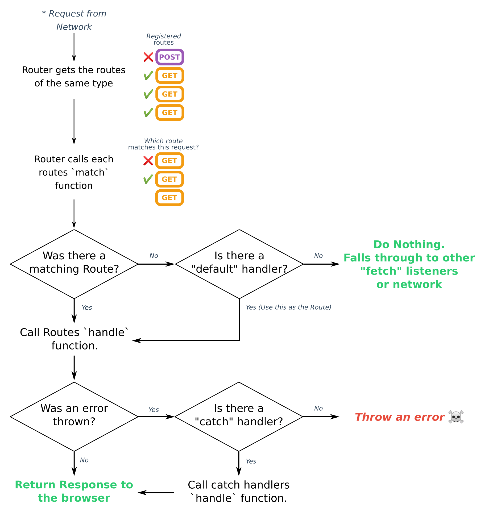

# Workbox

## Что такое `Workbox`?

[Workbox](https://developers.google.com/web/tools/workbox) (далее - `WB`) - это библиотека (точнее, набор библиотек), основной целью которой является "предоставление лучших практик и избавление от шаблонного кода при работе с [сервис-воркерами](https://developer.mozilla.org/ru/docs/Web/API/Service_Worker_API)" (далее - СВ).

Если вы впервые слышите о СВ, то перед изучением данного руководства рекомендую ознакомиться со следующими материалами:

- <a href="https://developer.mozilla.org/ru/docs/Web/API/Service_Worker_API">Service Worker API - MDN</a>
- <a href="https://developers.google.com/web/fundamentals/primers/service-workers">Service Workers: an Introduction - Web Fundamentals</a>
- <a href="https://habr.com/ru/post/491840/">Визуализация работы сервис-воркеров - Хабр</a>
- <a href="https://habr.com/ru/post/517672/">Рецепты по приготовлению офлайн-приложений - Хабр</a>

`WB` предоставляет следующие возможности:

- предварительное кэширование
- кэширование во время выполнения
- стратегии (кэширования)
- обработка (перехват сетевых) запросов
- фоновая синхронизация
- помощь в отладке

## На что похож `WB API`?

Ниже приведены примеры основных подходов к разработке прогрессивных веб-приложений (приложений, в которых используются возможности, предоставляемые СВ).

### Кэширование шрифтов Google

Хотели бы вы, чтобы ваши гугл-шрифты были доступны в режиме офлайн после того, как пользователь в первый раз посетил ваш сайт? Тогда запишите их в кэш:

```js
import { ExpirationPlugin } from 'workbox-expiration'
import { registerRoute } from 'workbox-routing'
import { StaleWhileRevalidate } from 'workbox-strategies'

// Записываем гугл-шрифты в кэш с применением стратегии `stale-while-revalidate` (см. ниже) с
// ограничением максимального количества вхождений (записей в кэше)
registerRoute(
  ({ url }) =>
    url.origin === 'https://fonts.googleapis.com' ||
    url.origin === 'https://fonts.gstatic.com',
  new StaleWhileRevalidate({
    cacheName: 'google-fonts',
    plugins: [new ExpirationPlugin({ maxEntries: 20 })]
  })
)
```

### Кэширование `JavaScript` и `CSS`

Сделайте ваш `JS` и `CSS-код` быстрым за счет его доставки из кэша, будучи уверенными в его актуальности за счет периодического обновления (в фоновом режиме):

```js
import { registerRoute } from 'workbox-routing'
import { StaleWhileRevalidate } from 'workbox-strategies'

registerRoute(
  ({ request }) =>
    request.destination === 'script' || request.destination === 'style',
  new StaleWhileRevalidate()
)
```

### Кэширование изображений

Как правило, основной "вес" страницы - это изображения. Используйте следующее правило для сохранения изображений в кэше, будучи уверенными, что они не переполнят хранилище пользователя:

```js
import { CacheableResponsePlugin } from 'workbox-cacheable-response'
import { CacheFirst } from 'workbox-strategies'
import { ExpirationPlugin } from 'workbox-expiration'
import { registerRoute } from 'workbox-routing'

registerRoute(
  ({ register }) => request.destination === 'image',
  new CacheFirst({
    cacheName: 'images',
    plugins: [
      new CacheableResponsePlugin({
        statuses: [0, 200]
      }),
      new ExpirationPlugin({
        maxEntries: 60,
        maxAgeSeconds: 30 * 24 * 60 * 60 // 30 дней
      })
    ]
  })
)
```

### Предварительное кэширование

Используйте `WB` для предварительного кэширования ресурсов, используемых вашим приложением, с помощью `CLI`, `Node-модуля` или `Webpack-плагина`.

```js
// CLI
workbox wizard

// Node
const { generateSW } = require('workbox-build')

generateSW({
  swDest: './build/sw.js',
  globDirectory: './app',
  globPatterns: '**/*.{js, css, html, png}'
})

// Webpack
const { GenerateSW } = require('workbox-webpack-plugin')

module.exports = {
  // другие настройки вебпака
  plugins: [
    // другие плагины
    new GenerateSW()
  ]
}
```

### Гугл-аналитика в режиме офлайн

Хотите, чтобы гугл-аналитика продолжала работать при отсутствии подключения к сети? Никаких проблем.

```js
import * as googleAnalytics from 'wortkbox-google-analytics'

googleAnalytics.initialize()
```

## Начало работы

`WB` - это набор библиотек для помощи в создании и управлении СВ и кэшированием через <a href="https://developer.mozilla.org/ru/docs/Web/API/CacheStorage">`CacheStorage API`</a>. СВ и `CacheStorage API` при совместном использовании позволяют управлять тем, откуда загружаются ресурсы, используемые приложением (`JavaScript`, `CSS`, `HTML`, изображения и т.д.), из сети или из кэша.

### Установка

Начиная с 5 версии, `WB` может быть использован внутри СВ с помощью `JS-модулей` и `npm` посредством установки необходимых модулей `WB` и их импорта.

К сожалению, `JS-модули` не работают в СВ, поэтому для компиляции СВ требуется сборщик модулей, такой как `Webpack`, `Rollup` или `Parcel` (см. ниже).

### Создание СВ

Перед использованием `WB`, необходимо создать СВ и зарегистрировать его на странице. Начнем с создания файла `service-worker.js` в корневой директории проекта:

```js
console.log('Привет от сервис-воркера!')
```

Далее регистрируем СВ на странице:

```html
<script>
  // Проверяем поддержку СВ
  if ('serviceWorker' in navigator) {
    // Ожидаем полной загрузки страницы
    window.addEventListener('load', () => {
      navigator.serviceWorker.register('/service-worker.js')
    })
  }
</script>
```

Это сообщает браузеру, что данный СВ должен использоваться для текущей страницы. Если вы перезагрузите страницу, откроете инструменты разработчика `Chrome` и перейдете во вкладку `Console`, то увидите там сообщение от СВ.

Если переключиться на вкладку `Application`, то можно увидеть, что СВ был успешно зарегистрирован.

После этого можно подключать `WB`.

## Использование `WB`

`WB` - это набор `npm-модулей`. Сначала требуется установить нужный модуль, затем импортировать его. Одними из основных возможностей `WB` является маршрутизация и стратегии кэширования, с них и начнем.

### Маршрутизация и стратегии кэширования

`WB` позволяет управлять кэшированием HTTP-запросов с помощью различных стратегий кэширования. Первым делом необходимо определить, соответствует ли поступивший запрос определенному критерию и, если это так, применить к нему соответствующую стратегию. Можно использовать предварительно определенную стратегию (предоставляемую `WB`) или определить собственную. Базовая реализация маршрутизации и кэширования может выглядеть так:

```js
import { registerRoute } from 'workbox-routing'
import {
  NetworkFirst,
  StaleWhileRevalidate,
  CacheFirst
} from 'workbox-strategies'

// Используется для фильтрации запросов на основе статус-кодов, заголовков или обоих сразу (см. ниже)
import { CacheableResponsePlugin } from 'workbox-cacheable-response'
// Используется для ограничения количества записей в кэше и удаления записей по истечении определенного времени (см. ниже)
import { ExpirationPlugin } from 'workbox-expiration'

// Кэшируем страницы (`HTML`) с помощью стратегии `Network First` (сначала сеть)
registerRoute(
  // проверяем, что запрос - это переход на новую страницу
  ({ request }) => request.mode === 'navigate',
  new NetworkFirst({
    // помещаем все файлы в кэш с названием 'pages'
    cacheName: 'pages',
    plugins: [
      // кэшируем только результаты со статусом 200
      new CacheableResponsePlugin({
        statuses: [200]
      })
    ]
  })
)

// Кэшируем запросы на получение `CSS`, `JS` и веб-воркеров с помощью стратегии `Stale While Revalidate` (считается устаревшим после запроса)
registerRoute({
  // проверяем, что цель запроса - это таблица стилей, скрипт или воркер
  ({ request }) =>
    request.destination === 'style' ||
    request.destination === 'script' ||
    request.destination === 'worker',
  new StaleWhileRevalidate({
    // помещаем файлы в кэш с названием 'assets'
    cacheName: 'assets',
    plugins: [
      new CacheableResponsePlugin({
        statuses: [200]
      })
    ]
  })
})

// Кэшируем изображения с помощью стратегии `Cache First` (сначала кэш)
registerRoute(
  // проверяем, что цель запроса - изображение
  ({ request }) => request.destination === 'image',
  new CacheFirst({
    // помещаем файлы в кэш с названием 'images'
    cacheName: 'images',
    plugins: [
      new CacheableResponsePlugin({
        statuses: [200]
      }),
      // кэшируем до 50 изображений в течение 30 дней
      new ExpirationPlugin({
        maxEntries: 50,
        maxAgeSeconds: 60 * 60 * 24 * 30
      })
    ]
  })
)
```

### Предварительное кэширование

В дополнение к кэшированию после выполнения запроса (кэшированию во время выполнения), `WB` поддерживает предварительное кэширование - кэширование ресурсов во время установки СВ. Хорошими кандидатами для предварительного кэширования являются начальный `URL` приложения, резервная (офлайн) страница, а также ключевые `JS` и `CSS-файлы`. Предварительное кэширование позволяет гарантировать, что основные ресурсы приложения являются доступными в момент, когда СВ получает контроль над страницей.

Предварительное кэширование можно использовать внутри СВ с помощью плагина, предоставляемого сборщиком модулей, поддерживающим встраивание (внедрение) “манифеста предварительного кэширования” (см. ниже):

```js
import { precacheAndRoute } from 'workbox-precaching'

precacheAndRoute(self.__WB_MANIFEST)
```

Данный СВ предварительно кэширует файлы во время установки, заменяя `self.__WB_MANIFEST` списком вхождений, добавляемых в СВ во время сборки.

### Резервный контент

Как правило, для подготовки приложения к работе в режиме офлайн вместо "дефолтной" страницы с ошибкой предоставляется резервная страница. С помощью `WB` этот паттерн можно реализовать при помощи нескольких строк кода:

```js
import { precacheAndRoute } from 'workbox-precaching'
import { setCatchHandler } from 'workbox-routing'

// Обеспечиваем кэширование `/offline.html` во время сборки
precacheAndRoute(self.__WB_MANIFEST)

// Перехватываем ошибки, связанные с маршрутизацией, такие как отсутствие подключения к сети
setCatchHandler(async ({ event }) => {
  // Возвращаем предварительно сохраненную резервную страницу при запросе “документа”
  if (event.request.destination === 'document') {
    return matchPrecache('/offline.html')
  }

  return Response.error()
})
```

Данный СВ предварительно сохраняет резервную страницу и возвращает ее при отсутствии подключения к сети вместо ошибки.

## Использование сборщиков модулей с `WB`

Как было отмечено ранее, начиная с 5 версии, `WB` может использоваться в СВ с помощью `JS-модулей`.

### Создание сборки

**Выбор сборщика модулей**

Подойдет любой сборщик, поддерживающий модули, например, <a href="https://webpack.js.org/">`Webpack`</a>, <a href="https://rollupjs.org/guide/en/">`Rollup`</a> или <a href="https://parceljs.org/">`Parcel`</a>.

**Написание кода СВ**

Ниже приведен пример гипотетического СВ, импортирующего несколько `WB-библиотек`. Данный СВ должен быть обработан сборщиком перед запуском в браузере.

```js
import { precacheAndRoute } from 'workbox-precaching'
import { registerRoute } from 'workbox-routing'
import { CacheFirst } from 'workbox-strategies'

// Используем импортированные библиотеки для реализации кэширования,
// маршрутизации и другой логики
precacheAndRoute(self.__WB_MANIFEST)

registerRoute(
  ({ request }) => request.destination === 'image',
  new CacheFirst({ cacheName: 'images' })
)

// и т.д.
```

Следует отметить, что `WB` поддерживает расширенное логгирование в режиме для разработки и минимальное логгирование в производственном режиме.

**Опционально: встраивание манифеста предварительного кэширования**

Для того, чтобы кэшировать ресурсы во время установки СВ, необходимо предоставить `WB` оформленный определенным образом список `URL`. Данный список называется “манифестом предварительного кэширования” (precaching manifest).

Место для вставки такого манифеста во время сборки обозначается с помощью `self.__WB_MANIFEST`.

**Настройка вебпака**

Плагин <a href="https://developers.google.com/web/tools/workbox/modules/workbox-webpack-plugin#injectmanifest_plugin">`Inject Manifest`</a> отвечает как за сборку СВ, так и за встраивание манифеста. При его использование не требуется отдельно настраивать СВ.

**Настройка CLI**

Вместо плагина для сборщика можно использовать <a href="https://developers.google.com/web/tools/workbox/modules/workbox-cli">`workbox-cli`</a> в режиме <a href="https://developers.google.com/web/tools/workbox/modules/workbox-cli#injectmanifest">`injectManifest`</a>.

При использовании данного подхода после каждой успешной сборки необходимо запускать `injectManifest`, передавая ему свежего СВ в качестве настройки `swSrc`.

**`GenerateSW`**

В режиме `generateSW` при использовании `workbox-build`, `workbox-cli` или `GenerateSW` в `workbox-webpack-plugin` не нужно настраивать процесс сборки - готовый к использованию СВ будет сгенерирован автоматически.

## Обработка запросов

Маршрутизация в `WB` - это процесс определения совпадения маршрута с запросом и обработка совпавшего запроса (отправка ответа на него).

Существует три способа реализации определения совпадений с помощью `workbox-routing`:

1. Строка
2. Регулярное выражение
3. Функция обратного вызова

### Поиск совпадений

**С помощью строк**

Запрашиваемый `URL` сравнивается со строкой и, если они равны, запрос передается обработчику (`handler`). Маршрутизатор для `/logo.png` может быть реализован так:

```js
import { registerRoute } from 'workbox-routing'

registerRoute('/logo.png', handler)
```

Проблема такого подхода состоит в том, что запросы из другого источника (origin) не будут совпадать со строкой. Поэтому лучше определять абсолютный путь:

```js
import { registerRoute } from 'workbox-routing'

registerRoute('https://some-other-origin.com/logo.png', handler)
```

**С помощью регулярных выражений**

Лучшим способом обработки группы запросов является использование регулярного выражения.

Данный подход является гораздо более гибким, чем предыдущий. Например, вот как можно реализовать маршрутизацию на основе расширений файлов:

```js
import { registerRoute } from 'workbox-routing'

registerRoute(new RegExp('\\.js$'), jsHandler)

registerRoute(new RegExp('\\.css$'), cssHandler)
```

Регулярные выражения также могут использоваться для поиска совпадения с определенным форматом `URL`, например:

```js
// /blog/<год>/<месяц>/<пост заголовок идентификатор>
import { registerRoute } from 'workbox-routing'

registerRoute(new RegExp('/blog/\\d{4}/\\d{2}/.+'), handler)
```

И снова наш маршрут не будет совпадать с запросом из другого источника. Эту проблему можно решить с помощью `wildcard` (`.+`):

```js
import { registerRoute } from 'workbox-routing'

registerRoute(new RegExp('.+/blog/\\d{4}/\\d{2}/.+'), handler)
```

Такой же фокус можно проделать с первым примером:

```js
import { registerRoute } from 'workbox-routing'

registerRoute(new RegExp('.+\\.js$'), jsHandler)

registerRoute(new RegExp('.+\\.css$'), cssHandler)
```

**С помощью колбэков**

Для дальнейшей кастомизации определения совпадений можно воспользоваться функцией <a href="https://developers.google.com/web/tools/workbox/reference-docs/latest/module-workbox-routing#%7EmatchCallback">`matchCallback`</a>. Данная функция принимает <a href="https://developer.mozilla.org/en-US/docs/Web/API/ExtendableEvent">`ExtendableEvent`</a>, <a href="https://developer.mozilla.org/ru/docs/Web/API/Request">`Request`</a> и объект <a href="https://developer.mozilla.org/en-US/docs/Web/API/URL">`URL`</a>.

Простой пример:

```js
import { registerRoute } from 'workbox-routing'

const matchFunction = ({ url, request, event }) => {
  return url.href === 'https://example.com/app.js'
}

registerRoute(matchFunction, handler)
```

### Обработка запросов

Существует два способа обработки запросов:

1. Использование одной из стратегий, предоставляемых `workbox-strategies`
2. Предоставление функции обратного вызова, возвращающей промис, который разрешается объектом `Response`

**С помощью стратегий**

`WB` предоставляет следующие стратегии кэширования:

- `Stale While Revalidate` (ресурс считается устаревшим после запроса) - ответ возвращается из кэша, после чего выполняется обновление кэша в фоновом режиме (если ответ еще не кэширован, он возвращается из сети). Данная стратегия является безопасной, поскольку кэш все время обновляется. Ее недостатком является постоянный запрос ресурсов из сети
- `Network First` (сначала сеть) - сперва предпринимается попытка вернуть ответ из сети. Если данная попытка увенчалась успехом, ответ возвращается и после этого записывается в кэш. В противном случае, возвращается ответ из кэша
- `Cache First` (сначала кэш) - если ответ имеется в кэше, он возвращается. Иначе отправляется запрос к сети и полученный (валидный) ответ записывается в кэш и после этого передается браузеру
- `Network Only` (только сеть)
- `Cache Only` (только кэш)

```js
import { registerRoute } from 'workbox-routing'
import * as strategies from 'workbox-strategies'

registerRoute(match, new strategies.StaleWhileRevalidate())

registerRoute(match, new strategies.NetworkFirst())

registerRoute(match, new strategies.CacheFirst())

registerRoute(match, new strategies.NetworkOnly())

registerRoute(match, new strategies.CacheOnly())
```

Поведение маршрутизатора при использовании любой стратегии может быть кастомизировано посредством определения используемого кэша или добавления плагинов:

```js
import { StaleWhileRevalidate } from 'workbox-strategies'

new StaleWhileRevalidate({
   // используем кастомный кэш
  cacheName: 'my-cache-name',

  // добавляем массив плагинов (например, `ExpirationPlugin`)
  plugins: [
    ...
  ]
})
```

**С помощью колбэков**

Для дальнейшей кастомизации обработки запросов можно воспользоваться асинхронным колбэком, возвращающим объект `Response`. Данный колбэк принимает объект со свойствами `url` и `event`:

```js
import { registerRoute } from 'workbox-routing'

const handler = async ({ url, event }) => {
  return new Response(`Ответ от кастомного обработчика.`)
}

registerRoute(match, handler)
```

Следует отметить, что значение, возвращаемое колбэком `match`, передается в функцию обратного вызова `handler` в виде аргумента `params`:

```js
import { registerRoute } from 'workbox-routing'

const match = ({ url, event }) => {
  if (url.pathname === '/example') {
    return {
      name: 'Workbox',
      type: 'Руководство'
    }
  }
}

const handler = async ({ url, event, params }) => {
  // ответ будет выглядеть как "Руководство по Workbox"
  return new Response(`${params.type} по ${params.name}`)
}

registerRoute(match, handler)
```

Это может быть полезным, например, в случае, когда у нас имеется какая-то информации, “зашитая” в URL, которая извлекается в `match` (путем разбора `URL`) и используется в `handler`.

## Настройка `WB`

`WB` предоставляет названия для кэша и уровни логгирования из коробки. Эти значения можно изменять.

### Настройка названия кэша

При использовании различных `WB API` можно заметить, что некоторый кэш создается автоматически.


При отсутствии названий кэша `WB` использует дефолтные названия, определенные в `workbox-core`. Предопределенные названия кэша выглядят так:

```js
import { cacheNames } from 'workbox-core'

const precacheCacheName = cacheNames.precache
const runtimeCacheName = cacheNames.runtime
const googleAnalyticsCacheName = cacheNames.googleAnalytics
```

Каждое название состоит из трех частей:

```
<prefix>-<cacheId>-<suffix>
```

Эти названия можно менять как целиком, так и по частям:

```js
import { setCacheNameDetails } from 'workbox-core'

setCacheNameDetails({
  prefix: 'my-app',
  suffix: 'v1'
})
```

Или так:

```js
import { setCacheNameDetails } from 'workbox-core'

setCacheNameDetails({
  prefix: 'my-app',
  suffix: 'v1',
  precache: 'custom-precache-name',
  runtime: 'custom-runtime-name',
  googleAnalytics: 'custom-google-analytics-name'
})
```

### Кастомные названия кэша в стратегиях

Некоторые части `WB API` принимают настройку `cacheName` с названием кэша. К таким `API`, в частности, относятся стратегии. В случае установки настройки `cacheName`, префикс и суффикс не используются. Например, вот как можно определить название для кэша изображений:

```js
import { registerRoute } from 'workbox-routing'
import { CacheFirst } from 'workbox-strategies'

registerRoute(
  ({ request }) => request.destination === 'image',
  new CacheFirst({
    cacheName: 'my-image-cache'
  })
)
```

Теперь изображения будут записываться в кэш `my-image-cache`.


### Настройки запросов в стратегиях

При использовании кастомной стратегии для кэширования во время выполнения может потребоваться настройка некоторых аспектов исходящих запросов. Например, в запросе могут отсутствовать необходимые данные для авторизации.

Для реализации такого сценария мы можем передать в конструктор стратегии настройку `fetchOptions`, соответствующую настройкам <a href="https://developer.mozilla.org/ru/docs/Web/API/WindowOrWorkerGlobalScope/fetch#%D0%B0%D1%80%D0%B3%D1%83%D0%BC%D0%B5%D0%BD%D1%82%D1%8B">`init`</a> `Fetch API`. Эти настройки будут применяться в отношении всех исходящих запросов, которые обрабатываются данной стратегией.

```js
import { registerRoute } from 'workbox-routing'
import { NetworkFirst } from 'workbox-strategies'

registerRoute(
  ({ url }) => url.origin === 'https://third-party.example.com',
  new NetworkFirst({
    fetchOptions: {
      credentials: 'include'
    }
  })
)
```

## Обработка запросов к другим источникам

Запросы к другим источникам обрабатываются `WB` особым образом.

### Запросы к другим источникам и непрозрачные ответы

Одним из основных защитных механизмов, используемых браузером, является запрет доступа к телу и другим частям ответа, поступившего из другого источника без <a href="https://developer.mozilla.org/ru/docs/Web/HTTP/CORS">`CORS-заголовков`</a>. Такие ответы являются "непрозрачными" (opaque). СВ в этом отношении не является исключением.

### Не забывайте включать режим `CORS`

Если вы запрашиваете ресурсы с источника, поддерживающего `CORS`, но получаете непрозрачные ответы, возможно, вы неправильно их запрашиваете.

Например, следующий `HTML` запускает запросы, приводящие к непрозрачным ответам, даже если `example.com` поддерживает `CORS`:

```html
<link rel="stylesheet" href="https://example.com/path/to/style.css" />

```

В данном случае, для отправки запросов, в ответ на которые возвращаются прозрачные ответы, следует включить режим `CORS` с помощью атрибута <a href="">`crossorigin`</a>:

```html
<link
  crossorigin="anonymous"
  rel="stylesheet"
  href="https://example.com/path/to/style.css"
/>

```

### Опасность кэширования непрозрачных ответов

Обычно, `WB` не кэширует непрозрачные ответы. Причина этого заключается в том, что такие ответы могут привести к плохому "состоянию" приложения. Предположим, что мы определили такой маршрутизатор:

```js
import { registerRoute } from 'workbox-routing'
import { CacheFirst } from 'workbox-strategies'

registerRoute('https://cdn.google.com/example-script.min.js', new CacheFirst())
```

В данном случае, любой ответ будет записываться в кэш и возвращаться в ответ на запрос. Сохранение и возврат непрозрачного ответа могут привести к поломке приложения.

Тем не менее, данный подход можно использовать с такими стратегиями как `StaleWhileRevalidate` и `NetworkFirst`, поскольку в этом случае время жизни плохого ответа будет непродолжительным за счет регулярного обновления кэша.

```js
import { registerRoute } from 'workbox-routing'
import { NetworkFirst, StaleWhileRevalidate } from 'workbox-strategies'

registerRoute(
  'https://cdn.google.com/example-script.min.js',
  new NetworkFirst()
)

// или
registerRoute(
  'https://cdn.google.com/example-script.min.js',
  new StaleWhileRevalidate()
)
```

При использовании другой стратегии и получении непрозрачного ответа `WB` выведет в консоль предупреждение о том, что ответ не кэширован.


### Принудительное кэширование непрозрачных ответов

Непрозрачные ответы могут принудительно записываться в кэш с помощью плагинов, таких как `workbox-cacheable-response`:

```js
import { registerRoute } from 'workbox-routing'
import { NetworkFirst, StaleWhileRevalidate } from 'workbox-strategies'
import { CacheableResponsePlugin } from 'workbox-cacheable-response'

registerRoute(
  'https://cdn.google.com/example-script.min.js',
  new CacheFirst({
    plugins: [
      new CacheableResponsePlugin({
        statuses: [0, 200]
      })
    ]
  })
)
```

## Использование плагинов

Плагины позволяют определять дополнительное поведение, связанное с обработкой запросов или ответов, в течение жизненного цикла запроса.

### Плагины, предоставляемые `WB`

`WB` предоставляет следующие плагины:

- `BackgroundSyncPlugin` - при отсутствии подключения к сети запрос помещается в очередь фоновой синхронизации (background sync queue) и повторно отправляется при следующем возникновении события `sync`
- `BroadcastUpdatePlugin` - при любом обновлении кэша отправляется (dispatch) сообщение в `BroadcastChannel` или через `postMessage()`
- `CacheableResponsePlugin` - кэширование только тех запросов, которые соответствуют установленным критериям
- `ExpirationPlugin` - определение количества или максимального возраста записей в кэше
- `RangeRequestsPlugin` - отправка ответов на запросы, включающие заголовок `Range` (частичный контент из кэша)

```js
import { registerRoute } from 'workbox-routing'
import { CacheFirst } from 'workbox-strategies'
import { ExpirationPlugin } from 'workbox-expiration'

registerRoute(
  ({ request }) => request.destination === 'image',
  new CacheFirst({
    cacheName: 'images',
    plugins: [
      new ExpirationPlugin({
        maxEntries: 60,
        maxAgeSeconds: 30 * 24 * 60 * 60 // 30 дней
      })
    ]
  })
)
```

### Кастомные плагины

Пользовательский плагин - это объект, содержащий один из следующих методов:

- `cacheWillUpdate`: вызывается перед тем, как `Response` используется для обновления кэша. Он позволяет изменять ответ перед его добавлением в кэш или возвращать `null` для предотвращения обновления
- `cacheDidUpdate`: вызывается перед добавлением новой записи в кэш или обновлением существующей записи. Может использоваться для выполнения каких-либо операций после обновления кэша
- `cacheKeyWillBeUsed`: вызывается перед использованием запроса в качестве ключа для кэша, как для поиска кэша (в режиме `read`), так и для записи в кэш (в режиме `write`). Может использоваться для перезаписи или нормализации `URL` перед их использованием для доступа к кэшу
- `cacheResponseWillBeUsed`: вызывается перед использованием ответа из кэша. Позволяет проверять ответ и возвращать `null` или другой ответ
- `requestWillFetch`: вызывается перед выполнением сетевого запроса. Позволяет изменять `Request`
- `fetchDidFail`: вызывается при провале запроса, чаще всего связанным с `NetworkError`. Обратите внимание, что данный метод не вызывается при получении ошибки, например, `404 Not Found`
- `fetchDidSucceed`: вызывается при успешном запросе, независимо от статуса ответа
- `handlerWillStart`: вызывается перед запуском обработчика ответа. Может использоваться для установки начального состояния обработчика
- `handlerWillRespond`: вызывается перед возвращением ответа обработчиком стратегии. Может использоваться для модификации ответа, возвращаемого обработчиком
- `handlerDidRespond`: вызывается после возвращения ответа методом `handle()`. Может использоваться для записи любых деталей ответа, например, после изменений, произведенных с ним плагинами
- `handleDidComplete`: вызывается после добавления в `event` всех <a href="https://w3c.github.io/ServiceWorker/#extendableevent-extend-lifetime-promises">"промисов для расширения жизненного цикла"</a>. Может использоваться для обработки данных, которые становятся доступными после выполнения своих задач обработчиком (например, кэширование статуса обращений, задержка кэширования, задержка сетевого запроса и т.д.)
- `handleDidError`: вызывается, когда обработчик не может предоставить валидный ответ ни из кэша, ни из сети. Может использоваться для предоставления резервного контента при возникновении сетевой ошибки

Все эти функции вызываются с ключевым словом `await` при достижении кэшем (или событием `fetch`) контрольной точки.

Вот как выглядит использование этих колбэков:

```js
const myPlugin = {
  cacheWillUpdate: async ({ request, response, event, state }) => {
    // Возвращаем `response`, другой объект `Response` или `null`
    return response
  },
  cacheDidUpdate: async ({
    cacheName,
    request,
    oldResponse,
    newResponse,
    event,
    state
  }) => {
    // Ничего не возвращаем.
    // Обратите внимание `newResponse.bodyUsed` имеет значение `true` при вызове.
    // Это означает, что тело запроса уже прочитано. Если вам требуется доступ
    // к телу свежего ответа:
    // const freshResponse = await caches.match(request, { cacheName })
  },
  cacheKeyWillBeUsed: async ({ request, mode, params, event, state }) => {
    // `request` - это объект `Request`, который может быть использован в качестве ключа кэша.
    // `mode` может иметь значение 'read' или 'write'.
    // Возвращаем строку или `Request`, свойство `url` которого будет использовано как ключ кэша.
    // Возврат оригинального `request` лишает смысла использование этого колбэка
    return request
  },
  cachedResponseWillBeUsed: async ({
    cacheName,
    request,
    matchOptions,
    cachedResponse,
    event,
    state
  }) => {
    // Возвращаем `cachedResponse`, другой объект `Response` или `null`
    return cachedResponse
  },
  requestWillFetch: async ({ request, event, state }) => {
    // Возвращаем `request` или другой объект `Request`
    return request
  },
  fetchDidFail: async ({ originalRequest, request, error, event, state }) => {
    // Ничего не возвращаем.
    // Обратите внимание: `originalRequest` - это запрос браузера, `request` - это
    // запрос, обработанный плагинами в
    // колбэках `requestWillFetch`, а `error` - это исключение, вызвавшее
    // провал `fetch()`
  },
  fetchDidSucceed: async ({ request, response, event, state }) => {
    // Возвращаем `response` для использования сетевого ответа как есть или создаем и возвращаем новый объект `Response`
    return response
  },
  handlerWillStart: async ({ request, event, state }) => {
    // Ничего не возвращаем.
    // Здесь можно установить начальное состояние обработчика
  },
  handlerWillRespond: async ({ request, response, event, state }) => {
    // Возвращаем `response` или другой объект `Response`
    return response
  },
  handlerDidRespond: async ({ request, response, event, state }) => {
    // Ничего не возвращаем.
    // Здесь можно зафиксировать конечный результат
  },
  handlerDidComplete: async ({ request, response, error, event, state }) => {
    // Ничего не возвращаем.
    // Здесь можно работать с дополнительными данными
  },
  handlerDidError: async ({ request, event, error, state }) => {
    // Возвращаем `response` или другой объект `Response` (в качестве подстраховки), или `null`
    return response
  }
}
```

Как правило, объект `event`, передаваемый в колбэк - это исходное событие, вызвавшее операцию `fetch` или `cache`. Тем не менее, всегда следует проверять наличие данного объекта перед его использованием. При вызове метода `handle()` в стратегии `event`, передаваемый в него, будет передан в колбэки плагинов.

Все колбэки также принимают объект `state`, который является уникальным по отношению к объекту конкретного плагина и вызову стратегии. Это делает возможным реализацию плагинов, где один колбэк выполняет операции на основе данных, полученных от другого колбэка в том же плагине (например, вычисление дельты времени между запуском `requestWillFetch()` и `fetchDidSucceed()` или `fetchDidFail()`).

## Квота хранилища

Каждый браузер устанавливает определенный лимит объема памяти, который может использоваться приложением. Данный лимит зависит от браузера. Объем используемой и доступной памяти можно проверить с помощью `navigator.storage.estimate()`. `WB` позволяет настроить автоматическую очистку хранилища при достижении квоты (storage quota).

```js
import { registerRoute } from 'workbox-routing'
import { CacheFirst } from 'workbox-strategies'
import { ExpirationPlugin } from 'workbox-expiration'

registerRoute(
  ({ request }) => request.destination === 'image',
  // Используем стратегию "сначала кэш" со следующими настройками
  new CacheFirst({
    // Название кэша
    cacheName: 'images',
    plugins: [
      new ExpirationPlugin({
        // Максимальное количество записей в кэше (сохраняемых файлов)
        maxEntries: 50,
        // Срок хранения файлов в кэше
        maxAgeSeconds: 30 * 24 * 60 * 60,
        // Автоматическая очистка хранилища при достижении квоты
        purgeOnQuotaError: true
      })
    ]
  })
)
```

## Общие рекомендации

Ниже приведено несколько примеров использования стратегий кэширования для разных случаев.

### Гугл-шрифты

Сервис гугл-шрифтов состоит из двух частей:

- таблица стилей с определениями `@font-face`, содержащими ссылки на шрифты
- статические файлы со шрифтами

Таблица стилей может часто изменяться, поэтому для нее лучше использовать стратегию `stale-while-revalidate`, которая выполняет обновление кэша после каждого запроса. Для файлов шрифтов, которые меняются редко, можно использовать стратегию `cache-first`.

```js
import { registerRoute } from 'workbox-routing'
import { CacheFirst, StaleWhileRevalidate } from 'workbox-strategies'
import { CacheableResponsePlugin } from 'workbox-cacheable-response'
import { ExpirationPlugin } from 'workbox-expiration'

// Кэшируем таблицу стилей с помощью стратегии `stale-while-revalidate`
registerRoute(
  ({ url }) => url.origin === 'https://fonts.googleapis.com',
  new StaleWhileRevalidate({
    cacheName: 'google-fonts-stylesheets'
  })
)

// Кэшируем файлы со шрифтами с помощью стратегии `cache-first` на 1 год
registerRoute(
  ({ url }) => url.origin === 'https://fonts.gstatic.com',
  new CacheFirst({
    cacheName: 'google-fonts-webfonts',
    plugins: [
      new CacheableResponsePlugin({
        statuses: [0, 200]
      }),
      new ExpirationPlugin({
        maxAgeSeconds: 60 * 60 * 24 * 365,
        maxEntries: 30
      })
    ]
  })
)
```

### Кэширование изображений

```js
import { registerRoute } from 'workbox-routing'
import { ExpirationPlugin } from 'workbox-expiration'

registerRoute(
  ({ request }) => request.destination === 'image',
  new CacheFirst({
    cacheName: 'images',
    plugins: [
      new ExpirationPlugin({
        maxEntries: 60,
        maxAgeSeconds: 30 * 24 * 60 * 60 // 30 дней
      })
    ]
  })
)
```

### Кэширование `JS` и `CSS-файлов`

```js
import { registerRoute } from 'workbox-routing'
import { StaleWhileRevalidate } from 'workbox-strategies'

registerRoute(
  ({ request }) =>
    request.destination === 'script' || request.destination === 'style',
  new StaleWhileRevalidate({
    cacheName: 'static-resources'
  })
)
```

### Кэширование контента из разных источников

```js
import { registerRoute } from 'workbox-routing'
import { StaleWhileRevalidate } from 'workbox-strategies'

registerRoute(
  ({ url }) =>
    url.origin === 'https://fonts.googleapis.com' ||
    url.origin === 'https://fonts.gstatic.com',
  new StaleWhileRevalidate()
)
```

### Кэширование ресурсов из определенного источника

```js
import { registerRoute } from 'workbox-routing'
import { CacheFirst } from 'workbox-strategies'
import { CacheableResponsePlugin } from 'workbox-cacheable-response'
import { ExpirationPlugin } from 'workbox-expiration'

registerRoute(
  ({ url }) => url.origin === 'https://hacker-news.firebaseio.com',
  new CacheFirst({
    cacheName: 'stories',
    plugins: [
      new ExpirationPlugin({
        maxEntries: 50,
        maxAgeSeconds: 5 * 60 // 5 минут
      }),
      new CacheableResponsePlugin({
        statuses: [0, 200]
      })
    ]
  })
)
```

### Установка таймера на выполнение сетевого запроса

В следующем примере мы пытаемся вернуть ответ из сети. Если запрос выполняется дольше 3 секунд, возвращается ответ из кэша:

```js
import { registerRoute } from 'workbox-routing'
import { NetworkFirst } from 'workbox-strategies'
import { ExpirationPlugin } from 'workbox-expiration'

registerRoute(
  ({ url }) => url.origin === 'https://hacker-news.firebaseio.com',
  new NetworkFirst({
    networkTimeoutSeconds: 3,
    cacheName: 'stories',
    plugins: [
      new ExpirationPlugin({
        maxEntries: 50,
        maxAgeSeconds: 5 * 60 // 5 минут
      })
    ]
  })
)
```

### Кэширование ресурсов из определенной поддиректории

```js
import { registerRoute } from 'workbox-routing'
import { StaleWhileRevalidate } from 'workbox-strategies'

registerRoute(
  ({ url }) =>
    url.origin === self.location.origin && url.pathname.startsWith('/static/'),
  new StaleWhileRevalidate()
)
```

### Кэширование на основе типа ресурса

```js
import { registerRoute } from 'workbox-routing'
import { CacheFirst } from 'workbox-strategies'
import { ExpirationPlugin } from 'workbox-expiration'

registerRoute(
  // Кастомная функция `matchCallback`
  ({ request }) => request.destination === 'audio',
  new CacheFirst({
    cacheName: 'audio',
    plugins: [
      new ExpirationPlugin({
        maxEntries: 60,
        maxAgeSeconds: 30 * 24 * 60 * 60 // 30 дней
      })
    ]
  })
)
```

## Доступ к кэшу из приложения

`Cache Storage API` доступен как в СВ, так и в контексте `window`. Если вы хотите изменить кэш - добавить или удалить из него записи или получить список кэшированных `URL`, вы можете сделать это напрямую, без обращения к СВ через `postMessage()`.

В следующем примере мы добавляем в кэш новые записи при выполнении пользователем определенного действия в приложении:

```js
// В app.js
async function addToCache(urls) {
  const myCache = await window.caches.open('my-cache')
  await myCache.addAll(urls)
}

// Вызываем `addToCache` в любое время, например, после загрузки страницы
window.addEventListener('load', () => {
  // Определяем список относительных `URL` для текущей страницы
  addToCache(['/static/relatedUrl1', '/static/relatedUrl2'])
})
```

Название кэша `my-cache` затем может быть использовано в СВ:

```js
// Inside service-worker.js:

import { registerRoute } from 'workbox-routing'
import { StaleWhileRevalidate } from 'workbox-strategies'

registerRoute(
  ({ url }) =>
    url.origin === self.location.origin && url.pathname.startsWith('/static/'),
  new StaleWhileRevalidate({
    cacheName: 'my-cache'
  })
)
```

## Продвинутые техники

### Предлагаем пользователю перезагрузить страницу

Хорошей практикой является отображение “баннера” (оповещения) во время обновления и установки СВ.

Для реализации этого паттерна требуется некоторый код на странице и в СВ.

**Код на странице**

```html
<script type="module">
  import { Workbox } from 'https://storage.googleapis.com/workbox-cdn/releases/6.1.5/workbox-window.prod.mjs'

  if ('serviceWorker' in navigator) {
    const wb = new Workbox('/sw.js')
    let registration

    const showSkipWaitingPrompt = (event) => {
      // `event.wasWaitingBeforeRegister` будет иметь значение `false`, если это
      // первый раз, когда обновленный СВ находится в режиме ожидания.
      // Когда `event.wasWaitingBeforeRegister` имеет значение `true`, предыдущий
      // обновленный СВ все еще находится в режиме ожидания.
      // Это позволяет кастомизировать UI.

      // Предположим, что приложение имеет несколько элементов UI,
      // которые пользователь может принять или отклонить
      const prompt = createUIPrompt({
        onAccept: () => {
          // Допустим, пользователь принял обновление, регистрируем обработчик,
          // который перезагрузит страницу как только предыдущий ожидающий
          // СВ получит контроль над ней
          wb.addEventListener('controlling', (event) => {
            window.location.reload()
          })

          wb.messageSkipWaiting()
        },

        onReject: () => {
          prompt.dismiss()
        }
      })
    }

    // Регистрируем обработчик, который определяет момент, когда
    // СВ был установлен, но ожидает активации
    wb.addEventListener('waiting', showSkipWaitingPrompt)

    wb.register()
  }
</script>
```

При обнаружении ожидающего СВ, мы сообщаем пользователю о том, что доступна обновленная версия приложения и запрашиваем у него разрешение на перезагрузку страницы. Если пользователь предоставил разрешение, мы используем `messageSkipWaiting()` для указания ожидающему СВ запустить `self.skipWaiting()`, что означает начало его активации. После того, как новый СВ был активирован и получил контроль над страницей, мы перезагружаем ее, что приводит к отображению последней версии предварительно кэшированных ресурсов.

**Код в СВ**

Если вы используете один из встроенных инструментов `WB` в режиме `GenerateSW` и `skipWaiting` имеет значение `false` (значение по умолчанию), то приведенный ниже код будет автоматически включен в генерируемого СВ.

Если вы создаете собственного СВ или работаете в режиме `InjectManifest`, тогда в код СВ необходимо добавить следующее:

```js
addEventListener('message', (event) => {
  if (event.data && event.data.type === 'SKIP_WAITING') {
    self.skipWaiting()
  }
})
```

Этот код "слушает" сообщения с `type: 'SKIP_WAITING'` и запускает метод `self.skipWaiting()` для активации СВ.

### Подготовка кэша во время выполнения

После настройки маршрутов для кэширования ресурсов, может возникнуть желание добавить некоторые файлы в кэш во время установки СВ.

Для этого нужные ресурсы следует записать в кэш во время выполнения:

```js
import { cacheNames } from 'workbox-core'

self.addEventListener('install', (event) => {
  const urls = [
    /* ... */
  ]
  const cacheName = cacheNames.runtime
  event.waitUntil(caches.open(cacheName).then((cache) => cache.addAll(urls)))
})
```

При использовании стратегий с кастомным названием для кэша просто присвойте это название свойству `cacheName`.

### Резервный контент

Возврат резервного ответа - это лучше, чем отсутствие ответа. Например, можно возвращать заменитель (placeholder) изображения, когда не удалось получить само изображение, или резервную `HTML-страницу` вместо стандартной офлайн-страницы, предоставляемой браузером.

**Резервная страница**

```js
import * as navigationPreload from 'workbox-navigation-preload'
import { registerRoute, NavigationRoute } from 'workbox-routing'
import { NetworkOnly } from 'workbox-strategies'

const CACHE_NAME = 'offline-html'
// Мы исходим из предположения, что `/offline.html` - это `URL` самодостаточной страницы
// (без внешних изображений или стилей)
const FALLBACK_HTML_URL = '/offline.html'
// Записываем резервную страницу в кэш при установке СВ
self.addEventListener('install', async (event) => {
  event.waitUntil(
    caches.open(CACHE_NAME).then((cache) => cache.add(FALLBACK_HTML_URL))
  )
})

navigationPreload.enable()

const networkOnly = new NetworkOnly()
const navigationHandler = async (params) => {
  try {
    // Пытаемся выполнить сетевой запрос
    return await networkOnly.handle(params)
  } catch (error) {
    // В случае провала запроса, возвращаем резервную cтраницу из кэша
    return caches.match(FALLBACK_HTML_URL, {
      cacheName: CACHE_NAME
    })
  }
}

// Регистрируем данную стратегию для обработки всех маршрутов
registerRoute(new NavigationRoute(navigationHandler))
```

**Более сложный пример**

Все встроенные стратегии отклоняются (reject) одинаково при провале запроса и/или отсутствии кэша. Это позволяет добавить глобальный "перехватчик" для обработки всех ошибок.

```js
import { matchPrecache, precacheAndRoute } from 'workbox-precaching'
import { registerRoute, setDefaultHandler, setCatchHandler } from 'workbox-routing'
import { CacheFirst, StaleWhileRevalidate } from 'workbox-strategies'

// Опционально: используем режим `injectManifest` с одним из
// встроенных инструментов для предварительного кэширования списка `URL`, включая резервные
precacheAndRoute(self.__WB_MANIFEST)

// Используем стратегию "сначала кэш" и определенный кэш для изображений
registerRoute(
  ({ request }) => request.destination === 'image',
  new CacheFirst({
    cacheName: 'images',
    plugins: [...]
  })
)

// Используем стратегию "считается устаревшим после запроса" для других ресурсов
setDefaultHandler(new StaleWhileRevalidate())

// Данный "перехватчик" запускается при провале любого запроса
setCatchHandler(async ({ event }) => {
  // `FALLBACK_URL` должен быть записан в кэш во время выполнения или предварительно
  // Если он был предварительно кэширован, следует вызывать
  // `matchPrecache(FALLBACK_URL)` (из пакета `workbox-precaching`)
  // для получения ответа из правильного кэша
  //
  // Используйте `event`, `request` и `url` для формирования правильного ответа.
  // Одним из способов является использование `request.destination`
  switch (event.request.destination) {
    case 'document':
      // При использовании предварительно кэшированных `URL`,
      // возвращаем matchPrecache(FALLBACK_HTML_URL)
      return caches.match(FALLBACK_HTML_URL)
    break

    case 'image':
      return caches.match(FALLBACK_IMAGE_URL)
    break

    case 'font':
      return caches.match(FALLBACK_FONT_URL)
    break

    default:
      // При отсутствии резервного контента, возвращаем ошибку
      return Response.error()
  }
})
```

### Выполнение автономных запросов

Большинство разработчиков использует одну из стратегий как часть настройки маршрутизатора. Данная настройка позволяет автоматически реагировать на определенное событие `fetch` ответом, полученным от стратегии.

Существуют ситуации, когда мы хотим использовать стратегию в собственной настройке маршрутизатора или вместо обычного запроса `fetch()`.

В таких случаях можно использовать стратегию в "автономном" режиме:

```js
import { NetworkFirst } from 'workbox-strategies'

// В СВ
const strategy = new NetworkFirst({ networkTimeoutSeconds: 10 })

const response = await strategy.handle({
  request: new Request('https://example.com/path/to/file')
})
// Обрабатываем ответ
```

Параметр `request` является обязательным и должен иметь тип `Request`.

Параметр `event` является опциональным `ExtendableEvent`. Если данный параметр указан, он будет использоваться для сохранения СВ (через `event.waitUntil()`) в течение времени, достаточного для завершения "фонового" обновления кэша и его очистки.

`handle()` возвращает промис для объекта `Response`.

**Более сложный пример**

```js
import { StaleWhileRevalidate } from 'workbox-strategies'

self.addEventListener('fetch', (event) => {
  if (event.request.url.endsWith('/complexRequest')) {
    event.respondWith(
      (async () => {
        // Продвинутая настройка стратегии
        const strategy = new StaleWhileRevalidate({ cacheName: 'api-cache' })

        // Выполняем два запроса с помощью стратегии.
        // Поскольку мы передаем `event`, `event.waitUntil()` вызывается автоматически
        const firstPromise = strategy.handle({
          event,
          request: 'https://example.com/api1'
        })
        const secondPromise = strategy.handle({
          event,
          request: 'https://example.com/api2'
        })

        const [firstResponse, secondResponse] = await Promise.all(
          firstPromise,
          secondPromise
        )
        const [firstBody, secondBody] = await Promise.all(
          firstResponse.text(),
          secondResponse.text()
        )

        // Предположим, что мы просто хотим объединить первый ответ от API со вторым для создания
        // финального ответа в формате HTML
        const compositeResponse = new Response(firstBody + secondBody, {
          headers: { 'content-type': 'text/html' }
        })

        return compositeResponse
      })()
    )
  }
})
```

### Кэширование аудио и видео

```html
<!-- На странице -->
<!-- В настоящее время установка атрибута `crossorigin` является обязательной даже для запросов из одного источника -->
<video src="movie.mp4" crossorigin="anonymous"></video>
```

```js
import { registerRoute } from 'workbox-routing'
import { CacheFirst } from 'workbox-strategies'
import { CacheableResponsePlugin } from 'workbox-cacheable-response'
import { RangeRequestsPlugin } from 'workbox-range-requests'

// В СВ
// Для записи медиа в кэш можно использовать как предварительное кэширование, так и прямой вызов `cache.add()`
//
// Данный маршрутизатор отправит сетевой запрос при отсутствии совпадения с кэшем,
// но он не будет заполнять кэш во время выполнения.
// Если имеется совпадение с кэшем, он, возможно, будет иметь дело с частичными ответами
registerRoute(
  ({ url }) => url.pathname.endsWith('.mp4'),
  new CacheFirst({
    cacheName: 'your-cache-name-here',
    plugins: [
      new CacheableResponsePlugin({ statuses: [200] }),
      new RangeRequestsPlugin()
    ]
  })
)
```

## Автоматическое создание СВ

### `workbox-cli`

Устанавливаем `CLI`:

```bash
yarn global add workbox-cli
# или
npm i -g workbox-cli
```

Запускам `wizard`. Он настраивает `CLI` для проекта, задавая несколько вопросов о его структуре для определения файлов для кэширования.

```bash
workbox wizard
```

Создаем СВ:

```bash
workbox generateSW workbox-config.js
```

Регистрируем СВ на странице:

```html
<script>
  // Проверяем поддержку СВ
  if ('serviceWorker' in navigator) {
    // Используем событие `load` объекта `window` для определения момента полной загрузки страницы
    window.addEventListener('load', () => {
      navigator.serviceWorker.register('/service-worker.js')
    })
  }
</script>
```

Добавляем в `workbox-config.js` настройку `runtimeCaching` для кэширования изображений во время выполнения:

```js
module.exports = {
  globDirectory: 'build/',
  globPatterns: ['**/*.{html,json,js,css}'],
  swDest: 'build/sw.js',

  // Определяем правила для кэширования во время выполнения
  runtimeCaching: [
    {
      // Обрабатываем запрос на получение файлов с расширениями .png, .jpg, .jpeg или .svg
      urlPattern: /\.(?:png|jpg|jpeg|svg)$/,

      // Применяем стратегию "сначала кэш"
      handler: 'CacheFirst',

      options: {
        // Используем кастомное название для кэша
        cacheName: 'images',

        // Кэшируем не более 10 изображений
        expiration: {
          maxEntries: 10
        }
      }
    }
  ]
}
```

Под капотом `workbox-cli` использует модуль `workbox-build`, облегчая интеграцию `WB` в процесс сборки проекта с помощью командной строки.

**Режимы `CLI`**

`CLI` имеет 4 режима:

- `wizard`: пошаговое руководство по настройке `WB` для проекта
- `generateSW`: генерация готового СВ
- `injectManifest`: встраивание ресурсов для предварительного кэширования
- `copyLibraries`: копирование библиотек `WB` в директорию проекта

**`wizard`**

`wizard` задает несколько вопросов, связанных с настройкой проекта, а также с тем, какие файлы нуждаются в предварительном кэшировании. Ответы используются для генерации файла с настройками, который используется при запуске в режиме `generateSW`.

Начальный файл с настройками можно кастомизировать с помощью любых поддерживаемых настроек.

**`generateSW`**

Используется для генерации готового СВ на основе файла с настройками.

```bash
workbox generateSW path/to/config.js
```

Когда использовать:

- вы хотите предварительно кэшировать файлы
- вам достаточно простой настройки кэширования во время выполнения (данная настройка позволяет определять маршрутизаторы и стратегии)

Когда лучше не использовать:

- вы хотите использовать другие возможности СВ (например, пуш-уведомления)
- вы хотите импортировать дополнительные скрипты или добавить дополнительную логику

**`injectManifest`**

Режим `injectManifest` предоставляет более полный контроль над тем, как будет выглядеть финальный СВ. Использование этого режима предполагает наличие файла с СВ (в локации, определенной в `config.js`).

При запуске `injectManifest` он ищет специальную строку (`precacheAndRoute(self.__WB_MANIFEST)` по умолчанию) в коде СВ. Он заменяет пустой массив списком `URL` для предварительного кэширования и записывает СВ в локацию, определенную в `config.js`. Остальной код СВ остается неизменным.

```bash
workbox injectManifest path/to/config.js
```

Когда использовать:

- вам требуется больше контроля над СВ
- вы хотите предварительно кэшировать файлы
- вам требуется большая гибкость с точки зрения маршрутизации
- вы хотите использовать СВ совместно с другими `API` (например, с пуш-уведомлениями)

Когда лучше не использовать:

- вы ищете самый простой способ добавления СВ в приложение

**`copyLibraries`**

Данный режим может быть полезен, когда вы хотите использовать режим `injectManifest` и локальную копию `WB` вместо `CDN`.

### `workbox-build`

Установка:

```bash
yarn add workbox-build
# или
npm i workbox-build
```

Вызываем `generateSW()`. Для генерации СВ необходимо добавить `workboxBuild.generateSW()` в `Node.js-скрипт`:

```js
const workboxBuild = require('workbox-build')

// Обратите внимание: это должно запускаться после создания всех ресурсов
const buildSW = () => {
  // возвращается промис
  return workboxBuild.generateSW({
    globDirectory: 'build',
    globPatterns: ['**/*.{html,json,js,css}'],
    swDest: 'build/sw.js'
  })
}
```

Этот код создаст СВ в `build/sw.js`, который предварительно кэширует все файлы в директории `build`, совпадающие с `globPatterns`.

Регистрируем СВ на странице:

```html
<script>
  if ('serviceWorker' in navigator) {
    window.addEventListener('load', () => {
      navigator.serviceWorker.register('/service-worker.js')
    })
  }
</script>
```

Настройка СВ для кэширования изображений во время выполнения идентична настройке, используемой для создания СВ с помощью `workbox-cli`.

Модуль `workbox-build` интегрируется в процесс сборки проекта с помощью `Node.js` и может генерировать готовый СВ или формировать список ресурсов для предварительного кэширования, который используется существующим СВ.

**`generateSW`**

```js
// в build.js
const { generateSW } = require('workbox-build')

const swDest = 'build/sw.js'
generateSW({
  swDest
  // другие настройки
}).then(({ count, size }) => {
  console.log(
    `Сгенерирован ${swDest}, который предварительно кэширует ${count} файлов. Общий размер кэшируемых файлов составляет ${size} байт.`
  )
})
```

**`injectManifest`**

```js
// в build.js
const { injectManifest } = require('workbox-build')

const swSrc = 'src/sw.js'
const swDest = 'build/sw.js'
injectManifest({
  swSrc,
  swDest
  // другие настройки
}).then(({ count, size }) => {
  console.log(
    `Сгенерирован ${swDest}, который предварительно кэширует ${count} файлов. Общий размер кэшируемых файлов составляет ${size} байт.`
  )
})
```

### `Webpack`

`WB` предоставляет два плагина для вебпака: один для создания готового СВ, другой для формирования списка ресурсов для предварительного кэширования.

Эти плагины реализованы в виде двух классов в модуле `workbox-webpack-plugin`: `GenerateSW` и `InjectManifest`.

**`GenerateSW`**

```js
// в webpack.config.js:
const { GenerateSW } = require('workbox-webpack-plugin')

module.exports = {
  // другие настройки вебпака
  plugins: [
    // другие плагины
    new GenerateSW({
      // дополнительные настройки
      option: 'value'
    })
  ]
}
```

**`InjectManifest`**

```js
// в webpack.config.js:
const { InjectManifest } = require('workbox-webpack-plugin')

module.exports = {
  plugins: [
    new InjectManifest({
      swSrc: './src/sw.js'
    })
  ]
}
```

## Модули

Каждый модуль решает определенную задачу и может быть использован как совместно с другими модулями, так и самостоятельно.

- `workbox-background-sync`: фоновая синхронизация, позволяющая выполнять сетевые запросы в режиме офлайн
- <a href="https://developers.google.com/web/tools/workbox/modules/workbox-broadcast-update">`workbox-broadcast-update`</a>: отправка уведомлений об обновлении кэша (через <a href="https://developer.mozilla.org/en-US/docs/Web/API/Broadcast_Channel_API">`Broadcast Channel API`</a>)
- `workbox-cacheable-response`: фильтрация кэшируемых запросов на основе статус-кодов или заголовков ответов
- <a href="https://developers.google.com/web/tools/workbox/modules/workbox-core">`workbox-core`</a>: изменение уровня логгирования и названий кэша. Содержит общий код, используемый другими модулями
- `workbox-expiration`: установка лимита записей в кэше и времени жизни сохраненных ресурсов
- <a href="https://developers.google.com/web/tools/workbox/modules/workbox-google-analytics">`workbox-google-analytics`</a>: фиксация действий пользователей на странице в режиме офлайн
- <a href="https://developers.google.com/web/tools/workbox/modules/workbox-navigation-preload">`workbox-navigation-preload`</a>: предварительная загрузка запросов, связанных с навигацией
- `workbox-precaching`: предварительное кэширование ресурсов и управление их обновлением
- <a href="https://developers.google.com/web/tools/workbox/modules/workbox-range-requests">`workbox-range-request`</a>: поддержка частичных ответов
- `workbox-recipes`: общие паттерны использования `WB`
- `workbox-routing`: обработка запросов с помощью встроенных стратегий кэширования или колбэков
- `workbox-strategies`: стратегии кэширования во время выполнения, как правило, используемые совместно с `workbox-routing`
- <a href="https://developers.google.com/web/tools/workbox/reference-docs/latest/module-workbox-streams">`workbox-streams`</a>: формирование ответа на основе нескольких источников потоковой передачи данных
- `workbox-window`: регистрация, управление обновлением и обработка событий жизненного цикла СВ

## `workbox-background-sync`

Иногда запрос на отправку данных на сервер проваливается. Это может произойти из-за потери соединения или из-за "упавшего" сервера. В любом случае, было бы здорово иметь возможность автоматически повторять выполнение такого запроса.

Новый <a href="https://wicg.github.io/background-sync/spec/">`BackgroundSync API`</a> - отличное решение для такой ситуации. Когда СВ обнаруживает провалившийся запрос, он может регистрировать возникновение события `sync`, отправляемого брузером при восстановлении соединения. Данное событие отправляется даже если пользователь вышел из приложения, что делает этот подход гораздо более эффективным, чем традиционные способы повторного выполнения провалившихся запросов.

Браузеры, поддерживающие `BackgroundSync API`, автоматически отправляют повторный запрос от вашего имени через интервал, определяемый браузером. В браузерах, которые не поддерживают указанную технологию, рассматриваемый модуль отправит повторный запрос при очередном запуске СВ.

### Базовое использование

Простейший способ использования фоновой синхронизации заключается в применении плагина, который автоматически помещает провалившиеся запросы в очередь и выполняет их повторную отправку при регистрации события `sync`:

```js
import { BackgroundSyncPlugin } from 'workbox-background-sync'
import { registerRoute } from 'workbox-routing'
import { NetworkOnly } from 'workbox-strategies'

const bgSyncPlugin = new BackgroundSyncPlugin('myQueueName', {
  maxRetentionTime: 24 * 60 // Попытка выполнения повторного запроса будет выполнена в течение 24 часов (в минутах)
})

registerRoute(
  /\/api\/.*\/*.json/,
  new NetworkOnly({
    plugins: [bgSyncPlugin]
  }),
  'POST'
)
```

### Продвинутое использование

Рассматриваемый модуль предоставляет класс `Queue`, который, после инстанцирования, может использоваться для хранения провалившихся запросов. Такие запросы записываются в <a href="https://developer.mozilla.org/ru/docs/Web/API/IndexedDB_API">`IndexedDB`</a> и извлекаются из нее при восстановлении соединения.

**Создание очереди**

```js
import { Queue } from 'workbox-background-sync'

const queue = new Queue('myQueueName') // название очереди должно быть уникальным
```

Название очереди используется как часть названия "тега", который получает <a href="https://wicg.github.io/background-sync/spec/#dom-syncmanager-register">`register()`</a> глобального <a href="https://wicg.github.io/background-sync/spec/#sync-manager-interface">`SyncManager`</a>. Оно также используется как название <a href="https://developer.mozilla.org/en-US/docs/Web/API/IDBObjectStore">"объектного хранилища"</a> `IndexedDB`.

**Добавление запроса в очередь**

```js
import { Queue } from 'workbox-background-sync'

const queue = new Queue('myQueueName')

self.addEventListener('fetch', (event) => {
  // Клонируем запрос для безопасного чтения
  // при добавлении в очередь
  const promiseChain = fetch(event.request.clone()).catch((err) => {
    return queue.pushRequest({ request: event.request })
  })

  event.waitUntil(promiseChain)
})
```

После добавления в очередь, запрос будет автоматически выполнен повторно при получении СВ события `sync` (или при следующем запуске СВ в браузерах, которые не поддерживают фоновую синхронизацию).

## `workbox-cacheable-response`

При кэшировании ресурсов во время выполнения не существует общего правила для определения валидности таких ресурсов, т.е. того, подлежат ли эти ресурсы сохранению с целью повторного использования.

Рассматриваемый модуль позволяет определять пригодность ответа для кэширования на основе статус-кода или присутствия заголовка с определенным значением.

### Кэширование на основе статус-кода

```js
import { registerRoute } from 'workbox-routing'
import { CacheFirst } from 'workbox-strategies'
import { CacheableResponsePlugin } from 'workbox-cacheable-response'

registerRoute(
  ({ url }) =>
    url.origin === 'https://example.com' && url.pathname.startsWith('/images/'),
  new CacheFirst({
    cacheName: 'image-cache',
    plugins: [
      new CacheableResponsePlugin({
        statuses: [0, 200]
      })
    ]
  })
)
```

Данная настройка указывает `WB` кэшировать любые ответы со статусом `0` или `200` при обработке запросов к `https://example.com`.

### Кэширование на основе заголовка

```js
import { registerRoute } from 'workbox-routing'
import { StaleWhileRevalidate } from 'workbox-strategies'
import { CacheableResponsePlugin } from 'workbox-cacheable-response'

registerRoute(
  ({ url }) => url.pathname.startsWith('/path/to/api/'),
  new StaleWhileRevalidate({
    cacheName: 'api-cache',
    plugins: [
      new CacheableResponsePlugin({
        headers: {
          'X-Is-Cacheable': 'true'
        }
      })
    ]
  })
)
```

При обработке ответов на запросы к `URL`, начинающемуся с `/path/to/api/`, проверяется, присутствует ли в ответе заголовок `X-Is-Cacheable` (который добавляется сервером). Если заголовок присутствует и имеет значение `true`, такой ответ кэшируется.

При определении нескольких заголовков, для кэширования ответа достаточно совпадения с одним из них.

Разумеется, указанные техники определения пригодности ответов для кэширования можно комбинировать:

```js
import { registerRoute } from 'workbox-routing'
import { StaleWhileRevalidate } from 'workbox-strategies'
import { CacheableResponsePlugin } from 'workbox-cacheable-response'

registerRoute(
  ({ url }) => url.pathname.startsWith('/path/to/api/'),
  new StaleWhileRevalidate({
    cacheName: 'api-cache',
    plugins: [
      new CacheableResponsePlugin({
        statuses: [200, 404],
        headers: {
          'X-Is-Cacheable': 'true'
        }
      })
    ]
  })
)
```

При использовании встроенной стратегии без явного определения `cacheableResponse.CacheableResponsePlugin`, для проверки валидности ответа используются следющие критерии:

- `staleWhileRevalidate` и `networkFirst`: ответы со статусом `0` (непрозрачные ответы) и `200` считаются валидными
- `cacheFirst`: только ответы со статусом `200` считаются валидными

По умолчанию заголовки ответа для определения его валидности не используются.

### Продвинутое использование

Для определения логики кэширования за пределами стратегии можно использовать класс `CacheableResponse`:

```js
import { CacheableResponse } from 'workbox-cacheable-response'

const cacheable = new CacheableResponse({
  statuses: [0, 200],
  headers: {
    'X-Is-Cacheable': 'true'
  }
})

const response = await fetch('/path/to/api')

if (cacheable.isResponseCacheable(response)) {
  const cache = await caches.open('api-cache')
  cache.put(response.url, response)
} else {
  // Ответ не может быть кэширован
}
```

## `workbox-expiration`

Данный плагин позволяет ограничивать количество ресурсов, сохраняемых в кэше, а также время их хранения.

### Ограничение количества записей в кэше

```js
import { registerRoute } from 'workbox-routing'
import { CacheFirst } from 'workbox-strategies'
import { ExpirationPlugin } from 'workbox-expiration'

registerRoute(
  ({ request }) => request.destination === 'image',
  new CacheFirst({
    cacheName: 'image-cache',
    plugins: [
      new ExpirationPlugin({
        // ограничиваем количество записей в кэше
        maxEntries: 20
      })
    ]
  })
)
```

При достижении лимита удаляются самые старые записи.

### Ограничение времени хранения ресурсов в кэше

```js
import { registerRoute } from 'workbox-routing'
import { CacheFirst } from 'workbox-strategies'
import { ExpirationPlugin } from 'workbox-expiration'

registerRoute(
  ({ request }) => request.destination === 'image',
  new CacheFirst({
    cacheName: 'image-cache',
    plugins: [
      new ExpirationPlugin({
        // ограничиваем время хранения ресурсов в кэше
        maxAgeSeconds: 24 * 60 * 60
      })
    ]
  })
)
```

Проверка записей на соответствие этому критерию и, при необходимости, их удаление осуществляется после каждого запроса или обновления кэша.

### Продвинутое использование

Класс `CacheExpiration` позволяет отделять логику ограничения от других модулей. Для установки ограничений создается экземпляр названного класса:

```js
import { CacheExpiration } from 'workbox-expiration'

const cacheName = 'my-cache'
const expirationManager = new CacheExpiration(cacheName, {
  maxAgeSeconds: 24 * 60 * 60,
  maxEntries: 20
})
```

Затем, при обновлении записи в кэше, вызывается метод `updateTimestamp()` для обновления "возраста" записи.

```js
await openCache.put(request, response)

await expirationManager.updateTimestamp(request.url)
```

Для проверки всех записей в кэше на предмет их соответствия установленным критериям вызывается метод `expireEntries()`:

```js
await expirationManager.expireEntries()
```

## `workbox-precaching`

СВ позволяет записывать файлы в кэш во время установки. Это называется предварительным кэшированием, поскольку контент кэшируется перед использованием СВ.

Предварительное кэширование позволяет приложению работать в режиме офлайн без выполнения сетевых запросов на получение ресурсов, используемых приложением.

`WB` предоставляет простой и понятный `API` для реализации этого паттерна и эффективной загрузки ресурсов.

При первом запуске приложения `workbox-precaching` "смотрит" на загружаемые ресурсы, удаляет дубликаты и регистрирует соответствующие события СВ для загрузки и хранения ресурсов. `URL`, которые содержат информацию о версии (версионную информацию) (например, хэш контента) используются в качестве ключей кэша без дополнительной модификации. К ключам кэша `URL`, которые не содержат такой информации, добавляется параметр строки запроса, представляющий хэш контента, генерируемый `WB` во время выполнения.

`workbox-precaching` делает все это при обработке события `install` СВ.

При повторном посещении приложения пользователем, при наличии нового СВ с другими предварительно кэшируемыми ресурсами `workbox-precaching` оценивает новый список и определяет, какие ресурсы являются новыми, а какие нуждаются в обновлении на основе версионной информации. Добавление новых ресурсов или обновление существующих выполняется при обработке следующего события `install`.

Новый СВ не будет использоваться для ответов на запросы до его активации. В событии `activate` `workbox-precaching` определяет кэшированные ресурсы, отсутствующие в новом списке `URL`, и удаляет их из кэша.

### Обработка предварительно кэшированных ответов

Вызов `precacheAndRoute()` или `addRoute()` создает маршрутизатор, который определяет совпадения запросов с предварительно кэшированными `URL`.

В этом маршрутизаторе используется стратегия "сначала кэш".

Порядок вызова названных методов имеет важное значение. Обычно, они вызываются в начале файла с кодом СВ, перед регистрацией и дополнительными маршрутизаторами, определяемыми с помощью `registerRoute()`. Если вызвать сначала `registerRoute()`, то любой маршрутизатор, совпавший с входящим запросом, независимо от стратегии, определенной в этом маршрутизаторе, будет использован для формирования ответа.

### Список предварительно кэшируемых ресурсов

`workbox-precaching` ожидает получения массива объектов со свойствами `url` и `revision`. Данный массив иногда называют "манифестом предварительного кэширования":

```js
import { precacheAndRoute } from 'workbox-precaching'

precacheAndRoute([
  { url: '/index.html', revision: '383676' },
  { url: '/styles/app.0c9a31.css', revision: null },
  { url: '/scripts/app.0d5770.js', revision: null }
  // другие записи
])
```

Свойства `revision` второго и третьего объектов имеют значения `null`. Это объясняется тем, что версионная информация этих объектов является частью значений их свойств `url`.

В отличие от `JavaScript` и `CSS` `URL`, указывающие на `HTML-файлы`, как правило, не включают в себя версионную информацию по той причине, что ссылки на такие файлы должны быть статическими.

Версионирование позволяет рассматриваемому модулю определять необходимость обновления кэшированного ресурса.

_Обратите внимание_: для генерации списка предварительно кэшируемых ресурсов следует использовать один из встроенных инструментов `WB`: `workbox-build`, `workbox-webpack-plugin` или `workbox-cli`. Создавать такой список вручную - очень плохая идея.

### Автоматическая обработка входящих запросов

При поиске совпадения входящего запроса с кэшированным ресурсом `workbox-precaching` автоматически выполняет некоторые манипуляции с `URL`.

Например, запрос к `/` оценивается как запрос к `index.html`.

**Игнорирование параметров строки запроса**

По умолчанию игнорируются параметры поиска, которые начинаются с `utm_` или точно совпадают с `fbclid`. Это означает, что запрос к `/about.html?utm_campaign=abcd` оценивается как запрос к `/about.html`.

Игнорируемые параметры указываются в настройке `ignoreURLParametersMatching`:

```js
import { precacheAndRoute } from 'workbox-precaching'

precacheAndRoute(
  [
    { url: '/index.html', revision: '383676' },
    { url: '/styles/app.0c9a31.css', revision: null },
    { url: '/scripts/app.0d5770.js', revision: null }
  ],
  {
    // Игнорируем все параметры
    ignoreURLParametersMatching: [/.*/]
  }
)
```

**Основной файл директории**

По умолчанию основным файлом директории считается `index.html`. Именно поэтому запросы к `/` оцениваются как запросы к `/index.html`. Это поведение можно изменить с помощью настройки `directoryIndex`:

```js
import { precacheAndRoute } from 'workbox-precaching'

precacheAndRoute(
  [
    { url: '/index.html', revision: '383676' },
    { url: '/styles/app.0c9a31.css', revision: null },
    { url: '/scripts/app.0d5770.js', revision: null }
  ],
  {
    directoryIndex: null
  }
)
```

**"Чистые" URL**

По умолчанию к запросу добавляется расширение `.html`. Например, запрос к `/about` оценивается как `/about.html`. Это можно изменить с помощью настройки `cleanUrls`:

```js
import { precacheAndRoute } from 'workbox-precaching'

precacheAndRoute([{ url: '/about.html', revision: 'b79cd4' }], {
  cleanUrls: false
})
```

**Кастомные манипуляции**

Настройка `urlManipulation` позволяет кастомизировать логику определения совпадений. Эта функция должна возвращать массив возможных совпадений:

```js
import { precacheAndRoute } from 'workbox-precaching'

precacheAndRoute(
  [
    { url: '/index.html', revision: '383676' },
    { url: '/styles/app.0c9a31.css', revision: null },
    { url: '/scripts/app.0d5770.js', revision: null }
  ],
  {
    urlManipulation: ({ url }) => {
      // Логика определения совпадений
      return [alteredUrlOption1, alteredUrlOption2]
    }
  }
)
```

## `workbox-routing`

СВ может перехватывать сетевые запросы. Он может отвечать браузеру кэшированным контентом, контентом, полученным из сети, или контентом, генерируемым СВ.

`workbox-routing` - это модуль, позволяющий "связывать" поступающие запросы с функциями, формирующими на них ответы.

При отправке сетевого запроса возникает событие `fetch`, которое регистрирует СВ для формирования ответа на основе маршрутизаторов и обработчиков.



_Обратите внимание_ на следующее:

- важно указывать метод запроса. По умолчанию перехватываются только `GET-запросы`
- маршрутизаторы должны регистрироваться в правильном порядке. При наличии нескольких "роутов" для одного запроса, сработает только первый из них

### Определение совпадений и обработка запросов

В `WB` "роут" - это две функции: функция "определения совпадения" и функция "обработки запроса".

`WB` предоставляет некоторые утилиты для помощи в реализации названных функций.

Функция определения совпадения принимает `ExtendableEvent`, `Request` и объект `URL`. Возврат истинного значения из этой функции означает совпадение. Например, вот пример определения совпадения с конкретным `URL`:

```js
const matchCb = ({ url, request, event }) => {
  return url.pathname === '/special/url'
}
```

Функция обработки запроса принимает такие же параметры + аргумент `value`, который имеет значение, возвращаемое из первой функции:

```js
const handlerCb = async ({ url, request, event, params }) => {
  const response = await fetch(request)
  const responseBody = await response.text()
  return new Response(`${responseBody} <!-- Глядите-ка! Новый контент. -->`, {
    headers: response.headers
  })
}
```

Обработчик должен возвращать промис, разрешающийся `Response`.

Регистрация колбэков выглядит следующим образом:

```js
import { registerRoute } from 'workbox-routing'

registerRoute(matchCb, handlerCb)
```

Единственным ограничением является то, что функция определения совпадения должна возвращать истинное значение синхронно. Это связано с тем, что `Router` должен синхронно обрабатывать событие `fetch` или передавать его другим обработчикам.

Как правило, в функции обработки запроса используется одна из встроенных стратегий, например:

```js
import { registerRoute } from 'workbox-routing'
import { StaleWhileRevalidate } from 'workbox-strategies'

registerRoute(matchCb, new StaleWhileRevalidate())
```

### Определение совпадений с помощью регулярного выражения

Вместо функции определения совпадения, можно использовать регулярное выражение:

```js
import { registerRoute } from 'workbox-routing'

registerRoute(new RegExp('/styles/.*\\.css'), handlerCb)
```

Для запросов из одного источника данная "регулярка" будет регистрировать совпадения для следующих `URL`:

- https://example.com/styles/main.css
- https://example.com/styles/nested/file.css
- https://example.com/nested/styles/directory.css

Однако, в случае с запросами к другим источникам, регулярка _должна совпадать с началом `URL`_. Поэтому совпадение для следующих `URL` обнаружено не будет:

- https://cdn.third-party-site.com/styles/main.css
- https://cdn.third-party-site.com/styles/nested/file.css
- https://cdn.third-party-site.com/nested/styles/directory.css

Для решения этой проблемы можно использовать такое регулярное выражение:

```js
new RegExp('https://cdn\\.third-party-site\\.com.*/styles/.*\\.css')
```

Для регистрации совпадений как с локальными, так и со сторонними `URL` можно использовать `wildcard`, но при этом следует проявлять особую осторожность.

### Роут для навигации

Если ваше приложение - это одностраничник, для обработки всех запросов, связанных с навигацией, можно использовать `NavigationRoute`.

```js
import { createHandlerBoundToURL } from 'workbox-precaching'
import { NavigationRoute, registerRoute } from 'workbox-routing'

// Предположим, что страница `/app-shell.html` была предварительно кэширована
const handler = createHandlerBoundToURL('/app-shell.html')
const navigationRoute = new NavigationRoute(handler)
registerRoute(navigationRoute)
```

При посещении пользователем вашего сайта, запрос на получение страницы будет считаться навигационным, следовательно, ответом на него будет кэшированная страница `/app-shell.html`.

По умолчанию такой ответ будет формироваться для всех навигационных запросов. Это поведение можно изменить с помощью настроек `allowList` и `denyList`, определив набор `URL`, которые должны обрабатываться этим роутом.

```js
import { createHandlerBoundToURL } from 'workbox-precaching'
import { NavigationRoute, registerRoute } from 'workbox-routing'

const handler = createHandlerBoundToURL('/app-shell.html')

const navigationRoute = new NavigationRoute(handler, {
  allowlist: [new RegExp('/blog/')],
  denylist: [new RegExp('/blog/restricted/')]
})

registerRoute(navigationRoute)
```

**Обратите внимание**, что `denyList` имеет приоритет перед `allowList`.

### Обработчик по умолчанию

```js
import { setDefaultHandler } from 'workbox-routing'

setDefaultHandler(({ url, event, params }) => {
  // ...
})
```

### Обработчик ошибок

```js
import { setCatchHandler } from 'workbox-routing'

setCatchHandler(({ url, event, params }) => {
  // ...
})
```

### Обработка `не-GET-запросов`

```js
import { registerRoute } from 'workbox-routing'

registerRoute(
  matchCb,
  handlerCb,
  // определяем метод
  'POST'
)

registerRoute(
  new RegExp('/api/.*\\.json'),
  handlerCb,
  // определяем метод
  'POST'
)
```

## `workbox-strategies`

Стратегия кэширования - это паттерн, определяющий порядок формирования СВ ответа на запрос (после возникновения события `fetch`).

Вот какие стратегии предоставляет рассматриваемый модуль.

#### Stale-While-Revalidate


Данная стратегия возвращает ответ из кэша (при наличии ответа в кэше) или из сети (при отсутствии кэшированного ответа). Сетевой запрос используется для обновления кэша. Такой запрос выполняется независимо от возраста кэшированного ответа.

```js
import { registerRoute } from 'workbox-routing'
import { StaleWhileRevalidate } from 'workbox-strategies'

registerRoute(
  ({ url }) => url.pathname.startsWith('/images/avatars/'),
  new StaleWhileRevalidate()
)
```

#### Cache-Fisrt


Данная стратегия отлично подходит для больших статических редко изменяемых ресурсов.

При наличии ответа в кэше, он просто возвращается, а сеть не используется совсем. Если ответа в кэше нет, выполняется сетевой запрос, ответ на который возвращается пользователю и кэшируется для следующего использования.

```js
import { registerRoute } from 'workbox-routing'
import { CacheFirst } from 'workbox-strategies'

registerRoute(
  ({ request }) => request.destination === 'style',
  new CacheFirst()
)
```

#### Network-First


Данная стратегия подходит для часто обновляемых запросов. Сначала выполняется сетевой запрос. Если запрос выполняется успешно, ответ на него возвращается пользователю и записывается в кэш. Если запрос проваливается, возвращается кэшированный ответ.

```js
import { registerRoute } from 'workbox-routing'
import { NetworkFirst } from 'workbox-strategies'

registerRoute(
  ({ url }) => url.pathname.startsWith('/social-timeline/'),
  new NetworkFirst()
)
```

#### Network-Only


```js
import { registerRoute } from 'workbox-routing'
import { NetworkOnly } from 'workbox-strategies'

registerRoute(
  ({ url }) => url.pathname.startsWith('/admin/'),
  new NetworkOnly()
)
```

#### Cache-Only


```js
import { registerRoute } from 'workbox-routing'
import { CacheOnly } from 'workbox-strategies'

registerRoute(({ url }) => url.pathname.startsWith('/app/v2/'), new CacheOnly())
```

### Настройка стратегии

Каждая стратегия позволяет кастомизировать:

- название кэша
- лимит записей в кэше и время их "жизни"
- плагины

**Название кэша**

```js
import { registerRoute } from 'workbox-routing'
import { CacheFirst } from 'workbox-strategies'

registerRoute(
  ({ request }) => request.destination === 'image',
  new CacheFirst({
    cacheName: 'image-cache'
  })
)
```

**Плагины**

В стратегии могут использоваться следующие плагины:

- `workbox-background-sync`
- `workbox-broadcast-update`
- `workbox-cacheable-response`
- `workbox-expiration`
- `workbox-range-requests`

```js
import { registerRoute } from 'workbox-routing'
import { CacheFirst } from 'workbox-strategies'
import { ExpirationPlugin } from 'workbox-expiration'

registerRoute(
  ({ request }) => request.destination === 'image',
  new CacheFirst({
    cacheName: 'image-cache',
    plugins: [
      new ExpirationPlugin({
        // Хранить ресурсы в течение недели
        maxAgeSeconds: 7 * 24 * 60 * 60,
        // Хранить до 10 ресурсов
        maxEntries: 10
      })
    ]
  })
)
```

`WB` также позволяет создавать и использовать <a href="https://developers.google.com/web/tools/workbox/modules/workbox-strategies#custom_strategies">собственные стратегии</a>.

## `workbox-recipies`

Некоторые паттерны, особенно касающиеся маршрутизации и кэширования, являются достаточно общими для возможности их стандартизации в виде переиспользуемых рецептов. `workbox-recipies` предоставляет набор таких рецептов.

### Рецепты

Каждый рецепт - это комбинация определенных модулей `WB`. Ниже приводятся рецепты и паттерны, которые они используют под капотом, на случай, если вы захотите кастомизировать тот или иной рецепт.

#### Резервный контент

Данный рецепт позволяет СВ возвращать резервную страницу, изображение или шрифт при возникновении ошибки при выполнении запроса на получения любого из указанных ресурсов.

По умолчанию резервная страница должна иметь название `offline.html`.

Резервный контент возвращается при совпадении с определенным запросом. При использовании рассматриваемого рецепта в отдельности, необходимо реализовать соответствующие роуты. Простейшим способом это сделать является использование метода `setDefaultHandler()` для создания роута, применяющего стратегию "только сеть" в отношении всех запросов.

**Рецепт**

```js
import { offlineFallback } from 'workbox-recipes'
import { setDefaultHandler } from 'workbox-routing'
import { NetworkOnly } from 'workbox-strategies'

setDefaultHandler(new NetworkOnly())

offlineFallback()
```

**Паттерн**

```js
import { setCatchHandler, setDefaultHandler } from 'workbox-routing'
import { NetworkOnly } from 'workbox-strategies'

const pageFallback = 'offline.html'
const imageFallback = false
const fontFallback = false

setDefaultHandler(new NetworkOnly())

self.addEventListener('install', (event) => {
  const files = [pageFallback]
  if (imageFallback) {
    files.push(imageFallback)
  }
  if (fontFallback) {
    files.push(fontFallback)
  }

  event.waitUntil(
    self.caches
      .open('workbox-offline-fallbacks')
      .then((cache) => cache.addAll(files))
  )
})

const handler = async (options) => {
  const dest = options.request.destination
  const cache = await self.caches.open('workbox-offline-fallbacks')

  if (dest === 'document') {
    return (await cache.match(pageFallback)) || Response.error()
  }

  if (dest === 'image' && imageFallback !== false) {
    return (await cache.match(imageFallback)) || Response.error()
  }

  if (dest === 'font' && fontFallback !== false) {
    return (await cache.match(fontFallback)) || Response.error()
  }

  return Response.error()
}

setCatchHandler(handler)
```

### Подготовка кэша

Данный рецепт позволяет записывать определенные `URL` в кэш во время установки СВ. Она может использоваться в качестве альтернативы предварительного кэширования в случае, когда нам заранее известен список `URL` для сохранения.

**Рецепт**

```js
import { warmStrategyCache } from 'workbox-recipes'
import { CacheFirst } from 'workbox-strategies'

// Здесь может испоьзоваться любая стратегия
const strategy = new CacheFirst()
const urls = ['/offline.html']

warmStrategyCache({ urls, strategy })
```

**Паттерн**

```js
import { CacheFirst } from 'workbox-strategies'
// Здесь может использоваться любая стратегия
const strategy = new CacheFirst()
const urls = ['/offline.html']

self.addEventListener('install', (event) => {
  // `handleAll` возвращает два промиса, второй промис разрешается после добавления всех элементов в кэш
  const done = urls.map(
    (path) =>
      strategy.handleAll({
        event,
        request: new Request(path)
      })[1]
  )

  event.waitUntil(Promise.all(done))
})
```

### Кэширование страницы

Данный рецепт позволяет СВ отвечать на запрос на получение `HTML-страницы` с помощью стратегии "сначала сеть". При этом, СВ оптимизируется таким образом, что в случае отсутствия подключения к сети, возвращает ответ из кэша менее чем за 4 секунды. По умолчанию запрос к сети выполняется в течение 3 секунд. Настройка `warmCache` позволяет подготовить ("разогреть") кэш к использованию.

**Рецепт**

```js
import { pageCache } from 'workbox-recipes'

pageCache()
```

**Паттерн**

```js
import { registerRoute } from 'workbox-routing'
import { NetworkFirst } from 'workbox-strategies'
import { CacheableResponsePlugin } from 'workbox-cacheable-response'

const cacheName = 'pages'
const matchCallback = ({ request }) => request.mode === 'navigate'
const networkTimeoutSeconds = 3

registerRoute(
  matchCallback,
  new NetworkFirst({
    networkTimeoutSeconds,
    cacheName,
    plugins: [
      new CacheableResponsePlugin({
        statuses: [0, 200]
      })
    ]
  })
)
```

### Кэширование статических ресурсов

Данный рецепт позволяет СВ отвечать на запросы на получение статических ресурсов, таких как `JavaScript`, `CSS` и веб-воркеры с помощью стратегии "считается устаревшим после запроса" (ответ возвращается из кэша, после чего кэш обновляется). Поддерживается разогрев кэша (`warmCache`).

**Рецепт**

```js
import { staticResourceCache } from 'workbox-recipes'

staticResourceCache()
```

**Паттерн**

```js
import { registerRoute } from 'workbox-routing'
import { StaleWhileRevalidate } from 'workbox-strategies'
import { CacheableResponsePlugin } from 'workbox-cacheable-response'

const cacheName = 'static-resources'
const matchCallback = ({ request }) =>
  // CSS
  request.destination === 'style' ||
  // JavaScript
  request.destination === 'script' ||
  // веб-воркеры
  request.destination === 'worker'

registerRoute(
  matchCallback,
  new StaleWhileRevalidate({
    cacheName,
    plugins: [
      new CacheableResponsePlugin({
        statuses: [0, 200]
      })
    ]
  })
)
```

### Кэширование изображений

Данный рецепт позволяет СВ отвечать на запросы на получение изображений с помощью стратегии "сначала кэш". По умолчанию кэшируется до 60 изображений в течение 30 дней. Поддерживается разогрев кэша.

**Рецепт**

```js
import { imageCache } from 'workbox-recipes'

imageCache()
```

**Паттерн**

```js
import { registerRoute } from 'workbox-routing'
import { CacheFirst } from 'workbox-strategies'
import { CacheableResponsePlugin } from 'workbox-cacheable-response'
import { ExpirationPlugin } from 'workbox-expiration'

const cacheName = 'images'
const matchCallback = ({ request }) => request.destination === 'image'
const maxAgeSeconds = 30 * 24 * 60 * 60
const maxEntries = 60

registerRoute(
  matchCallback,
  new CacheFirst({
    cacheName,
    plugins: [
      new CacheableResponsePlugin({
        statuses: [0, 200]
      }),
      new ExpirationPlugin({
        maxEntries,
        maxAgeSeconds
      })
    ]
  })
)
```

### Кэширование гугл-шрифтов

Данный рецепт кэширует таблицу стилей для шрифтов с помощью стратегии "считается устаревшим после запроса" и сами шрифты с помощью стратегии "сначала кэш". По умолчанию кэшируется до 30 шрифтов в течение 1 года.

**Рецепт**

```js
import { googleFontsCache } from 'workbox-recipes'

googleFontsCache()
```

**Паттерн**

```js
import { registerRoute } from 'workbox-routing'
import { StaleWhileRevalidate } from 'workbox-strategies'
import { CacheFirst } from 'workbox-strategies'
import { CacheableResponsePlugin } from 'workbox-cacheable-response'
import { ExpirationPlugin } from 'workbox-expiration'

const sheetCacheName = 'google-fonts-stylesheets'
const fontCacheName = 'google-fonts-webfonts'
const maxAgeSeconds = 60 * 60 * 24 * 365
const maxEntries = 30

registerRoute(
  ({ url }) => url.origin === 'https://fonts.googleapis.com',
  new StaleWhileRevalidate({
    cacheName: sheetCacheName
  })
)

// Кэшируем до 30 шрифтов с помощью стратегии "сначала кэш" и храним кэш в течение 1 года
registerRoute(
  ({ url }) => url.origin === 'https://fonts.gstatic.com',
  new CacheFirst({
    cacheName: fontCacheName,
    plugins: [
      new CacheableResponsePlugin({
        statuses: [0, 200]
      }),
      new ExpirationPlugin({
        maxAgeSeconds,
        maxEntries
      })
    ]
  })
)
```

### Быстрое использование

Комбинация рассмотренных рецептов позволяет создать СВ, который будет отвечать на навигационные запросы с помощью стратегии "сначала сеть", на запросы на получение статических ресурсов с помощью стратегии "считается устаревшим после запроса", на получение изображений с помощью стратегии "сначала кэш". Он также будет обрабатывать гугл-шрифты и предоставлять резервный контент в случае возникновения ошибки. Вот как это выглядит:

```js
import {
  pageCache,
  imageCache,
  staticResourceCache,
  googleFontsCache,
  offlineFallback
} from 'workbox-recipes'

pageCache()

googleFontsCache()

staticResourceCache()

imageCache()

offlineFallback()
```

## `workbox-window`

Данный модуль выполняется в контексте `window`. Его основными задачами является следующее:

- упрощение процесса регистрации и обновления СВ в наиболее подходящие для этого моменты жизненного цикла СВ
- помощь в обнаружении наиболее распространенных ошибок, совершаемых разработчиками при работе с СВ
- облегчение коммуникации между кодом СВ и кодом, запускаемым в `window`

### Использование CDN

```html
<script type="module">
  import { Workbox } from 'https://storage.googleapis.com/workbox-cdn/releases/6.1.5/workbox-window.prod.mjs'

  if ('serviceWorker' in navigator) {
    const wb = new Workbox('/sw.js')

    wb.register()
  }
</script>
```

### Использование сборщика модулей

**Установка**

```bash
yarn add workbox-window
# или
npm i workbox-window
```

**Использование**

```js
import { Workbox } from 'workbox-window'

if ('serviceWorker' in navigator) {
  const wb = new Workbox('/sw.js')

  wb.register()
}
```

### Примеры

**Регистрация СВ и уведомление пользователя о его активации**

```js
const wb = new Workbox('/sw.js')

wb.addEventListener('activated', (event) => {
  // `event.isUpdate` будет иметь значение `true`, если другая версия СВ
  // управляет страницей при регистрации данной версии
  if (!event.isUpdate) {
    console.log('СВ был активирован в первый раз!')

    // Если СВ настроен для предварительного кэширования ресурсов,
    // эти ресурсы могут быть получены здесь
  }
})

// Региструем СВ после добавления обработчиков событий
wb.register()
```

**Уведомление пользователя о том, что СВ был установлен, но ожидает активации**

Когда на странице, управляемой СВ, региструется новый СВ, по умолчанию последний не будет активирован до тех пор, пока все клиенты, контрлируемые первым, не завершат свои сессии.

```js
const wb = new Workbox('/sw.js')

wb.addEventListener('waiting', (event) => {
  console.log(
    `Новый СВ был установлен, но он не может быть активирован, пока все вкладки браузера не будут закрыты или перезагружены`
  )
})

wb.register()
```

**Уведомление пользователя об обновлении кэша**

Модуль `workbox-broadcast-update` позволяет информировать пользователей об обновлении контента. Для получения этой информации в браузере используется событие `message` с типом `CACHE_UPDATED`:

```js
const wb = new Workbox('/sw.js')

wb.addEventListener('message', (event) => {
  if (event.data.type === 'CACHE_UPDATED') {
    const { updatedURL } = event.data.payload

    console.log(`Доступна новая версия ${updatedURL}!`)
  }
})

wb.register()
```

**Отправка СВ списка URL для кэширования**

В некоторых приложениях имеет смысл кэшировать только те ресурсы, которые используются посещенной пользователем страницей. Модуль `workbox-routing` принимает список `URL` и кэширует их на основе правил, определенных в маршрутизаторе.

В приведенном ниже примере при каждой активации нового СВ в роутер отправляется список `URL` для кэширования. _Обратите внимание_, что мы можем отправлять все `URL`, поскольку будут кэшированы только те из них, которые совпадут с роутами.

```js
const wb = new Workbox('/sw.js')

wb.addEventListener('activated', (event) => {
  // Получаем `URL` текущей страницы + все загружаемые страницей ресурсы
  const urlsToCache = [
    location.href,
    ...performance.getEntriesByType('resource').map((r) => r.name)
  ]
  // Передаем этот список СВ
  wb.messageSW({
    type: 'CACHE_URLS',
    payload: { urlsToCache }
  })
})

wb.register()
```

## Практика

В этом разделе представлено несколько сниппетов, которые можно использовать в приложениях "как есть", а также краткий обзор готовых решений для разработки `PWA`, предоставляемых такими фреймворками для фронтенда, как `React` и `Vue`.

Для обеспечения работы приложения в режиме офлайн требуется не только СВ и его регистрация в основной файле приложения, но и так называемый "манифест".

О том, что такое манифест можно почитать <a href="https://web.dev/add-manifest/">здесь</a>, <a href="https://developer.mozilla.org/ru/docs/Web/Manifest">здесь</a> и <a href="https://www.w3.org/TR/appmanifest/">здесь</a>.

Как правило, манифест (и СВ) размещаются на верхнем уровне (в корневой директории) проекта. Манифест может иметь расширение `.json` или `.webmanifest` (лучше использовать первый вариант).

**Манифест**

```json
{
  "name": "Название приложения",
  "short_name": "Краткое название (будет указано под иконкой приложения при его установке)",
  "scope": "/", // зона контроля СВ, разные страницы могут обслуживаться разными СВ
  "start_url": ".", // начальный URL, как правило, директория, в которой находится index.html, в котором регистрируется СВ
  "display": "standalone",
  "orientation": "portrait",
  "background_color": "#f0f0f0",
  "theme_color": "#3c3c3c",
  "description": "Описание приложения",
  // этих иконок должно быть достаточно для большинства “девайсов”
  "icons": [
    {
      "src": "./icons/64x64.png",
      "sizes": "64x64",
      "type": "image/png"
    },
    {
      "src": "./icons/128x128.png",
      "sizes": "128x128",
      "type": "image/png"
    },
    {
      "src": "./icons/256x256.png",
      "sizes": "256x256",
      "type": "image/png",
      "purpose": "any maskable"
    },
    {
      "src": "./icons/512x512.png",
      "sizes": "512x512",
      "type": "image/png"
    }
  ],
  "serviceworker": {
    "src": "./service-worker.js" // ссылка на файл с кодом СВ
  }
}
```

**Ручная реализация СВ, использующего стратегию "сначала кэш"**

```js
// Название кэша
// используется для обновления кэша
// в данном случае, для этого достаточно изменить версию кэша - my-cache-v2
const CACHE_NAME = 'my-cache-v1'

// Критические для работы приложения ресурсы
const ASSETS_TO_CACHE = [
  './index.html',
  './offline.html',
  './style.css',
  './script.js'
]

// Предварительное кэширование ресурсов, выполняемое во время установки СВ
self.addEventListener('install', (e) => {
  e.waitUntil(
    caches.open(CACHE_NAME).then((cache) => cache.addAll(ASSETS_TO_CACHE))
  )
  self.skipWaiting()
})

// Удаление старого кэша во время активации нового СВ
self.addEventListener('activate', (e) => {
  e.waitUntil(
    caches.keys().then((keys) =>
      Promise.all(
        keys.map((key) => {
          if (key !== CACHE_NAME) {
            return caches.delete(key)
          }
        })
      )
    )
  )
  self.clients.claim()
})

// Обработка сетевых запросов
/*
  1. Выполняется поиск совпадения
  2. Если в кэше имеется ответ, он возвращается
  3. Если ответа в кэше нет, выполняется сетевой запрос
  4. Ответ на сетевой запрос кэшируется и возвращается
  5. В кэш записываются только ответы на `GET-запросы`
  6. При возникновении ошибки возвращается резервная страница
*/
self.addEventListener('fetch', (e) => {
  e.respondWith(
    caches
      .match(e.request)
      .then(
        (response) =>
          response ||
          fetch(e.request).then((response) =>
            caches.open(CACHE_NAME).then((cache) => {
              if (e.request.method === 'GET') {
                cache.put(e.request, response.clone())
              }
              return response
            })
          )
      )
      .catch(() => caches.match('./offline.html'))
  )
})
```

**Конфигурация `Webpack`**

Пример настройки вебпака для производственной сборки прогрессивного веб-приложения.

Предположим, что в нашем проекте имеется 4 директории:

- `public` - директория со статическими ресурсами, включая `index.html`, `manifest.json` и `sw-reg.js`
- `src` - директория с кодом приложения
- `build` - директория для сборки
- `config` - директория с настройками, включая `.env`, `paths.js` и `webpack.config.js`

В файле `public/sw-reg.js` содержится код регистрации СВ:

```js
if ('serviceWorker' in navigator) {
  window.addEventListener('load', () => {
    navigator.serviceWorker
      .register('./service-worker.js')
      .then((reg) => {
        console.log('СВ зарегистрирован: ', reg)
      })
      .catch((err) => {
        console.error('Регистрация СВ провалилась: ', err)
      })
  })
}
```

В файле `config/paths.js` осуществляется экспорт путей к директориям с файлами приложения:

```js
const path = require('path')

module.exports = {
  public: path.resolve(__dirname, '../public'),
  src: path.resolve(__dirname, '../src'),
  build: path.resolve(__dirname, '../build')
}
```

Допустим, что в качестве фронтенд-фреймворка мы используем `React`, а также, что в проекте используется `TypeScript`. Тогда файл `webpack.config.js` будет выглядеть следующим образом:

```js
const webpack = require('webpack')
// импортируем пути к директориям с файлами приложения
const paths = require('../paths')

// плагин для копирования статических ресурсов в директорию сборки
const CopyWebpackPlugin = require('copy-webpack-plugin')
// плагин для обработки `index.html` - вставки ссылок на стили и скрипты, добавления метаданных и т.д.
const HtmlWebpackPlugin = require('html-webpack-plugin')
// плагин для обеспечения прямого доступа к переменным среды окружения
const Dotenv = require('dotenv-webpack')
// плагин для минификации и удаления неиспользуемого CSS
const MiniCssExtractPlugin = require('mini-css-extract-plugin')
// плагин для сжатия изображений
const ImageminPlugin = require('imagemin-webpack-plugin').default
// плагин для добавления блоков кода
const AddAssetHtmlPlugin = require('add-asset-html-webpack-plugin')

// Плагин для генерации СВ
const { GenerateSW } = require('workbox-webpack-plugin')

// настройки Babel
const babelLoader = {
  loader: 'babel-loader',
  options: {
    presets: ['@babel/preset-env', '@babel/preset-react'],
    plugins: [
      '@babel/plugin-proposal-class-properties',
      '@babel/plugin-syntax-dynamic-import',
      '@babel/plugin-transform-runtime'
    ]
  }
}

module.exports = {
  // режим сборки
  mode: 'production',
  // входная точка
  entry: {
    index: {
      import: `${paths.src}/index.js`,
      dependOn: ['react', 'helpers']
    },
    react: ['react', 'react-dom'],
    helpers: ['immer', 'nanoid']
  },
  // отключаем логгирование
  devtool: false,
  // результат сборки
  output: {
    // директория сборки
    path: paths.build,
    // название файла
    filename: 'js/[name].[contenthash].bundle.js',
    publicPath: './',
    // очистка директории при каждой сборке
    clean: true,
    crossOriginLoading: 'anonymous',
    module: true
  },
  resolve: {
    alias: {
      '@': `${paths.src}/components`
    },
    extensions: ['.mjs', '.js', '.jsx', '.ts', '.tsx', '.json']
  },
  experiments: {
    topLevelAwait: true,
    outputModule: true
  },
  module: {
    rules: [
      // JavaScript, React
      {
        test: /\.m?jsx?$/i,
        exclude: /node_modules/,
        use: babelLoader
      },
      // TypeScript
      {
        test: /.tsx?$/i,
        exclude: /node_modules/,
        use: [babelLoader, 'ts-loader']
      },
      // CSS, SASS
      {
        test: /\.(c|sa|sc)ss$/i,
        use: [
          'style-loader',
          {
            loader: 'css-loader',
            options: { importLoaders: 1 }
          },
          'sass-loader'
        ]
      },
      // статические ресурсы - изображения и шрифты
      {
        test: /\.(jpe?g|png|gif|svg|eot|ttf|woff2?)$/i,
        type: 'asset'
      },
      {
        test: /\.(c|sa|sc)ss$/i,
        use: [
          MiniCssExtractPlugin.loader,
          {
            loader: 'css-loader',
            options: { importLoaders: 1 }
          },
          'sass-loader'
        ]
      }
    ]
  },
  plugins: [
    new CopyWebpackPlugin({
      patterns: [
        {
          from: `${paths.public}/assets`
        }
      ]
    }),

    new HtmlWebpackPlugin({
      template: `${paths.public}/index.html`
    }),

    // это позволяет импортировать реакт только один раз
    new webpack.ProvidePlugin({
      React: 'react'
    }),

    new Dotenv({
      path: './config/.env'
    }),

    new MiniCssExtractPlugin({
      filename: 'css/[name].[contenthash].css',
      chunkFilename: '[id].css'
    }),

    new ImageminPlugin({
      test: /\.(jpe?g|png|gif|svg)$/i
    }),

    // Добавляем код регистрации СВ в `index.html`
    new AddAssetHtmlPlugin({ filepath: `${paths.public}/sw-reg.js` }),

    // Генерируем СВ
    new GenerateSW({
      clientsClaim: true,
      skipWaiting: true
    })
  ],
  optimization: {
    runtimeChunk: 'single'
  },
  performance: {
    hints: 'warning',
    maxEntrypointSize: 512000,
    maxAssetSize: 512000
  }
}
```

<a href="https://github.com/harryheman/React-Total/blob/main/md/webpack.md">Здесь</a> вы найдете шпаргалку по настройке вебпака. Пример полной конфигурации вебпака для `JS/React/TS-проекта` можно посмотреть <a href="https://github.com/harryheman/Webpack5-Max">здесь</a>.

**React PWA**

Для того, чтобы получить готовый шаблон `React-приложения` с возможностями `PWA`, достаточно выполнить команду:

```bash
yarn create react-app my-app --template pwa
# или
npx create-react-app ...
```

Или, если речь идет о `TypeScript-проекте`:

```bash
yarn create react-app my-app --template pwa-typescript
# или
npx create-react-app ...
```

Кроме прочего, в директории `src` создаются файлы `service-worker.ts` и `serviceWorkerRegister.ts` (последний импортируется в `index.tsx`), а в директории `public` - файл `manifest.json`.

Затем, перед сборкой проекта с помощью команды `yarn build` или `npm run build`, в файл `src/index.tsx` необходимо внести одно изменение:

```js
// до
serviceWorkerRegistration.unregister()

// после
serviceWorkerRegistration.register()
```

Подробнее об этом можно прочитать <a href="https://create-react-app.dev/docs/making-a-progressive-web-app/">здесь</a>.

**Vue PWA**

С `Vue` дела обстоят еще проще.

Глобально устанавливаем `vue-cli`:

```bash
yarn global add @vue/cli
# или
npm i -g @vue/cli
```

Затем, при создании шаблона проекта с помощью команды `vue create my-app`, выбираем `Manually select features` и `Progressive Web App (PWA) Support`.

Кроме прочего, в директории `src` создается файл `registerServiceWorker.ts`, который импортируется в `main.ts`. Данный файл содержит ссылку на файл `service-worker.js`, который, как и `manifest.json`, автоматически создается при сборке проекта с помощью команды `yarn build` или `npm run build`. Разумеется, содержимое обоих файлов можно <a href="https://cli.vuejs.org/ru/core-plugins/pwa.html">кастомизировать</a>.
