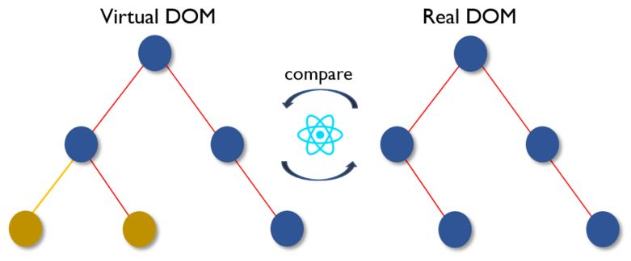
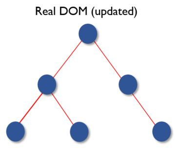

# Вопросы по React. Версия 1

> [Источник](https://github.com/sudheerj/reactjs-interview-questions).

## Ключевые концепции `React`

### Что такое `React`?

`React` - это _открытая (с открытым исходным кодом) JavaScript-библиотека для фронтенда_, предназначенная для создания пользовательских интерфейсов, особенно, если речь идет о создании одностраничных приложений (Single Page Applications, SPA). Она отвечает за слой представления (view) в веб и мобильных приложениях. `React` был разработан [Jordan Walke](https://github.com/jordwalke) - инженером `Facebook`. `React` был представлен на `Facebook News Feed` в 2011 году, а для `Instagram` - в 2012 году.

### Назовите основные особенности `React`

Основными особенностями `React` является следующее:

1. Использование _VirtualDOM_ (виртуальной объектной модели документа) вместо _RealDOM_ (настоящий или реальный `DOM`), поскольку манипуляции с _RealDOM_ являются дорогостоящими с точки зрения производительности.
2. Поддержка _рендеринга на стороне сервера_ (Server Side Rendering, SSR).
3. Следование принципу _однонаправленного_ потока или связывания данных (one-directional data flow).
4. Использование _переиспользуемых_ (reusable) компонентов пользовательского интерфейса (User Interface, UI) для формирования слоя представления.

### Что такое `JSX`?

`JSX` (JavaScript и XML) - это `XML-подобный` синтаксис, расширяющий возможности `ECMAScript`. По сути, он является синтаксическим сахаром для функции `React.createElement`, совмещая выразительность `JavaScript` с `HTML-подобным` синтаксисом разметки.

В приведенном ниже примере текст внутри тега `h1` в методе `render` возвращается в виде `JavaScript-функции`:

```jsx
class App extends React.Component {
  render() {
    return (
      <div>
        <h1>Добро пожаловать в мир React!</h1>
      </div>
    )
  }
}
```

### В чем разница между элементами и компонентами?

_Элемент_ - это обычный объект, описывающий, что мы хотим увидеть на экране в терминах узлов и других частей `DOM`. _Элементы_ могут содержать другие _элементы_ в своих свойствах. Создавать элементы в `React` легко. Однако после создания, элемент не подлежит изменению.

Объектное представление `React-элемента` выглядит так:

```jsx
const element = React.createElement(
  'div',
  { id: 'login-btn' },
  'Войти'
)
```

Функция `React.createElement` возвращает такой объект:

```
{
  type: 'div',
  props: {
    children: 'Войти',
    id: 'login-btn'
  }
}
```

Данный объект рендерится с помощью `ReactDOM.render()`:

```html
<div id='login-btn'>Login</div>
```

В отличие от элемента, _компонент_ может определяться по-разному. Он может быть классом с методом `render` (классовый компонент) или простой функцией (функциональный компонент). В любом случае _компонент_ принимает свойства (пропы, props от properties) на вход и возвращает `JSX`:

```jsx
const Button = ({ onLogin }) =>
  <div id={'login-btn'} onClick={onLogin}>Войти</div>
```

`JSX` транспилируется (преобразуется) в функцию `React.createElement`:

```jsx
const Button = ({ onLogin }) => React.createElement(
  'div',
  { id: 'login-btn', onClick: onLogin },
  'Войти'
)
```

### Как создаются компоненты?

Существует 2 способа это сделать:

1. _Функциональные компоненты:_ это простейший способ создания компонента. Такие функции являются "чистыми" (pure), принимают объект с пропами в качестве аргумента и возвращают элемент (или несколько элементов во фрагменте):

```jsx
function Greeting({ message }) {
  return <h1>{`Привет, ${message}`}</h1>
}
```

2. _Классовые компоненты:_ для определения компонента также можно использовать `ES6-классы`. Приведенный функциональный компонент может быть переписан следующим образом:

```jsx
class Greeting extends React.Component {
  render() {
    return <h1>{`Привет, ${this.props.message}`}</h1>
  }
}
```

### Когда лучше использовать классовый компонент, а когда функциональный?

Если компонент нуждается в _состоянии или методах жизненного цикла_, тогда используйте классовый компонент, иначе, используйте функциональный компонент.

_Обратите внимание:_ в `React 16.8` были представлены хуки, позволяющие использовать состояние, методы жизненного цикла и другие возможности классовых компонентов в функциях. В настоящее время классовые компоненты в `React` почти не используются.

### Что такое "чистые" компоненты?

`React.PureComponent` - это то же самое, что `React.Component`, за исключением автоматической обработки метода `shouldComponentUpdate()`. При изменении пропов или состояния `PureComponent` автоматически выполняет их поверхностное (shallow) сравнение. `Component` такого сравнения по умолчанию не проводит. Поэтому компонент будет повторно рендерится до тех пор, пока не будет явно вызван метод `shouldComponentUpdate()`.

### Что такое состояние?

_Состояние_ (state) - это объект, содержащий некоторую информацию, которая может измениться в течение жизненного цикла компонента. Мы всегда должны стараться делать состояние настолько простым, насколько это возможно, и минимизировать количество компонентов без состояния.

Создадим компонент `User` с состоянием `message`:

```jsx
class User extends React.Component {
  constructor(props) {
    super(props)

    this.state = {
      message: 'Добро пожаловать в мир React!'
    }
  }

  render() {
    return (
      <div>
        <h1>{this.state.message}</h1>
      </div>
    )
  }
}
```


Состояние похоже на проп, но оно является приватным (замкнуто в своей области видимости) и полностью контролируется компонентом, т.е. оно недоступно для других компонентов, кроме того, которому оно принадлежит и которое его определяет.

### Что такое пропы?

_Пропы_ (props) - это входные данные для компонента. Это простые значения (примитивы) или объект, содержащий несколько значений, которые передаются компонентам при их создании с помощью синтаксиса, похожего на атрибуты `HTML-тегов`.

Основное назначение пропов в `React` заключается в предоставлении компоненту следующего функционала:

1. Передача данных компоненту.
2. Вызов изменения состояния.
3. Использование через `this.props.propName` внутри метода `render` компонента.

Создадим элемент со свойством `reactProp`:

```jsx
<Element reactProp={1} />
```

Этот `reactProp` добавляется в качестве свойства ко встроенному объекту `props`, который присутствует во всех компонентах `React`:

```jsx
props.reactProp
```

### В чем разница между состоянием и пропами?

И `props`, и `state` являются обычными `JavaScript-объектами`. Несмотря на то, что они оба содержат информацию, которая используется при рендеринге компонента, функционал у них разный. Пропы передаются компоненту подобно аргументам, передаваемым функции, а состояние управляется компонентом как переменные, объявленные внутри функции.

### Почему не следует обновлять состояние напрямую?

Если попытаться обновить состояние напрямую, компонент не будет подвергнут повторному рендерингу:

```jsx
// неправильно
this.state.message = 'Привет, народ!'
```

Вместо этого, следует использовать метод `setState`. Он планирует (откладывает) обновление состояния компонента. Когда состояние меняется, компонент перерисовывается:

```jsx
// правильно
this.setState({ message: 'Привет, народ!' })
```

_Обратите внимание:_ состояние компонента можно изменять напрямую в `constructor()` или с помощью синтаксиса определения полей класса (данное предложение находится на _3 стадии рассмотрения_).

### Для чего в `setState()` используются функции обратного вызова?

Колбек вызывается после выполнения `setState()` и рендеринга компонента. Поскольку метод `setState` является _асинхронным_, колбек используется для выполнения любых "последующих" операций.

```jsx
setState({ name: 'Иван' }, () => console.log(`Свойство "name" обновлено и компонент перерисован`))
```

_Обратите внимание:_ вместо таких колбеков рекомендуется использовать методы жизненного цикла.

### В чем разница между обработкой событий в `HTML` и `React`?

Вот некоторые из основных отличий:

1. В `HTML` название события указывается строчными буквами (в нижнем регистре):

```html
<button onclick="activateLasers()" />
```

В `React` для этого используется "верблюжий стиль" (camelCase):

```jsx
<button onClick={activateLasers}>
```

2. В `HTML` можно вернуть `false` для отключения поведения по умолчанию:

```html
<a href='#' onclick="console.log('Ссылка!'); return false;" />
```

В `React` необходимо явно вызывать метод `preventDefault`:

```jsx
function handleClick(event) {
  event.preventDefault()
  console.log('Ссылка!')
}
```

3. В `HTML` необходимо вызывать функцию с помощью `()`. В `React` этого делать не нужно.

### Как в колбеках `JSX` определяется контекст методов или обработчиков событий?

Существует 3 способа это сделать:

1. Привязка в конструкторе - в классах `JavaScript` методы не связаны с экземплярами по умолчанию. То же самое справедливо для обработчиков событий в `React`. Обычно, мы делаем привязку в конструкторе:

```jsx
class Component extends React.Component {
  constructor(props) {
    super(props)
    this.handleClick = this.handleClick.bind(this)
  }

  handleClick() {
    // ...
  }
}
```

2. Синтаксис публичных полей класса - для привязки колбеков можно также использовать такой синтаксис:

```jsx
handleClick = () => {
  console.log('Это: ', this)
}
```

```jsx
<button onClick={this.handleClick}>
  Нажми на меня
</button>
```

3. Стрелочные функции - также мы можем использовать _стрелочные функции_ прямо в колбеках:

```jsx
<button onClick={(event) => this.handleClick(event)}>
  Нажми на меня
</button>
```

_Обратите внимание:_ если колбек передается в качестве пропа дочерним компонентам, это может привести к ненужному повторному рендерингу. В таких случаях, рекомендуется использовать `bind()` или _синтаксис публичных полей класса_ для улучшения производительности.

### Как передать аргумент в колбек или обработчик событий?

Для этого можно использовать _стрелочную функцию_ в качестве обертки для _обработчика событий_:

```jsx
<button onClick={() => this.handleClick(id)} />
```

Это эквивалентно следующему вызову `bind()`:

```jsx
<button onClick={this.handleClick.bind(this, id)} />
```

В стрелочную функцию можно также передавать аргументы:

```jsx
<button onClick={this.handleClick(id)} />
handleClick = (id) => () => {
  console.log("Здравствуйте, ваш идентификатор: ", id)
}
```

### Что такое синтетические события в React?

`SyntheticEvent` - это кроссбраузерная обертка для нативных событий браузера. Этот `API` аналогичен браузерному, включая `stopPropagation()` и `preventDefault()`, но работает одинаково во всех браузерах.

### Что такое условный рендеринг?

Для условного рендеринга (conditional rendering) можно использовать обычные `if` или _тернарные операторы_. Кроме того, в `JSX` можно встраивать любое выражение посредством оборачивания его в фигурные скобки, а также совместно с логическим оператором `&&` (короткие вычисления).

```jsx
<h1>Привет!</h1>
{
  messages.length > 0 && !isLogin
  ? (<h2>
        У вас {messages.length} непрочитанных сообщений.
    </h2>)
  : (<h2>
        У вас нет непрочитанных сообщений.
    </h2>)
}
```

### Что такое `key` и в чем заключаются преимущества его использования?

`key` - это специальный строковый атрибут, который следует использовать при создании списков элементов. Проп `key` помогает `React` определять, какие элементы подверглись изменениям, были добавлены или удалены.

Чаще всего в качестве _ключа_ (key) мы используем идентификаторы:

```jsx
const todoItems = todos.map((todo) =>
  <li key={todo.id}>
    {todo.text}
  </li>
)
```

При отсутствии `id` в качестве _ключа_ можно использовать _индекс элемента_:

```jsx
const todoItems = todos.map((todo, index) =>
  <li key={index}>
    {todo.text}
  </li>
)
```

_Обратите внимание:_

1. Использовать _индексы_ в качестве ключей _не рекомендуется_, если порядок расположения элементов может измениться. Это может негативно сказаться на производительности, а также привести к проблемам с состоянием компонента.
2. При извлечении элемента списка в качестве самостоятельного компонента применяйте _ключи_ к этим компонентам, а не к тегу `li`.
3. При отсутствии пропа `key` в консоль будет выведено соответствующее предупреждение.

### Для чего используются ссылки или рефы?

Реф (`ref`) возвращает ссылку на `DOM-элемент`. Этого в большинстве случаев _следует избегать_. Тем не менее, ссылки могут быть полезны при необходимости получения прямого доступа к `DOM-элементу` или экземпляру компонента.

### Как создаются ссылки?

Существует 2 подхода:

1. Новый: _ссылки_ создаются с помощью `React.createRef()` и привязываются к элементу с помощью атрибута `ref`. Для того, чтобы иметь возможность использовать _рефы_ во всем компоненте, просто присвойте `ref` свойству экземпляра в конструкторе:

```jsx
class MyComponent extends React.Component {
  constructor(props) {
    super(props)
    this.myRef = React.createRef()
  }
  render() {
    return <div ref={this.myRef} />
  }
}
```

2. Также можно использовать реф-колбеки (callback refs). Например, доступ к полю для ввода текста строки для поиска можно получить следующим образом:

```jsx
class SearchBar extends Component {
  constructor(props) {
    super(props)
    this.txtSearch = null
    this.state = { term: '' }
    this.setInputSearchRef = (e) => {
        this.txtSearch = e
    }
  }
  onInputChange(event) {
    this.setState({ term: this.txtSearch.value })
  }
  render() {
    return (
      <input
        value={this.state.term}
        onChange={this.onInputChange.bind(this)}
        ref={this.setInputSearchRef}
      />
    )
  }
}
```

_Рефы_ также могут использоваться в функциональных компонентах с помощью _замыканий_ или хука `useRef`.

_Обратите внимание:_ использовать встроенные реф-колбеки не рекомендуется.

### Что такое перенаправление или передача ссылки?

_Передача ссылки_ (ref forwarding) - это "фича" (feature - возможность, способность), которая позволяет компонентам принимать _реф_ и передавать его потомкам (дочерним компонентам):

```jsx
const ButtonElement = React.forwardRef((props, ref) => (
  <button ref={ref} className="customButton">
    {props.children}
  </button>
))

// создаем ссылку на кнопку
const ref = React.createRef()
<ButtonElement ref={ref}>Передать ссылку</ButtonElement>
```

### Что лучше использовать, колбек-рефы или findDOMNode()?

Лучше использовать _callback refs_. Это объясняется тем, что `findDOMNode()` препятствует будущим улучшениям `React`.

Типичный пример использования `findDOMNode()`:

```jsx
class MyComponent extends Component {
  componentDidMount() {
    findDOMNode(this).scrollIntoView()
  }

  render() {
    return <div />
  }
}
```

Рекомендуемый подход:

```jsx
class MyComponent extends Component {
  constructor(props){
    super(props)
    this.node = createRef()
  }
  componentDidMount() {
    this.node.current.scrollIntoView()
  }

  render() {
    return <div ref={this.node} />
  }
}
```

### Что такое виртуальный `DOM`?

_Virtual DOM_ (VDOM) - это представление _Real DOM_, хранимое в памяти. Данное представление синхронизируется с настоящим DOM. Сравнение происходит между вызовом функции рендеринга и отображением элемента на экране. Данный внутренний процесс называется _согласованием_ (reconciliation).

### Как работает виртуальный `DOM`?

_Virtual DOM_ работает следующим образом:

1. При любом изменении внутренних данных пользовательский интерфейс меняется в представлении виртуального DOM.


2. Затем вычисляется разница между предыдущим и новым представлениями.



3. После этого обновляются только те части реального DOM, которые подверглись изменениям.



### В чем разница между теневым и виртуальным `DOM`?

_Shadow DOM_ - это браузерная технология, спроектированная для ограничения области видимости переменных и `CSS` в _веб-компонентах_. _Virtual DOM_ - это концепция, реализуемая некоторыми библиотеками `JavaScript` поверх браузерных `API`.

### Что такое `React Fiber`?

_Fiber_ (волокно) - это новый движок _согласования_, изменение основного алгоритма, появившийся в `React 16`. Основной задачей `React Fiber` является повышения производительности в таких областях, как анимация, создание макета страницы, обработка жестов, возможность приостанавливать, прерывать или повторно запускать выполнение операций, предоставление приоритета определенным типам обновлений, а также новые примитивы параллелизма.

### Для чего предназначен `React Fiber`?

Цель _React Fiber_ - повышение производительности в таких областях, как анимация, создание макета страницы и обработка жестов. Основной его особенностью является _incremental rendering_ (инкрементальный рендеринг; используется в `Angular`): возможность разделения процесса рендеринга на части и их объединение через различные фреймы.

### Что такое управляемые компоненты?

Компоненты, которые управляют инпутами формы для текущего пользователя, называются _управляемыми_. Любое изменение состояния имеет соответствующий обработчик.

Например, для того, чтобы значение было представлено прописными буквами (в _верхнем регистре_), мы используем такой обработчик:

```jsx
handleChange(event) {
  this.setState({ value: event.target.value.toUpperCase() })
}
```

### Что такое неуправляемые компоненты?

_Неуправляемые компоненты_ - это компоненты, которые имеют собственное состояние. При необходимости получения значения их текущего состояния используются ссылки на `DOM-элементы`. Это больше похоже на обычный `HTML`.

В приведенном ниже примере мы получаем доступ к полю для ввода имени пользователя по ссылке:

```jsx
class UserProfile extends React.Component {
  constructor(props) {
    super(props)
    this.handleSubmit = this.handleSubmit.bind(this)
    this.input = React.createRef()
  }

  handleSubmit(event) {
    alert('Ваше имя: ' + this.input.current.value)
    event.preventDefault()
  }

  render() {
    return (
      <form onSubmit={this.handleSubmit}>
        <label>
          Имя:
          <input type="text" ref={this.input} />
        </label>
        <input type="submit" value="Submit" />
      </form>
    )
  }
}
```

Для обработки форм рекомендуется использовать _управляемые компоненты_.

### В чем разница между `createElement()` и `cloneElement()`?

`JSX` транспилируется в функции `createElement` для создания элементов `React`, которые используются для объектного представления пользовательского интерфейса. А `cloneElement()` используется для клонирования элемента и передачи ему новых свойств.

### Что такое подъем состояния?

Когда несколько компонентов нуждаются в использовании одних и тех же изменяющихся данных, рекомендуется _поднимать совместно используемое состояние_ до ближайшего общего предка. Это означает, что если два дочерних компонента используют одинаковые данные, следует поднять состояние к их родителю, вместо дублирования состояния в каждом потомке.

### Назовите стадии жизненного цикла компонента

Жизненный цикл компонента состоит из `3` стадий:

1. Монтирование: компонент готов к встраиванию в браузерный `DOM`. Эта стадия охватывает инициализацию в `constructor()`, а также методы жизненного цикла `getDerivedStateFromProps`, `render` и `componentDidMount`.

2. Обновление: на данной стадии компонент обновляется либо из-за получения новых пропов, либо из-за обновления состояния с помощью `setState()` или `forceUpdate()`. Эта стадия охватывает такие методы жизненного цикла как `getDerivedStateFromProps`, `shouldComponentUpdate`, `render`, `getSnapshotBeforeUpdate` и `componentDidUpdate`.

3. Размонтирование: на этой последней стадии компонент удаляется из браузерного `DOM`. Данная стадия включает метод жизненного цикла `componentWillUnmount`.

Следует отметить, что в `React` также имеются особые стадии применения изменений к `DOM`:

1. Рендеринг: компонент рендерится без каких-либо побочных эффектов. Это применяется в отношении "чистых" компонентов. На данной стадии `React` может приостанавливать, прерывать или перезапускать рендеринг.

2. Pre-commit: перед обновлением компонента существует момент, когда `React` читает `DOM` через `getSnapshotBeforeUpdate()`.

3. Commit: `React` изменяет `DOM` и выполняет завершающие методы жизненного цикла, такие как `componentDidMount` при монтировании, `componentDidUpdate` при обновлении и `componentWillUnmount` при размонтировании.

Стадии жизненного цикла в `React 16.3+` ([интерактивная версия](http://projects.wojtekmaj.pl/react-lifecycle-methods-diagram/))


До `React 16.3`:


### Назовите методы жизненного цикла

До `React 16.3`:

- _componentWillMount:_ выполняется перед рендерингом для настройки корневого компонента на уровне приложения;
- _componentDidMount:_ выполняется после первого рендеринга, здесь выполняются `AJAX-запросы`, обновляется `DOM` или состояние компонента, регистрируются обработчики событий;
- _componentWillReceiveProps:_ выполняется при обновлении любого пропа для запуска перехода состояния;
- _shouldComponentUpdate:_ определяет, должен ли компонент обновляться. Значением по умолчанию является `true`. Если компонент не нуждается в повторном рендеринге при изменении состояния или пропов, можно вернуть `false`. Это подходящее место для улучшения производительности, позволяющее предотвратить ненужные рендеринги при получении компонентом новых пропов;
- _componentWillUpdate:_ выполняется перед повторным рендерингом компонента при изменении состояния или пропов и при истинном значении, возвращаемом `shouldComponentUpdate()`;
- _componentDidUpdate:_ в основном, используется для обновления `DOM` в соответствии с изменениями состояния или пропов;
- _componentWillUnmount:_ используется для отмены сетевых запросов или удаления обработчиков событий, связанных с компонентом.

`React 16.3+`:

- _getDerivedStateFromProps:_ запускается перед вызовом метода `render` и при каждом повторном рендеринге. Он используется в редких случаях, когда требуется производное состояние (derived state). [Читать подробнее](https://reactjs.org/blog/2018/06/07/you-probably-dont-need-derived-state.html);
- _componentDidMount:_ выполняется после первого рендеринга, здесь выполняются `AJAX-запросы`, обновляется `DOM` или состояние компонента, регистрируются обработчики событий;
- _shouldComponentUpdate:_ определяет, должен ли компонент обновляться. Значением по умолчанию является `true`. Если компонент не нуждается в повторном рендеринге при изменении состояния или пропов, можно вернуть `false`. Это подходящее место для улучшения производительности, позволяющее предотвратить ненужные рендеринги при получении компонентом новых пропов;
- _getSnapshotBeforeUpdate:_ выполняется перед применением результатов рендеринга к `DOM`. Любое значение, возвращенное этим методом, передается в `componentDidUpdate()`. Это может быть полезным для получения информации из `DOM`, например, позиции курсора или величины прокрутки;
- _componentDidUpdate:_ в основном, используется для обновления `DOM` в соответствии с изменением состояния или пропов. Не выполняется, если `shouldComponentUpdate()` возвращает `false`;
- _componentWillUnmount_ используется для отмены сетевых запросов или удаления обработчиков событий, связанных с компонентом.

### Что такое компонент высшего порядка?

_Higher-order component_ (`HOC`) - это функция, принимающая компонент и возвращающая новый компонент. Это паттерн, производный от композиционной природы `React`.

Мы называем такие компоненты _чистыми_, поскольку они могут принимать и динамически предоставлять дочерние компоненты, но не меняют и не копируют их поведение.

```jsx
const EnhancedComponent = higherOrderComponent(WrappedComponent)
```

`HOC` обычно используются для:

1. Обеспечения возможности повторного использования кода, логики, а также для абстрагирования шаблонов.
2. Отложенного рендеринга.
3. Абстрагирования и манипуляции состоянием.
4. Манипуляции пропами.

### Как в `HOC` создаются прокси для пропов?

Пропы, передаваемые в компонент, можно добавлять/редактировать с помощью шаблона _проксирования пропов_ следующим образом:

```jsx
function HOC(WrappedComponent) {
  return class Test extends Component {
    render() {
      const newProps = {
        title: 'Новый заголовок',
        footer: false,
        showFeatureX: false,
        showFeatureY: true
      }

      return <WrappedComponent {...this.props} {...newProps} />
    }
  }
}
```

### Что такое контекст?

`Context API` предоставляет возможность передавать данные в дереве компонента без необходимости передачи пропов на каждом уровне вручную.

Например, статус аутентификации пользователя, языковые предпочтения или цветовая схема могут использоваться многими компонентами приложения:

```jsx
const { Provider, Consumer } = React.createContext(defaultValue)
```

### Что такое `children`?

_Потомки_ (дети, дочерние компоненты) - это проп (`this.props.children`), позволяющий передавать одни компоненты другим как любые другие пропы. Дерево компонентов, размещаемое между открывающим и закрывающим тегами, передается компоненту в качестве пропа `children`.

Для работы с этим пропом в `React API` существуют такие методы как `React.Children.map`, `React.Children.forEach`, `React.Children.count`, `React.Children.only` и `React.Children.toArray`.

Простой пример использования пропа `children`:

```jsx
const MyDiv = React.createClass({
  render: function() {
    return <div>{this.props.children}</div>
  }
})

ReactDOM.render(
  <MyDiv>
    <span>Привет, </span>
    <span>народ</span>
  </MyDiv>,
  node
)
```

### Как в `React` выглядят комментарии?

Комментарии в `React/JSX` похожи на многострочные комментарии `JavaScript`, но оборачиваются в фигурные скобки:

_Однострочные комментарии:_

```jsx
<div>
  {/* Однострочный комментарий (в чистом `JavaScript` однострочные комментарии помещаются после двойного слеша (`//`)) */}
  {`Добро пожаловать, ${user}! Приступим к изучению React`}
</div>
```

_Многострочные комментарии:_

```jsx
<div>
  {/*
    Комментарий,
    состоящий из
    нескольких строк
  */}
  {`Добро пожаловать, ${user}! Приступим к изучению React`}
</div>
```

### Для чего используется `super(props)` в конструкторе?

Конструктор дочернего класса не может использовать ссылку на `this` до вызова метода `super`. То же самое справедливо для `ES6-подклассов`. Основная причина передачи аргумента `props` в `super()` состоит в обеспечении возможности доступа к `this.props` в конструкторе дочернего компонента.

_Передача пропов:_

```jsx
class MyComponent extends React.Component {
  constructor(props) {
    super(props)

    console.log(this.props) // { name: 'Иван', age: 30 }
  }
}
```

_Без пропов:_

```jsx
class MyComponent extends React.Component {
  constructor(props) {
    super()

    console.log(this.props) // undefined

    // однако, пропы по-прежнему доступны как в конструкторе,
    console.log(props) // { name: 'Иван', age: 30 }
  }

  render() {
    // так и за его пределами
    console.log(this.props) // { name: 'Иван', age: 30 }
  }
}
```

### Что такое согласование?

После изменения состояния или пропов компонента, `React` определяет, нуждается ли `DOM` в обновлении посредством сравнения нового элемента с предыдущим. Когда эти элементы отличаются, `React` обновляет `DOM`. Данный процесс называется _согласованием_ (reconciliation).

### Как определить состояние с помощью вычисляемого свойства?

При использовании `ES6` или транспилятора `Babel` для преобразования `JSX-кода` можно применять _вычисляемые названия свойств_:

```jsx
handleInputChange(event) {
  this.setState({ [event.target.id]: event.target.value })
}
```

### Какая распространенная ошибка приводит к вызову функции при каждом рендеринге?

При передаче функции компоненту в качестве аргумента она не должна вызываться:

```jsx
render() {
  // неправильно: `handleClick` вызывается вместо передачи в качестве ссылки
  return <button onClick={this.handleClick()}>Нажми на меня</button>
}
```

Вместо этого, следует передавать саму функцию, без круглых скобок (`()`):

```jsx
render() {
  // правильно: `handleClick` передается как ссылка
  return <button onClick={this.handleClick}>Нажми на меня</button>
}
```

### Поддерживает ли `React.lazy()` именованный экспорт?

Нет, функция `React.lazy` поддерживает только экспорт по умолчанию. Для того, чтобы импортировать модуль с помощью именованного импорта, можно создать промежуточный модуль, который будет повторно экспортировать этот модуль по умолчанию. Это также обеспечит _тряску дерева_ (tree shaking) и предотвратит загрузку неиспользуемых компонентов.

Рассмотрим файл, в котором по имени экспортируется несколько компонентов:

```jsx
// MoreComponents.js
export const SomeComponent = /* ... */
export const UnusedComponent = /* ... */
```

Затем компоненты из `MoreComponents.js` повторно экспортируются в промежуточном файле `IntermediateComponent.js`:

```jsx
// IntermediateComponent.js
export { SomeComponent as default } from "./MoreComponents.js"
```

После этого компоненты могут импортироваться лениво:

```jsx
import React, { lazy } from 'react'
const SomeComponent = lazy(() => import("./IntermediateComponent.js"))
```

### Почему в `React` используется `className` вместо `class`?

`class` - это одно из ключевых слов `JavaScript`, а `JSX` - это расширение `JavaScript`. Вот почему в `React` вместо `class` используется `className`. В качестве пропа `className` передается строка:

```jsx
render() {
  return <span className='nav nav-main'>Меню</span>
}
```

### Что такое фрагмент?

_Фрагмент_ (fragment) - это распространенный паттерн в `React`, который используется в компонентах, возвращающих несколько элементов. _Фрагменты_ позволяют группировать дочерние элементы без создания лишних `DOM-узлов`:

```jsx
render() {
  return (
    <React.Fragment>
      <ChildA />
      <ChildB />
      <ChildC />
    </React.Fragment>
  )
}
```

Также существует _сокращенный синтаксис_, но он не поддерживается в некоторых библиотеках (на сегодняшний день таких библиотек почти не осталось):

```jsx
render() {
  return (
    <>
      <ChildA />
      <ChildB />
      <ChildC />
    </>
  )
}
```

### Почему фрагмент лучше, чем дополнительный `div`?

Вот некоторые причины:

1. Фрагменты немного быстрее и используют меньше памяти. Реальная польза от этого ощущается в очень больших и глубоких деревьях элементов.
2. Некоторые механизмы `CSS`, например, `Flexbox` и `Grid` используют связь предок-потомок, поэтому добавление дополнительных `div` может поломать макет страницы.
3. Меньшее количество элементов облегчает инспектирование `DOM.`

### Что такое порталы?

_Порталы_ (portals) - рекомендуемый способ рендеринга потомков в `DOM-узле`, который находится за пределами родительского компонента:

```jsx
ReactDOM.createPortal(child, container)
```

Первый аргумент - любой `React-компонент`, подлежащий рендерингу, такой как элемент, строка или фрагмент. Второй аргумент - `DOM-элемент`.

### Что такое компонент без состояния?

Если поведение компонента не зависит от его состояния, такой компонент считается не имеющим состояния. Для создания компонентов без состояния можно использовать как функции, так и классы. Однако, если нам не нужны методы жизненного цикла, тогда лучше использовать функциональные компоненты. У функций по сравнению с классами в этом случае имеется несколько преимуществ: их легче писать, читать и тестировать, они немного быстрее и в них не требуется использовать ключевое слово `this`.

### Что такое компонент с состоянием?

Если поведение компонента зависит от состояния, такой компонент считается имеющим состояние. Раньше компоненты с состоянием можно было создавать только с помощью классов. Сейчас хуки предоставляют возможность создавать функциональные компоненты с состоянием. В классах состояние инициализируется в `constructor()` с помощью `this.state = initialValue`, в функции - с помощью `const [state, setState] = useState(initialValue)`.

Классовый компонент с состоянием:

```jsx
class App extends Component {
  constructor(props) {
    super(props)
    this.state = { count: 0 }
  }

  render() {
    // ...
  }
}
```

Аналогичный функциональный компонент:

```jsx
import React, { useState } from 'react'

const App = (props) => {
  const [count, setCount] = useState(0)

  return (
    // ...
  )
}
```

### Как осуществить проверку пропов?

При запуске приложения в _режиме для разработки_, `React` автоматически проверяет все пропы, определенные в компонентах, на _правильность типов_. Если тип является неправильным, `React` выводит в консоль предупреждение. Эта проверка отключена в _режиме для продакшна_ с целью повышения производительности. Обязательные пропы определяются с помощью `isRequired`.

Набор предопределенных типов пропов:

1. `PropTypes.number`.
2. `PropTypes.string`.
3. `PropTypes.array`.
4. `PropTypes.object`.
5. `PropTypes.func`.
6. `PropTypes.node`.
7. `PropTypes.element`.
8. `PropTypes.bool`.
9. `PropTypes.symbol`.
10. `PropTypes.any`.

Пример определения `propTypes` для компонента `User`:

```jsx
import React from 'react'
import PropTypes from 'prop-types'

class User extends React.Component {
  static propTypes = {
    name: PropTypes.string.isRequired,
    age: PropTypes.number.isRequired
  }

  render() {
    return (
      <>
        <h1>{`Добро пожаловать, ${this.props.name}!`}</h1>
        <h2>{`Ваш возраст: ${this.props.age}`}</h2>
      </>
    )
  }
}
```

_Обратите внимание:_ В `React 15.5` `PropTypes` были перемещены из `React.PropTypes` в библиотеку `prop-types`.

### Какие преимущества предоставляет использование React?

Вот список основных преимуществ:

1. Повышение производительности приложения благодаря _виртуальному DOM_.
2. `JSX` облегчает написание и чтение кода.
3. Возможность рендеринга как на стороне клиента, так и на стороне сервера.
4. Возможность относительно простой интеграции с фреймворками, поскольку `React` - это всего лишь библиотека.
5. Возможность быстрого юнит и интеграционного тестирования с помощью таких инструментов, как `Jest`.

### Какие ограничения имеются в React?

Кроме преимуществ, в `React` существуют некоторые ограничения:

1. `React` - это всего лишь библиотека, отвечающая за слой представления, а не полноценный фреймворк.
2. Его трудно изучать новичкам в веб-разработке (впрочем, как и любой другой фреймворк).
3. Интеграция с традиционными `MVC-фреймворками` требует дополнительных настроек.
4. Код является более сложным из-за встроенных шаблонов и `JSX`.
5. Большое количество мелких компонентов приводит к сложности в проектировании и построении архитектуры приложения.

### Что такое предохранители?

_Предохранители_ (error boundaries) - это компоненты, которые отлавливают ошибки `JavaScript`, возникающие в любом дочернем компоненте, сообщают об этих ошибках и отображают резервный `UI`.

Классовый компонент становится предохранителем при определении в нем метода жизненного цикла `componentDidCatch` или метода `static getDerivedStateFromError`:

```jsx
class ErrorBoundary extends React.Component {
  constructor(props) {
    super(props)
    this.state = { hasError: false }
  }

  componentDidCatch(error, info) {
    // отправляем ошибки в специальный сервис
    logErrorToMyService(error, info)
  }

  static getDerivedStateFromError(error) {
      // обновляем состояние, чтобы при следующем рендеринге использовался резервный `UI`
      return { hasError: true }
    }

  render() {
    if (this.state.hasError) {
      // резервный `UI`
      return <h1>Что-то пошло не так.</h1>
    }
    return this.props.children
  }
}
```

После этого предохранитель используется как обычный компонент:

```jsx
<ErrorBoundary>
  <MyWidget />
</ErrorBoundary>
```

### Как реализовать предохранитель в `React 15`?

`React 15` предоставляет поддержку для _error boundaries_ с помощью метода `unstable_handleError`. Данный метод был переименован в `componentDidCatch` в `React 16`.

### Какой способ рекомендуется использовать для статической проверки типов?

Обычно, для проверки типов в `React-приложениях` используется библиотека `PropTypes` (`React.PropTypes` перемещен в пакет `prop-types`, начиная с `React 15.5`). Для больших приложений рекомендуется использовать _статические типизаторы_, такие как `Flow` или `TypeScript`, которые выполняют проверку типов во время компиляции и предоставляют возможности по их автоматическому исправлению.

### Для чего используется пакет react-dom?

Пакет `react-dom` предоставляет _методы, специфичные для `DOM`_, которые могут быть использованы на верхнем уровне приложения. Большинству компонентов не нужен этот модуль. Вот некоторые из методов рассматриваемой библиотеки:

1. `render`.
2. `hydrate`.
3. `unmountComponentAtNode`.
4. `findDOMNode`.
5. `createPortal`.

### Для чего предназначен метод `render`?

Данный метод используется для встраивания `React-элемента` в `DOM` в определенный контейнер и возврата ссылки на этот элемент. Если `React-элемент` уже рендерился ранее, осуществляется обновление только той части `DOM`, которая подверглась соответствующим изменениям.

```jsx
ReactDOM.render(element, container[, callback])
```

При передаче `render()` опционального колбека, он будет вызван после рендеринга или обновления компонента.

### Что такое `ReactDOMServer`?

`ReactDOMServer` - это объект, позволяющий рендерить компоненты в виде статической разметки (обычно, используется на `Node.js-серверах`). Данный объект в основном используется при _рендеринге на стороне сервера_. Следующие методы могут быть использованы как на сервере, так и в браузерном окружении:

1. `renderToString`.
2. `renderToStaticMarkup`.

Например, мы запускаем основанный на `Node.js` веб-сервер, такой как `Express`, `Koa` или `Happi`, и вызываем `renderToString()` для рендеринга корневого элемента в виде строки, которую сервер отправляет в ответ на запрос:

```jsx
// используем `Express`
import { renderToString } from 'react-dom/server'
import MyPage from './MyPage'

app.get('/', (req, res) => {
  res.write('<!DOCTYPE html><html><head><title>My Page</title></head><body>')
  res.write('<div id="content">')
  res.write(renderToString(<MyPage/>))
  res.write('</div></body></html>')
  res.end()
})
```

### Как использовать `innerHtml` в `React`?

Атрибут `dangerouslySetInnerHTML` в `React` является альтернативой свойства `innerHTML`. Как и последний, его использование представляет собой угрозу межсайтового скриптинга (`XSS`). В `dangerouslySetInnerHTML` необходимо передать объект с ключом `__html` и `HTML-разметкой` в качестве значения.

В приведенном ниже примере `MyComponent` использует атрибут `dangerouslySetInnerHTML` для определения разметки:

```jsx
function createMarkup() {
  return { __html: 'Опасно!' }
}

function MyComponent() {
  return <div dangerouslySetInnerHTML={createMarkup()} />
}
```

### Как использовать стили в `React`?

Атрибут `style` принимает объект `JavaScript` со свойствами в стиле _camelCase_, а не в виде `CSS-строки`. Это обеспечивает согласованность с `JavaScript-свойствами`, связанными со стилями, является более эффективным и закрывает некоторые дыры в безопасности (`XSS`).

```jsx
const divStyle = {
  color: 'deepskyblue',
  backgroundImage: 'url(' + imgUrl + ')'
}

function HelloWorldComponent() {
  return <div style={divStyle}>Привет, народ!</div>
}
```

Стили пишутся в _camelCase_ для интеграции со свойствами узлов `DOM` в `JavaScript` (например, `node.style.backgroundImage`).

### Чем отличаются события в `React`?

Обработка событий в элементах `React` имеет некоторые синтаксические отличия:

1. Обработчики событий именуются в верблюжьем стиле (`onClick`), а не в нижнем регистре (`onclick`).
2. В `JSX` в обработчик передается функция, а не строка (функция передается как ссылка, т.е. не вызывается).

### Что произойдет при использовании `setState()` в `constructor()`?

Если это сделать, то, помимо присвоения значения объекту состояния, `React` повторно отрендерит компонент и всех его потомков. Мы получим ошибку `Can only update a mounted or mounting component` (можно обновлять только смонтированный или монтируемый компонент). Поэтому для инициализации состояния внутри конструктора следует использовать `this.state`.

### Почему следует избегать использования индексов в качестве ключей компонентов?

_Ключи_ (keys) должны быть стабильными, предсказуемыми и уникальными, чтобы `React` имел возможность "следить" за элементами.

В приведенном ниже примере ключом каждого элемента является порядок его расположения в массиве без привязки к предоставляемым им данным. Это ограничивает возможности `React` по оптимизации:

```jsx
{todos.map((todo, index) =>
  <Todo
    {...todo}
    key={index}
  />
)}
```

При использовании в качестве ключей некоторых данных элемента, например, `todo.id`, которые являются уникальными и стабильными, у `React` появляется возможность менять порядок расположения (рендеринга) элементов без необходимости выполнения дополнительных вычислений:

```jsx
{todos.map((todo) =>
  <Todo {...todo} key={todo.id} />
)}
```

### Правильно ли использовать `setState()` в `componentWillMount()`?

Да, использование `setState()` внутри `componentWillMount()` является безопасным. В то же время, рекомендуется избегать выполнения асинхронной инициализации в методе жизненного цикла `componentWillMount`. `componentWillMount()` вызывается перед монтированием. Он также вызывается перед методом `render`, поэтому настройка состояния в этом методе не приводит к повторному рендерингу. В нем следует избегать выполнения каких-либо побочных эффектов и подписок. Вместо `componentWillMount()` асинхронную логику следует помещать в `componentDidMount()`.

```jsx
componentDidMount() {
  axios.get(`/api/todos`)
    .then(({ data }) => {
      this.setState({
        messages: [...data]
      })
    })
    .catch(console.error)
}
```

### Что произойдет при использовании пропов в `constructor()`?

При изменении пропов компонента без его обновления, эти новые пропы никогда не будут отображены на экране, поскольку функция-конструктор никогда не обновит текущее состояние компонента. Обновление состояния через пропы возможно только после создания компонента.

В приведенном ниже примере обновленное значение инпута никогда не отобразится:

```jsx
class MyComponent extends React.Component {
  constructor(props) {
    super(props)

    this.state = {
      records: [],
      inputValue: this.props.inputValue
    }
  }

  render() {
    return <div>{this.state.inputValue}</div>
  }
}
```

Значение обновится при использовании пропов в методе `render`:

```jsx
class MyComponent extends React.Component {
  constructor(props) {
    super(props)

    this.state = {
      record: []
    }
  }

  render() {
    return <div>{this.props.inputValue}</div>
  }
}
```

### Как выполнить условный рендеринг компонента?

В некоторых случаях требуется рендерить разные компоненты в зависимости от некоторого состояния. `JSX` не рендерит `false` или `undefined`, поэтому для рендеринга определенной части компонента только при удовлетворении определенного условия можно использовать _короткие вычисления_ (оператор `&&`):

```jsx
const MyComponent = ({ name, address }) => (
  <div>
    <h2>{name}</h2>
    {address && <p>{address}</p>}
  </div>
)
```

Если нам требуется условие `if else`, тогда можно воспользоваться _тернарным оператором_:

```jsx
const MyComponent = ({ name, address }) => (
  <div>
    <h2>{name}</h2>
    {address
      ? <p>{address}</p>
      : <p>Адрес отсутствует</p>
    }
  </div>
)
```

### Почему следует быть осторожным при распаковке пропов на `DOM-элементы`?

При _распространении или распаковке пропов_ мы подвержены риску добавления неизвестных `HTML-атрибутов`, что считается плохой практикой. Вместо этого, лучше использовать деструктуризацию пропов с помощью оператора `...rest`. Это обеспечит добавление к элементу только нужных пропов:

Например:

```jsx
const ComponentA = () =>
  <ComponentB isDisplay={true} className='someClassName' />

const ComponentB = ({ isDisplay, ...domProps }) =>
  <div {...domProps}>{ComponentB}</div>
```

### Как использовать декораторы в React?

Классовые компоненты могут _декорироваться_ способом, аналогичным передаче компонента в функцию. _Decorators_ - гибкий и удобочитаемый способ модификации функциональности компонента:

```jsx
@setTitle('Профиль')
class Profile extends React.Component {
    //....
}

/*
  `title` - это строка, которая устанавливается заголовку документа
  `WrappedComponent` - это то, что получит декоратор
  при его размещении над классовым компонентом
*/
const setTitle = (title) => (WrappedComponent) => {
  return class extends React.Component {
    componentDidMount() {
      document.title = title
    }

    render() {
      return <WrappedComponent {...this.props} />
    }
  }
}
```

_Обратите внимание:_ декораторы - экспериментальная технология, находящаяся на _3 стадии рассмотрения_.

### Как запомнить или сохранить компонент?

Существуют специальные библиотеки для запоминания или сохранения компонентов для предотвращения их повторного вычисления. Данная техника называется _мемоизацией_.

Например, библиотека `moize` может сохранять один компонент в другом:

```jsx
import moize from 'moize'
import Component from './components/Component'

const MemoizedFoo = moize.react(Component)

const Consumer = () => {
  <div>
    <MemoizedFoo />
  </div>
}
```

Начиная с `React 16.6`, у нас имеется `React.memo()`. Это компонент высшего порядка (`HOC`), который сохраняет компонент неизменным до обновления его пропов. Для этого достаточно обернуть в него мемоизируемый компонент:

```jsx
const MemoComponent = React.memo(function MemoComponent(props) {
  /* рендеринг с помощью пропов */
})
// или
export default React.memo(MyFunctionComponent)
```

Также следует отметить, что похожий (но не аналогичный) функционал предоставляет хук `useMemo`.

### Как в `React` реализовать рендеринг на стороне сервера?

`React` поддерживает рендеринг на стороне `Node.js-сервера` из коробки. Для этого используется специальная версия `DOM-рендерера`, которая реализует такой же паттерн, что и клиентская часть приложения:

```jsx
import ReactDOMServer from 'react-dom/server'
import App from './App'

ReactDOMServer.renderToString(<App />)
```

Метод `renderToString` возвращает обычный `HTML` в виде строки, которая затем может быть помещена в тело (`body`) ответа сервера. На стороне клиента `React` определяет предварительно отрендеренный контент и просто вставляет его в существующее дерево компонентов.

### Как включить производственный режим?

Для этого следует установить `NODE_ENV` в значение `production` в методе `DefinePlugin()` сборщика модулей `Webpack`. Это отключит проверку типов и дополнительные предупреждения. Кроме того, при минификации кода, например, с помощью `Uglify`, удаляющего "мертвый" код, а также код и комментарии для разработки, размер сборки будет намного меньше.

### Что такое `Create React App` и в чем заключаются преимущества его использования?

`create-react-app` - это инструмент, позволяющий быстро создавать и запускать `React-приложения`, минуя стадию настройки проекта.

Создадим проект приложения (`todo-app`) с помощью `CRA`:

```bash
npx create-react-app todo-app
# или
npm init react-app todo-app
# или
yarn create react-app todo-app

cd todo-app

# сборка, тестирование и запуск сервера для разработки
$ npm run build
$ npm run test
$ npm start
# или
$ yarn build
$ yarn test
$ yarn start
```

Проект включает в себя все необходимое для разработки приложения на `React`:

1. Поддержка синтаксиса `ES6`, `React`, `JSX` и `Flow`.
2. Расширения языка после `ES6`, такие как spread- и rest-операторы.
3. Автоматическое добавление префиксов к стилям, поэтому нам не нужно вручную добавлять `-webkit- `и другие префиксы.
4. Быстрый запуск интерактивных юнит-тестов со встроенной поддержкой отчетов о покрытии кода.
5. Автоматически перезапускаемый сервер для разработки, выводящий предупреждения о наиболее распространенных ошибках.
6. Скрипт для сборки `JS`, `CSS` и статических файлов для продакшна с хешами в названиях и картами ресурсов (source maps).

### Назовите методы жизненного цикла компонента, относящиеся к монтированию

При создании и встраивании компонента в `DOM` методы жизненного цикла вызываются в следующем порядке:

1. `constructor`.
2. `static getDerivedStateFromProps`.
3. `render`.
4. `componentDidMount`.

### Какие методы жизненного цикла были признаны устаревшими в `React 16`?

Следующие методы жизненного цикла являются небезопасными практиками кодирования и усложняют работу с асинхронной логикой:

1. `componentWillMount`.
2. `componentWillReceiveProps`.
3. `componentWillUpdate`.

Начиная с `React 16.3`, эти методы следует использовать с префиксом `UNSAFE_`, а версии без префиксов были удалены в `React 17`.

### Для чего используется метод жизненного цикла `getDerivedStateFromProps`?

Статический метод жизненного цикла `getDerivedStateFromProps` вызывается после инстанцирования элемента перед его повторным рендерингом. Он может возвращать объект для обновления состояния или `null` как индикатор того, что новые пропы не требуют обновления состояния.

```jsx
class MyComponent extends React.Component {
  static getDerivedStateFromProps(props, state) {
    // ...
  }
}
```

Этот метод вместе с `componentDidUpdate()` охватывает все случаи использования `componentWillReceiveProps()`.

### Для чего используется метод жизненного цикла `getSnapshotBeforeUpdate`?

Метод жизненного цикла `getSnapshotBeforeUpdate` вызывается сразу после обновления `DOM`. Значение, возвращенное этим методом, передается в качестве третьего аргумента `componentDidUpdate()`.

```jsx
class MyComponent extends React.Component {
  getSnapshotBeforeUpdate(prevProps, prevState) {
    // ...
  }
}
```

Этот метод вместе с `componentDidUpdate()` охватывает все случаи использования `componentWillUpdate()`

### Заменяют ли хуки рендер-пропы и компоненты высшего порядка?

_Рендер-пропы_ (render props) и _компоненты высшего порядка_ рендерят только одного потомка, однако, в большинстве случаев, хуки предоставляют более простой способ минимизации количества уровней вложенности дерева компонентов.

### Как рекомендуется именовать компоненты?

Компоненты рекомендуется именовать с помощью ссылок вместо использования `displayName`.

Пример использования `displayName`:

```jsx
export default React.createClass({
  displayName: 'TodoApp',
  // ...
})
```

Рекомендуемый подход:

```jsx
export default class TodoApp extends React.Component {
  // ...
}
```

### Какой порядок расположения методов в классовом компоненте является рекомендуемым?

Рекомендуемый порядок расположения методов от _монтирования_ до _рендеринга_ классового компонента следующий:

1. `static` методы.
2. `constructor`.
3. `getChildContext`.
4. `componentWillMount`.
5. `componentDidMount`.
6. `componentWillReceiveProps`.
7. `shouldComponentUpdate`.
8. `componentWillUpdate`.
9. `componentDidUpdate`.
10. `componentWillUnmount`.
11. Обработчики событий, такие как `handleSubmit` или `handleChange`.
12. Геттеры, необходимые для рендеринга, такие как `getSelectReason` или `getFooterContent`.
13. Опциональные методы рендеринга, такие как `renderNavigation` или `renderProfilePicture`.
14. `render`.

### Что такое компонент-переключатель?

_Компонент-переключатель_ (switching component) - это компонент, который рендерит один из нескольких компонентов. Для получения значений пропов для компонентов необходимо использовать объект.

Пример компонента-переключателя, отображающего разные страницы на основе пропа `page`:

```jsx
import HomePage from './HomePage'
import AboutPage from './AboutPage'
import ServicesPage from './ServicesPage'
import ContactPage from './ContactPage'

const PAGES = {
  home: HomePage,
  about: AboutPage,
  services: ServicesPage,
  contact: ContactPage
}

const Page = (props) => {
  const CurrentPage = PAGES[props.page] || HomePage

  return <CurrentPage {...props} />
}

// ключи объекта `PAGES` могут быть использованы в `propTypes`
Page.propTypes = {
  page: PropTypes.oneOf(Object.keys(PAGES)).isRequired
}
```

### Для чего в `setState()` может передаваться функция?

Дело в том, что `setState()` - это асинхронная операция. `React` откладывает обновление состояния по причинам производительности, поэтому состояние может обновиться не сразу после вызова `setState()`. Это означает, что нам не следует полагаться на текущее состояние при вызове `setState()`, поскольку мы не можем быть увереными в том, каким оно является. Решением данной проблемы является передача в `setState()` функции с предыдущим состоянием в качестве аргумента. Это позволяет избежать проблем, связанных с отображением на экране старого состояния компонента из-за асинхронной природы `setState()`.

Допустим, начальным значением `count` является `0`. Несмотря на 3 последовательных вызова операции по увеличению значения, `count` равняется `1`:

```jsx
// предположим, что `this.state.count === 0`
this.setState({ count: this.state.count + 1 })
this.setState({ count: this.state.count + 1 })
this.setState({ count: this.state.count + 1 })
// `this.state.count === 1`, а не `3`!
```

Если мы передадим функцию в `setState()` значение `count` увеличится корректно:

```jsx
this.setState((prevState, props) => ({
  count: prevState.count + props.increment
}))
// `this.state.count === 3`, как ожидается
```

### Почему в `setState()` рекомендуется использовать функцию, а не объект?

`React` может объединять несколько вызовов `setState()` в один для повышения производительности. Поскольку `this.props` и `this.state` обновляются асинхронно, нам не следует полагаться на их значения для вычисления следующего состояния.

Приведенный ниже пример счетчика работает неправильно:

```jsx
// неправильно
this.setState({
  counter: this.state.counter + this.props.increment,
})
```

Рекомендуемый подход заключается в вызове `setState()` с функцией в качестве аргумента. Эта функция принимает предыдущее состояние в качестве первого параметра и обновленные пропы в качестве второго параметра:

```jsx
// правильно
this.setState((prevState, props) => ({
  counter: prevState.counter + props.increment
}))
```

### Что такое строгий режим в `React`?

`React.StrictMode` - это полезный компонент, обеспечивающий индикацию потенциальных проблем в приложении. Как и `<Fragment>`, `<StrictMode>` не приводит к рендеренгу лишних `DOM-элементов`. Он активирует дополнительные проверки и предупреждения. Эти проверки применяются только в _режиме для разработки_.

```jsx
import React from 'react'

function ExampleApplication() {
  return (
    <div>
      <Header />
      <React.StrictMode>
        <div>
          <ComponentOne />
          <ComponentTwo />
        </div>
      </React.StrictMode>
      <Footer />
    </div>
  )
}
```

В приведенном примере _строгий режим_ включен только для компонентов `ComponentOne` и `ComponentTwo`.

### Что такое примеси?

_Примеси или миксины_ (mixins) - это способ обеспечения совместного использования одной функциональности совершенно разными компонентами. Примеси _не следует использовать_, их можно заменить _компонентами высшего порядка_ или _декораторами_.

Одним из самых распространенных случаев использования примесей является `PureRenderMixin`. Его можно использовать в некоторых компонентах для предотвращения повторного рендеринга, когда пропы и состояние поверхностно (shallow) равны предыдущим:

```jsx
const PureRenderMixin = require('react-addons-pure-render-mixin')

const Button = React.createClass({
  mixins: [PureRenderMixin],
  // ...
})
```

В настоящее время примеси признаны устаревшими.

### Почему `isMounted()` является антипаттерном? Назовите более подходящее решение

Основная цель использования `isMounted()` заключается в предотвращении вызова `setState()` после размонтирования компонента, поскольку это приводит к выводу в консоль предупреждения.

```jsx
if (this.isMounted()) {
  this.setState({ ... })
}
```

Проверка `isMounted()` перед вызовом `setState()` отключает предупреждения, но противоречит цели этих предупреждений. Использование `isMounted()` - это _дурно пахнущий_ код, поскольку единственная причина его использования заключается в предположении, что нам потребуется ссылка на компонент после его размонтирования.

Оптимальным решением является определение места, где `setState()` может быть вызван после размонтирования компонента, и его удаление. Такие ситуации обычно возникают в колбеках, когда компонент ожидает получения некоторых данных и размонтируется до их получения. В идеале, все колбеки должны отключаться в `componentWillUnmount()` перед размонтированием компонента.

### Какие события указателя поддерживаются в `React`?

_События указателя_ (Pointer Events) предоставляют унифицированный способ обработки всех событий ввода. Раньше у нас была мышь и соответствующие обработчики, сегодня у нас имеется множество различных устройств, в состав которых мышь не входит, например, телефоны с событиями касаний экрана пальцем или стилусом. Необходимо помнить, что эти события работают только в браузерах, поддерживающих соответствующую спецификацию.

Следующие типы событий доступны в `React DOM`:

1. `onPointerDown`.
2. `onPointerMove`.
3. `onPointerUp`.
4. `onPointerCancel`.
5. `onGotPointerCapture`.
6. `onLostPointerCapture`.
7. `onPointerEnter`.
8. `onPointerLeave`.
9. `onPointerOver`.
10. `onPointerOut`.

### Почему название компонента должно начинаться с большой буквы?

Когда мы рендерим компонент с помощью `JSX`, название этого компонента должно начинаться с большой буквы, в противном случае, `React` выбросит исключение, связанное с неопознанным `HTML-тегом`. Принятое соглашение гласит, что с маленькой буквы могут начинаться только `HTML` и `SVG-теги`.

```jsx
class SomeComponent extends Component {
  // ...
}
```

Мы можем определить классовый компонент, название которого начинается с маленькой буквы, но при импорте название должно начинаться с большой буквы. Здесь название, начинающееся с маленькой буквы, не вызовет проблем:

```jsx
class myComponent extends Component {
  render() {
    return <div />
  }
}

export default myComponent
```

При импорте указанного компонента в другой файл, его название должно начинаться с большой буквы:

```jsx
import MyComponent from './MyComponent'
```

#### Существуют ли исключения из этого правила?

Названия компонентов должны начинаться с большой буквы, за одним исключением: имена тегов, начинающиеся с маленькой буквы, с точкой (аксессоры) являются валидными названиями компонентов.

Например, следующий тег будет скомпилирован в валидный компонент:

```jsx
render(){
  return <obj.component /> // `React.createElement(obj.component)`
}
```

### Поддерживаются ли пользовательские `DOM-атрибуты` в `React 16`?

Да. В прошлом `React` игнорировал неизвестные атрибуты. Когда мы использовали атрибут, который `React` не мог распознать, он просто его пропускал.

Например, элемент с таким атрибутом:

```jsx
<div mycustomattribute='something' />
```

в `React 15` превращался в пустой `div`:

```html
<div />
```

В `React 16` любые неизвестные атрибуты все равно встраиваются в `DOM`:

```html
<div mycustomattribute='something' />
```

Это полезно с точки зрения использования специфичных для браузера или библиотеки атрибутов, тестирования новых `DOM API` и интеграции с фреймворками.

### В чем разница между `constructor()` и `getInitialState()`?

При использовании `ES6-классов` состояние следует инициализировать в конструкторе, а при использовании `React.createClass()` - в методе `getInitialState`.

_ES6-классы:_

```jsx
class MyComponent extends React.Component {
  constructor(props) {
    super(props)
    this.state = { /* начальное состояние */ }
  }
}
```

`React.createClass()`:

```jsx
const MyComponent = React.createClass({
  getInitialState() {
    return { /* начальное состояние */ }
  }
})
```

_Обратите внимание:_ `React.createClass()` признан устаревшим и удален в `React 16`. Для создания компонентов с состоянием используйте классы или функции с хуками.

### Можно ли принудительно обновить компонент без вызова `setState()`?

По умолчанию компонент перерисовывается при изменении его состояния или пропов. Если метод `render` зависит от других данных, мы можем сообщить `React` о том, что компонент нуждается в повторном рендеринге, вызвав `forceUpdate()`:

```jsx
component.forceUpdate(callback)
```

_Обратите внимание_: использовать `forceUpdate()` не рекомендуется.

### В чем разница между `super()` и `super(props)`?

Если мы хотим получить доступ к `this.props` в `constructor()`, тогда пропы должны быть переданы в метод `super`.

`super(props)`:

```jsx
class MyComponent extends React.Component {
  constructor(props) {
    super(props)
    console.log(this.props) // { name: 'Иван', ... }
  }
}
```

`super()`:

```jsx
class MyComponent extends React.Component {
  constructor(props) {
    super()
    console.log(this.props) // undefined
  }
}
```

### Как реализовать цикл внутри `JSX`?

Для этого можно использовать `Array.prototype.map()` и стрелочную функцию.

Например, в следующем примере массив объектов `items` преобразуется в массив компонентов:

```jsx
<tbody>
  {items.map(item => <TableRow key={item.id} name={item.name} />)}
</tbody>
```

Однако, с помощью `for` реализовать цикл не получится:

```jsx
// не работает
<tbody>
  for (let i = 0; i < items.length; i++) {
    <TableRow key={items[i].id} name={items[i].name} />
  }
</tbody>
```

Это объясняется тем, что `JSX-теги` транспилируются в _вызовы функций_, а мы не можем использовать операторы внутри выражений. Ситуация может измениться благодаря выражению `do`, которое находится на _1 стадии рассмотрения_.

### Как получить доступ к пропам в закавыченных значениях атрибутов?

`JSX` не поддерживает интерполяцию переменных в значениях атрибутов. Следующий код не будет работать:

```jsx

```

Однако, мы можем поместить любое `JavaScript-выражение` в фигурные скобки как входящее значение атрибута. Следующий код работает, как ожидается:

```jsx

```

Также можно использовать _шаблонные литералы_ (template literals):

```jsx

```

### Что такое массив `PropTypes.shape`?

Если мы хотим передать массив объектов определенной формы в компонент, тогда следует использовать `PropTypes.shape()` в качестве аргумента `PropTypes.arrayOf()`:

```jsx
ReactComponent.propTypes = {
  arrayWithShape: PropTypes.arrayOf(PropTypes.shape({
    color: PropTypes.string.isRequired,
    fontSize: PropTypes.number.isRequired
  })).isRequired
}
```

### Как реализовать условное применение `CSS-класса`?

Не следует использовать фигурные скобки внутри кавычек, поскольку в этом случае они будут оцениваться как строка:

```jsx
// не работает
<div className="btn-panel {this.props.visible ? 'show' : 'hidden'}">
```

Вместо этого, фигурные скобки следует помещать снаружи (не забудьте про пробел между названиями классов):

```jsx
<div className={'btn-panel ' + (this.props.visible ? 'show' : 'hidden')}>
```

Лучше использовать _шаблонные строки:_

```jsx
<div className={`btn-panel ${this.props.visible ? 'show' : 'hidden'}`}>
```

### В чем разница между `React` и `ReactDOM`?

Пакет `react` содержит `React.createElement()`, `React.Component`, `React.Children` и другие вспомогательные функции, связанные с элементами и компонентами. О них можно думать как об изоморфных или универсальных помощниках в создании компонентов. Пакет `react-dom` содержит `ReactDOM.render()`, а в `react-dom/server` у нас имеется _рендеринг на стороне сервера_, обеспечиваемый такими методами как `ReactDOMServer.renderToString()` и `ReactDOMServer.renderToStaticMarkup()`.

### Почему `ReactDOM` отделен от `React`?

Команда `React` проделала большую работу по извлечению всех "фич", связанных с `DOM`, в отдельную библиотеку под названием `react-dom`. Впервые библиотеки были разделены в `React 0.14`. Учитывая другие библиотеки, такие как `react-native`, `react-art`, `react-canvas` и `react-three`, становится очевидным, что ядро `React` не должно быть тесно связано с браузером или `DOM`.

Для обеспечения рендеринга в разных средах выполнения кода, команда `React` разделила основной пакет `React` на две части: `react` и `react-dom`. Это позволяет легко создавать компоненты, которые могут использоваться как в веб, так и в мобильной версиях приложения.

### Как использовать элемент `label` в `React`?

Если мы попытаемся отрендерить элемент `label`, привязав его к инпуту с помощью стандартного атрибута `for`, то в готовой разметке этот атрибут будет пропущен, а в консоль будет выведено предупреждение:

```jsx
<label for='user'>Пользователь</label>
<input type='text' id='user' />
```

Поскольку `for` в `JavaScript` является ключевым словом, вместо него следует использовать `htmlFor`:

```jsx
<label htmlFor='user'>Пользователь</label>
<input type='text' id='user' />
```

### Как совместно использовать несколько встроенных объектов со стилями?

Для этого можно использовать _spread-оператор_ в обычном `React`:

```jsx
  <button style={{...styles.panel.button, ...styles.panel.submitButton}}>Отправить</button>
```

В `React Native` можно использовать синтаксис массивов:

```jsx
<button style={[styles.panel.button, styles.panel.submitButton]}>Отправить</button>
```

### Как повторно отрендерить компонент при изменении окна просмотра браузера?

Для этого можно прослушивать событие `resize` в методе `componentDidMount` и обновлять направления (`width` и `height`). Не забудьте удалить соответствующий обработчик в методе `componentWillUnmount`:

```jsx
class WindowDimensions extends React.Component {
  constructor(props){
    super(props)
    this.updateDimensions = this.updateDimensions.bind(this)
  }

  componentWillMount() {
    this.updateDimensions()
  }

  componentDidMount() {
    window.addEventListener('resize', this.updateDimensions)
  }

  componentWillUnmount() {
    window.removeEventListener('resize', this.updateDimensions)
  }

  updateDimensions() {
    this.setState({width: window.innerWidth, height: window.innerHeight})
  }

  render() {
    return <span>{this.state.width} x {this.state.height}</span>
  }
}
```

Аналогичный функциональный компонент:

```jsx
function WindowDimensions() {
  const [state, setState] = useState({
    width: window.innerWidth,
    height: window.innerHeight
  })

  useEffect(() => {
    function updateDimensions() {
      setState({
        width: window.innerWidth,
        height: window.innerHeight
      })
    }
    window.addEventListener('resize', updateDimensions)
    return () => {
      window.removeEventListener('resize', updateDimensions)
    }
  }, [])

  return <span>{state.width} x {state.height}</span>
}
```

### В чем разница между методами `setState` и `replaceState`?

При использовании `setState()` текущее и предыдущее состояния объединяются. `replaceState()` удаляет текущее состояние и заменяет его переданным. Обычно, `setState()` используется до тех пор, пока нам действительно не понадобится удалить все предыдущие ключи по какой-то причине. Мы также можем установить состояние в значение `false`/`null` в `setState()` вместо использования `replaceState()`.

### Как можно следить за изменением состояния компонента?

При обновлении состояния вызывается метод жизненного цикла `componentDidUpdate`. Мы можем сравнить передаваемое состояние и пропы с предыдущими для выявления изменений:

```jsx
componentDidUpdate(prevProps, prevState)
```

_Обратите внимание:_ в предыдущих версиях `React` для обновления состояния можно было использовать `componentWillUpdate(nextProps, nextState)`. Впоследствии данный метод был признан устаревшим.

### Как рекомендуется удалять элемент из массива в состоянии компонента?

Оптимальный подход заключается в использовании метода `Array.prototype.filter`.

Создадим метод `removeItem()` для обновления состояния:

```jsx
removeItem(index) {
  this.setState({
    data: this.state.data.filter((item, i) => i !== index)
  })
}
```

### Возможно ли использовать `React` без рендеринга `HTML`?

В новых версиях (`>=16.2`) это вполне возможно. Ниже представлено несколько вариантов:

```jsx
render() {
  return false
}
```

```jsx
render() {
  return null // рекомендуемый подход
}
```

```jsx
render() {
  return []
}
```

```jsx
render() {
  return <React.Fragment></React.Fragment>
}
```

```jsx
render() {
  return <></>
}
```

С `undefined` это не работает.

### Как красиво отобразить `JSON` в `React`?

Мы можем использовать тег `pre` для сохранения форматирования, произведенного `JSON.stringify()`:

```jsx
const data = { name: 'Иван', age: 42 }

class User extends React.Component {
  render() {
    return (
      <pre>
        {JSON.stringify(data, null, 2)}
      </pre>
    )
  }
}

React.render(<User />, document.getElementById('container'))
```

### Почему нельзя обновлять пропы?

Философия `React` гласит, что пропы должны быть _иммутабельными_ (неизменяемыми или неизменными) и _однонаправленными_ (передаваемыми в одном направлении, сверху вниз, от предка к потомку). Это означает, что родительский компонент может передавать пропы дочерним, а последние не могут их модифицировать (для дочерних компонентов пропы доступны только для чтения).

### Как установить фокус на инпут при загрузке страницы?

Это можно сделать, создав _ссылку_ (`ref`) на элемент `input` и использовав метод `componentDidMount()`:

```jsx
class FocusableInput extends React.Component{
  componentDidMount() {
    this.nameInput.focus()
  }

  render() {
    return (
      <div>
        <input defaultValue='Не в фокусе' />
        <input
          ref={(input) => (this.nameInput = input)}
          defaultValue='В фокусе'
        />
      </div>
    )
  }
}
```

Аналогичный функциональный компонент:

```jsx
function FocusableInput() {
  const inputRef = useRef()

  useEffect(() => {
    inputRef.current.focus()
  }, [])

  return (
    <div>
      <input defaultValue='Не в фокусе' />
      <input
        ref={inputRef}
        defaultValue='В фокусе'
      />
    </div>
  )
}
```

### Какие существуют способы обновления объекта состояния?

1. Вызов `setState()` с объектом, объединяемым с состоянием.

- Использование `Object.assign()` для создания копии объекта:

```jsx
const user = Object.assign({}, this.state.user, { age: 42 })
this.setState({ user })
```

- Использование _spread-оператора_:

```jsx
const user = { ...this.state.user, age: 42 }
this.setState({ user })
```

2. Вызов `setState()` с функцией:

```jsx
this.setState(prevState => ({
  user: {
    ...prevState.user,
    age: 42
  }
}))
```

3. Вызов сеттера, возвращенного `useState()`:

```jsx
const [user, setUser] = useState({ name: 'Иван' })
setUser({ ...user, age: 42 })
```

### Как получить версию `React` при запуске приложения в браузере?

Для этого можно использовать `React.version`:

```jsx
const REACT_VERSION = React.version

ReactDOM.render(
  <div>{`Версия React: ${REACT_VERSION}`}</div>,
  document.getElementById('app')
)
```

### Какие существуют подходы к добавлению полифилов в `Create React App`?

1. Ручной импорт из `core-js`:

Создаем файл, например, `polyfills.js` и импортируем его в корневой файл `index.js`. Выполняем `npm install core-js` или `yarn add core-js` и импортируем необходимый функционал:

```jsx
import 'core-js/fn/array/find'
import 'core-js/fn/array/includes'
import 'core-js/fn/number/is-nan'
```

2. Использование специального сервиса:

Извлекаем из `CDN` `polyfill.io` определенные, специфичные для браузера полифилы посредством добавления такой строки в `index.html`:

```html
<script src='https://cdn.polyfill.io/v2/polyfill.min.js?features=default,Array.prototype.includes'></script>
```

В приведенном примере мы дополнительно запрашиваем `Array.prototype.includes()`, поскольку он не включен в стандартный набор.

### Как использовать `HTTPS` вместо `HTTP` в `Create React App`?

Для этого следует использовать опцию `HTTPS=true`. Мы можем отредактировать раздел со скриптами в `package.json` следующим образом:

```json
"scripts": {
  "start": "set HTTPS=true && react-scripts start"
}
```

Или просто выполнить команду `set HTTPS=true && npm start`.

### Как избежать использования относительных путей при импорте в `Create React App`?

Создаем файл `.env` в корневой директории проекта и добавляем в него адрес импорта:

```
NODE_PATH=src/app
```

Перезагружаем сервер для разработки. После этого у нас появится возможность импортировать все, что находится в `src/app`, без использования относительных путей.

Мы также можем создать в корневой директории проекта файл `jsconfig.json` следующего содержания:

```json
{
  "compilerOptions": {
    "baseUrl": "src"
  },
  "include": [
    "src"
  ]
}
```

В последнем случае импорт файлов будет начинаться с `src`:

```jsx
// вместо `../../app`, например
import Component from 'app/Component.js'
```

### Как добавить `Google Analytics` в `React Router`?

Добавьте обработчик к объекту `history` для записи каждого отображения страницы:

```jsx
history.listen(function(location) {
  window.ga('set', 'page', location.pathname + location.search)
  window.ga('send', 'pageview', location.pathname + location.search)
})
```

### Как обновлять состояние компонента каждую секунду?

Для этого нужно использовать `setInterval()`, изменяющий состояние. Не забудьте отключить таймер при размонтировании компонента во избежание ошибок и утечек памяти:

```jsx
componentDidMount() {
  this.interval = setInterval(() => this.setState({ time: Date.now() }), 1000)
}

componentWillUnmount() {
  clearInterval(this.interval)
}
```

Аналогичный функциональный компонент:

```jsx
const [time, setTime] = useState(Date.now)

useEffect(() => {
  const timerId = setTimeout(() => setTime(Date.now), 1000)
  return () => {
    clearInterval(timerId)
  }
}, [time])
```

### Как применить вендорные префиксы во встроенных стилях?

`React` не применяет _вендорные префиксы_ автоматически. Нам необходимо добавлять их вручную:

```jsx
<div style={{
  transform: 'rotate(90deg)',
  WebkitTransform: 'rotate(90deg)', // обратите внимание на большую букву `W`
  msTransform: 'rotate(90deg)'      // `ms` - это единственный вендорный префикс в нижнем регистре
}} />
```

Такие библиотеки, как `styled-components` добавляют префиксы автоматически.

### Как экспортировать/импортировать компоненты с помощью `React` и `ES6`?

Для экспорта компонентов рекомендуется использовать экспорт по умолчанию:

```jsx
import React from 'react'
import User from 'user'

export default class MyProfile extends React.Component {
  render(){
    return (
      <User type="customer">
        {/* ... */}
      </User>
    )
  }
}
```

Вспомогательные элементы могут экспортироваться по названию.

_Обратите внимание:_ при агрегации (повторном экспорте) экспортируемых компонентов в файле `index.js`, удобнее использовать именованный экспорт, в противном случае, придется делать так:

```jsx
export { default as Component } from './Component'
```

### Почему `constructor()` вызывается только один раз?

Алгоритм _согласования_ (reconcilation) без дополнительной информации предполагает, что если определенный компонент находится на том же месте при повторном рендеринге, то это тот же самый компонент, что и раньше, поэтому используется предыдущий экземпляр вместо создания нового.

### Как в `React` определяются константы?

Для определения константы можно использовать синтаксис _статических полей класса_:

```jsx
class MyComponent extends React.Component {
  static DEFAULT_PAGINATION = 10
}
```

_Обратите внимание_: данное предложение находится на _3 стадии рассмотрения_.

### Как программно вызвать возникновение события нажатия кнопки?

Мы можем использовать проп `ref` через колбек в качестве ссылки на `HTMLInputElement`, сохранить эту ссылку в свойстве класса и использовать ее для вызова события в обработчике с помощью метода `click`. Это делается в 2 этапа:

1. Создаем ссылку в методе `render`:

```jsx
<input ref={(input) => (this.inputElement = input)} />
```

2. Вызываем событие клика в обработчике:

```jsx
this.inputElement.click()
```

То же самое можно реализовать с помощью хука `useRef`.

### Можно ли использовать `async/await` в React?

Новые версии `React` поддерживают синтаксис `async/await` из коробки. Раньше для этого надо было использовать `Babel` и плагин [transform-async-to-generator](https://babeljs.io/docs/en/babel-plugin-transform-async-to-generator).

### Назовите общую структуру директорий

Существует два варианта структурирования файлов:

1. Группировка по "фичам" или маршрутам (роутам):

```
common/
├─ Avatar.js
├─ Avatar.css
├─ APIUtils.js
└─ APIUtils.test.js
feed/
├─ index.js
├─ Feed.js
├─ Feed.css
├─ FeedStory.js
├─ FeedStory.test.js
└─ FeedAPI.js
profile/
├─ index.js
├─ Profile.js
├─ ProfileHeader.js
├─ ProfileHeader.css
└─ ProfileAPI.js
```

2. Группировка по типам файлов:

```
api/
├─ APIUtils.js
├─ APIUtils.test.js
├─ ProfileAPI.js
└─ UserAPI.js
components/
├─ Avatar.js
├─ Avatar.css
├─ Feed.js
├─ Feed.css
├─ FeedStory.js
├─ FeedStory.test.js
├─ Profile.js
├─ ProfileHeader.js
└─ ProfileHeader.css
```

### Назовите популярные библиотеки для работы с анимацией

`React Motion` и `React Spring` являются самыми популярными библиотеками для работы с анимацией в экосистеме `React` на сегодняшний день.

### В чем заключаются преимущества использования модулей со стилями?

Рекомендуется избегать жесткого кодирования стилей в компонентах. Любые значения, которые предполагается использовать в нескольких компонентах, должны быть извлечены в собственные модули.

Например, эти стили могут быть извлечены в разные компоненты:

```jsx
export const colors = {
  white,
  black,
  blue
}

export const space = [
  0,
  8,
  16
]
```

И затем импортироваться в компоненты по необходимости:

```jsx
import { space, colors } from './styles'
```

### Назовите популярные линтеры

Самым популярным линтером для `JavaScript` является `ESLint`. Для анализа специфического кода доступны специальные плагины. Одним из наиболее распространенных в случае с `React` является пакет `eslint-plugin-react`. По умолчанию он следует набору лучших практик, включая правила определения наличия ключей в циклах и полный набор типов пропов.

Другим популярным инструментом является `eslint-plugin-jsx-a11y`, который помогает исправлять распространенные проблемы с доступностью. Поскольку `JSX` отличается от обычного `HTML`, проблемы с текстом `alt` или `tabindex`, например, не будут обнаруживаться обычными плагинами.

### Как выполнить `AJAX-запрос` и в каком методе жизненного цикла это следует делать?

Для этого можно использовать такие библиотеки, как `jQuery AJAX`, `Axios` или встроенный `Fetch API`. Данные должны запрашиваться в методе `componentDidMount`. Для обновления компонента (после получения данных) используется `setState()`.

В следующем примере список сотрудников запрашивается из `API` и записывается в локальное состояние компонента:

```jsx
class MyComponent extends React.Component {
  constructor(props) {
    super(props)

    this.state = {
      employees: [],
      error: null
    }
  }

  componentDidMount() {
    fetch('https://api.example.com/items')
      .then(res => res.json())
      .then(
        (data) => {
          this.setState({
            employees: data.employees
          })
        },
        (error) => {
          this.setState({ error })
        }
      )
  }

  render() {
    const { error, employees } = this.state

    if (error) {
      return <div>Ошибка: {error.message}</div>
    } else {
      return (
        <ul>
          {employees.map((employee) => (
            <li key={employee.name}>
              {employee.name} - {employee.salary}
            </li>
          ))}
        </ul>
      )
    }
  }
}
```

То же самое можно реализовать с помощью хука `useEffect` и сеттера из хука `useState`.

### Что такое рендер-пропы?

_Рендер-пропы_ (Render Props) - это техника распределения кода между компонентами с помощью пропа, чьим значением является функция. Следующий компонент использует рендер-проп, возвращающий `React-элемент`:

```jsx
<DataProvider render={(data) => (
  <h1>{`Привет, ${data.target}`}</h1>
)}/>
```

Этот паттерн широко используется такими библиотеками, как `React Router` (до 5 версии) и `DownShift`.

## Маршрутизация в `React`

### Что такое `React Router`?

`React Router` - это мощная библиотека маршрутизации, построенная на основе `React`, которая помогает добавлять новые страницы и перемещаться между ними очень быстро при сохранении синхронизации между адресом страницы и ее представлением.

### Чем `React Router` отличается от библиотеки `history`?

`React Router` - это обертка библиотеки `history`, которая обеспечивает взаимодействие с браузерным `window.history` и хеш-историей. Она также позволяет сохранять историю в памяти при отсутствии в окружении глобальной истории, например, при разработке мобильных приложений (`React Native`) и юнит-тестировании с помощью `Node.js`.

### Что такое `Router`?

`React Router 4` предоставляет 3 компонента `Router`:

1. `BrowserRouter`.
2. `HashRouter`.
3. `MemoryRouter`.

Указанные компоненты создают экземпляры _browser_, _hash_ и _memory_ истории, соответственно. `React Router 4` делает свойства и методы экземпляра `history` связанными с мартшрутизатором приложения через контекст в объекте `router`.

### Для чего предназначены методы `push` и `replace`?

Экземпляр истории имеет два метода для навигации:

1. `push`.
2. `replace`.

Если думать об истории как о массиве посещенных локаций, то метод `push` добавляет в массив новую локацию, а `replace` заменяет текущую локацию новой.

### Как реализовать программную навигацию?

Существует 3 способа реализовать программную навигацию в компоненте:

1. Использование функции высшего порядка `withRouter`:

`withRouter()` внедряет объект истории в качестве пропа в компонент. Этот объект предоставляет методы `push` и `replace`, позволяющие избежать использования контекста:

```jsx
import { withRouter } from 'react-router-dom' // это также работает с 'react-router-native'

const Button = withRouter(({ history }) => (
  <button
    type='button'
    onClick={() => { history.push('/new-location') }}
  >
    Нажми на меня
  </button>
))
```

2. Использование компонента `Route` и рендер-пропов:

Компонент `Route` предоставляет такой же проп, что и `withRouter()`, так что доступ к методам истории можно также получать через проп `history`.

```jsx
import { Route } from 'react-router-dom'

const Button = () => (
  <Route render={({ history }) => (
    <button
      type='button'
      onClick={() => { history.push('/new-location') }}
    >
      Нажми на меня
    </button>
  )} />
)
```

3. Использование контекста:

Данный подход использовать не рекомендуется, он считается нестабильным:

```jsx
const Button = (props, context) => (
  <button
    type='button'
    onClick={() => {
      context.history.push('/new-location')
    }}
  >
    Нажми на меня
  </button>
)

Button.contextTypes = {
  history: PropTypes.shape({
    push: PropTypes.func.isRequired
  })
}
```

### Как получить параметры строки запроса?

Возможность разбирать строку запроса была удалена из `React Router 4`, поскольку разработчики на протяжении нескольких лет просили добавить другую реализацию. Разработчикам была предоставлена возможность самостоятельного выбора реализации. Рекомендуемым подходом является использование библиотеки `query-srting`:

```jsx
import queryString from 'query-string'

const parsed = queryString.parse(props.location.search)
```

Также можно использовать нативное решение - `URLSearchParams()`:

```jsx
const params = new URLSearchParams(props.location.search)

const name = params.get('name')
```

### Когда можно получить предупреждение "Router может содержать только один дочерний компонент"?

Маршруты (роуты) должны быть обернуты в блок `Switch` (переключатель), поскольку этот блок является уникальным и рендерит только один компонент по определенному маршруту.

Прежде всего, необходимо импортировать `Switch`:

```jsx
import { Switch, Router, Route } from 'react-router'
```

Затем определить в нем маршруты:

```jsx
<Router>
  <Switch>
    <Route {/* ... */} />
    <Route {/* ... */} />
  </Switch>
</Router>
```

### Как передать аргументы методу `history.push`?

В процессе навигации объекту `history` можно передавать некоторые пропы:

```jsx
this.props.history.push({
  pathname: '/template',
  search: '?name=john',
  state: { detail: response.data }
})
```

Свойство `search`, например, используется для передачи параметров строки запроса.

### Как реализовать стандартную или `NotFound-страницу`?

`Switch` рендерит компонент по первому совпавшему маршруту. `Route` без пути всегда будет совпадать. Поэтому можно просто опустить атрибут `path` или же указать `/*` в качестве его значения:

```jsx
<Switch>
  <Route exact path="/" component={Home}/>
  <Route path="/user" component={User}/>
  <Route component={NotFound} />
</Switch>
```

### Как получить объект истории?

Для получения объекта истории необходимо выполнить следующие шаги:

1. Создать модуль, экспортирующий объект `history`, и импортировать этот модуль в проект.

Создаем файл `history.js`:

```jsx
// history.js
import { createBrowserHistory } from 'history'

export default createBrowserHistory({
  /* опциональный объект с настройками */
})
```

2. Вместо встроенных роутеров (например, `BrowserRouter`) следует использовать компонент `Router`. Импортируем `history` в файл `index.js`:

```jsx
// index.js
import { Router } from 'react-router-dom'
import history from './history'
import App from './App'

ReactDOM.render((
  <Router history={history}>
    <App />
  </Router>
), holder)
```

3. Можно использовать метод `push` объекта `history` по аналогии со встроенным объектом истории:

```jsx
// some-other-file.js
import history from './history'

history.push('/go-here')
```

### Как реализовать автоматическое перенаправление после выполнения пользователем входа в систему?

Пакет `react-router` предоставляет компонент `Redirect`. Рендеринг данного компонента приводит к перемещению в новую локацию. Как и в случае с перенаправлениями, выполняемыми сервером, новая локация перезапишет текущую в стеке истории:

```jsx
import React, { Component } from 'react'
import { Redirect } from 'react-router'

export default class LoginComponent extends Component {
  render() {
    if (this.state.isLoggedIn === true) {
      return <Redirect to="/your/redirect/page" />
    } else {
      return <div>Войдите, пожалуйста</div>
    }
  }
}
```

## Интернационализация в `React`

### Что такое `React Intl`?

`React Intl` - библиотека, облегчающая работу с интернационализацией в `React`. Она предоставляет готовые компоненты и `API` для обработки строк, чисел, дат и т.д. `React Intl` является адаптированной версией `FormatJS`.

### Назовите основные возможности `React Intl`

`React Intl` предоставляет следующие возможности:

1. Отображение чисел с разделителями.
2. Правильное отображение даты и времени.
3. Отображение разницы между датой и "сейчас".
4. Плюрализация (перевод во множественное число) подписей в строках.
5. Поддержка 150+ языков.
6. Возможность запуска как в браузере, так и в `Node.js`.
7. Следование стандартам.

### Назовите основные способы форматирования данных в `React Intl`

Библиотека `React Intl` предоставляет 2 способа форматирования строк, чисел и дат:

1. С помощью компонентов `React`:

```jsx
<FormattedMessage
  id='account'
  defaultMessage='На балансе недостаточно средств.'
/>
```

2. С помощью `API`:

```jsx
const messages = defineMessages({
  accountMessage: {
    id: 'account',
    defaultMessage: 'На балансе недостаточно средств.',
  }
})

formatMessage(messages.accountMessage)
```

### Как использовать `FormattedMessage` в качестве заменителя в `React Intl`?

Компонент `Formatted` из `react-intl` возвращает элементы, а не обычный текст, которые не могут использоваться в качестве заменителей (placeholders), альтернативного текста и т.д. Для этого необходимо использовать низкоуровневое `API` `formatMessage()`. Объект `intl` внедряется в компонент с помощью компонента высшего порядка `injectIntl()`, затем сообщение форматируется с помощью `formatMessage()`, доступного в этом объекте:

```jsx
import React from 'react'
import { injectIntl, intlShape } from 'react-intl'

const MyComponent = ({ intl }) => {
  const placeholder = intl.formatMessage({ id: 'messageId' })
  return <input placeholder={placeholder} />
}

MyComponent.propTypes = {
  intl: intlShape.isRequired
}

export default injectIntl(MyComponent)
```

### Как получить текущую локализацию с помощью `React Intl`?

Текущую локализацию в любом компоненте приложения можно получить с помощью `injectIntl()`:

```jsx
import { injectIntl, intlShape } from 'react-intl'

const MyComponent = ({ intl }) => (
  <div>{`Текущая локализация: ${intl.locale}`}</div>
)

MyComponent.propTypes = {
  intl: intlShape.isRequired
}

export default injectIntl(MyComponent)
```

### Как отформатировать дату с помощью `React Intl`?

Компонент высшего порядка `injectIntl()` предоставляет доступ к методу `formatDate` через пропы компонента. Этот метод используется внутренним механизмом экземпляров `FormattedDate` и возвращает строковое представление отформатированной даты:

```jsx
import { injectIntl, intlShape } from 'react-intl'

const stringDate = this.props.intl.formatDate(date, {
  year: 'numeric',
  month: 'numeric',
  day: 'numeric'
})

const MyComponent = ({ intl }) => (
  <div>{`Отформатированная дата: ${stringDate}`}</div>
)

MyComponent.propTypes = {
  intl: intlShape.isRequired
}

export default injectIntl(MyComponent)
```

## Тестирование в `React`

### Что такое поверхностный рендеринг в терминах тестирования?

_Поверхностный рендеринг_ (shallow rendering) используется для юнит-тестирования в `React`. Он позволяет рендерить "плоский" компонент и оценивать результаты, возвращаемые его методом `render`, не заботясь о поведении дочерних компонентов, которые в момент тестирования еще не инстанцированы или не отрисованы.

Например, если у нас имеется такой компонент:

```jsx
function MyComponent() {
  return (
    <div>
      <span className='heading'>Заголовок</span>
      <span className='description'>Описание</span>
    </div>
  )
}
```

Мы можем протестировать его следующим образом

```jsx
import ShallowRenderer from 'react-test-renderer/shallow'

// код теста
const renderer = new ShallowRenderer()
renderer.render(<MyComponent />)

const result = renderer.getRenderOutput()

expect(result.type).toBe('div')
expect(result.props.children).toEqual([
  <span className='heading'>Заголовок</span>,
  <span className='description'>Описание</span>
])
```

### Что такое `TestRenderer`?

Данный пакет предоставляет движок, который используется для рендеринга компонентов в виде "чистых" объектов `JavaScript`, не связанных с `DOM` или мобильным окружением. Он позволяет получить снимок иерархии компонентов (похожий на `DOM-дерево`), генерируемых `ReactDOM` или `React Native` без помощи браузера или `jsdom`:

```jsx
import TestRenderer from 'react-test-renderer'

const Link = ({ page, children }) => <a href={page}>{children}</a>

const testRenderer = TestRenderer.create(
  <Link page='https://www.facebook.com/'>Facebook</Link>
)

console.log(testRenderer.toJSON())
/*
{
  type: 'a',
  props: { href: 'https://www.facebook.com/' },
  children: [ 'Facebook' ]
}
*/
```

### Для чего предназначен `ReactTestUtils`?

`ReactTestUtils`, входящий в состав пакета `with-addons`, позволяет имитировать поведение `DOM` для целей юнит-тестирования.

### Что такое `Jest`?

`Jest` - это `JavaScript-фреймворк` для юнит-тестирования, созданный `Facebook` на основе `Jasmine`, предоставляющий возможность автоматического создания "моков" (mocks) и браузерного окружения с помощью `jsdom`. Он часто используется для тестирования компонентов.

### В чем заключаются преимущества `Jest` перед `Jasmine`?

Таких преимуществ несколько:

- Автоматическое выполнение тестов из исходного кода.
- Автоматическое внедрение зависимостей при выполнении тестов.
- Возможность синхронного тестирования асинхронного кода.
- Тесты запускаются в "фейковом" `DOM` (с помощью `jsdom`), что позволяет запускать тесты из командной строки.
- Одновременный запуск нескольких тестов, что позволяет им выполняться быстрее.

### Приведите пример использования `Jest`

Создадим тест для функции, возвращающей сумму двух чисел, находящейся в файле `sum.js`:

```jsx
// sum.js
const sum = (a, b) => a + b

export default sum
```

Создаем файл `sum.test.js`, содержащий код теста:

```jsx
import sum from './sum'

test('Сумма 1 и 2 равняется 3', () => {
  expect(sum(1, 2)).toBe(3)
})
```

Затем добавляем в `package.json` следующую строку:

```json
{
  "scripts": {
    "test": "jest"
  }
}
```

Наконец, выполняем `yarn test` или `npm test`, и `Jest` выполняет тестирование:

```bash
yarn test
PASS ./sum.test.js
✓ Cумма 1 и 2 равняется 3 (2ms)
```

## Управление состоянием в `React`

_Обратите внимание_: после появления в `React` хуков, в частности, `useContext` и `useReducer`, а также новых инструментов для управления состоянием типа `Zustand`, целесообразность использования `Redux` в `React-приложениях` вызывает большие сомнения. Однако следует иметь ввиду, что `Redux` используется в подавляющем большинстве существующих `React-приложений`, поэтому его изучение является полезным с точки зрения перспективы поддержки и развития таких проектов.

### Что такое `Flux`?

`Flux` - это _парадигма проектирования приложений_, являющаяся альтернативой более традиционному паттерну `MVC`. Это не фреймворк или библиотека, а новый вид архитектуры, разработанный специально для `React` с учетом концепции однонаправленного потока данных. `Facebook` использует данный паттерн в своих внутренних проектах.

Рабочий процесс или взаимодействие компонентов диспетчера (`dispatcher`), хранилища (`store`) и представления (`view`) с учетом каналов ввода/вывода выглядит следующим образом:


### Что такое `Redux`?

`Redux` - это стабильный (предсказуемый) контейнер для хранения состояния `JavaScript-приложений`, основанный на паттерне проектирования `Flux`. `Redux` может использоваться с `React` и любой другой библиотекой. Он легкий (около 2 Кб) и не имеет зависимостей.

### Назовите ключевые принципы `Redux`

`Redux` следует трем фундаментальным принципам:

1. _Единственный источник истины:_ состояние всего приложения хранится в одном древовидном объекте - хранилище (`store`). Единственное состояние-дерево облегчает наблюдение за изменениями, отладку и инспектирование кода.
2. _Состояние доступно только для чтения:_ единственный способ изменить состояние заключается в запуске операции (`action`) - объекте, описывающем произошедшее. Это позволяет гарантировать, что ни представления, ни сетевые запросы не будут изменять состояние напрямую.
3. _Изменение состояния производится с помощью "чистых" функций:_ для определения того, как изменяется состояние в зависимости от операции, создаются редукторы (`reducers`). Редукторы - это "чистые" функции, принимающие предыдущее состояние в качестве аргумента и возвращающие новое.

### Проведите сравнение `Redux` и `Flux`

Отличия между `Redux` и `Flux` можно свести к следующему:

1. _Недопустимость мутаций:_ во `Flux` состояние может быть изменяемым, а `Redux` требует, чтобы состояние было иммутабельным, и многие библиотеки для `Redux` исходят из предположения, что мы никогда не будем менять состояние напрямую. Мы можем обеспечить иммутабельность состояния с помощью таких пакетов, как `redux-immutable-state-invariant`, `immutable` или просто условившись с другими членами команды о написании иммутабельного кода.
2. _Осторожность в выборе библиотек:_ `Flux` не пытается решать такие проблемы, как повторное выполнение/отмена выполнения, стабильность (постоянство) кода или проблемы, связанные с обработкой форм, явно, а `Redux` имеет возможность к расширению с помощью посредников (`middlewares`) и предохранителей (`guards`) хранилища, что породило вокруг него довольно богатую экосистему.
3. _Отсутствие интеграции с Flow:_ `Flux` позволяет осуществлять очень выразительную статическую проверку типов, а `Redux` пока не поддерживает такой возможности.

### В чем разница между `mapStateToProps()` и `mapDispatchToProps()`?

`mapStateToProps()` - это утилита, позволяющая компонентам получать обновленное состояние (которое, например, было обновлено другим компонентом):

```jsx
const mapStateToProps = (state) => {
  return {
    todos: getVisibleTodos(state.todos, state.visibilityFilter)
  }
}
```

`mapDispatchToProps()` - утилита, позволяющая компонентам вызывать операции (которые могут приводить к обновлению состояния приложения):

```jsx
const mapDispatchToProps = (dispatch) => {
  return {
    onTodoClick: (id) => {
      dispatch(toggleTodo(id))
    }
  }
}
```

Для `mapDispatchToProps()` рекомендуется всегда использовать короткую форму записи объекта. `Redux` оборачивает ее в другую функцию, которая выглядит как `(…args) => dispatch(onTodoClick(…args))`, и передает эту обертку в качестве пропа в компонент:

```jsx
const mapDispatchToProps = ({
  onTodoClick
})
```

### Можно ли запускать операцию в редукторе?

Запуск операции (`action`) в редукторе (`reducer`) является _антипаттерном_. Редуктор не должен вызывать _побочных эффектов_, он должен принимать объект с типом операции (`action.type`) и полезной нагрузкой (`action.payload`) и возвращать объект с новым состоянием. Добавление обработчиков и запуск операций в редукторе могут привести к цепной реакции и другим негативным последствиям.

### Как получить доступ к хранилищу за пределами компонента?

Для этого нужно экспортировать хранилище из модуля, в котором оно создано с помощью `createStore()`. Имейте ввиду, что оно не должно загрязнять глобальное пространство имен:

```jsx
const store = createStore(myReducer)

export default store
```

### Назовите недостатки паттерна `MVW` (Model-View-Whatever: MVC, MVP, MVVM и т.д.)

1. Манипуляции с `DOM` с точки зрения производительности являются очень дорогостоящими, что делает приложение медленным и неэффективным.
2. Для обеспечения возможности использования обратных зависимостей была разработана очень сложная схема на основе моделей и представлений.
3. Происходит изменение большого количества данных в приложениях для совместной работы (таких как `Google Docs`).
4. Не существует простого способа отменять действия без добавления большого количества дополнительного кода (boilerplate).

### Существует ли что-либо общее между `Redux` и `RxJS`?

Названные библиотеки созданы для разных целей. Однако, между ними есть кое-что общее.

`Redux` - это инструмент для управления состоянием приложения. Как правило, он используется в качестве архитектурного решения для пользовательского интерфейса. Думайте о нем как об альтернативе (наполовину) `Angular`. `RxJS` - это библиотека для реактивного программирования (reactive programming). Обычно, она используется для выполнения асинхронных задач в `JavaScript`. Думайте о ней как об альтернативе промисам и `async/await`. `Redux` использует реактивную парадигму, поскольку хранилище состояния является реактивным. Хранилище наблюдает за операциями с расстояния и изменяет себя. `RxJS` следует той же парадигме, но вместо того, чтобы выступать в роли архитектуры, он предоставляет основные строительные блоки, наблюдаемые объекты (`observables`), для реализации указанного паттерна.

### Как запустить операцию при монтировании компонента?

Запускать операции можно в методе `componentDidMount`, а проверять данные - в методе `render`:

```jsx
class App extends Component {
  componentDidMount() {
    this.props.fetchData()
  }

  render() {
    return this.props.isLoaded
      ? <div>Загружено</div>
      : <div>Не загружено</div>
  }
}

const mapStateToProps = (state) => ({
  isLoaded: state.isLoaded
})

const mapDispatchToProps = { fetchData }

export default connect(mapStateToProps, mapDispatchToProps)(App)
```

### Для чего используется `connect()` в `Redux`?

Для того, чтобы иметь возможность использовать хранилище в контейнере, необходимо выполнить следующие шаги:

1. Использовать метод `mapStateToProps`: он передает части состояния из хранилища в определенные пропы.
2. Подключить пропы к контейнеру: объект, возвращаемый `mapStateToProps()`, подключается к контейнеру с помощью `connect()` из `react-redux`:

```jsx
import React from 'react'
import { connect } from 'react-redux'

class App extends React.Component {
  render() {
    return <div>{this.props.containerData}</div>
  }
}

function mapStateToProps(state) {
  return { containerData: state.data }
}

export default connect(mapStateToProps)(App)
```

### Как сбросить состояние в `Redux`?

Для этого необходимо создать _корневой редуктор_ (root reducer), делегирующий обработку операций редуктору, генерируемому методом `combineReducers`.

Создадим `rootReducer`, возвращающий начальное состояние после операции с типом `USER_LOGOUT`. Как мы знаем, редукторы возвращают начальное состояние при вызове с `undefined` в качестве первого аргумента, независимо от типа операции:

```jsx
const appReducer = combineReducers({
  /* редукторы уровня приложения */
})

const rootReducer = (state, action) => {
  if (action.type === 'USER_LOGOUT') {
    state = undefined
  }

  return appReducer(state, action)
}
```

При использовании пакета `redux-persist` может также потребоваться очистка хранилища. `redux-persist` сохраняет копию состояния в движке хранилища. Поэтому сначала нужно импортировать соответствующий движок, затем разобрать состояние перед установкой его значения в `undefined` и, наконец, очистить каждый ключ состояния хранилища:

```jsx
const appReducer = combineReducers({
  /* редукторы уровня приложения */
})

const rootReducer = (state, action) => {
  if (action.type === 'USER_LOGOUT') {
    Object.keys(state).forEach(key => {
      storage.removeItem(key)
    })

    state = undefined
  }

  return appReducer(state, action)
}
```

### Для чего используется символ `@` перед `connect()`?

Символ `@` указывает на то, что мы имеем дело с декоратором `JavaScript`. _Decorators_ делают возможным аннотирование и модификацию классов, их полей и методов во время определения класса.

Рассмотрим примеры настройки `Redux` без и с использованием декоратора:

- Без декоратора:

```jsx
import React from 'react'
import * as actionCreators from './actionCreators'
import { bindActionCreators } from 'redux'
import { connect } from 'react-redux'

function mapStateToProps(state) {
  return { todos: state.todos }
}

function mapDispatchToProps(dispatch) {
  return { actions: bindActionCreators(actionCreators, dispatch) }
}

class MyApp extends React.Component {
  // ...
}

export default connect(mapStateToProps, mapDispatchToProps)(MyApp)
```

- C декоратором:

```jsx
import React from 'react'
import * as actionCreators from './actionCreators'
import { bindActionCreators } from 'redux'
import { connect } from 'react-redux'

function mapStateToProps(state) {
 return { todos: state.todos }
}

function mapDispatchToProps(dispatch) {
 return { actions: bindActionCreators(actionCreators, dispatch) }
}

@connect(mapStateToProps, mapDispatchToProps)
export default class MyApp extends React.Component {
 // ...
}
```

Приведенные примеры почти идентичны, за исключением использования декоратора. Синтаксис декораторов пока не стандартизирован, является экспериментальным и может измениться в будущем (данное предложение находится на _3 стадии рассмотрения_). Для поддержки декораторов можно использовать `Babel`.

### В чем разница между контекстом `React` и `Redux`?

Мы можем использовать `Context API` напрямую, он отлично подходит для передачи данных глубоко вложенным компонентам - в этом состоит его основное назначение.

`Redux` - более мощный инструмент, предоставляющий большое количество возможностей, которыми не обладает интерфейс контекста. На самом деле, `Redux` использует контекст в своих внутренних механизмах, но не экстраполирует его в открытый интерфейс.

### Почему функции, изменяющие состояние, в `Redux` называются редукторами?

Редукторы (`reducers`) возвращают аккумулированное состояние (основанное на всех предыдущих и текущей операциях) (см. метод `Array.prototype.reduce`). Они действуют подобно "редукторам состояния". При каждом вызове редуктора, ему в качестве аргументов передаются состояние и операция. Переданное состояние обновляется (аккумулируется с предыдущим) на основе операции, и возвращается новое состояние. Мы можем "редуцировать" несколько операций и начальное состояние (хранилища) и применять эти операции к состоянию для получения результирующего состояния.

### Как выполнить `AJAX-запрос` в `Redux`?

Для этого можно использовать посредника (`middleware`) `redux-thunk`, позволяющего определять асинхронные операции.

Рассмотрим пример запроса аккаунта по `id` с помощью `Fetch API`:

```jsx
export function fetchAccount(id) {
  return dispatch => {
    dispatch(setLoadingAccountState()) // показываем индикатор загрузки
    fetch(`/account/${id}`, (response) => {
      dispatch(doneFetchingAccount()) // скрываем индикатор загрузки
      if (response.status === 200) {
        dispatch(setAccount(response.json())) // обновляем состояние полученными данными
      } else {
        // ошибка
        dispatch(response)
      }
    })
  }
}

function setAccount(data) {
  return { type: 'SET_ACCOUNT', data }
}
```

### Обязательно ли хранить состояние всех компонентов в хранилище?

Данные приложения следует хранить в хранилище `Redux`, а состояние компонентов пользовательского интерфейса в самих компонентах. У создателя `Redux` Дэна Абрамова по этому поводу есть замечательная статья под названием "Следует ли вам использовать Redux?".

### Как рекомендуется получать доступ к хранилищу?

Лучшим способом получить доступ к хранилищу `Redux` в компоненте является использование функции `connect`, которая создает новый компонент, оборачивающий существующий. Этот паттерн называется _компоненты высшего порядка_ (`HOC`), он является предпочтительным способом расширения функциональности компонента в `React`. Это позволяет передавать в компонент состояние и "создателей операций" (`action creators`), в том числе, при обновлении хранилища.

Создадим компонент `FilterLink` с помощью `connect()`:

```jsx
import { connect } from 'react-redux'
import { setVisibilityFilter } from '../actions'
import Link from '../components/Link'

const mapStateToProps = (state, ownProps) => ({
  active: ownProps.filter === state.visibilityFilter
})

const mapDispatchToProps = (dispatch, ownProps) => ({
  onClick: () => dispatch(setVisibilityFilter(ownProps.filter))
})

const FilterLink = connect(
  mapStateToProps,
  mapDispatchToProps
)(Link)

export default FilterLink
```

Поскольку такой вариант имеет несколько встроеных оптимизаций производительности и, как правило, меньше подвержен "багам", разработчики `Redux` почти всегда рекомендуют использовать `connect()` вместо прямого доступа к хранилищу (через контекст).

```jsx
class MyComponent {
  someMethod() {
    doSomethingWith(this.context.store)
  }
}
```

### В чем разница между компонентом и контейнером?

_Component_ - это классовый или функциональный компонент, описывающий визуальное представление определенной части приложения.

_Container_ - это неофициальный термин для описания компонента, подключенного к хранилищу `Redux`. Контейнеры "подписываются" на обновление состояния `Redux` и "запускают" (`dispatch`) операции. Такие компоненты, как правило, не рендерят `DOM-элементы`: они делегируют эту обязанность дочерним компонентам, отвечающим за визуализацию.

### Для чего в `Redux` нужны константы?

Константы позволяют легко обнаруживать все случаи применения определенного типа операции в проекте. Они также позволяют избегать глупых ошибок, связанных с типами - немедленно выбрасывается исключение `ReferenceError`.

Обычно, мы сохраняем константы в отдельном файле  (`constants.js` или `actionTypes.js`).

```jsx
export const ADD_TODO = 'ADD_TODO'
export const DELETE_TODO = 'DELETE_TODO'
export const EDIT_TODO = 'EDIT_TODO'
export const COMPLETE_TODO = 'COMPLETE_TODO'
export const COMPLETE_ALL = 'COMPLETE_ALL'
export const CLEAR_COMPLETED = 'CLEAR_COMPLETED'
```

В `Redux` мы используем их в 2 местах:

1. При создании операции:

`actions.js`:

```jsx
import { ADD_TODO } from './actionTypes'

export function addTodo(text) {
  return { type: ADD_TODO, text }
}
```

2. В редукторе:

`reducer.js`:

```jsx
import { ADD_TODO } from './actionTypes'

export default (state = [], action) => {
  switch (action.type) {
    case ADD_TODO:
      return [
        ...state,
        {
          text: action.text,
          completed: false
        }
      ]
    default:
      return state
  }
}
```

### Какие существуют способы для привязки создателей операции к методу `dispatch` в `mapDispatchToProps()`?

Ниже представлено несколько возможных вариантов:

```jsx
const mapDispatchToProps = (dispatch) => ({
  action: () => dispatch(action())
})
```

```jsx
const mapDispatchToProps = (dispatch) => ({
  action: bindActionCreators(action, dispatch)
})
```

```jsx
const mapDispatchToProps = { action }
```

Третий вариант является сокращением первого.

### Для чего используется параметр `ownProps` в методах `mapStateToProps` и `mapDispatchToProps`?

В `ownProps` содержатся собственные пропы компонента, подключенного к `Redux` с помощью функции `connect`.

Если мы используем такой подключенный компонент:

```jsx
import ConnectedComponent from './containers/ConnectedComponent'

<ConnectedComponent user='Иван' />
```

`ownProps` внутри функций `mapStateToProps` и `mapDispatchToProps` будет таким объектом:

```jsx
{ user: 'Иван' }
```

Мы можем использовать этот объект для определения значений, возвращаемых указанными функциями.

### Как структурировать директории верхнего уровня в `Redux`?

Большинство приложений имеют несколько "топовых" директорий:

1. _components_: используется для "тупых" компонентов, не знающих о `Redux`.
2. _containers_: используется для "умных" компонентов, подключенных к `Redux`.
3. _actions_: используется для всех создателей операции - названия файлов указывают на соответствующие части приложения.
4. _reducers_: используется для всех редукторов - названия файлов соответствуют ключам состояния.
5. _store_: используется для инициализации хранилища.

Такая структура прекрасно подходит для небольших и средних приложений.

### Что такое `Redux Saga`?

`redux-saga` - это библиотека, позволяющая легче и быстрее выполнять побочные эффекты (асинхронную логику вроде получения данных от сервера и доступа к кешу браузера) в `React/Redux-приложениях`.

```bash
yarn add redux-saga
# или
npm i redux-saga
```

### Определите ментальную модель `Redux Saga`

`Redux Saga` - своего рода отдельный "тред" (поток выполнения кода) в приложении, отвечающий исключительно за побочные эффекты. `redux-saga` - это `middleware` для `Redux`. Это означает, что данный тред может запускаться, приостанавливаться и отменяться из основного приложения с помощью обычных операций `Redux`. Он имеет доступ к состоянию приложения и может выполнять запуск операций.

### В чем разница между методами `call` и `put` в `redux-saga`?

`call` и `put` являются функциями для создания эффектов. `call` используется для создания эффекта описания, указывающего посреднику вызвать промис. `put` создает эффект, указывающий посреднику запустить операцию.

Рассмотрим как эти эффекты работают применительно к запросу пользовательских данных:

```jsx
// функция-генератор
function* fetchUserSaga(action) {
  // функция `call` получает аргументы, которые передаются функции `api.fetchUser`,
  // указываем `middleware` вызвать промис, разрешенное значение которого присваивается переменной `userData`
  const userData = yield call(api.fetchUser, action.userId)

  // указываем `middleware` запустить соответствующую операцию
  yield put({
    type: 'FETCH_USER_SUCCESS',
    userData
  })
}
```

### Что такое `Redux Thunk`?

`Redux Thunk` - это посредник (`middleware`), позволяющий создавать `action creators`, возвращающих функции вместо операций. `Redux Thunk` может использоваться для отложенного или условного запуска операций. Его внутренняя функция в качестве параметров принимает методы хранилища `dispatch` и `getState`.

### В чем разница между `redux-saga` и `redux-thunk`?

`Redux Thunk` и `Redux Saga` предназначены для работы с побочными эффектами. В большинстве случаев `Thunk` для этого пользуется _промисами_, а `Saga` - _генераторами_. `Thunk` проще в использовании и промисы лучше знакомы большинству разработчиков, `Saga` предоставляет больше возможностей, но требуется хорошо разбираться в генераторах. Названные `middlewares` могут использоваться совместно: можно начать с использования `Thunk` и, при необходимости, перейти на `Saga`.

### Что такое `Redux DevTools`?

`Redux DevTools` - это `Redux-окружение` для "путешествий во времени" и "живого" (live) редактирования кода с возможностью "горячей" (hot) перезагрузки, повторения операций и широко кастомизируемым интерфейсом. Для того, чтобы не возиться с самостоятельной установкой `Redux DevTools` и его интеграцией в проект, можно воспользоваться соответствующими расширениями для `Chrome` и `Firefox`.

### Назовите основные возможности `Redux DevTools`

Вот некоторые из основных возможностей `Redux DevTools`:

1. Возможность инспектирования каждого состояния и полезной нагрузки операции.
2. Возможность возвращаться назад, "отменяя" выполнение операций.
3. Повторное вычисление каждой "зафиксированной" операции при изменении кода редуктора.
4. Возможность увидеть, в процессе выполнения какой операции редуктор выбросил исключение и в чем именно заключается ошибка.
5. Возможность сохранения сессии отладки кода между перезагрузками страницы с помощью метода `persistState`.

### Что такое селекторы и зачем их использовать?

_Селекторы_ (selectors) - это функции, принимающие состояние `Redux` в качестве аргумента и возвращающие некоторые данные для передачи компоненту.

Например, так можно извлечь данные пользователя из состояния:

```jsx
const getUserData = state => state.user.data
```

Селекторы имеют 2 главных преимущества:

1. Селектор может вычислять производные данные, позволяя `Redux` записывать в хранилище минимально возможное состояние.
2. Селектор не выполняет повторных вычислений до тех пор, пока не изменится хотя быодин из его аргументов.

### Что такое `Redux Form`?

`Redux Form` работает с `React` и `Redux`, позволяя формам в `React` хранить состояние в `Redux`. `Redux Form` может использоваться с обычными `HTML5-инпутами`, а также с популярными `UI-фреймворками`, такими как `Material UI` и `React Bootstrap`.

### Назовите основные возможности, предоставляемые `Redux Form`

Некоторые из основных особенностей `Redux Form`:

1. Значения полей записываются в хранилище `Redux`.
2. Синхронная/асинхронная валидация полей и отправка формы.
3. Форматирование, разбор и нормализация значений полей.

### Как добавить несколько посредников в `Redux`?

Для этого можно использовать метод `applyMiddleware()`.

Пример добавления посредников `redux-thunk` и `logger`:

```jsx
import { createStore, applyMiddleware } from 'redux'
const createStoreWithMiddleware = applyMiddleware(thunk, logger)(createStore)
```

### Как установить начальное значение в `Redux`?

Для этого необходимо передать начальное состояние в качестве второго аргумента в метод `createStore()`:

```jsx
const rootReducer = combineReducers({
  todos,
  visibilityFilter
})

const initialState = {
  todos: [{ id: 123, name: 'test', completed: false }]
}

const store = createStore(
  rootReducer,
  initialState
)
```

### Чем `Relay` отличается от `Redux`?

`Relay` похож на `Redux` тем, что оба используют единственное хранилище. Основное отличие состоит в том, что `Relay` управляет состоянием через сервер, доступ к состоянию (чтение данных) и его изменение осуществляется через `GraphQL-запросы`. `Relay` кеширует данные в целях оптимизации их получения, запрашивая только изменившиеся данные и ничего более.

### Что такое операция?

_Операция_ (action) - это обычный `JavaScript-объект`, содержащий данные приложения, которые отправляются в хранилище. Операции должны иметь свойство `type`, указывающее какой тип операции необходимо выполнить. Операции также могут содержать полезную нагрузку (`payload`) - данные для обновления состояния.

Вот как может выглядеть операция по добавлению новой задачи в список:

```jsx
// здесь используется константа
{
  type: ADD_TODO,
  text: 'New todo'
}
```

## `React Native`

### В чем разница между `React Native` и `React`?

`React` - это `JavaScript-библиотека` для создания пользовательских интерфейсов и полноценных веб-приложений, работающая как в клиентском, так и в серверном окружении.

`React Native` - это фреймворк для разработки мобильных приложений (`iOS`, `Android` и `Windows`), позволяющий использовать `React` для создания компонентов и сам использующий его под капотом.

### Как тестируются приложения `React Native`?

`React Native` может тестироваться только в симуляторах мобильного окружения. Для запуска приложения можно использовать [Expo](https://expo.io). При синхронизации с помощью `QR-кода`, телефон и компьютер должны быть подключены к одной сети.

### Как реализовать логгирование?

Для этого можно использовать функции `console.log`, `console.warn` и т.д. Начиная с `React Native 0.29`, для вывода сообщений в консоль также можно использовать следующие команды:

```bash
react-native log-ios
react-native log-android
```

### Как производить отладку?

Для отладки приложений `React Native` необходимо выполнить следующие шаги:

1. Запускаем приложение в симуляторе `iOS`, например.
2. Нажимаем `Command/Ctrl + D` - открывается страница по адресу `http://localhost:8081/debugger-ui`.
3. Разрешаем _Pause On Caught Exceptions_ для улучшения опыта отладки.
4. Наживаем `Command + Option + I`/`Ctrl + Shift + I` или `F12` для того, чтобы открыть инструменты разработчика `Chrome`.
5. Отлаживаем приложение.

## Библиотеки для `React`

### Что такое `Reselect` и как она работает?

`Reselect` - это _библиотека селекторов_ (для `Redux`), которая использует концепцию _мемоизации_. Изначально она создавалась для вычисления производных данных из состояния `Redux-приложений`, но вполне может применяться и к другой архитектуре или библиотеке.

`Reselect` сохраняет копию входных/выходных данных последнего вызова и производит повторные вычисления только при изменении этих данных. Если передаются одни и те же данные, `Reselect` возвращает результат из кеша. Мемоизация и кеширование являются полностью настраиваемыми.

### Что такое `Flow`?

`Flow` - это инструмент для _статической проверки типов_, специально разработанный для обнаружения ошибок в типах `JavaScript`. Типы `Flow` делают более мелкие различия, чем традиционная система типов. Например, `Flow`, в отличие от большинства других систем типов, помогает перехватывать ошибки, связанные с `null`.

### В чем разница между `Flow` и `PropTypes`?

`Flow` - это _инструмент статического анализа кода_, который использует надмножество языка, позволяющее добавлять аннотации типов для всего кода и осуществлять проверку во время компиляции.

`PropTypes` - это _инструмент базовой проверки типов_, встроенный в `React`. Он может проверять только типы пропов, переданных компоненту. Если нам нужна большая гибкость с точки зрения проверки типов, то лучшим выбором будет использование `Flow/TypeScript`.

### Как использовать `Font Awesome` в `React`?

Для того, чтобы включить `Font Awesome` в `React-проект`, необходимо выполнить следующие шаги:

1. Устанавливаем `font-awesome`:

```bash
yarn add font-awesome
# или
npm i font-awesome
```

2. Импортируем стили `font-awesome` в файл `index.js`:

```jsx
import 'font-awesome/css/font-awesome.min.css'
```

3. Добавляем класс `font-awesome` в атрибут `className`:

```jsx
render() {
  return <div><i className={'fa fa-spinner'} /></div>
}
```

### Что такое `React DevTools`?

`React DevTools` (инструменты разработчика `React`) позволяют инспектировать дерево компонентов, включая их состояние и пропы. Они существуют как в виде расширения для браузера (`Chrome` и `Firefox`), так и в виде самостоятельного приложения (работают с другими окружениями, такими как `Safari`, `IE` и `React Native`).

### Почему `React DevTools` не загружаются в `Chrome` для локальных файлов?

Для того, чтобы `React DevTools` отображались при открытии локального `HTML-файла` в браузере (`file://...`), в _Расширениях Chrome_ необходимо выбрать _Allow access to file URLs_ (разрешить доступ к путям файлов).

### Как использовать Polymer в React?

Для того, чтобы использовать `Polymer` в `React`, необходимо сделать следующее:

1. Создать элемент `Polymer`:

```html
<!-- calender-element.html -->
<link rel='import' href='../../bower_components/polymer/polymer.html' />

<script>
  Polymer({
    is: 'calender-element',
    ready: function() {
      this.textContent = 'Это календарь'
    }
  })
</script>
```

2. Создать компонент `Polymer`, импортировав его в `index.html`:

```html
<!-- index.html -->
<link rel='import' href='./src/polymer-components/calender-element.html'>
```

3. Использовать этот компонент в `JSX`:

```jsx
import React from 'react'

class MyComponent extends React.Component {
  render() {
    return (
      <calender-element />
    )
  }
}

export default MyComponent
```

### В чем заключаются преимущества `React` перед `Vue`?

`React` имеет следующие преимущества перед `Vue`:

1. Предоставляет большую гибкость при разработке больших приложений.
2. Его легче тестировать.
3. Подходит для разработки мобильных приложений.
4. Доступно больше информации и готовых решений.

_Обратите внимание:_ приведенные выше преимущества являются субъективными и сильно зависят от опыта разработки.

### В чем разница между `React` и `Angular`?

Отличия между `React` и `Angular` в табличной форме:

| React | Angular |
| ----- | ------- |
| `React` - это библиотека, которая имеет только слой представления | `Angular` - это фреймворк, в котором реализован весь функционал `MVC` |
| `React` умеет выполнять рендеринг на стороне сервера | `Angular` раньше выполнял рендеринг только на стороне клиента, но, начиная с `Angular 2`, он также умеет рендерить компоненты на стороне сервера |
| `React` использует `JSX`, который выглядит как `HTML` в `JS`, что может сбивать с толку | `Angular` следует "шаблонному" подходу к `HTML`, что делает код более коротким и понятным |
| `React Native`, позволяющий разрабатывать мобильные приложения, быстрее и стабильнее | `Ionic`, соответственно, менее стабильный и более медленный |
| В `React` поток данных является однонаправленным, что существенно облегчает отладку | В `Angular` поток данных двунаправленный, данные тесно связывают дочерний и родительский компоненты, что часто затрудняет отладку |

_Обратите внимание:_ приведенные отличия является субъективными и сильно зависят от опыта разработки.

### Почему в `DevTools` не отображается вкладка `React`?

При загрузке страницы `React DevTools` устанавливает глобальную переменную `__REACT_DEVTOOLS_GLOBAL_HOOK__`, после чего `React` активирует этот хук в процессе инициализации приложения и использует его для взаимодействия с инструментами разработчика. Если сайт не использует `React` или `React` больше не может взаимодействовать с `DevTools`, соответствующая вкладка отображаться не будет.

### Что такое `Styled Components`?

`styled-components` - это `JavaScript-библиотека` для стилизации `React-приложений`. Она исключает необходимость интеграции между стилями и компонентами и позволяет писать стили, дополняемые `JavaScript`. На сегодняшний день это одно из самых популярных решений `CSS-in-JS`.

### Приведите пример использования `Styled Components`

Создаем силизованные компоненты `Title` и `Wrapper`:

```jsx
import React from 'react'
import styled from 'styled-components'

const Title = styled.h1`
  font-size: 1.5em;
  text-align: center;
  color: palevioletred;
`

const Wrapper = styled.section`
  padding: 4em;
  background: deepskyblue;
`
```

Переменные `Title` и `Wrapper` являются обычными компонентами, которые можно рендерить как любые другие компоненты:

```jsx
<Wrapper>
  <Title>Наш первый стилизованный компонент</Title>
</Wrapper>
```

### Что такое `Relay`?

`Relay` - это фреймворк `JavaScript`, предоставляющий слой данных и возможность клиент-серверной коммуникации для веб-приложений, в которых используется слой представления `React`.

### Как создать `TypeScript-проект` с помощью `Create React App`?

Начиная с `react-scripts@2.1.0`, в `create-react-app` встроена возможность автоматического создания `React/TypeScript-проектов`. Для этого достаточно указать `--template typescript` или просто `--typescript` после названия приложения:

```bash
npx create-react-app my-app --template typescript

# или

yarn create react-app my-app --typescript
```

## Разное

### Назовите основные возможности библиотеки `Reselect`

Основные возможности этой библиотеки:

1. Селекторы могут вычислять производные данные, позволяя `Redux` сохранять минимально возможное состояние.
2. Селекторы являются эффективными: они не выполняют повторных вычислений до тех пор, пока не изменится один из переданных им аргументов.
3. Допустима композиция селекторов: они могут передаваться другим селекторам.

### Приведите пример использования `Reselect`

Выполним некоторые вычисления, связанные с заказом товара, с помощью `Reselect`:

```jsx
import { createSelector } from 'reselect'

const shopItemsSelector = state => state.shop.items
const taxPercentSelector = state => state.shop.taxPercent

const subtotalSelector = createSelector(
  shopItemsSelector,
  items => items.reduce((acc, item) => acc + item.value, 0)
)

const taxSelector = createSelector(
  subtotalSelector,
  taxPercentSelector,
  (subtotal, taxPercent) => subtotal * (taxPercent / 100)
)

export const totalSelector = createSelector(
  subtotalSelector,
  taxSelector,
  (subtotal, tax) => ({ total: subtotal + tax })
)

const exampleState = {
  shop: {
    taxPercent: 8,
    items: [
      { name: 'яблоко', value: 1.20 },
      { name: 'апельсин', value: 0.95 },
    ]
  }
}

console.log(subtotalSelector(exampleState)) // 2.15
console.log(taxSelector(exampleState))      // 0.172
console.log(totalSelector(exampleState))    // { total: 2.322 }
```

### Можно ли использовать статические объекты в классовых компонентах?

Нет, `statics` работает только в `React.createClass()`:

```jsx
someComponent = React.createClass({
  statics: {
    someMethod: function() {
      // ...
    }
  }
})
```

Однако, мы можем создавать статические элементы внутри классов с помощью _синтаксиса статических полей класса_:

```jsx
class Component extends React.Component {
  static propTypes = {
    // ...
  }

  static someMethod() {
    // ...
  }
}
```

Или за пределами класса:

```jsx
class Component extends React.Component {
  // ...
}

Component.propTypes = {...}
Component.someMethod = function(){....}
```

### `Redux` может использоваться только с `React`?

`Redux` может использоваться в качестве хранилища данных для любого пользовательского интерфейса. Чаще всего, он используется совместно с `React` и `React Native`, но также имеется возможность его интеграции с `Angular`, `Angular 2`, `Vue`, `Mithril` и т.д. `Redux` просто предоставляет механизм подписки (`Pub/Sub`), который может использоваться в любом коде.

### Требуются ли какие-либо дополнительные инструменты для работы с `Redux`?

`Redux` написан на синтаксисе `ES6` и транспилируется в `ES5` при сборке для продакшна с помощью `Webpack` и `Babel`. Нам не требуются какие-либо дополнительные инструменты. `Redux` также предоставляется в виде `UMD-модуля`, что позволяет использовать его напрямую, минуя стадию сборки.

### Как обновить начальное состояние `Redux Form`?

Для этого необходимо добавить настройку `enableReinitialize : true`:

```jsx
const InitializeFromStateForm = reduxForm({
  form: 'initializeFromState',
  enableReinitialize : true
})(UserEdit)
```

_Обратите внимание:_ обновление начальных значений повлечет за собой обновление компонента формы.

### Как с помощью `PropTypes` разрешить использование разных типов одним пропом?

Для этого можно использовать метод `oneOfType`.

Например, значение свойства `height` может быть указано с помощью типа `string` или `number`:

```jsx
Component.PropTypes = {
  height: PropTypes.oneOfType([
    PropTypes.string,
    PropTypes.number
  ])
}
```

### Можно ли импортировать `SVG-файл` как компонент `React`?

Мы можем импортировать `SVG` в компонент вместо его загрузки в виде файла. Такая возможность доступна, начиная с `react-scripts@2.0.0`.

```jsx
import { ReactComponent as Logo } from './logo.svg'

const App = () => (
  <div>
    {/* Logo - это обычный `React-компонент` */}
    <Logo />
  </div>
)
```

_Обратите внимание:_ не забывайте использовать фигурные скобки при импорте.

### Почему не рекомендуется использовать встроенные реф-колбеки или функции?

Если колбек ссылки определен как встроенная функция, он будет вызван дважды в процессе обновления, в первый раз с нулевым значением, второй - с `DOM-элементом`. Это объясняется тем, что новый экземпляр функции создается при каждом рендеринге, поэтому `React` необходимо удалить старую ссылку и установить новую:

```jsx
class UserForm extends Component {
  handleSubmit = () => {
    console.log("Значением поля является: ", this.input.value)
  }

  render () {
    return (
      <form onSubmit={this.handleSubmit}>
        <input
          type='text'
          ref={(input) => (this.input = input)} // это позволяет получить доступ к значению `input` в обработчике `submit`
        />
        <button type='submit'>Отправить</button>
      </form>
    )
  }
}
```

Однако, нам нужно, чтобы колбек вызывался только один раз при монтировании компонента. Простейшим решением является использование синтаксиса _полей класса_ для определения функции:

```jsx
class UserForm extends Component {
  handleSubmit = () => {
    console.log("Значением поля является: ", this.input.value)
  }

  setSearchInput = (input) => {
    this.input = input
  }

  render () {
    return (
      <form onSubmit={this.handleSubmit}>
        <input
          type='text'
          ref={this.setSearchInput}
        />
        <button type='submit'>Отправить</button>
      </form>
    )
  }
}
```

_Обратите внимание:_ при использовании хука `useRef` в функциональных компонентах таких проблем не возникает.

### Что такое перехват рендеринга?

Концепция _перехвата рендеринга_ (render hijacking) - это возможность контролировать, что получит один компонент от другого. Это означает, что мы декорируем компонент, оборачивая его в `HOC` (компонент высшего порядка). Это позволяет внедрять дополнительные пропы или осуществлять другие изменения, которые меняют логику рендеринга. В действительности, не происходит никакого перехвата, но использование `HOC` заставляет компонент вести себя по-другому.

### Как реализовать `HOC-фабрику`?

Для реализации `HOC` (компонента высшего порядка) в `React` существует два способа.

1. Проксирование пропов (Props Proxy - PP).
2. Инверсия наследования (Inheritance Inversion - II).

Они используют разные подходы к управлению `WrappedComponent` (обернутым компонентом).

_Проксирование пропов_

При использовании данного подхода метод `render` возвращает `React-элемент` с типом `WrappedComponent`. Мы передаем ему пропы, полученные `HOC`, поэтому данный подход называется _Props Proxy_:

```jsx
function ppHOC(WrappedComponent) {
  return class PP extends React.Component {
    render() {
      return <WrappedComponent {...this.props}/>
    }
  }
}
```

_Инверсия наследования_

При использовании данного подхода возвращаемый `HOC-класс` расширяет `WrappedComponent`. Он называется _Inheritance Inversion_ потому, что вместо того, чтобы `WrappedComponent` расширял некоторый класс `Enhancer`, он сам пассивно расширяется "усилителем" (enchancer - усилитель). Отношения между ними напоминают инверсию:

```jsx
function iiHOC(WrappedComponent) {
  return class Enhancer extends WrappedComponent {
    render() {
      return super.render()
    }
  }
}
```

### Как передать число в компонент?

Числа просто заключаются в фигурные скобки (`{}`), а строки дополнительно закавычиваются:

```jsx
React.render(<User age={30} department={"IT"} />, document.getElementById('container'))
```

### Обязательно ли хранить все состояние в `Redux`? Можно ли использовать внутреннее состояние компонентов?

Мы сами решаем, что использовать. В этом заключается одна из задач разработчика - определить, какое состояние требуется приложению, и где должна храниться каждая часть этого состояния. Одни разработчики предпочитают хранить все состояние в `Redux`, что обеспечивает полную сериализацию и управляемость приложения. Другие предпочитают хранить некритичное состояние `UI`, такое как "открыт ли выпадающий список или модальное окно" внутри соответствующего компонента.

Ниже представлены основные правила для определения того, какие типы данных следует хранить в `Redux`:

1. Нуждаются ли другие части приложения в этих данных?
2. Требуется ли создавать производные данные на основе оригинальных?
3. Используются ли эти данные несколькими компонентами?
4. Существует ли вероятность того, что потребуется восстанавливать прошлое состояние?
5. Собираетесь ли мы кешировать данные (для использования версии из кеша вместо выполнения повторного запроса)?

### Для чего предназначен метод `registerServiceWorker`?

`React` создает сервис-воркера (service worker) без необходимости предварительной настройки из коробки (при использовании шаблона `pwa` в `create-react-app`). Сервис-воркер - это `веб-API`, позволяющий записывать файлы приложения в кеш и возвращать их из него при отсутствии подключения к сети или медленном соединении, что сильно улучшает пользовательский опыт, обеспечивая возможность работы приложения в режиме офлайн. Сервис-воркер - это своего рода прокси для `HTTP-запросов`.

```jsx
import React from 'react'
import ReactDOM from 'react-dom'
import App from './App'
import registerServiceWorker from './registerServiceWorker'

ReactDOM.render(<App />, document.getElementById('root'))
registerServiceWorker()
```

### Что такое `React.memo()`?

Классовым компонентам можно запретить повторный рендеринг, если их пропы остались прежними, с помощью `PureComponent` или `shouldComponentUpdate()`. Теперь и у функциональных компонентов имеется такая возможность благодаря функции-обертке `React.memo`:

```jsx
const MyComponent = React.memo(function MyComponent(props) {
  /* повторный рендеринг данного компонента выполняется только при изменении передаваемых ему пропов */
})
```

Похожий (но не аналогичный) функционал предоставляет хук `useMemo`.

### Что такое `React.lazy()`?

Функция `React.lazy` позволяет рендерить результаты динамического импорта как обычные компоненты. Она автоматически загружает "бандл", содержащий `OtherComponent` (см. пример ниже), когда данный компонент будет отрендерен. Функция возвращает промис, который разрешается модулем с экспортом по умолчанию, содержащим `React-компонент`. `OtherComponent` обязательно должен быть обернут в компонент `Suspense`:

```jsx
import React, { Suspense } from 'react'
const OtherComponent = React.lazy(() => import('./OtherComponent'))

function MyComponent() {
  return (
    <Suspense>
      <OtherComponent />
    </Suspense>
  )
}
```

_Обратите внимание:_ `React.lazy()` и `Suspense` пока не доступны для рендеринга на стороне сервера. Если нам требуется разделение кода в приложении, которое рендерится на сервере, используйте библиотеку `React Loadable`.

### Как предотвратить лишние обновления компонента с помощью `setState()`?

Мы можем сравнивать предыдущее состояния с текущим и решать, следует ли повторно рендерить компонент. Для предотвращения повторного рендеринга из `setState()` достаточно вернуть `null`.

Пример условного рендеринга профиля пользователя:

```jsx
getUserProfile = (user) => {
  const latestAddress = user.address
  this.setState(state => {
    if (state.address === latestAddress) {
      return null
    } else {
      return { title: latestAddress }
    }
  })
}
```

### Как рендерить числа, строки и массивы в `React 16`?

_Массивы:_ в отличие от предыдущих версий, метод `render` не обязательно должен возвращать единственный элемент. Он вполне может возвращать несколько дочерних элементов без обертки.

Например, вот список/массив разработчиков:

```jsx
const ReactJSDevs = () => {
  return [
    <li key="1">John</li>,
    <li key="2">Jane</li>
  ]
}
```

Мы можем объединить этот массив с другим компонентом:

```jsx
const JSDevs = () => {
  return (
    <ul>
      <li>Bob</li>
      <ReactJSDevs/>
      <li>Alice</li>
    </ul>
  )
}
```

_Строки и числа:_ мы также можем возвращать из метода `render` строки и числа:

```jsx
// строка
render() {
  return 'Добро пожаловать в мир React!'
}

// число
render() {
  return 2022
}
```

### Как использовать синтаксис "определения полей класса" в классовых компонентах?

Синтаксис классовых компонентов может быть сильно сокращен с помощью "определения полей класса". Данный синтаксис позволяет инициализировать локальное состояние без конструктора и определять методы класса с помощью стрелочных функций без их привязки к экземпляру.

Рассмотрим пример счетчика:

```jsx
class Counter extends Component {
  state = { value: 0 }

  handleIncrement = () => {
    this.setState((prevState) => ({
      value: prevState.value + 1
    }))
  }

  handleDecrement = () => {
    this.setState((prevState) => ({
      value: prevState.value - 1
    }))
  }

  render() {
    return (
      <div>
        {this.state.value}

        <button onClick={this.handleIncrement}>+</button>
        <button onClick={this.handleDecrement}>-</button>
      </div>
    )
  }
}
```

### Что такое хуки?

Хуки (hooks) - это относительно новая возможность, представленная в `React 16.8`, позволяющая использовать состояние и другие "реактивные" возможности в функциональных компонентах.

Пример использования хука `useState`:

```jsx
import { useState } from 'react'

function Example() {
  // переменная `count` содержит начальное значение состояния компонента
  // `setCount` - функция для обновления этого значения
  // об этом можно думать, как о паре геттер/сеттер
  const [count, setCount] = useState(0)

  return (
    <div>
      <p>Вы кликнули {count} раз</p>
      <button onClick={() => setCount(count + 1)}>
        Нажми на меня
      </button>
    </div>
  )
}
```

### Назовите правила использования хуков

При использовании хуков необходимо соблюдать 2 правила:

1. Хуки не должны вызываться внутри циклов, условий или вложенных функций. Это позволяет обеспечить одинаковый порядок вызова хуков при повторном рендеринге и сохранять состояние хуков между несколькими вызовами `useState()` и `useEffect()`.
2. Хуки можно вызывать только внутри функциональных компонентов `React` и других хуков, они не могут вызываться их внутри обычных функций.

### Как обеспечить соблюдение правил использования хуков?

Команда `React` разработала специальный `ESLint-плагин`, который следит за соблюдением правил использования хуков. Этот плагин можно установить следующим образом:

```bash
yarn add eslint-plugin-react-hooks
# или
npm i eslint-plugin-react-hooks
```

И добавить в настройки `ESLint` следующее:

```json
// файл с настройками линтера, например, `.eslintrc.json`
{
  "plugins": [
    // ...
    "react-hooks"
  ],
  "rules": {
    // ...
    "react-hooks/rules-of-hooks": "error"
  }
}
```

_Обратите внимание:_ данный плагин применяется по умолчанию при использовании `Create React App` для создания проекта.

### В чем разница между `Flux` и `Redux`?

Ниже представлены основные отличия между `Flux` и `Redux`:

| Flux | Redux |
| ----- | ------- |
| Состояние мутабельно | Состояние иммутабельно |
| Хранилище содержит как состояние, так и логику его изменения | Хранилище содержит только состояние |
| Существует несколько хранилищ | Существует только одно хранилище |
| Все хранилища являются самостоятельными и "плоскими" | Одно хранилище, включающее иерархию редукторов |
| Имеется диспетчер-одиночка ("синглтон") | Концепция диспетчера как таковая отсутствует |
| `React-компоненты` подписываются на хранилище | Компоненты-контейнеры используют функцию `connect` |

### В чем заключаются преимущества использования `React Router 4`?

Ниже представлены основные преимущества использования `React Router 4`:

1. `API` реализует компонентный подход. Роутер представлен в виде обычного компонента (`BrowserRouter`, например), который оборачивает дочерние компоненты (`Switch`, `Route` и др.).
2. Нет необходимости работать с историей браузера напрямую. Роутер сам об этом позаботится - главное, не забыть обернуть маршруты в `Router`.
3. Размер приложения уменьшается за счет использования только определенных модулей (модули ядра, веб или нативные модули).

### Опишите сигнатуру метода жизненного цикла `componentDidCatch`

Метод `componentDidCatch` вызывается после того, как в любом из его потомков выбрасывается исключение. Он принимает два параметра:

1. `error` - объект выброшенного исключения.
2. `info` - объект с ключом `componentStack`, содержащим информацию о том, какой компонент выбросил исключение.

Сигнатура метода:

```jsx
componentDidCatch(error, info)
```

### В каких случаях предохранители не перехватывают ошибки?

Предохранители (error boundaries) не срабатывают в следующих случаях:

1. Внутри обработчиков событий.
2. В асинхронном коде, использующем колбеки `setTimeout` или `requestAnimationFrame`.
3. В процессе рендеринга на стороне сервера.
4. Когда исключение выбрасывается в самом предохранителе.

### Почему в обработчиках событий предохранители не нужны?

Предохранители (error boundaries) не перехватывают ошибки внутри обработчиков событий. Обработчики не вызываются во время рендеринга, в отличие от метода `render` или методов жизненного цикла. Поэтому `React` знает, как справиться с ошибками в обработчиках. Для перехвата ошибок за пределами обработчика можно использовать блок `try/catch`:

```jsx
class MyComponent extends React.Component {
  constructor(props) {
    super(props)
    this.state = { error: null }
  }

  handleClick = () => {
    try {
      // ...
    } catch (error) {
      this.setState({ error })
    }
  }

  render() {
    if (this.state.error) {
      return <h1>Ошибка: {this.state.error}</h1>
    }
    return <div onClick={this.handleClick}>Нажми на меня</div>
  }
}
```

### В чем разница между блоком `try/catch` и предохранителями?

`try/catch` предназначен для работы с императивным кодом, а предохранители (error boundaries) - с декларативным, результаты которого отображаются на экране.

Пример использования `try/catch`:

```jsx
try {
  showButton()
} catch (error) {
  // ...
}
```

Пример использования предохранителя:

```jsx
<ErrorBoundary>
  <MyComponent />
</ErrorBoundary>
```

Если где-то глубоко в дереве компонента возникнет ошибка, она будет обработана ближайшим предохранителем.

### Что происходит с необработанными ошибками в `React 16`?

В `React 16` ошибки, которые не были перехвачены предохранителем, приведут к размонтированию всего дерева компонента. Причина такого решения состоит в том, что лучше полностью удалить интерфейс, чем отобразить его неправильную версию. Например, лучше ничего не отобразить, чем отобразить неправильную сумму в приложении для оплаты товаров.

### Где следует размещать предохранители?

Это зависит от потребностей приложения. Можно использовать один из следующих подходов:

1. Обернуть в предохранитель (error boundary) маршруты (роуты) верхнего уровня для отображения общего сообщения об ошибке для всего приложения.
2. Оборачивать в предохранители отдельные компоненты во избежание "падения" всего приложения.

### В чем заключается преимущество трассировки стека компонента перед предохранителями?

Кроме сообщений об ошибках и обычной трассировки стека, `React` отображает трассировку стека компонента с названиями компонентов и пронумерованными строками с помощью предохранителей (error boundaries).

Пример отображения трассировки стека компонента `BuggyCounter`:


### Какой метод является обязательным для любого классового компонента?

Единственный обязательным методом любого классового компонента `React` является `render()`, все остальные методы являются опциональными.

### Какие типы данных может возвращать метод `render`?

Метод `render` может возвращать следующие типы данных:

1. _React-элементы:_ элементы, преобразуемые в узлы `DOM`. Они включают в себя `HTML-элементы`, такие как `<div>` и пользовательские элементы.
2. _Массивы и фрагменты:_ элементы, представляющие собой обертки для нескольких дочерних элементов.
3. _Порталы:_ позволяют рендерить дочерние элементы в другом поддереве `DOM`.
4. _Строки и числа:_ встраиваются в `DOM` в виде текстовых узлов.
5. _Логические значения и `null`:_ не отображаются на экране, используются для условного рендеринга.
6. Некоторые другие.

### В чем заключается основное назначение конструктора классового компонента?

Конструктор предназначен для:

1. Инициализации локального состояния компонента посредством присваивания `this.state` какого-либо объекта.
2. Привязки методов обработчиков событий к экземпляру компонента.

Пример обоих случаев:

```jsx
constructor(props) {
  super(props)
  // вызывать `this.setState()` здесь нельзя
  this.state = { counter: 0 }
  this.handleClick = this.handleClick.bind(this)
}
```

### Обязательно ли определять конструктор в компоненте?

Нет, это не обязательно. Если нам не нужно инициализировать состояние или определять контекст методов, тогда можно реализовать компонент без конструктора. Инициализировать состояние экземпляра также можно с помощью синтаксиса _определения полей класса_.

### Что такое пропы по умолчанию?

Свойство `defaultProps` определяет пропы, которые устанавливаются классу по умолчанию. Значения данного объекта используются для неопределенных пропов.

Создадим дефолтный проп для цвета компонента кнопки:

```jsx
class MyButton extends React.Component {
  // ...
}

MyButton.defaultProps = {
  color: 'red'
}
```

Если при использовании компонента `MyButton`, ему не будет передан проп `color`, значением этого пропа станет значение по умолчанию, т.е. `red`.

```jsx
render() {
  return <MyButton />  // значением `props.color` будет red
}
```

_Обратите внимание:_ если мы передадим `null`, значением пропа будет `null`.

### Почему не следует вызывать `setState()` в `componentWillUnmount()`?

`setState()` не следует вызывать в `componentWillUnmount()`, поскольку после размонтирования компонент больше не монтируется, а, значит, состояние компонента никогда не обновится.

### Для чего используется `static getDerivedStateFromError()`?

Метод `getDerivedStateFromError` вызывается после того, как любой из дочерних компонентов выбросил исключение. Он получает ошибку в качестве аргумента и должен вернуть значение для обновления состояния.

Сигнатура этого метода выглядит так:

```jsx
static getDerivedStateFromError(error)
```

Рассмотрим случай использования предохранителя:

```jsx
class ErrorBoundary extends React.Component {
  constructor(props) {
    super(props)
    this.state = { hasError: false }
  }

  static getDerivedStateFromError(error) {
    // обновляем состояние для отображения резервного контента при следующем рендеринге
    return { hasError: true }
  }

  render() {
    if (this.state.hasError) {
      // резервный контент
      return <h1>Что-то пошло не так.</h1>
    }

    return this.props.children
  }
}
```

### В каком порядке вызываются методы жизненного цикла при повторном рендеринге компонента?

Обновление компонента может быть вызвано изменением пропов или состояния. При повторном рендеринге методы вызываются в следующим порядке:

1. `static getDerivedStateFromProps`.
2. `shouldComponentUpdate`.
3. `render`.
4. `getSnapshotBeforeUpdate`.
5. `componentDidUpdate`.

### Какие методы вызываются при обработке ошибок?

При возникновении ошибки в процессе рендеринга, в методе жизненного цикла, в конструкторе или любом потомке компонента, вызываются следующие методы:

1. `static getDerivedStateFromError`.
2. `componentDidCatch`.

### Для чего используется поле класса `displayName`?

`displayName` используется для отладки. Обычно, нам не нужно определять его явно, оно ссылается на название функции или класса, определяющего компонент. Явное обозначение может потребоваться для отображения другого названия в целях отладки или при создании компонента высшего порядка.

В следующем примере `displayName` используется для указания на то, что мы имеем дело с результатом `HOC` `withSubscription`:

```jsx
function withSubscription(WrappedComponent) {
  class WithSubscription extends React.Component {/* ... */}

  WithSubscription.displayName = `WithSubscription(${getDisplayName(WrappedComponent)})`

  return WithSubscription
}

function getDisplayName(WrappedComponent) {
  return WrappedComponent.displayName || WrappedComponent.name || 'Component'
}
```

### Хорошо ли `React-приложения` поддерживаются браузерами?

`React` поддерживается всеми популярными браузерами, включая `Internet Explorer 9` и выше. Для более старых браузеров требуются полифилы.

### Для чего используется метод жизненного цикла `unmountComponentAtNode`?

Метод `unmountComponentAtNode` из пакета `react-dom` используется для удаления смонтированного `React-компонента` из `DOM`, очистки его обработчиков и состояния. Если целевой компонент отсутствует, этот метод ничего не делает. Он возвращает `true` при размонтировании компонента и `false` в противном случае.

Рассматриваемый метод имеет следующую сигнатуру:

```jsx
ReactDOM.unmountComponentAtNode(container)
```

### Что такое разделение кода?

_Разделение кода_ (code splitting) - это техника, используемая сборщиками модулей, такими как `Webpack` и `Browserify`, когда создается несколько "бандлов" (кусочков кода, соответствующих определенным частям приложения), подгружаемых по необходимости. `React` поддерживает разделение кода с помощью динамического импорта.

В приведенном ниже примере `moduleA.js` выделяется в отдельный "чанк" (chunk - часть, кусок), который загружается только после того, как пользователь нажал кнопку "Загрузить":

`moduleA.js`:

```jsx
const moduleA = 'Привет'

export { moduleA }
```

`App.js`:

```jsx
import React, { Component } from 'react'

class App extends Component {
  handleClick = () => {
    import('./moduleA')
      .then(({ moduleA }) => {
        // использование модуля
      })
      .catch((err) => {
        // обработка ошибки
      })
  }

  render() {
    return (
      <div>
        <button onClick={this.handleClick}>Загрузить</button>
      </div>
    )
  }
}

export default App
```

Данная техника также используется для отложенной ("ленивой") загрузки модулей с помощью функции `React.lazy()` и компонента `Suspense`.

### В чем заключаются преимущества использования строгого режима?

`StrictMode` может быть полезен в следующих случаях:

1. Идентификация компонентов с _небезопасными методами жизненного цикла_.
2. Вывод предупреждений об использовании _устаревших встроенных ссылок_ (inline refs).
3. Определение неожиданных _побочных эффектов_.
4. Определение использования _устаревшего интерфейса контекста_.
5. Вывод предупреждений об использовании _устаревшего метода `findDOMNode`_.

### Что такое фрагменты с ключами?

Фрагменты, определяемые с помощью `React.Fragment`, могут иметь ключи. Типичным примером такого использования является создание коллекции фрагментов:

```jsx
function Glossary(props) {
  return (
    <dl>
      {props.items.map((item) => (
        // без `key` React выведет в консоль предупреждение
        <React.Fragment key={item.id}>
          <dt>{item.term}</dt>
          <dd>{item.description}</dd>
        </React.Fragment>
      ))}
    </dl>
  )
}
```

_Обратите внимание:_ `key` - это единственный атрибут, который в настоящее время можно добавлять фрагменту. Как обещают разработчики `React`, в будущем появится возможность добавлять фрагментам другие атрибуты, такие как обработчики событий.

### Все ли `HTML-атрибуты` поддерживаются в `React`?

Начиная с `React 16`, полностью поддерживаются все стандартные и пользовательские `DOM-атрибуты`. Поскольку в `React-компонентах` используются как кастомные, так и связанные с `DOM` пропы, в `React` используется _camelCase_ (верблюжий стиль), как и в `DOM API`.

Примеры использования стандартных `HTML-атрибутов`:

```jsx
<div tabIndex="-1" />      // node.tabIndex
<div className="Button" /> // node.className
<input readOnly={true} />  // node.readOnly
```

Данные пропы работают аналогично соответствующим `HTML-атрибутами`, за исключением некоторых особых случаев. Также поддерживаются все `SVG-атрибуты`.

### Какие ограничения имеют `HOC`?

Компоненты высшего порядка, кроме очевидных преимуществ, имеют некоторые ограничения:

1. `HOC` не рекомендуется использовать внутри метода `render`:

```jsx
render() {
  // при каждом рендеринге создается новая версия `EnhancedComponent`
  // `EnhancedComponent1 !== EnhancedComponent2`
  const EnhancedComponent = enhance(MyComponent)
  // это приводит к тому, что внутреннее поддерево компонентов каждый раз демонтируется/монтируется
  return <EnhancedComponent />
}
```

Приведенный код ухудшает производительность приложения за счет повторного монтирования компонента, что также приводит к потере состояния компонента и всех его потомков. В данном случае `HOC` следует вынести за пределы компонента: это приведет к однократному монтированию компонента.

2. Статические методы не копируются автоматически:

При применении `HOC` к компоненту, новый компонент не будет иметь статических методов исходного:

```jsx
// определяем статический метод
WrappedComponent.staticMethod = function() { /*...*/ }
// применяем `HOC`
const EnhancedComponent = enhance(WrappedComponent)

// "усиленный" компонент не имеет статического метода
console.log(typeof EnhancedComponent.staticMethod) // undefined
```

Эту проблему можно решить посредством копирования методов в контейнер перед его возращением:

```jsx
function enhance(WrappedComponent) {
  class Enhance extends React.Component { /*...*/ }
  // необходимо точно знать, какие методы копировать
  Enhance.staticMethod = WrappedComponent.staticMethod
  return Enhance
}
```

3. Рефы не передаются:

В случае с `HOC` приходится передавать все пропы оборачиваемому компоненту, но это не работает со ссылками. Это объясняется тем, что ссылка - это не совсем обычный проп, такой как ключ (key), например. Для передачи рефов следует использовать `React.forwardRef()`.

### Как отлаживать `forwardRefs` в `DevTools`?

`React.forwardRef()` принимает рендер-функцию в качестве параметра и `DevTools` используют эту функцию для определения того, что следует отображать для компонента, передаваемого по ссылке.

Например, если мы не укажем имя функции рендеринга или не используем свойство `displayName`, тогда в `DevTools` функция отобразится как `ForwardRef`:

```jsx
const WrappedComponent = React.forwardRef((props, ref) => {
  return <LogProps {...props} forwardedRef={ref} />
})
```

Если же мы именуем рендер-функцию, тогда она отобразится как `ForwardRef(myFunction)`:

```jsx
const WrappedComponent = React.forwardRef(
  function myFunction(props, ref) {
    return <LogProps {...props} forwardedRef={ref} />
  }
)
```

В качестве альтернативы можно установить свойство `displayName` для функции `forwardRef`:

```jsx
function logProps(Component) {
  class LogProps extends React.Component {
    // ...
  }

  function forwardRef(props, ref) {
    return <LogProps {...props} forwardedRef={ref} />
  }

  // определяем отображаемое название компонента
  // например, `ForwardRef(logProps(MyComponent))`
  const name = Component.displayName || Component.name
  forwardRef.displayName = `logProps(${name})`

  return React.forwardRef(forwardRef)
}
```

### В каких случаях пропы компонента по умолчанию будут иметь значение `true`?

Если мы не передаем значение для пропа, его значением становится `true`. Такое поведение соответствует поведению `HTML`.

Приведенные ниже выражения эквиваленты:

```jsx
<MyInput autocomplete />

<MyInput autocomplete={true} />
```

_Обратите внимание:_ данный подход использовать не рекомендуется, поскольку он может конфликтовать с сокращенной формой записи объектов в `JavaScript` (например, `{ name }` является сокращением для `{ name: name }`).

### Что такое `Next.js`? Назовите основные возможности, которые он предоставляет

`Next.js` - это популярный и легковесный фреймворк для статических приложений и приложений с серверным рендерингом, построенных с помощью `React`. Он также из коробки предоставляет решения для стилизации и маршрутизации. Ниже представлены основные возможности данного фреймворка:

1. Рендеринг на стороне сервера по умолчанию.
2. Автоматическое разделение кода для ускорения загрузки страниц.
3. Простая клиентская маршрутизация (основанная на страницах - `pages`).
4. Среда для разработки, основанная на `Webpack`, с поддержкой "горячей" перезагрузки модулей (Hot Module Replacement, HMR).
5. Возможность реализации сервера на `Express` или любом другом фреймворке для `Node.js`.
6. Возможность самостоятельной настройки `Babel` и `Webpack`.

### Как передать обработчик события компоненту?

Мы можем передавать обработчики событий и другие функции дочерним компонентам как пропы. Они затем могут быть использованы следующим образом:

```jsx
<button onClick={this.handleClick} />
```

### Является ли использование стрелочных функций в методе `render` хорошей практикой?

Да, является. Часто, самым легким способом является передача аргументов в функцию обратного вызова. Но при таком подходе необходимо внимательно следить за производительностью:

```jsx
class Foo extends Component {
  handleClick() {
    console.log('Случилось нажатие на кнопку')
  }
  render() {
    return <button onClick={() => this.handleClick()}>Нажми на меня</button>
  }
}
```

_Обратите внимание:_ использование стрелочной функции в методе `render` приводит к созданию функции при каждом рендеринге, что может повлечь за собой проблемы с производительностью.

### Как предотвратить множественный вызов функции?

Если мы используем обработчик событий, такой как `onClick()` или `onScroll()`, и хотим предотвратить слишком ранний вызов этого обработчика, тогда мы можем ограничить количество вызовов колбека. Для этого можно применить одну из следующих техник:

1. _Throttling:_ за одну единицу времени можно выполнить только один вызов функции. Данную технику можно реализовать с помощью функции `_.throttle()` из библиотеки `Lodash`.
2. _Debouncing:_ вызов функции выполняется только по истечении определенного времени. Данную технику можно реализовать с помощью функции `_.debounce()` из `Lodash`.
3. _RequestAnimationFrame:_ вызовы функции основаны на `requestAnimationFrame()`. Данную технику можно реализовать с помощью функции `rafSchd` из пакета `raf-schd`.

### Как `JSX` предотвращает атаки, связанные с инъекцией вредоносного кода?

`React DOM` "обезвреживает" все значение, содержащиеся в `JSX`, перед их рендерингом. Это исключает возможность внедрения постороннего кода в приложение. Все значение конвертируются в строку перед отрисовкой.

Пример использования данных, введенных пользователем:

```jsx
const name = response.potentiallyMaliciousInput // потенциально опасные данные
const element = <h1>{name}</h1>
```

Это также позволяет предотвратить межсайтовый скриптинг (`XSS`).

### Как обновить отрендеренный элемент?

Мы можем обновить `UI` (представленный отрисованным элементом), передав методу `ReactDOM.render` новый элемент.

Пример часов, которые обновляются каждую секунду посредством вызова метода `render`:

```jsx
function tick() {
  const element = (
    <div>
      <h1>Привет, народ!</h1>
      <h2>Сейчас {new Date().toLocaleTimeString()}.</h2>
    </div>
  )
  ReactDOM.render(element, document.getElementById('root'))
}

setInterval(tick, 1000)
```

### Почему пропы доступны только для чтения?

Компонент в виде функции или класса никогда не должен модифицировать переданные ему пропы:

```jsx
function capital(amount, interest) {
  return amount + interest
}
```

Приведенная функция называется "чистой" (pure), потому что она не изменяет передаваемые ей значения и всегда возвращает одинаковый результат для одних и тех же аргументов. `React` следует концепции "Все компоненты должны действовать подобно чистым функциям по отношению к пропам".

### Почему состояние обновляется путем объединения?

При вызове `setState()` в компоненте `React` объединяет переданный объект с текущим состоянием.

Здесь у нас имеется состояние в виде 2 массивов для постов и комментариев:

```jsx
constructor(props) {
  super(props)
  this.state = {
    posts: [],
    comments: []
  }
}
```

Мы можем обновлять эти массивы по отдельности:

```jsx
componentDidMount() {
  fetchPosts().then((response) => {
    this.setState({
      posts: response.posts
    })
  })

  fetchComments().then(({ comments }) => {
    this.setState({
      comments
    })
  })
}
```

В приведенном примере `this.setState({ comments })` обновляет только массив с комментариями, не затрагивая массив с постами.

_Обратите внимание:_ при использовании хука `useState` состояния не объединяются автоматически. При вызове `setState()` состояния необходимо объединять вручную:

```jsx
const [state, setState] = useState({
  posts: [],
  comments: []
})

useEffect(() => {
  fetchPosts().then(({ posts }) => {
    setState({
      ...state,
      posts
    })
  })
}, [])

useEffect(() => {
  fetchPosts().then(({ comments }) => {
    setState({
      ...state,
      comments
    })
  })
}, [])
```

### Как передать аргумент в обработчик событий?

При выполнении перебора обычной практикой является передача дополнительного аргумента обработчику событий. Это может быть реализовано с помощью стрелочной функции или метода `bind`.

Пример обновления таблицы пользователей:

```jsx
<button onClick={(e) => this.updateUser(userId, e)}>Обновить данные пользователя</button>
<button onClick={this.updateUser.bind(this, userId)}>Обновить данные пользователя</button>
```

В обоих случаях "синтетический" (synthetic) аргумент передается на второй позиции. При использовании стрелочных функций его необходимо передавать явно, при использовании `bind()` он передается автоматически.

### Как предотвратить рендеринг компонента?

Это можно сделать, вернув `null` из компонента. Так можно реализовать условный рендеринг компонента:

```jsx
function Greeting(props) {
  if (!props.loggedIn) {
    return null
  }

  return (
    <div className="greeting">
      Добро пожаловать, {props.name}!
    </div>
  )
}
```

```jsx
class User extends React.Component {
  constructor(props) {
    super(props)
    this.state = {loggedIn: false, name: 'Иван'}
  }

  render() {
    return (
        <div>
          {/* предотвращаем рендеринг компонента, если пользователь не выполнил вход в систему */}
          <Greeting loggedIn={this.state.loggedIn} />
          <UserDetails name={this.state.name}>
        </div>
    )
  }
}
```

### Назовите условия для безопасного использования индексов в качестве ключей

Для безопасного использования индексов в качестве ключей (keys) требуется соблюдение 3 условий:

1. Список и его элементы являются статическими - они не вычисляются и не изменяются на протяжении всего жизненного цикла компонента.
2. Элементы списка не имеют уникальных идентификаторов.
3. Список не фильтруется, порядок его элементов не меняется.

### Должны ли ключи быть уникальными в глобальном контексте?

Ключи (keys) должны быть уникальными среди соседних элементов, но не в глобальном контексте. Это означает, что одни и те же ключи можно использовать в разных массивах.

Пример использования одинаковых ключей в разных блоках:

```jsx
function Book(props) {
  const index = (
    <ul>
      {props.pages.map((page) =>
        <li key={page.id}>
          {page.title}
        </li>
      )}
    </ul>
  )

  const content = props.pages.map((page) =>
    <div key={page.id}>
      <h3>{page.title}</h3>
      <p>{page.content}</p>
      <p>{page.pageNumber}</p>
    </div>
  )

  return (
    <div>
      {index}
      <hr />
      {content}
    </div>
  )
}
```

### Назовите популярные решения для работы с формами в `React`

`Formik` - это один из наиболее популярных инструментов для работы с формами в `React`. Эта библиотека предоставляет готовые решения для валидации, отслеживания заполненности полей и реализации отправки формы.

Возможности названной библиотеки можно разделить на следующие категории:

1. Запись и получение значений из состояния формы.
2. Валидация и генерация сообщений об ошибках.
3. Обработка отправки формы.

`Formik` часто используется для создания масштабируемых, высокопроизводительных обработчиков форм.

Другим популярным решением является библиотека `React Hook Form`.

### Почему нам не приходится работать с наследованием в `React`?

В `React` вместо наследования рекомендуется использовать композицию для обеспечения возможности как совместного использования кода несколькими компонентами, так и повторного использования самих компонентов. Композиция вместе с пропами предоставляют в наше распоряжение все необходимое для кастомизации внешнего вида и поведения компонента явным и безопасным способом.

Если требуется совместное использование функционала, не связанного с `UI`, тогда соответствующий код следует выносить в отдельный модуль. Затем компоненты могут импортировать этот модуль и использовать функцию, объект или класс без необходимости их расширения.

### Можно ли использовать веб-компоненты в `React`?

Да, мы вполне можем использовать веб-компоненты в `React-приложении`. Даже несмотря на то, что многим разработчикам не нравится такое сочетание, это может потребоваться при использовании сторонних библиотек компонентов пользовательского интерфейса, реализованных с помощью веб-компонентов.

Пример использования веб-компонента для выбора даты `Vaadin`:

```jsx
import React, { Component } from 'react'
import './App.css'
import '@vaadin/vaadin-date-picker'

class App extends Component {
  render() {
    return (
      <div className="App">
        <vaadin-date-picker label="Когда вы родились?"></vaadin-date-picker>
      </div>
    )
  }
}

export default App
```

### Что такое динамической импорт?

Динамический импорт (dynamic import) - это синтаксис, позволяющий реализовать разделение кода (code splitting), т.е. загрузку модулей по необходимости:

1. Обычный импорт:

```jsx
import { add } from './math'

console.log(add(10, 20))

```
2. Динамический импорт:

```jsx
import("./math").then((math) => {
  console.log(math.add(10, 20))
})
```

### Что такое загружаемые компоненты?

Если требуется разделение кода (code splitting) в приложении с серверным рендерингом, рекомендуемым способом является использование загружаемых (loadable) компонентов, поскольку `React.lazy()` и `Suspense` недоступны на стороне сервера. `Loadable` позволяет рендерить результаты динамического импорта в виде обычных компонентов:

Пример:

```jsx
import loadable from '@loadable/component'

const OtherComponent = loadable(() => import('./OtherComponent'))

function MyComponent() {
  return (
    <div>
      <OtherComponent />
    </div>
  )
}
```

После этого `OtherComponent` будет загружаться как отдельный "бандл" (кусок кода, соответствующий определенной части приложения).

### Что такое `Suspense`?

Если модуль содержит динамический импорт (dynamic import), который не успел загрузиться к моменту рендеринга родительского компонента, требуется отобразить некоторый запасной контент, например, в виде индикатора загрузки. Это можно реализовать с помощью компонента `Suspense`.

Пример:

```jsx
const OtherComponent = React.lazy(() => import('./OtherComponent'))

function MyComponent() {
  return (
    <div>
      <Suspense fallback={<div>Загрузка...</div>}>
        <OtherComponent />
      </Suspense>
    </div>
  )
}
```

`Suspense` оборачивает "ленивый" (загружаемый отложенно) компонент.

### Что такое основанное на маршрутах разделение кода?

Одним из лучших мест для разделения кода (code splitting) являются маршруты (роуты, routes). Текущая страница полностью обновляется, так что пользователь не сможет взаимодействовать с элементами предыдущей и текущей страниц одновременно. Таким образом, пользовательский опыт не будет испорчен.

Пример разделения кода с помощью библиотеки `react-router` и функции `React.lazy`:

```jsx
import { BrowserRouter as Router, Route, Switch } from 'react-router-dom'
import React, { Suspense, lazy } from 'react'

const Home = lazy(() => import('./routes/Home'))
const About = lazy(() => import('./routes/About'))

const App = () => (
  <Router>
    <Suspense fallback={<div>Загрузка...</div>}>
      <Switch>
        <Route exact path="/" component={Home}/>
        <Route path="/about" component={About}/>
      </Switch>
    </Suspense>
  </Router>
)
```

В приведенном примере разделение кода происходит на уровне маршрутов.

### Приведите пример использования контекста

`Context API` спроектирован для распределения данных, которые можно назвать _глобальными_, между несколькими `React-компонентами`, независимо от уровня вложенности этих компонентов.

Пример прямого доступа к пропу `theme` для стилизации компонента кнопки:

```jsx
// создаем контекст со значением `light` по умолчанию
const ThemeContext = React.createContext('light')

// создаем компонент `App`, передающий значение темы всем потомкам
class App extends React.Component {
  render() {
    return (
      <ThemeContext.Provider value="dark">
        <Toolbar />
      </ThemeContext.Provider>
    )
  }
}

// промежуточным компонентам не требуется передавать проп `theme` дальше (ниже)
function Toolbar(props) {
  return (
    <div>
      <ThemedButton />
    </div>
  )
}

// получаем значение темы в компоненте кнопки
class ThemedButton extends React.Component {
  static contextType = ThemeContext

  render() {
    return <Button theme={this.context} />
  }
}
```

В функциональном компоненте значение контекста можно получить с помощью хука `useContext`.

### Для чего используется дефолтное значение контекста?

Аргумент `defaultValue` используется в случаях, когда в дереве компонента не найден подходящий провайдер контекста (`Provider`). Это может быть полезным для тестирования компонентов в изоляции без необходимости их оборачивания в `Provider`:

```jsx
const MyContext = React.createContext(defaultValue)
```

### Как использовать `contextType`?

`contextType` используется для потребления (consume) объекта контекста. Данное свойство может использоваться 2 способами:

1. Свойство класса:

Свойству `contextType` класса можно присвоить объект контекста, созданный с помощью метода `React.createContext`. После этого можно потреблять ближайшее значение контекста посредством `this.context` в любом методе жизненного цикла, включая метод `render`:

```jsx
class MyClass extends React.Component {
  componentDidMount() {
    let value = this.context
    /* выполняем побочные эффекты при монтировании, используя значение `MyContext` */
  }
  componentDidUpdate() {
    let value = this.context
    /* ... */
  }
  componentWillUnmount() {
    let value = this.context
    /* ... */
  }
  render() {
    let value = this.context
    /* выполняем рендеринг, используя значение `MyContext` */
  }
}

MyClass.contextType = MyContext
```

2. Статическое поле:

`contextType` можно инициализировать c помощью синтаксиса статических полей класса:

```jsx
class MyClass extends React.Component {
  static contextType = MyContext

  render() {
    let value = this.context
    /* выполняем рендеринг, используя значение `MyContext` */
  }
}
```

### Что такое потребитель?

_Потребитель_ (consumer) - это компонент, подписанный (реагирующий) на изменения контекста. Ему требуется функция в качестве дочернего элемента, получающая текущее значение контекста и возвращающая узел `React`. Аргумент `value` равняется пропу `value` ближайшего провайдера данного контекста:

```jsx
<MyContext.Consumer>
  {(value) => /* выполняем рендеринг на основе значения контекста */}
</MyContext.Consumer>
```

### Как решать проблемы производительности при использовании контекста?

Контекст использует идентификацию ссылок для определения необходимости в повторном рендеринге. Существуют некоторые ошибки, которые могу привести к непреднамеренному рендерингу в потребителях при повторном рендеринге родительского компонента.

Например, в представленном ниже примере все потребители будут перерисовываться при каждом рендеринге провайдера, поскольку каждый раз создается новый объект-значение пропа `value`:

```jsx
class App extends React.Component {
  render() {
    return (
      <Provider value={{ something: 'нечто' }}>
        <Toolbar />
      </Provider>
    )
  }
}
```

Данная проблема может быть решена путем сохранения состояния в конструкторе родительского компонента:

```jsx
class App extends React.Component {
  constructor(props) {
    super(props)
    this.state = {
      value: { something: 'нечто' },
    }
  }

  render() {
    return (
      <Provider value={this.state.value}>
        <Toolbar />
      </Provider>
    )
  }
}
```

### Для чего используются `forwardRefs` в `HOC`?

Ссылки не могут передаваться потомкам, поскольку они не являются обычными пропами. Они обрабатываются `React` особым образом, также как _ключи_ (keys). При добавилении ссылки к `HOC`, она будет указывать на самый внешний компонент, а не на оборачивающий. В этом случае можно использовать технику под названием "перенаправление или передача ссылки" (ref forwarding).

С помощью `React.forwardRef` мы можем передать ссылку внутреннему компоненту:

```jsx
function logProps(Component) {
  class LogProps extends React.Component {
    componentDidUpdate(prevProps) {
      console.log('старые пропы:', prevProps)
      console.log('новые пропы:', this.props)
    }

    render() {
      const { forwardedRef, ...rest } = this.props

      // присваиваем кастомный проп `forwardedRef` в качестве ссылки
      return <Component ref={forwardedRef} {...rest} />
    }
  }

  return React.forwardRef((props, ref) => {
    // передаем ссылку
    return <LogProps {...props} forwardedRef={ref} />
  })
}
```

Используем данный `HOC` для вывода в консоль всех пропов компонента `FancyButton`:

```jsx
class FancyButton extends React.Component {
  focus() {
    // ...
  }

  // ...
}
export default logProps(FancyButton)
```

Теперь создадим ссылку и передадим ее компоненту. Это позволит установить фокус на кнопку:

```jsx
import FancyButton from './FancyButton'

const ref = React.createRef()

ref.current.focus()

<FancyButton
  label="Нажми на меня"
  handleClick={this.handleClick}
  ref={ref}
/>
```

### Почему следует проявлять осторожность при использовании `forwardRefs` в библиотеке компонентов?

Когда мы начинаем использовать `forwardRef` в библиотеке компонентов, это чаще всего означает несовместимые изменения и релиз новой мажорной версии. Это объясняется изменением поведения библиотеки за счет присвоения ссылок и экспортируемых типов. Такие изменения могут сломать приложение и другие библиотеки.

### Как создать классовый компонент без использования синтаксиса `ES6`?

Это можно сделать с помощью модуля `create-react-class`. Для пропов по умолчанию необходимо определить функцию `getDefaultProps` в передаваемом объекте. Также требуется реализовать отдельный метод `getInitialState`, возвращающий начальное значение:

```jsx
var Greeting = createReactClass({
  getDefaultProps: function() {
      return {
        name: 'Иван'
      }
    },
  getInitialState: function() {
      return { message: this.props.message }
    },
  handleClick: function() {
    console.log(this.state.message)
  },
  render: function() {
    return <h1>Привет, {this.props.name}!</h1>
  }
})
```

_Обратите внимание:_ при использовании `createReactClass()` для всех методов доступно автоматическое связывание, т.е. нам не нужно использовать `bind(this)` в конструкторе для обработчиков событий.

### Можно ли использовать `React` без `JSX`?

Да, `JSX` не является обязательным условием использования `React`. На самом деле `JSX` используется для того, чтобы избежать настройки компиляции в среде разработки. Каждый `JSX-элемент` - всего лишь синтаксический сахар для `React.createElement(component, props, ...children)`.

Пример с `JSX`:

```jsx
class Greeting extends React.Component {
  render() {
    return <div>Привет, {this.props.message}!</div>
  }
}

ReactDOM.render(
  <Greeting message="народ" />,
  document.getElementById('root')
)
```

То же самое без `JSX`:

```jsx
class Greeting extends React.Component {
  render() {
    return React.createElement('div', null, `Привет, ${this.props.message}!`)
  }
}

ReactDOM.render(
  React.createElement(Greeting, { message: 'народ' }, null),
  document.getElementById('root')
)
```

### Что такое алгоритм определения различий?

`React` нуждается в использовании алгоритма определения эффективного обновления `UI` для совпадения с текущим состоянием дерева компонентов. Алгоритм определения различий требует выполнения минимального количества операций для преобразования одного дерева в другое. Тем не менее, сложность данного алгоритма составляет порядка `O(n3)`, где `n` - это количество элементов в дереве.

В этом случае для отображения `1000` элементов потребуется около миллиарда сравнений. Это очень много. Вместо этого, `React` реализует эвристический алгоритм со сложностью `O(n)`, основываясь на 2 важных предположениях:

1. 2 элемента разных типов приводят к возникновению разных деревьев.
2. Разработчик может отметить стабильные элементы с помощью пропа `key`.

### Каким правилам следует алгоритм определения различий?

При сравнении 2 деревьев `React` начинает с сравнения 2 корневых элементов каждого поддерева. Поведение различается в зависимости от типов этих элементов. Алгоритм согласования следует таким правилам:

1. Элементы разных типов: если корневые элементы имеют разные типы, `React` уничтожает старое дерево и строит новое с нуля. Например, изменение элемента с `<a>` на `` или с `<Article>` на `<Comment>` разных типов приводит к полной перестройке дерева компонентов.
2. `DOM-элементы` одного типа: при сравнении двух `DOM-элементов` одинакового типа, `React` "смотрит" на атрибуты обоих, сохраняет нижележащие `DOM-узлы`, и обновляет только изменившиеся атрибуты. Вот пример изменения значения атрибута `className`:

```jsx
<div className="show" title="React" />

<div className="hide" title="React" />
```

3. Компоненты одного типа: при обновлении компонента экземпляр остается прежним, поэтому состояние сохраняется между рендерингами. `React` обновляет пропы нижележащего экземпляра компонента для совпадения с новым элементом и вызывает методы `componentWillReceiveProps` и `componentWillUpdate` экземпляра. После этого вызывается метод `render` и алгоритм определения различий рекурсивно сравнивает предыдущий результат с текущим.
4. Рекурсивное сравнение потомков: при рекурсивном сравнении потомков узла `DOM`, `React` просто одновременно перебирает оба списка и отмечает различия. Например, добавление нового элемента в конец списка обрабатывается быстро, а в середину медленно, поскольку все элементы после нового будут помечены как новые и перерисованы.

```jsx
<ul>
  <li>first</li>
  <li>second</li>
</ul>

<ul>
  <li>first</li>
  <li>second</li>
  <li>third</li>
</ul>
```

5. Обработка ключей: `React` поддерживает атрибут `key`. Когда потомки имеют ключи, `React` использует их для сравнения потомков оригинального дерева с потомками нового дерева. Поэтому использование ключей существенно повышает эффективность согласования деревьев:

```jsx
<ul>
  <li key="2015">John</li>
  <li key="2016">Jane</li>
</ul>

<ul>
  <li key="2014">Bob</li>
  <li key="2015">John</li>
  <li key="2016">Jane</li>
</ul>
```

### Когда может потребоваться использовать ссылки?

_Ссылки_ (рефы - refs) используются в следующих случаях:

1. Управление фокусом, выделением текста или воспроизведением медиа.
2. Запуск анимации.
3. Интеграция со сторонними библиотеками для работы с `DOM`.

### Обязательно ли проп должен называться `render` при использовании рендер-пропов?

Несмотря на название паттерна, использовать `render` в качестве названия пропа необязательно. Любой проп, который является функцией, указывающей компоненту, что следует рендерить, технически является "рендер-пропом".

Пример использования `children` как пропа для рендера:

```jsx
<Mouse children={(mouse) => (
  <p>Позиция курсора мыши: {mouse.x}, {mouse.y}</p>
)}/>
```

На самом деле, проп `children` не нуждается в имени в списке "атрибутов" `JSX-элемента`. Его можно поместить за пределами элемента:

```jsx
<Mouse>
  {(mouse) => (
    <p>Позиция курсора мыши: {mouse.x}, {mouse.y}</p>
  )}
</Mouse>
```

При использовании данной техники (без названия), необходимо явно сообщить `propTypes` о том, что состояние этого потомка должно быть функцией:

```jsx
Mouse.propTypes = {
  children: PropTypes.func.isRequired
}
```

### В чем заключается проблема использования рендер-пропов в "чистых" компонентах?

Создание функции внутри метода `render` противоречит назначению "чистого" компонента. Поскольку поверхностное сравнение пропов будет всегда возвращать `false` для новых пропов, каждый рендеринг будет генерировать новое значение для рендер-пропа. Эту проблему можно решить путем определения функции рендеринга в качестве метода экземпляра.

### Как создать HOC с помощью рендер-пропов?

Мы можем реализовать компонент высшего порядка (`HOC`) с помощью обычного компонента с рендер-пропом. Например, если мы хотим получить `HOC` `withMouse` вместо компонента `Mouse`, то можем создать его с помощью `Mouse` с пропом для рендерига:

```jsx
function withMouse(Component) {
  return class extends React.Component {
    render() {
      return (
        <Mouse render={mouse => (
          <Component {...this.props} mouse={mouse} />
        )}/>
      )
    }
  }
}
```

В этом случае рендер-пропы имеют возможность использовать другие паттерны.

### Что такое `Windowing`?

`Windowing` - это техника, позволяющая рендерить небольшой набор элементов в один момент времени, что может существенно уменьшить время повторного рендеринга компонента, а также число создаваемых `DOM-узлов`. Если приложение рендерит длинный список данных, то рекомендуется использовать эту технику. Популярными решениями являются `react-window` и `react-virtualized`. Они предоставляют несколько переиспользуемых компонентов для работы со списками, "гридами" (grids) и табличными данными.

### Как отображать ложные значения в `JSX`?

Ложные значения, такие как `false, null, undefined`, как и `true` являются валидными `React-элементами`, но они ничего не рендерят. Для их отображения требуется предварительная конвертация (преобразование) в строку.

Пример:

```jsx
<div>
  Моя JavaScript-переменная - это {String(myVariable)}.
</div>
```

### Назовите типичные случаи использования порталов

Порталы в `React` используются в случае переполнения (overflow) родительского компонента: скрытые элементы или элементы, которые "вырваны" из контекста стека (стили `z-index, position, opacity` и т.д.). Данная техника используется для визуализации "независимости" таких элементов от родительских контейнеров.

Примерами подобных элементов могут служить диалоговые или модальные окна, глобальные уведомления, всплывающие подсказки и т.д.

### Как установить значение по умолчанию для неуправляемого компонента?

В `React` значение атрибута элемента формы перезаписывает соответствующее значение в `DOM`. В случае использования неуправляемых компонентов может потребоваться установить начальное значение, но оставить его неуправляемым при последующих обновлениях. Для решения этой задачи используется атрибут `defaultValue` вместо атрибута `value`:

```jsx
render() {
  return (
    <form onSubmit={this.handleSubmit}>
      <label>
        Имя пользователя:
        <input
          defaultValue="Иван"
          type="text"
          ref={this.input} />
      </label>
      <input type="submit" value="Отправить" />
    </form>
  )
}
```

То же самое справедливо в отношении полей `select` и `textarea`. Однако, для полей  `checkbox` и `radio` следует использовать атрибут `defaultChecked`.

### Назовите ваш любимый стек для разработки приложений на `React`

Несмотря на то, что технический стек различается от разработчика к разработчику, существуют некоторые популярные решения, которые используются повсеместно. Они включают в себя `redux`, `redux-thunk` и `redux-saga` для управления состоянием и работы с асинхронным кодом, `react-router` для маршрутизации, `styled-components` для стилизации, `axios` или `fetch` для работы с `REST API` и другие инструменты, такие как `Webpack`, `Babel`, `reselect` и т.д.

### В чем разница между настоящим и виртуальным `DOM`?

Ниже представлены основные отличие между реальным и виртуальным `DOM`:

| Реальный DOM | Виртуальный DOM |
| ----- | ------- |
| Обновления медленные | Обновления быстрые |
| Манипуляции с DOM очень дорогостоящие | Манипуляции с DOM не очень дорогие |
| HTML можно обновлять напрямую | HTML нельзя обновлять напрямую |
| Активная работа с DOM часто приводит к утечкам памяти | Утечки памяти практически полностью исключены |
| При обновлении элемента создается новая DOM | При изменении элемента обновляется только JSX |

### Как добавить `Bootstrap` в `React`?

`Bootstrap` может быть добавлен в `React-приложение` 3 способами:

1. С помощью `Bootstrap CDN`: это самый простой способ - добавляем соответствующие теги (стили и скрипт) в `head`.
2. `Bootstrap` как зависимость: при использовании сборщика модулей, такого как `Webpack`, предпочтительной является установка `Bootstrap` в качестве зависимости:

```bash
yarn add bootstrap
# или
npm i bootstrap
```

3. Пакет `React Bootstrap`: в этом случае можно использовать "компонентную" версию `Bootstrap`. Существует 2 популярных решения:
   1. `react-bootstrap`
   2. `reactstrap`

### Назовите популярные сайты или приложения, использующие `React` в качестве фреймворка для фронтенда

Ниже представлен _топ-10 сайтов_, использующих `React` как библиотеку для фронтенда:

1. Facebook
2. Uber
3. Instagram
4. WhatsApp
5. Khan Academy
6. Airbnb
7. Dropbox
8. Flipboard
9. Netflix
10. PayPal

### Рекомендуется ли использовать технику `CSS-in-JS` в `React`?

`React` не предоставляет инструмента для работы со стилями. Для новичка хорошей отправной точкой может стать определение стилей в отдельном `CSS-файле` и ссылка на него через атрибуты `className`. Функционал по использованию техники `CSS-in-JS` предоставляется сторонними библиотеками, такими как `styled-components`.

### Как запрашивать данные с помощью хуков?

Хук, отвечающий за побочные эффекты, называется `useEffect`. Именно этот хук используется для запроса данных с помощью библиотеки `axios` или встроенного `fetch` и записи полученных данных в локальное состояние компонента с помощью функции обновления состояния (сеттера), возвращаемой хуком `useState`.

Пример получения списка статей:

```jsx
import React, { useState, useEffect } from 'react'
import axios from 'axios'

function App() {
  const [data, setData] = useState({ hits: [] })

  useEffect(async () => {
    const result = await axios(
      'http://hn.algolia.com/api/v1/search?query=react',
    )
    setData({ hits: result.data })
  }, [])

  return (
    <ul>
      {data.hits.map((item) => (
        <li key={item.objectID}>
          <a href={item.url}>{item.title}</a>
        </li>
      ))}
    </ul>
  )
}

export default App
```

_Обратите внимание:_ мы указываем пустой массив в качестве второго аргумента хука во избежание его активации при обновлении компонента. Поэтому хук запускает эффект только один раз во время монтирования компонента.

### Охватывают ли хуки все случаи использования классовых компонентов?

Хуки пока охватывают не все случаи использования классовых компонентов, однако такие планы имеются. В настоящее время не существует хуков, эквивалентых методам жизненного цикла `getSnapshotBeforeUpdate` и `componentDidCatch`.

### Почему мы используем деструктуризацию массива в `useState()`?

При определении переменной состояния с помощью хука `useState`, возвращается массив с двумя элементами. Первым элементом является текущее значение состояния, а вторым - функция для обновления этого значения. Использование `[0]` и `[1]` для доступа к указанным элементам массива нецелесообразно, поскольку они имеют вполне определенный смысл. Поэтому мы используем деструктуризацию массива.

Пример получения элемента массива по индексу:

```jsx
const userStateVariable = useState('userProfile') // возвращается пара элементов
const user = userStateVariable[0] // получаем первый элемент
const setUser = userStateVariable[1] // получаем второй элемент
```

Пример получения элементов массива с помощью деструктуризации:

```jsx
const [user, setUser] = useState('userProfile')
```

### Что послужило источниками вдохновения при разработке хуков?

Некоторые из таких источников:

1. Эксперименты с функциональным `API` в репозитории `react-future`.
2. Эксперименты сообщества с `API` рендер-пропов, такие как компонент `Reactions`.
3. Переменные и ячейки состояния в `DisplayScript`.
4. Подписки в `RxJS`.
5. Компоненты-редукторы в `ReasonReact`.

### Как получить доступ к императивному интерфейсу веб-компонентов?

Веб-компоненты часто предоставляют императивный `API` для реализации их функциональности. Для прямого взаимодействия с узлами `DOM` можно использовать рефы (ссылки, refs). Однако, при использовании сторонних библиотек веб-компонентов, лучшим решением является создание `React-компонента`, оборачивающего веб-компонент.

### Что такое `Formik`?

`Formik` - это небольшая библиотека для `React`, решающая 3 основные задачи:

1. Запись значений и их получение из состояния формы.
2. Валидация и генерация сообщений об ошибках.
3. Обработка отправки формы.

### Назовите популярные решения для работы с асинхронным кодом в `Redux`?

Среди популярных решений (посредников, middlewares) для работы с асинхронным кодом в экосистеме `Redux` можно назвать `Redux Thunk`, `Redux Promise`, `Redux Saga` и др.

### Понимают ли браузеры `JSX`?

Нет, браузеры его не понимают. Для преобразования `JSX` в обычный `JavaScript` нужен транспилятор. Чаще всего в этой роли выступает `Babel`.

### Опишите поток данных в `React`

`React` реализует однонаправленный реактивный поток данных (one-directional reactive data flow) с помощью пропов, что ускоряет рендеринг и легче в изучении, чем традиционное двустороннее связывание данных.

### Что такое `React Scripts`?

`react-scripts` - это набор скриптов из интерфейса командной строки (`CLI`) `create-react-app`, который позволяет быстро начать разработку `React-приложения` без необходимости предварительной настройки вспомогательных инструментов. Команда `react-scripts start`, например, запускает сервер для разработки с возможностью "горячей" перезагрузки модулей.

### Назовите основные возможности `Create React App`

Список некоторых основных возможностей, предоставляемых `CRA`:

1. Поддержка синтаксиса `ES6`, `React`, `JSX`, `Flow` и `TypeScript`.
2. Автоматическое добавление вендорных префиксов к стилям `CSS`.
3. Сброс/нормализация стилей.
4. "Живой" (live) сервер для разработки.
5. Быстрый интерактивный запуск юнит-тестов со встроенной поддержкой отчетов о покрытии кода.
6. Встроенный скрипт для сборки `JS`, `CSS`, изображений и других статических файлов для продакшна с хешами и картами ресурсов (source maps).
7. Сервис-воркер (service worker) и файл манифеста (`manifest`), полностью отвечающие критериям прогрессивных веб-приложений (Progressive Web Apps, PWA).

### Для чего используется `ReactDOMServer.renderToNodeStream()`?

`ReactDOMServer.renderToNodeStream()` используется для генерации `HTML` на стороне сервера и отправки готовой разметки в ответ на запрос от клиента для ускорения загрузки страницы. Это способствует улучшению `SEO`, поскольку поисковики индексируют статические страницы лучше, чем `SPA` (Single Page Applications - одностраничные приложения).

_Обратите внимание:_ данный метод доступен только на сервере.

### Что такое `MobX`?

`MobX` - это простое, легко масштабируемое и "проверенное в боях" решение для управления состоянием приложений, позволяющее использовать реактивное функциональное программирование (`TFRP`). Для `React-приложений` требуется установка двух библиотек:

```bash
yarn add mobx mobx-react
# или
npm i mobx mobx-react
```

### В чем разница между `Redux` и `MobX`?

Основные различия между `Redux` и `MobX` состоят в следующем:

| Критерий | Redux | MobX |
| ----- | ------- | -------
| Определение| Это `JavaScript-библиотека` для управления состоянием приложения | Это `JavaScript-библиотека` для реактивного управления состоянием приложения |
| Программирование | В основном написана с помощью синтаксиса `ES6` | Написана на `ES5` |
| Хранилище данных | Единственное большое хранилище для всех данных | Возможно использование нескольких хранилищ |
| Использование | В основном используется для больших и сложных приложений | Используется для небольших и средних приложений |
| Производительность | Нуждается в улучшении | Обеспечивает наилучшую производительность |
| Хранение данных | Используются обычные объекты | Используются наблюдаемые (`observable`) объекты |

### Обязательно ли изучать `ES6` перед изучением `React`?

Нет, это не обязательно. Однако многие ресурсы, посвященные `React`, активно используют синтаксис `ES6`. Вот парочка примеров:

1. Деструктуризация: для получения пропов и их использования в компоненте.

```jsx
// ES5
var someData = this.props.someData
var dispatch = this.props.dispatch

// ES6
const { someData, dispatch } = this.props
```

2. Spread-оператор: помогает передавать пропы компоненту.

```jsx
// ES5
<SomeComponent someData={this.props.someData} dispatch={this.props.dispatch} />

// ES6
<SomeComponent {...this.props} />
```

3. Стрелочные функции: делают синтаксис более компактным.

```jsx
// ES5
var users = usersList.map(function (user) {
  return <li>{user.name}</li>
})

// ES6
const users = usersList.map(user => <li>{user.name}</li>)
```

### Что такое конкурентный рендеринг?

_Конкурентный рендеринг_ (Concurrent Rendering) делает `React-приложения` более отзывчивыми за счет рендеринга дерева компонентов без блокировки основного пользовательского интерфейса. Он позволяет `React` откладывать длительный рендеринг для обработки приоритетных событий. При включении данного режима `React` начинает следить за появлением задач с более высоким приоритетом и при появлении таких задач приостанавливает текущий рендеринг, позволяя им выполниться в первоочередном порядке. Конкурентный режим можно включить 2 способами:

```jsx
// часть приложения
<React.unstable_ConcurrentMode>
  <Something />
</React.unstable_ConcurrentMode>

// приложение целиком
ReactDOM.unstable_createRoot(domNode).render(<App />)
```

### В чем разница между асинхронным и конкурентным режимами?

По сути, они делают одно и то же. Раньше "конкурентный" режим назывался "асинхронным". Название было изменено, чтобы подчеркнуть возможность `React` выполнять работу на разных "приоритетных" уровнях. Также это позволяет не путать его с другими подходами к реализации асинхронного рендеринга.

### Можно ли использовать встроенный `JavaScript` в `React`?

Да, мы можем использовать встроенный `JavaScript`, но будем получать предупреждение в консоли. Дело в том, что `URL`, начинающиеся с `javascript:`, представляют опасность включения необезвреженных/небезопасных строк в такие теги, как `a`, тем самым создавая дыру в безопасности:

```jsx
const companyProfile = {
  website: "javascript: alert('Ваш сайт взломан!')",
}

// в консоль будет выведено предупреждение
<a href={companyProfile.website}>Подробнее</a>
```

В будущем при использовании встроенного `JavaScript` будет выбрасываться исключение.

### Для чего предназначен плагин `ESlint` для хуков?

Данный плагин следит за соблюдением правил использования хуков. Он исходит из предположения, что любая функция, начинающаяся с `use` и следующей за ней большой буквы, является хуком. Эти правила следующие:

1. Хуки можно вызывать только внутри компонентов или других хуков (в том числе, пользовательских).
2. При каждом рендере хуки вызываются в том порядке, в котором они были определены.

### В чем разница между императивным и декларативным кодом в `React`?

Представьте простой `UI-компонент`, такой как кнопка "Нравится". При нажатии этой кнопки цвет ее фона меняется с серого на голубой и наоборот.

Императивный способ реализации такой кнопки выглядит следующим образом:

```jsx
if ( user.likes() ) {
  if ( hasBlue() ) {
    removeBlue()
    addGrey()
  } else {
    removeGrey()
    addBlue()
  }
}
```

Требуется проверить, что отображается на экране в данный момент, выполнить все необходимые операции по перерисовке элемента на основе текущего состояния приложения, включая отмену изменений, вызванных предыдущим состоянием. Представьте, каким сложным это может быть в реальном приложении.

Декларативный подход выглядит так:

```jsx
if ( this.state.liked ) {
  return <BlueLike />
} else {
  return <GreyLike />
}
```

Таким образом, декларативный подход разделяет ответственность. Требуется всего лишь определить, как должен выглядеть интерфейс на основе текущего состояния приложения. Кроме того, такой синтаксис легче читать и поддерживать.

### В чем заключаются преимущества использования `TypeScript`?

Некоторые из основных преимуществ, предоставляемых использованием `TypeScript` в `React-приложениях`:

1. Возможность использования самых последних "фич" `JavaScript`.
2. Возможность использования интерфейсов и псевдонимов для определения сложных типов.
3. `IDE`, такие как `VSCode`, "заточены" под `TypeScript`.
4. Возможность устранять ошибки на ранней стадии разработки.

### Как обеспечить сохранение информации об аутентификации пользователя между сессиями с помощью контекста?

Когда пользователь входит в систему и перезагружает страницу, для сохранения состояния мы обычно используем операцию по загрузке данных пользователя в хуке `useEffect` в главном файле (`App.js`). Это легко реализовать с помощью `Redux`:

`App.js`:

```jsx
import { loadUser }  from './actions/auth'

store.dispatch(loadUser())
```

Для того, чтобы получить доступ к контексту в `App.js`, необходимо обернуть компонент `App` в компонент `AuthState` в `index.js`. После этого при перезагрузке страницы независимо от того, где мы находимся, пользователь останется аутентифицированным/авторизованным, поскольку операция `loadUser()` будет запускаться при каждом рендеринге.

`index.js`:

```jsx
import React from 'react'
import ReactDOM from 'react-dom'
import App from './App'
import AuthState from './context/auth/AuthState'

ReactDOM.render(
  <React.StrictMode>
    <AuthState>
      <App />
    </AuthState>
  </React.StrictMode>,
  document.getElementById('root')
)
```

`App.js`:

```jsx
const authContext = useContext(AuthContext)

const { loadUser } = authContext

useEffect(() => {
  loadUser()
},[])
```

`loadUser.js`:

```jsx
const loadUser = async () => {
    const token = sessionStorage.getItem('token')

    if(!token){
      dispatch({
        type: TOKEN_ERROR
      })
    }
    setAuthToken(token)

    try {
      const res = await axios('/api/auth')

      dispatch({
        type: USER_LOADED,
        payload: res.data.data
      })
    } catch (err) {
      console.error(err)
    }
}
```

### В чем заключаются преимущества нового способа преобразования `JSX`?

Тремя главными преимуществами этого являются:

1. Возможность использования `JSX` без импорта `React`.
2. Немного уменьшается размер "бандла".
3. Будущие реализации приведут к уменьшению количества концепций, знание которых требуется для овладения `React`.

### Чем новый способ преобразования `JSX` отличается от старого?

Новый способ не требует присутствия `React` в области видимости, т.е. в простых случаях нам не нужно импортировать `React` в файле компонента.

_Старый способ:_

```jsx
import React from 'react'

function App() {
  return <h1>Доброе утро!</h1>
}
```

Данный `JSX` будет преобразован в `JavaScript` следующим образом:

```jsx
import React from 'react'

function App() {
  return React.createElement('h1', null, 'Доброе утро!')
}
```

_Новый способ:_

```jsx
function App() {
  return <h1>Доброе утро!</h1>
}
```

Под капотом `JSX` трансформируется в такой код:

```jsx
import { jsx as _jsx } from 'react/jsx-runtime'

function App() {
  return _jsx('h1', { children: 'Доброе утро!' })
}
```
